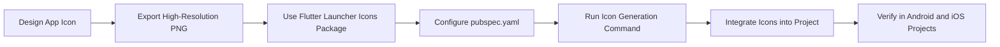

## 13.1.1 Creating App Icons

App icons are the face of your application, providing the first impression to users. A well-designed app icon is crucial for brand recognition and user engagement. This section will guide you through the process of designing, generating, and integrating app icons into your Flutter project.

### Design Principles

Creating an effective app icon involves adhering to several key design principles:

- **Simplicity:** Icons should be simple and easily recognizable. Avoid clutter and focus on a single, clear concept that conveys the essence of your app.
  
- **Scalability:** Ensure the icon looks good at various sizes. It should be legible and visually appealing whether viewed on a small mobile screen or a larger tablet display.

- **Consistency:** Maintain a consistent style and color scheme with your app’s theme. This helps in creating a cohesive brand identity.

- **Uniqueness:** Create distinctive icons that stand out in the app store. Your icon should be memorable and distinguishable from competitors.

### Creating the Icon Design

To create your app icon, you can use a variety of design tools. Here are some popular options:

- **Adobe Illustrator:** A powerful tool for creating vector graphics, ideal for designing scalable icons.

- **Sketch:** A design tool focused on user interface and experience design, widely used for app icon creation.

- **Figma:** A collaborative interface design tool that allows for real-time collaboration and prototyping.

- **Inkscape:** A free alternative for vector graphic design, suitable for creating high-quality icons.

#### Design Process

1. **Start with a High Resolution:** Design your icon at a high resolution, such as 1024x1024 pixels. This ensures that the icon maintains quality when resized.

2. **Use Vector Graphics:** Designing in vector format allows for easy scaling without loss of quality.

3. **Export as PNG:** Once your design is complete, export it in PNG format with a transparent background. This format is widely supported and maintains the quality of your design.

### Generating Platform-Specific Icons

Once you have your icon design, the next step is to generate the necessary icon sizes for Android and iOS platforms. This can be done using tools or Flutter packages.

#### Popular Tools

- **Flutter Launcher Icons:** A Flutter package that simplifies the process of generating app icons for both Android and iOS.

- **App Icon Generator Websites:** Websites like [AppIcon.co](https://appicon.co/) allow you to upload your design and download the required files for different platforms.

### Integrating Icons into Flutter

After generating the icons, you need to integrate them into your Flutter project. This involves replacing placeholder icons with your custom icons and updating configuration files if necessary.

#### Steps to Integrate Icons

1. **Replace Placeholder Icons:** Navigate to the respective directories in your Flutter project and replace the default icons with your generated icons.

2. **Update Configuration Files:** Ensure that your configuration files, such as `pubspec.yaml`, reference the new icons.

### Code Example

Here's how you can configure your `pubspec.yaml` to use the `flutter_launcher_icons` package:

```yaml
dependencies:
  flutter:
    sdk: flutter
  flutter_launcher_icons: ^0.10.0
dev_dependencies:
  flutter_launcher_icons: ^0.10.0
flutter_icons:
  android: true
  ios: true
  image_path: "assets/icons/app_icon.png"
```

### Steps to Generate Icons Using Flutter Launcher Icons

1. **Install the Package:** Ensure `flutter_launcher_icons` is listed in your `pubspec.yaml` as shown above.

2. **Run the Package:** Execute the following command in your terminal:

   ```bash
   flutter pub run flutter_launcher_icons:main
   ```

3. **Verify the Icons:** Check the generated icons in the respective platforms’ directories (`android/app/src/main/res/` for Android and Xcode project settings for iOS).

### Mermaid.js Diagram

To visualize the process, here is a Mermaid.js diagram:



### Best Practices and Common Pitfalls

- **Test Across Devices:** Ensure your icon looks good on different devices and screen sizes. Test on both Android and iOS platforms.

- **Avoid Text:** Text can be hard to read at smaller sizes. Focus on graphical elements instead.

- **Keep It Simple:** Overly complex icons can be hard to recognize. Aim for simplicity and clarity.

- **Stay Updated:** Follow the latest design guidelines from Apple and Google to ensure your icons meet platform standards.

### Additional Resources

- [Flutter Documentation on App Icons](https://flutter.dev/docs/deployment/android#reviewing-the-build-configuration)
- [Material Design Guidelines](https://material.io/design/iconography/product-icons.html)
- [Apple Human Interface Guidelines](https://developer.apple.com/design/human-interface-guidelines/ios/icons-and-images/app-icon/)

By following these guidelines and using the tools available, you can create professional and effective app icons that enhance your app's brand and user experience.

## Quiz Time!



### What is the primary purpose of an app icon?

- [x] To provide the first impression of the app
- [ ] To display detailed app information
- [ ] To serve as the app's main navigation tool
- [ ] To replace the app's splash screen

> **Explanation:** An app icon serves as the face of the application, providing the first impression to users and aiding in brand recognition.

### Which design principle emphasizes the need for an icon to look good at various sizes?

- [ ] Simplicity
- [x] Scalability
- [ ] Consistency
- [ ] Uniqueness

> **Explanation:** Scalability ensures that the icon maintains its quality and legibility across different sizes and resolutions.

### What is a recommended resolution for designing an app icon?

- [ ] 512x512 pixels
- [x] 1024x1024 pixels
- [ ] 256x256 pixels
- [ ] 2048x2048 pixels

> **Explanation:** Designing at a high resolution, such as 1024x1024 pixels, ensures the icon maintains quality when resized.

### Which file format is recommended for exporting app icons?

- [ ] JPEG
- [x] PNG
- [ ] GIF
- [ ] BMP

> **Explanation:** PNG format is recommended because it supports transparency and maintains the quality of the design.

### What tool can be used to generate platform-specific icons in Flutter?

- [ ] Xcode
- [x] Flutter Launcher Icons
- [ ] Android Studio
- [ ] Visual Studio Code

> **Explanation:** The Flutter Launcher Icons package simplifies the process of generating app icons for both Android and iOS.

### What command is used to generate icons using the Flutter Launcher Icons package?

- [ ] flutter build icons
- [ ] flutter generate icons
- [x] flutter pub run flutter_launcher_icons:main
- [ ] flutter create icons

> **Explanation:** The command `flutter pub run flutter_launcher_icons:main` is used to generate the icons.

### Where should you verify the generated icons for Android?

- [x] android/app/src/main/res/
- [ ] ios/Runner/Assets.xcassets
- [ ] lib/assets/icons/
- [ ] build/app/outputs/

> **Explanation:** The generated icons for Android are located in the `android/app/src/main/res/` directory.

### Which design tool is not mentioned as a popular option for creating app icons?

- [ ] Adobe Illustrator
- [ ] Sketch
- [ ] Figma
- [x] Blender

> **Explanation:** Blender is not mentioned as it is primarily a 3D modeling tool, not typically used for 2D icon design.

### What is a common pitfall to avoid when designing app icons?

- [ ] Using vector graphics
- [x] Including text
- [ ] Testing across devices
- [ ] Keeping it simple

> **Explanation:** Including text can be problematic as it may become unreadable at smaller sizes.

### True or False: It is important to follow the latest design guidelines from Apple and Google when creating app icons.

- [x] True
- [ ] False

> **Explanation:** Following the latest design guidelines ensures that your icons meet platform standards and enhance user experience.


