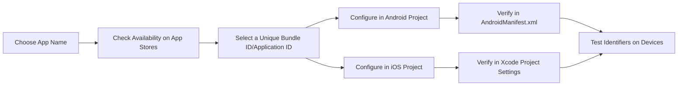

## 13.1.3 App Naming and Bundle IDs

In the world of mobile app development, the app's name and bundle ID are more than just identifiers—they are the keys to your app's identity in the digital marketplace. Properly configuring these elements ensures that your app stands out, avoids conflicts, and is easily discoverable by users. This section will guide you through the process of selecting an app name and configuring bundle IDs for both iOS and Android platforms, ensuring a smooth deployment process.

### Understanding the Importance of App Naming and Bundle IDs

Before diving into the technical details, it's crucial to understand why app naming and bundle IDs are so important:

- **Unique Identification:** Both the app name and bundle ID serve as unique identifiers in app stores, preventing conflicts with other apps and ensuring that your app is easily recognizable.
- **Brand Recognition:** A well-chosen app name can enhance brand recognition and convey the app's purpose to potential users.
- **Deployment and Updates:** Correctly configured bundle IDs are essential for deploying updates and maintaining app continuity across versions.

### App Naming: Crafting a Memorable Identity

Choosing the right name for your app is a critical step in the development process. Here are some key considerations:

- **Reflect the App’s Purpose:** The name should give users a clear idea of what the app does. It should be descriptive yet concise.
- **Uniqueness and Memorability:** A unique and memorable name helps your app stand out in crowded app stores. Avoid generic names that might be easily confused with other apps.
- **Compliance with App Store Guidelines:** Each app store has specific guidelines regarding app names. Ensure your chosen name complies with these rules to avoid rejection during the submission process.
- **Availability Check:** Before finalizing the name, check its availability on app stores to ensure there are no conflicts with existing apps. This can be done by searching the app stores directly or using online tools designed for this purpose.

### Bundle ID (iOS) and Application ID (Android): Ensuring Uniqueness

The bundle ID (iOS) and application ID (Android) are unique identifiers that distinguish your app from others. They follow a specific format and must be unique across app stores.

#### Bundle ID for iOS

- **Format:** The bundle ID follows the reverse domain name notation, such as `com.yourcompany.yourapp`.
- **Configuration in Xcode:** To set or change the bundle ID, open your Flutter project in Xcode, navigate to the project settings under the General tab, and modify the `Bundle Identifier` field.

#### Application ID for Android

- **Format:** Similar to the bundle ID, the application ID also follows the reverse domain name notation.
- **Configuration in Flutter Project:**
  - Open the `android/app/build.gradle` file.
  - Update the `applicationId` field within the `defaultConfig` block:
    ```groovy
    defaultConfig {
        applicationId "com.yourcompany.yourapp"
        minSdkVersion 21
        targetSdkVersion 33
        versionCode 1
        versionName "1.0.0"
        // ...
    }
    ```
  - Ensure that the `AndroidManifest.xml` file reflects any necessary changes.

### Configuring Bundle IDs in Your Flutter Project

Let's walk through the steps to configure bundle IDs for both Android and iOS platforms in a Flutter project.

#### Configuring for Android

1. **Open `build.gradle`:** Navigate to `android/app/build.gradle` in your Flutter project.
2. **Set the Application ID:**
   ```groovy
   android {
       defaultConfig {
           applicationId "com.yourcompany.yourapp"
           minSdkVersion 21
           targetSdkVersion 33
           versionCode 1
           versionName "1.0.0"
           // ...
       }
       // ...
   }
   ```
3. **Modify `AndroidManifest.xml`:** Ensure that any necessary changes are reflected in the `AndroidManifest.xml` file.

#### Configuring for iOS

1. **Open Xcode:** Navigate to the `ios` directory of your Flutter project and open the `.xcworkspace` file in Xcode.
2. **Change the Bundle Identifier:**
   - Go to the project settings by selecting the project name in the Xcode navigator.
   - Under the General tab, locate the `Bundle Identifier` field and update it to your desired identifier, such as `com.yourcompany.yourapp`.

### Best Practices for Naming and Bundle IDs

- **Consistency Across Platforms:** Use a consistent naming convention for bundle IDs across all platforms to maintain uniformity and avoid confusion.
- **Avoid Post-Publication Changes:** Once your app is published, avoid changing the bundle ID, as this can disrupt app updates and user data continuity.
- **Organize Bundle IDs:** If you manage multiple apps, keep your bundle IDs organized by following a logical naming structure, such as `com.yourcompany.appname`.

### Verification and Testing

After configuring the app name and bundle IDs, it's essential to verify that everything is set up correctly:

- **Cross-Platform Verification:** Ensure that the bundle ID corresponds correctly in both Android and iOS project settings.
- **Testing on Devices:** Test the app on physical devices to confirm that the identifiers are functioning as expected and that there are no conflicts.

### Practical Code Example

Below is a practical code example demonstrating how to configure the application ID in an Android project:

```groovy
// File: android/app/build.gradle
android {
    defaultConfig {
        applicationId "com.yourcompany.yourapp"
        minSdkVersion 21
        targetSdkVersion 33
        versionCode 1
        versionName "1.0.0"
        // ...
    }
    // ...
}
```

And for iOS, ensure your `Info.plist` reflects the correct bundle identifier:

```xml
<!-- File: ios/Runner/Info.plist -->
<key>CFBundleIdentifier</key>
<string>com.yourcompany.yourapp</string>
```

### Visualizing the Process with Mermaid.js

To better understand the process of app naming and bundle ID configuration, consider the following diagram:



### Conclusion

Choosing the right app name and configuring bundle IDs are foundational steps in the app deployment process. By following the guidelines and best practices outlined in this section, you can ensure that your app is uniquely identifiable and ready for a successful launch in app stores. Remember, a well-chosen name and correctly configured identifiers not only help in deployment but also contribute to your app's long-term success and brand recognition.

For further reading and resources, consider exploring the official documentation for [iOS Bundle Identifiers](https://developer.apple.com/documentation/bundleresources/information_property_list/cfbundleidentifier) and [Android Application IDs](https://developer.android.com/studio/build/application-id).

---

## Quiz Time!



### What is the primary purpose of an app's bundle ID?

- [x] To uniquely identify the app in app stores
- [ ] To provide a user-friendly name for the app
- [ ] To determine the app's version number
- [ ] To describe the app's functionality

> **Explanation:** The bundle ID uniquely identifies the app in app stores, ensuring there are no conflicts with other apps.

### Which format is used for bundle IDs in iOS?

- [x] Reverse domain name notation
- [ ] Forward domain name notation
- [ ] CamelCase notation
- [ ] Snake_case notation

> **Explanation:** Bundle IDs in iOS use reverse domain name notation, such as `com.yourcompany.yourapp`.

### Where do you configure the application ID for an Android app in a Flutter project?

- [x] `android/app/build.gradle`
- [ ] `ios/Runner/Info.plist`
- [ ] `pubspec.yaml`
- [ ] `lib/main.dart`

> **Explanation:** The application ID for an Android app is configured in the `android/app/build.gradle` file.

### What should you do before finalizing an app name?

- [x] Check for name availability on app stores
- [ ] Ensure it is longer than 20 characters
- [ ] Use only lowercase letters
- [ ] Include special characters

> **Explanation:** Before finalizing an app name, check for its availability on app stores to avoid conflicts.

### What is a best practice regarding bundle IDs after app publication?

- [x] Avoid changing the bundle ID
- [ ] Change it frequently for security
- [ ] Use a different ID for each update
- [ ] Include the app version in the ID

> **Explanation:** Avoid changing the bundle ID after publication to maintain app continuity and user data integrity.

### How can you verify that the bundle ID is correctly configured in an iOS project?

- [x] Check the `Bundle Identifier` in Xcode project settings
- [ ] Review the `pubspec.yaml` file
- [ ] Test the app on an Android device
- [ ] Look for errors in the console output

> **Explanation:** Verify the bundle ID by checking the `Bundle Identifier` in the Xcode project settings.

### What is the equivalent of a bundle ID in Android?

- [x] Application ID
- [ ] Package Name
- [ ] App Name
- [ ] Version Code

> **Explanation:** The equivalent of a bundle ID in Android is the application ID.

### Why is it important to use a consistent naming convention for bundle IDs?

- [x] To maintain uniformity across platforms
- [ ] To increase app download speed
- [ ] To enhance app graphics
- [ ] To reduce app size

> **Explanation:** Using a consistent naming convention for bundle IDs helps maintain uniformity across platforms and avoid confusion.

### What is a potential consequence of not checking app name availability?

- [x] App store rejection due to conflicts
- [ ] Increased app size
- [ ] Slower app performance
- [ ] Higher development costs

> **Explanation:** Not checking app name availability can lead to app store rejection due to conflicts with existing apps.

### True or False: The bundle ID can be changed at any time without affecting the app.

- [ ] True
- [x] False

> **Explanation:** Changing the bundle ID after the app is published can disrupt updates and user data continuity.


