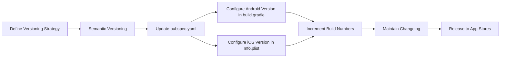

## 13.1.4 App Versioning

App versioning is a critical aspect of software development, especially in mobile applications where updates and improvements are frequent. Proper versioning not only helps developers manage changes but also communicates updates effectively to users. In this section, we will delve into the intricacies of app versioning in Flutter, covering the essentials of semantic versioning, configuration for both Android and iOS, and best practices to ensure a smooth deployment process.

### Understanding Version Numbers

Version numbers are identifiers that signify the state of an application at a given point in time. They are crucial for both developers and users to track the evolution of an app.

- **Version Name:** This is a human-readable string that typically follows a format like `1.0.0` or `2.1.3`. It helps users understand the level of changes in the app.
- **Version Code (Android) and Build Number (iOS):** These are incremental integers used by app stores to identify different iterations of an app. They are not visible to users but are essential for the app store's internal processes.

### Semantic Versioning

Semantic versioning is a widely adopted versioning scheme that uses a three-part number format: `MAJOR.MINOR.PATCH`. This format provides a clear and structured way to communicate the nature of changes in each release.

- **MAJOR:** Incremented for significant changes or overhauls that are not backward compatible. For example, a complete redesign of the app's interface or a change in the core functionality.
- **MINOR:** Incremented when new features are added that are backward compatible. This could include new functionalities or enhancements that do not break existing features.
- **PATCH:** Incremented for bug fixes and minor improvements that do not affect the app's API or functionality.

**Example:** In the version `1.2.3`, `1` is the MAJOR version, `2` is the MINOR version, and `3` is the PATCH version.

### Configuring Versioning in a Flutter Project

In Flutter, versioning is configured in the `pubspec.yaml` file, which serves as the central configuration file for your project.

#### Updating the `pubspec.yaml`

To set the version for your Flutter app, update the `version` field in `pubspec.yaml`:

```yaml
name: your_app
description: A new Flutter project.

version: 1.0.0+1
environment:
  sdk: ">=2.17.0 <3.0.0"
dependencies:
  flutter:
    sdk: flutter
  # ... other dependencies
```

- `1.0.0` is the version name, indicating the MAJOR, MINOR, and PATCH levels.
- `1` is the build number, which should be incremented with each release to the app stores.

#### Configuring Versioning for Android

For Android, the versioning information is reflected in the `android/app/build.gradle` file. Ensure that the version code and version name are correctly set:

```groovy
android {
    defaultConfig {
        versionCode flutterVersionCode.toInteger()
        versionName flutterVersionName
        // ...
    }
}
```

- `versionCode` is an integer that should be incremented with every release.
- `versionName` is a string that matches the version name in `pubspec.yaml`.

#### Configuring Versioning for iOS

For iOS, versioning is configured in the `ios/Runner/Info.plist` file. Update the following keys:

```xml
<key>CFBundleShortVersionString</key>
<string>1.0.0</string>
<key>CFBundleVersion</key>
<string>1</string>
```

- `CFBundleShortVersionString` corresponds to the version name.
- `CFBundleVersion` corresponds to the build number.

### Best Practices for App Versioning

Adopting best practices in app versioning ensures consistency and clarity in your release process:

- **Increment the Build Number:** Always increment the build number with every release to the app stores. This is crucial for both Android and iOS to recognize the new version.
- **Update the Version Name for New Features:** When introducing new features or significant changes, update the version name to reflect these enhancements.
- **Maintain a Changelog:** Keep a detailed changelog to document updates and communicate them to users. This transparency helps users understand what has changed and what to expect.
- **Automate Version Increments:** Use scripts or Continuous Integration (CI) pipelines to automate version increments. This reduces human error and ensures consistency across releases.

### Code Example

Here is a practical example of how to set up versioning in your Flutter project:

```yaml
name: your_app
description: A new Flutter project.

version: 1.0.0+1
environment:
  sdk: ">=2.17.0 <3.0.0"
dependencies:
  flutter:
    sdk: flutter
  # ... other dependencies
```

### Visualizing the Versioning Process

To better understand the process of app versioning, let's visualize it using a Mermaid.js diagram:



### Conclusion

App versioning is a fundamental practice in software development that facilitates effective communication of changes and improvements to users. By adhering to semantic versioning principles and configuring versioning correctly in your Flutter project, you can ensure a smooth and organized deployment process. Remember to maintain a changelog and consider automating version increments to streamline your workflow.

For further exploration, consider reviewing the official Flutter documentation on [versioning](https://flutter.dev/docs/deployment/android#versioning) and [semantic versioning](https://semver.org/). Additionally, exploring CI/CD tools like [GitHub Actions](https://github.com/features/actions) or [Jenkins](https://www.jenkins.io/) can provide insights into automating your versioning process.

## Quiz Time!



### What is the purpose of app versioning?

- [x] To manage updates and communicate changes to users
- [ ] To increase app size
- [ ] To decrease app performance
- [ ] To remove features

> **Explanation:** App versioning helps manage updates, track changes, and communicate improvements to users.

### What does the version name `1.2.3` signify in semantic versioning?

- [x] MAJOR.MINOR.PATCH
- [ ] PATCH.MINOR.MAJOR
- [ ] MINOR.MAJOR.PATCH
- [ ] PATCH.MAJOR.MINOR

> **Explanation:** In semantic versioning, `1.2.3` represents MAJOR.MINOR.PATCH.

### What should be incremented with every release to the app stores?

- [x] Build number
- [ ] App size
- [ ] Code complexity
- [ ] User reviews

> **Explanation:** The build number should be incremented with every release to ensure the app stores recognize the new version.

### Where do you configure the version code for an Android app in Flutter?

- [x] `android/app/build.gradle`
- [ ] `pubspec.yaml`
- [ ] `ios/Runner/Info.plist`
- [ ] `main.dart`

> **Explanation:** The version code for an Android app is configured in `android/app/build.gradle`.

### What is the role of `CFBundleShortVersionString` in iOS versioning?

- [x] It corresponds to the version name
- [ ] It corresponds to the build number
- [ ] It sets the app icon
- [ ] It configures the app's theme

> **Explanation:** `CFBundleShortVersionString` corresponds to the version name in iOS versioning.

### What is a best practice for maintaining a record of app updates?

- [x] Keeping a changelog
- [ ] Increasing app size
- [ ] Reducing code quality
- [ ] Ignoring user feedback

> **Explanation:** Keeping a changelog is a best practice for documenting updates and communicating them to users.

### Which tool can be used to automate version increments?

- [x] CI pipelines
- [ ] Manual updates
- [ ] User feedback
- [ ] App reviews

> **Explanation:** CI pipelines can automate version increments, ensuring consistency and reducing human error.

### What is the format of semantic versioning?

- [x] `MAJOR.MINOR.PATCH`
- [ ] `PATCH.MINOR.MAJOR`
- [ ] `MINOR.MAJOR.PATCH`
- [ ] `PATCH.MAJOR.MINOR`

> **Explanation:** Semantic versioning follows the format `MAJOR.MINOR.PATCH`.

### Why is it important to update the version name when introducing new features?

- [x] To reflect enhancements and communicate changes to users
- [ ] To increase app size
- [ ] To decrease app performance
- [ ] To remove features

> **Explanation:** Updating the version name when introducing new features helps reflect enhancements and communicate changes to users.

### True or False: The build number is visible to users.

- [ ] True
- [x] False

> **Explanation:** The build number is not visible to users; it is used internally by app stores to identify different iterations of an app.


