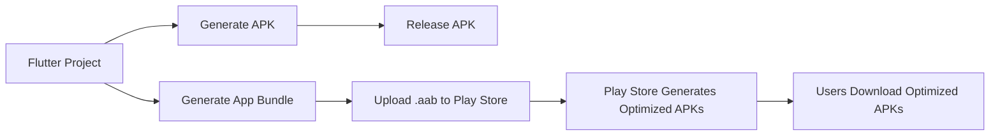

## 13.2.3 Building APK and App Bundle

Building an APK (Android Package) or an App Bundle is a crucial step in preparing your Flutter app for deployment on the Google Play Store. This process involves compiling your app into a format that can be distributed and installed on Android devices. In this section, we will delve into the differences between APKs and App Bundles, guide you through the steps to build each, and discuss best practices for optimizing your app for deployment.

### Understanding APK vs. App Bundle

Before diving into the build process, it's essential to understand the differences between an APK and an App Bundle, as each serves different purposes and offers unique advantages.

#### APK (Android Package)

- **Definition**: An APK is a single file that contains all the compiled code and resources of your app. It is the traditional format for distributing Android apps.
- **Use Cases**:
  - Suitable for testing and internal distribution.
  - Can be directly installed on devices without the need for the Google Play Store.
- **Characteristics**:
  - Contains all resources and code for all device configurations, leading to larger file sizes.
  - Ideal for quick testing and sharing with testers.

#### App Bundle

- **Definition**: An App Bundle is a publish-ready format that includes all the app's resources but defers the generation of APKs to the Google Play Store.
- **Use Cases**:
  - Preferred format for publishing apps on the Google Play Store.
  - Allows Google Play to generate and serve optimized APKs tailored to different device configurations.
- **Characteristics**:
  - Reduces app size for end-users by delivering only the necessary resources for their specific device.
  - Facilitates easier management of multiple device configurations and languages.

### Building an APK

Building an APK is a straightforward process in Flutter, and it is often used for testing purposes or distributing the app internally.

#### Command to Build a Release APK

To build a release APK, use the following command:

```bash
flutter build apk --release
```

This command compiles your Flutter app into an APK suitable for release.

#### Output Location

The generated APK can be found at:

```
build/app/outputs/flutter-apk/app-release.apk
```

#### Customizing the Build

Flutter provides options to customize the APK build process. For instance, you can specify target platforms or architectures:

```bash
flutter build apk --release --split-per-abi
```

- **`--split-per-abi`**: This option generates separate APKs for different CPU architectures (e.g., ARM, ARM64, x86), reducing the APK size for each architecture.

### Building an App Bundle

Building an App Bundle is the recommended approach for deploying apps on the Google Play Store, as it optimizes the app delivery process.

#### Command to Build a Release App Bundle

To build a release App Bundle, use the following command:

```bash
flutter build appbundle --release
```

#### Output Location

The generated App Bundle can be found at:

```
build/app/outputs/bundle/release/app-release.aab
```

#### Advantages of App Bundles

- **Smaller File Sizes**: App Bundles enable dynamic delivery, allowing users to download only the resources needed for their device configuration, resulting in smaller download sizes.
- **Optimized Delivery**: Google Play generates optimized APKs for different device configurations, ensuring efficient resource usage.
- **Simplified Management**: Developers can manage multiple device configurations and languages more easily, as the Play Store handles the distribution of the appropriate resources.

### Configuring Build Options

Optimizing your app's build process can significantly impact its performance and size. Here are some strategies to consider:

#### Optimize App Size

- **Remove Unused Resources**: Ensure that your app does not include unnecessary resources, such as images or libraries, that are not used in the final build.
- **Enable Code Minification and Obfuscation**: Use ProGuard or R8 to reduce the size of your app's code and protect it from reverse engineering.

```bash
flutter build apk --release --obfuscate --split-debug-info=/<project-name>/debug-info
```

- **`--obfuscate`**: Obfuscates the Dart code, making it harder to reverse-engineer.
- **`--split-debug-info`**: Splits the debug information into separate files, which can be useful for debugging obfuscated code.

#### ProGuard/R8 Configuration

To customize the rules for code minification and obfuscation, modify the `proguard-rules.pro` file in your project. This file allows you to specify which classes and methods should be kept during the build process.

### Testing the Built APK/App Bundle

Testing your app thoroughly before deployment is crucial to ensure a smooth user experience.

#### Install the APK on Physical Devices or Emulators

To test the APK on a device, use the following command:

```bash
flutter install
```

This command installs the APK on a connected Android device or emulator.

#### Use Tools Like `bundletool` to Test App Bundles Locally

`bundletool` is a command-line tool that allows you to test App Bundles locally by simulating the Google Play Store's APK generation process. This can help you verify that your app behaves as expected on different device configurations.

### Code Example

Here's a summary of the commands discussed:

```bash
flutter build apk --release

flutter build appbundle --release

flutter build apk --release --split-per-abi

flutter build apk --release --obfuscate --split-debug-info=debug-info/
```

### Visualizing the Build Process

To better understand the build process, consider the following diagram:



### Best Practices and Common Pitfalls

- **Best Practices**:
  - Regularly test your app on a variety of devices and configurations to ensure compatibility.
  - Use automated testing tools to streamline the testing process.
  - Keep your build tools and dependencies up to date to benefit from the latest features and improvements.

- **Common Pitfalls**:
  - Failing to test the app on different device configurations can lead to unexpected issues for users.
  - Neglecting to optimize the app size can result in longer download times and increased data usage for users.

### Additional Resources

For further exploration, consider the following resources:

- [Flutter Documentation](https://flutter.dev/docs): Official documentation for Flutter, including detailed guides on building and deploying apps.
- [Android Developers Guide](https://developer.android.com/guide): Comprehensive resource for Android development, including information on APKs and App Bundles.
- [ProGuard Manual](https://www.guardsquare.com/manual): Documentation for ProGuard, a tool for code optimization and obfuscation.

### Conclusion

Building APKs and App Bundles is a critical step in the Flutter app development process, enabling you to distribute your app efficiently and effectively. By understanding the differences between these formats and following best practices for optimization and testing, you can ensure a smooth deployment experience for your users.

## Quiz Time!



### What is an APK?

- [x] A single file containing all the app’s compiled code and resources.
- [ ] A publish-ready format that includes all the app’s resources but defers APK generation to the Play Store.
- [ ] A tool for testing app bundles locally.
- [ ] A configuration file for ProGuard.

> **Explanation:** An APK is a single file that contains all the compiled code and resources of an app, suitable for testing and internal distribution.

### What is the main advantage of using an App Bundle over an APK?

- [ ] Larger file sizes for users.
- [x] Smaller file sizes for users through dynamic delivery.
- [ ] Easier direct installation on devices.
- [ ] Simplified code obfuscation.

> **Explanation:** App Bundles allow Google Play to generate optimized APKs for different device configurations, resulting in smaller file sizes for users.

### Which command is used to build a release APK in Flutter?

- [x] `flutter build apk --release`
- [ ] `flutter build appbundle --release`
- [ ] `flutter install`
- [ ] `flutter run`

> **Explanation:** The command `flutter build apk --release` is used to compile a Flutter app into a release APK.

### Where is the generated App Bundle located after building?

- [ ] `build/app/outputs/flutter-apk/app-release.apk`
- [x] `build/app/outputs/bundle/release/app-release.aab`
- [ ] `build/app/outputs/flutter-bundle/app-release.bundle`
- [ ] `build/app/outputs/release/app-release.apk`

> **Explanation:** The App Bundle is generated at `build/app/outputs/bundle/release/app-release.aab`.

### What does the `--split-per-abi` option do when building an APK?

- [x] Generates separate APKs for different CPU architectures.
- [ ] Obfuscates the Dart code.
- [ ] Splits the APK into multiple smaller files.
- [ ] Enables code minification.

> **Explanation:** The `--split-per-abi` option generates separate APKs for different CPU architectures, reducing the APK size for each architecture.

### How can you test an App Bundle locally?

- [ ] By installing it directly on a device.
- [ ] By using the `flutter install` command.
- [x] By using the `bundletool` command-line tool.
- [ ] By uploading it to the Play Store.

> **Explanation:** `bundletool` is a command-line tool that allows you to test App Bundles locally by simulating the Google Play Store's APK generation process.

### What is the purpose of code obfuscation?

- [ ] To increase the app size.
- [x] To protect the code from reverse engineering.
- [ ] To simplify the build process.
- [ ] To generate separate APKs for different architectures.

> **Explanation:** Code obfuscation makes the Dart code harder to reverse-engineer, protecting the app's intellectual property.

### What file is used to customize ProGuard rules?

- [ ] `build.gradle`
- [ ] `pubspec.yaml`
- [x] `proguard-rules.pro`
- [ ] `AndroidManifest.xml`

> **Explanation:** The `proguard-rules.pro` file is used to customize the rules for code minification and obfuscation with ProGuard.

### True or False: An App Bundle can be directly installed on an Android device.

- [ ] True
- [x] False

> **Explanation:** An App Bundle cannot be directly installed on an Android device; it must be processed by the Google Play Store to generate installable APKs.

### Which command is used to install an APK on a connected device?

- [ ] `flutter build apk --release`
- [ ] `flutter build appbundle --release`
- [x] `flutter install`
- [ ] `flutter run`

> **Explanation:** The `flutter install` command is used to install an APK on a connected Android device or emulator.


