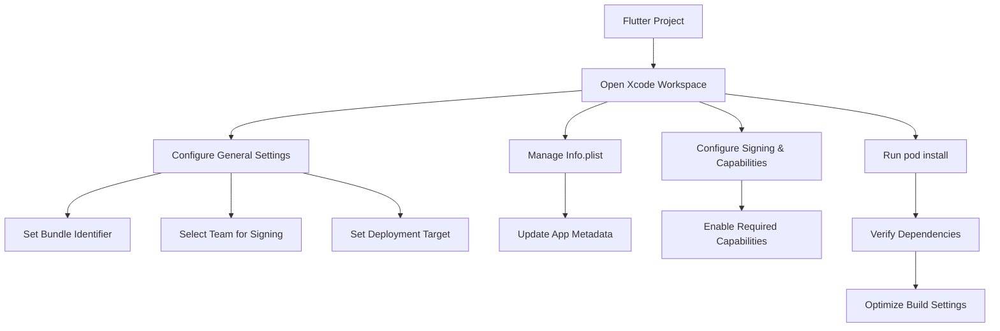

## 13.3.1 Setting Up Xcode Project for iOS Deployment in Flutter

Deploying your Flutter app on iOS requires careful configuration of the Xcode project, which is essential for managing the app’s compilation, signing, and deployment processes. This guide provides a detailed walkthrough of setting up and configuring your Xcode project to ensure a smooth deployment experience on the Apple App Store.

### Prerequisites

Before diving into the setup process, ensure you have the following prerequisites:

- **MacOS Environment:** Xcode is exclusively available on macOS, so you need a Mac to proceed.
- **Xcode Installation:** Download and install the latest version of Xcode from the Mac App Store. This ensures you have the most up-to-date tools and libraries.
- **Apple Developer Account:** An Apple Developer Account is necessary for code signing and app distribution. You can register for an account on the [Apple Developer website](https://developer.apple.com/).

### Opening the iOS Project in Xcode

To begin configuring your iOS project, you need to open it in Xcode. Follow these steps:

1. **Navigate to the iOS Directory:**
   Open your terminal and navigate to the `ios` directory within your Flutter project:

   ```bash
   cd your_flutter_project/ios
   ```

2. **Open the Xcode Workspace:**
   Use the following command to open the Xcode workspace:

   ```bash
   open Runner.xcworkspace
   ```

   This command opens the `Runner.xcworkspace` file, which is essential for managing dependencies through CocoaPods.

### Configuring Project Settings

Once your project is open in Xcode, you need to configure several settings to prepare it for deployment.

#### General Tab

- **Bundle Identifier:**
  Set the `Bundle Identifier` to match your app’s unique identifier. This is typically in the format `com.yourcompany.yourapp`. Ensure it matches the identifier you registered with your Apple Developer Account.

- **Team Selection:**
  Select the appropriate `Team` for code signing. This is usually your Apple Developer Account or organization.

- **Deployment Target:**
  Configure the minimum iOS version your app supports. This determines the oldest iOS version on which your app can run.

#### Signing & Capabilities

- **Automatic Signing:**
  Enable automatic signing to let Xcode manage certificates and provisioning profiles. Alternatively, set up manual signing if you need more control.

- **Capabilities:**
  Add necessary capabilities such as Push Notifications, App Groups, or In-App Purchases. This is done by enabling the respective toggles in the `Signing & Capabilities` tab.

### Managing Info.plist

The `Info.plist` file contains metadata about your app. Update it with the following information:

- **App Display Name:**
  Set the `CFBundleDisplayName` to the name you want displayed under your app icon on the home screen.

- **Versioning:**
  Update `CFBundleShortVersionString` for the app version (e.g., `1.0.0`) and `CFBundleVersion` for the build number (e.g., `1`).

- **Supported Orientations:**
  Configure the orientations your app supports, such as portrait or landscape.

```xml
<!-- File: ios/Runner/Info.plist -->
<key>CFBundleDisplayName</key>
<string>YourAppName</string>
<key>CFBundleShortVersionString</key>
<string>1.0.0</string>
<key>CFBundleVersion</key>
<string>1</string>
<!-- Add other configurations as needed -->
```

### Asset Catalog and App Icons

Ensure that your app icons and launch images are correctly integrated:

- **App Icons:**
  Use Xcode’s asset catalog to manage your app’s icons. Ensure all required icon sizes are provided for different devices and resolutions.

- **Launch Images:**
  Similarly, manage launch images through the asset catalog to ensure they display correctly on all devices.

### Handling Dependencies

Flutter uses CocoaPods to manage iOS dependencies. Ensure your dependencies are up-to-date:

- **Run CocoaPods Install:**
  Navigate to the `ios` directory and run:

  ```bash
  pod install
  ```

  This command installs and updates the necessary pods specified in your `Podfile`.

### Optimizing Build Settings

To enhance performance and reduce app size, configure the following build settings:

- **Release Build Optimizations:**
  Adjust optimization settings for release builds to improve performance.

- **Bitcode:**
  Enable bitcode if required by certain App Store features. Bitcode allows Apple to re-optimize your app’s binary in the future.

### Visualizing the Process

The following Mermaid.js diagram illustrates the process of setting up your Xcode project:



### Best Practices and Common Pitfalls

- **Keep Xcode Updated:** Regularly update Xcode to the latest version to avoid compatibility issues.
- **Verify App Icons:** Ensure all icon sizes are correctly set to prevent App Store rejection.
- **Test on Real Devices:** Always test your app on real iOS devices to catch issues that might not appear in simulators.
- **Monitor App Size:** Use Xcode’s tools to monitor and reduce your app’s size, ensuring it meets App Store guidelines.

### Additional Resources

- [Apple Developer Documentation](https://developer.apple.com/documentation/)
- [Flutter iOS Deployment Guide](https://flutter.dev/docs/deployment/ios)
- [CocoaPods Official Website](https://cocoapods.org/)

By following these steps and best practices, you can effectively set up your Xcode project for deploying your Flutter app on iOS. This configuration is crucial for ensuring a smooth submission process to the Apple App Store and providing a seamless user experience.

## Quiz Time!



### What is the primary purpose of setting up an Xcode project for a Flutter app?

- [x] To manage the app’s compilation, signing, and deployment for iOS devices.
- [ ] To design the app's user interface.
- [ ] To write the app's business logic.
- [ ] To test the app on Android devices.

> **Explanation:** Setting up an Xcode project is essential for managing the app’s compilation, signing, and deployment specifically for iOS devices.

### Which operating system is required to run Xcode?

- [x] macOS
- [ ] Windows
- [ ] Linux
- [ ] Android

> **Explanation:** Xcode is only available on macOS, so a Mac is required to run it.

### What command is used to open the Xcode workspace for a Flutter project?

- [x] `open Runner.xcworkspace`
- [ ] `flutter run ios`
- [ ] `xcodebuild open`
- [ ] `open ios/Runner.xcodeproj`

> **Explanation:** The command `open Runner.xcworkspace` is used to open the Xcode workspace, which is necessary for managing dependencies with CocoaPods.

### What should you set in the General tab of Xcode for code signing?

- [x] Select the appropriate Team.
- [ ] Configure the app's UI.
- [ ] Write the app's logic.
- [ ] Test the app's performance.

> **Explanation:** In the General tab, you need to select the appropriate Team for code signing, which is linked to your Apple Developer Account.

### What file contains metadata about your iOS app?

- [x] Info.plist
- [ ] Podfile
- [ ] main.dart
- [ ] build.gradle

> **Explanation:** The `Info.plist` file contains metadata about your iOS app, such as its display name and version.

### What is the purpose of running `pod install` in the iOS directory?

- [x] To install and update CocoaPods dependencies.
- [ ] To compile the app for iOS.
- [ ] To run the app on a simulator.
- [ ] To clean the build files.

> **Explanation:** Running `pod install` installs and updates the necessary CocoaPods dependencies specified in your Podfile.

### Why is it important to test your app on real iOS devices?

- [x] To catch issues that might not appear in simulators.
- [ ] To reduce the app's size.
- [ ] To improve the app's UI design.
- [ ] To write better code.

> **Explanation:** Testing on real devices helps catch issues that might not appear in simulators, ensuring a better user experience.

### What is the format for setting a Bundle Identifier?

- [x] com.yourcompany.yourapp
- [ ] yourapp.yourcompany.com
- [ ] yourcompany.com.yourapp
- [ ] app.yourcompany.yourapp

> **Explanation:** The Bundle Identifier is typically in the format `com.yourcompany.yourapp`.

### What should you do if your app requires Push Notifications?

- [x] Enable the capability in the Signing & Capabilities tab.
- [ ] Write custom code in main.dart.
- [ ] Configure it in the AndroidManifest.xml.
- [ ] Add a new dependency in pubspec.yaml.

> **Explanation:** If your app requires Push Notifications, you need to enable the capability in the Signing & Capabilities tab in Xcode.

### True or False: Bitcode must always be enabled for iOS apps.

- [ ] True
- [x] False

> **Explanation:** Bitcode is optional and should be enabled if required by certain App Store features, but it is not mandatory for all apps.


