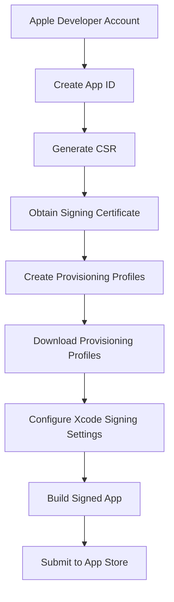

## 13.3.2 App Signing and Certificates

Deploying an iOS app to the Apple App Store involves several critical steps, with app signing and certificates being among the most crucial. These elements ensure that your app is secure, authentic, and ready for distribution. This section will guide you through the process of obtaining and configuring the necessary certificates and provisioning profiles, ensuring a smooth deployment experience.

### Understanding App Signing

App signing is a security measure that verifies the identity of the developer and ensures the integrity of the app. When you sign your app, you are essentially attaching a digital signature that confirms you are the legitimate creator. This process involves several key components:

- **Certificates**: These are digital documents that verify your identity as a developer. They are issued by Apple and are required for both development and distribution.
- **Provisioning Profiles**: These profiles link your app to your development or distribution certificates and specify which devices your app can run on.

#### Importance of App Signing

- **Security**: Ensures that the app has not been tampered with since it was signed.
- **Authenticity**: Confirms the identity of the developer to Apple and users.
- **Integrity**: Guarantees that the app is the same as when it was signed.

### Generating Certificates

To begin the app signing process, you need to generate the necessary certificates. This requires an active Apple Developer Account.

#### Apple Developer Account

Before you can generate certificates, ensure you have an active Apple Developer Account. This account provides access to the Apple Developer portal, where you will manage your app's certificates and provisioning profiles.

#### Creating an App ID

An App ID is a unique identifier for your app. It must match your app's bundle ID in Xcode.

- **Navigate to the Apple Developer portal**.
- **Select "Certificates, Identifiers & Profiles"**.
- **Click on "Identifiers" and then "App IDs"**.
- **Register a new App ID**: Ensure it matches your app's bundle ID.

#### Generating a Signing Certificate

1. **Create a Certificate Signing Request (CSR)**:
   - Open **Keychain Access** on your Mac.
   - Select **Keychain Access > Certificate Assistant > Request a Certificate from a Certificate Authority**.
   - Enter your email address and name, and select "Saved to disk".

2. **Upload the CSR to the Apple Developer Portal**:
   - Go to the **Certificates** section.
   - Choose **Development** or **Distribution** certificate.
   - Upload the CSR file to generate the certificate.

3. **Download and Install the Certificate**:
   - Once generated, download the certificate.
   - Double-click the certificate file to install it in Keychain Access.

### Creating Provisioning Profiles

Provisioning profiles are essential for testing and deploying your app.

#### Development Provisioning Profile

This profile allows you to test your app on physical devices.

- **Navigate to the Provisioning Profiles section**.
- **Select "Development"**.
- **Create a new profile**: Choose your App ID, select your development certificate, and specify the devices for testing.

#### Distribution Provisioning Profile

This profile is used for submitting your app to the App Store.

- **Select "Distribution"**.
- **Create a new profile**: Choose your App ID and select your distribution certificate.

### Configuring Xcode for App Signing

Xcode offers two methods for managing app signing: automatic and manual.

#### Automatic Signing

- **Enable Automatic Signing** in your Xcode project settings.
- Xcode will manage certificates and provisioning profiles for you.
- This method simplifies the process but offers less control.

#### Manual Signing

- **Disable Automatic Signing**.
- Manually select the certificates and provisioning profiles in Xcode.
- Provides greater control, necessary for advanced configurations.

### Importing Certificates and Provisioning Profiles

Ensure that all certificates are installed in Keychain Access and provisioning profiles are downloaded and installed.

- **Install Certificates**: Double-click the downloaded certificate files.
- **Install Provisioning Profiles**: Double-click the downloaded provisioning profile files to add them to Xcode.

### Best Practices

- **Renew Certificates Regularly**: Certificates expire, so renew them before expiration to avoid deployment interruptions.
- **Secure Your Certificates**: Keep them backed up and secure to protect your app's integrity.
- **Avoid Sharing Certificates**: Sharing certificates can compromise your app's security.

### Code Example

```bash
# (No direct command; use Keychain Access GUI)

```

```groovy
// File: ios/Runner.xcodeproj/project.pbxproj
// Xcode manages signing configurations automatically or based on your manual settings
```

### Visualizing the Process

Below is a Mermaid.js diagram illustrating the app signing and certificate process:



### Conclusion

App signing and certificates are vital components of iOS app deployment. By following the steps outlined in this guide, you can ensure that your app is secure, authentic, and ready for the Apple App Store. Remember to keep your certificates and provisioning profiles secure and up-to-date, and choose the signing method that best suits your needs.

For further exploration, consider reviewing Apple's official documentation on [App Distribution](https://developer.apple.com/documentation/appstoreconnectapi) and [Certificates, Identifiers & Profiles](https://developer.apple.com/account/resources/certificates/list).

## Quiz Time!



### What is the primary purpose of app signing?

- [x] To verify the developer's identity and ensure app integrity
- [ ] To increase app performance
- [ ] To reduce app size
- [ ] To enhance app graphics

> **Explanation:** App signing verifies the developer's identity and ensures the app's integrity, confirming that it hasn't been tampered with.

### What is required before generating certificates for iOS app deployment?

- [x] An active Apple Developer Account
- [ ] A completed app design
- [ ] A published app on the App Store
- [ ] A physical iOS device

> **Explanation:** An active Apple Developer Account is necessary to access the Apple Developer portal and manage certificates.

### What is a Certificate Signing Request (CSR)?

- [x] A file used to request a certificate from a Certificate Authority
- [ ] A document verifying app sales
- [ ] A request for app store approval
- [ ] A method to increase app security

> **Explanation:** A CSR is a file generated to request a certificate from a Certificate Authority, verifying the developer's identity.

### What is the role of a provisioning profile in iOS development?

- [x] It links your app to your development or distribution certificates and specifies which devices your app can run on
- [ ] It enhances app graphics
- [ ] It reduces app size
- [ ] It improves app performance

> **Explanation:** A provisioning profile links your app to your certificates and specifies the devices it can run on.

### What is the difference between development and distribution provisioning profiles?

- [x] Development profiles are for testing on devices; distribution profiles are for App Store submission
- [ ] Development profiles are for App Store submission; distribution profiles are for testing
- [ ] Both are used interchangeably
- [ ] Development profiles enhance graphics; distribution profiles enhance performance

> **Explanation:** Development profiles allow testing on devices, while distribution profiles are used for App Store submission.

### What is the advantage of using automatic signing in Xcode?

- [x] It simplifies the process by managing certificates and provisioning profiles automatically
- [ ] It enhances app graphics
- [ ] It reduces app size
- [ ] It improves app performance

> **Explanation:** Automatic signing simplifies the process by letting Xcode manage certificates and provisioning profiles.

### Why should certificates be renewed regularly?

- [x] To avoid deployment interruptions due to expiration
- [ ] To enhance app graphics
- [ ] To reduce app size
- [ ] To improve app performance

> **Explanation:** Certificates expire, so renewing them regularly avoids deployment interruptions.

### How can provisioning profiles be installed in Xcode?

- [x] By double-clicking the downloaded provisioning profile files
- [ ] By dragging them into the app's assets
- [ ] By emailing them to Apple
- [ ] By uploading them to the App Store

> **Explanation:** Provisioning profiles are installed by double-clicking the downloaded files, adding them to Xcode.

### What is a best practice for managing certificates?

- [x] Keep them secure and backed up
- [ ] Share them with other developers
- [ ] Post them online for easy access
- [ ] Ignore expiration dates

> **Explanation:** Keeping certificates secure and backed up is crucial to protect your app's integrity.

### True or False: Sharing certificates with others is a secure practice.

- [ ] True
- [x] False

> **Explanation:** Sharing certificates can compromise your app's security and is not a secure practice.


