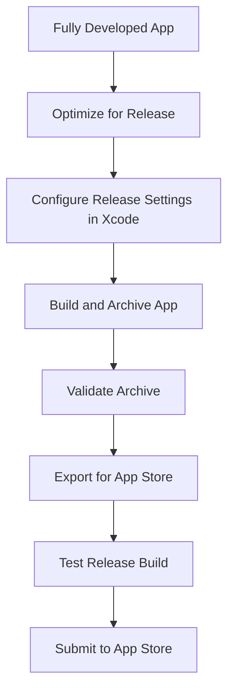

## 13.3.3 Building for Release

Building your Flutter app for release on iOS is a crucial step in the app development lifecycle. This process involves transforming your development code into an optimized, production-ready version, ensuring that your app meets Apple's stringent requirements for performance, security, and usability. In this section, we will explore the steps and best practices for building a release version of your iOS app, from optimizing your code to configuring Xcode settings and testing the final product.

### Optimizing for Release

Before you begin the release build process, it's essential to optimize your app to ensure it performs efficiently and meets the size constraints of the App Store. Here are some key strategies:

- **Minimize App Size:**
  - Remove unused resources and code. This can be achieved by using tools like `flutter clean` to clear the build cache and `flutter analyze` to identify unused code.
  - Use the `--split-debug-info` flag to reduce the size of your app's debug information.

- **Enable Compiler Optimizations:**
  - Ensure that your app is compiled with optimizations enabled. This can be done by setting the `--release` flag when building your app with Flutter.

- **Obfuscate Dart Code:**
  - To protect your app from reverse engineering, consider obfuscating your Dart code. This can be done using the `--obfuscate` and `--split-debug-info` flags during the build process.

### Configuring Release Settings in Xcode

Once your app is optimized, the next step is to configure the release settings in Xcode. This involves selecting the appropriate build configuration and ensuring that all debug flags are disabled.

- **Select the `Release` Build Configuration:**
  - Open your Flutter project in Xcode by navigating to the `ios` directory and double-clicking `Runner.xcworkspace`.
  - In Xcode, select the `Runner` project in the project navigator, then choose the `Runner` target.
  - Under the `Build Settings` tab, ensure that the `Release` configuration is selected.

- **Disable Debug Flags:**
  - Ensure that any debug-specific flags or settings are disabled in the `Release` configuration. This includes disabling `DEBUG` preprocessor macros and ensuring that logging is minimized.

### Building the Release App

With your app optimized and Xcode configured, you can now proceed to build the release version of your app. This involves creating an archive of your app, validating it, and exporting it for distribution.

#### Step-by-Step Guide to Building the Release App

1. **Select a Generic iOS Device:**
   - In Xcode, choose `Any iOS Device (arm64)` as the target device. This ensures that your app is built for all compatible iOS devices.

2. **Create an Archive:**
   - Navigate to `Product > Archive`. This will build your app and create an archive in the Organizer. The archive is a packaged version of your app that can be submitted to the App Store.

3. **Validate the Archive:**
   - In the Organizer, select the archive and click `Validate App`. This step checks your app against Apple's guidelines and ensures it meets all necessary requirements.

4. **Export the Archive:**
   - After validation, export the archive for the App Store or for Ad Hoc distribution. This involves selecting the appropriate export options and generating an IPA file for submission.

### Using Xcode Command Line for Builds

For developers who prefer automation or need to integrate the build process into a CI/CD pipeline, Xcode's command line tools and Fastlane offer powerful alternatives.

- **Using Fastlane:**
  - Fastlane is a popular tool for automating iOS and Android deployment. It simplifies the process of building, testing, and releasing mobile apps.

  ```bash
  # Install Fastlane if not already installed
  sudo gem install fastlane -NV

  # Navigate to the iOS directory
  cd ios

  # Initialize Fastlane
  fastlane init

  # Create a lane for building the app
  # File: ios/fastlane/Fastfile
  lane :release do
    build_app(scheme: "Runner")
    upload_to_app_store
  end

  # Run the release lane
  fastlane release
  ```

- **Using Xcode Command Line:**
  - You can also use Xcode's command line tools to build and archive your app.

  ```bash
  # Navigate to the iOS directory
  cd ios
  # Build the app for release using Xcode
  xcodebuild -workspace Runner.xcworkspace -scheme Runner -configuration Release archive -archivePath ./build/Runner.xcarchive
  # Export the archive to an App Store build
  xcodebuild -exportArchive -archivePath ./build/Runner.xcarchive -exportOptionsPlist exportOptions.plist -exportPath ./build
  ```

### Verifying the Release Build

Before submitting your app to the App Store, it's crucial to verify that the release build functions correctly on physical devices and meets user expectations.

- **Test on Physical Devices:**
  - Install the release build on various iOS devices to ensure compatibility and performance. Pay attention to UI responsiveness, network connectivity, and overall user experience.

- **Use TestFlight for Beta Testing:**
  - TestFlight allows you to distribute your app to external testers for beta testing. This is an excellent way to gather feedback and identify any issues before the official release.

### Code Example: Configuring Info.plist

When building for release, you may need to configure certain settings in your app's `Info.plist` file, such as URL schemes or permissions.

```xml
<!-- File: ios/Runner/Info.plist -->
<key>CFBundleURLTypes</key>
<array>
    <dict>
        <key>CFBundleTypeRole</key>
        <string>Editor</string>
        <key>CFBundleURLName</key>
        <string>yourapp</string>
        <key>CFBundleURLSchemes</key>
        <array>
            <string>yourapp</string>
        </array>
    </dict>
</array>
```

### Visualizing the Release Process

Here's a visual representation of the release process using a Mermaid.js diagram:



### Best Practices and Common Pitfalls

- **Best Practices:**
  - Regularly update your app's dependencies and ensure compatibility with the latest iOS versions.
  - Use automated testing and continuous integration to catch issues early in the development process.
  - Keep your app's documentation and release notes up to date for users and testers.

- **Common Pitfalls:**
  - Failing to test on a variety of devices can lead to unexpected issues in production.
  - Overlooking App Store guidelines can result in rejection during the submission process.
  - Neglecting to obfuscate sensitive code may expose your app to security risks.

### Further Resources

For more detailed information on building and releasing Flutter apps for iOS, consider exploring the following resources:

- [Flutter Official Documentation](https://flutter.dev/docs/deployment/ios)
- [Apple's App Store Review Guidelines](https://developer.apple.com/app-store/review/guidelines/)
- [Fastlane Documentation](https://docs.fastlane.tools/)

By following these guidelines and best practices, you can ensure that your Flutter app is optimized, compliant, and ready for a successful release on the Apple App Store.

## Quiz Time!



### What is the primary purpose of building a release version of your app?

- [x] To optimize the app for production and prepare it for App Store submission.
- [ ] To test new features in a development environment.
- [ ] To debug issues in the app.
- [ ] To create a backup of the app's source code.

> **Explanation:** Building a release version optimizes the app for production, ensuring it meets performance and security standards for App Store submission.

### Which tool can be used to automate the iOS build and release process?

- [x] Fastlane
- [ ] Android Studio
- [ ] Visual Studio Code
- [ ] GitHub

> **Explanation:** Fastlane is a tool designed to automate the build and release process for iOS and Android apps.

### What is the purpose of obfuscating Dart code?

- [x] To protect the app from reverse engineering.
- [ ] To increase the app's performance.
- [ ] To reduce the app's size.
- [ ] To improve code readability.

> **Explanation:** Obfuscating Dart code helps protect the app from reverse engineering by making the code harder to understand.

### In Xcode, which build configuration should be selected for a release build?

- [x] Release
- [ ] Debug
- [ ] Profile
- [ ] Test

> **Explanation:** The `Release` build configuration is optimized for production and should be selected for a release build.

### What is the first step in creating an archive for your app in Xcode?

- [x] Select a Generic iOS Device
- [ ] Validate the Archive
- [ ] Export the Archive
- [ ] Submit to App Store

> **Explanation:** Selecting a Generic iOS Device ensures the app is built for all compatible devices before creating an archive.

### Which command is used to build an app for release using Xcode's command line tools?

- [x] `xcodebuild -workspace Runner.xcworkspace -scheme Runner -configuration Release archive`
- [ ] `flutter build ios --release`
- [ ] `xcodebuild -scheme Debug`
- [ ] `xcodebuild -exportOptionsPlist`

> **Explanation:** This command builds the app for release using Xcode's command line tools, specifying the workspace, scheme, and configuration.

### What is the role of TestFlight in the release process?

- [x] To distribute the app to external testers for beta testing.
- [ ] To submit the app to the App Store.
- [ ] To compile the app's source code.
- [ ] To generate app icons.

> **Explanation:** TestFlight allows developers to distribute their app to external testers for beta testing before the official release.

### Why is it important to test the release build on physical devices?

- [x] To ensure compatibility and performance across different devices.
- [ ] To reduce the app's file size.
- [ ] To improve code readability.
- [ ] To generate release notes.

> **Explanation:** Testing on physical devices ensures the app functions correctly and performs well across various hardware configurations.

### What should be done after validating the archive in Xcode?

- [x] Export the Archive
- [ ] Create an Archive
- [ ] Select a Generic iOS Device
- [ ] Submit to App Store

> **Explanation:** After validation, the archive should be exported for App Store submission or Ad Hoc distribution.

### True or False: The `Debug` build configuration should be used for release builds.

- [ ] True
- [x] False

> **Explanation:** The `Release` build configuration, not `Debug`, should be used for release builds as it is optimized for production.


