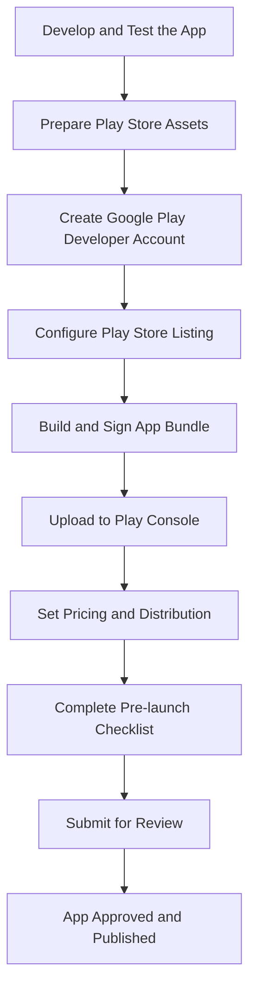

## 13.4.1 Google Play Store Submission

Publishing your Flutter app on the Google Play Store is a significant milestone in your app development journey. This process involves several critical steps, from setting up a developer account to submitting your app for review. This guide will walk you through each step, ensuring a smooth and successful submission.

### Creating a Google Play Developer Account

Before you can publish your app, you need to create a Google Play Developer Account. This account allows you to manage your apps on the Google Play Store.

- **Sign Up at Google Play Console:**
  - Visit the [Google Play Console](https://play.google.com/console) and sign up with your Google account.
  - You will need to pay a one-time registration fee of $25. This fee grants you lifetime access to the Play Console.

- **Complete Account Details:**
  - Fill in your account details, including your developer name, email address, and contact information.
  - Ensure that your contact information is accurate, as Google may use it to communicate important updates or issues regarding your app.

### Preparing App Assets

High-quality app assets are crucial for attracting users and making a strong first impression. Here's what you need to prepare:

- **App Icon:**
  - Your app icon should be a 512x512 PNG file.
  - Ensure it is visually appealing and represents your app's brand.

- **Screenshots:**
  - Provide at least two screenshots for each supported device size (phone, tablet, etc.).
  - Screenshots should be high-resolution and showcase key features of your app.

- **Feature Graphics:**
  - Create a feature graphic (1024x500 pixels) to highlight your app in the Play Store.
  - Use this space to convey the essence of your app visually.

- **App Description:**
  - Write a compelling and concise description that highlights your app's features and benefits.
  - Use keywords strategically to improve search visibility.

- **Promo Video (Optional):**
  - If you have a promotional video, include a YouTube link in your listing.
  - Videos can significantly enhance user engagement.

- **Privacy Policy:**
  - Provide a URL to your app's privacy policy, especially if your app collects user data.
  - Ensure your privacy policy complies with legal requirements.

### Configuring Play Store Listing

Your Play Store listing is your app's storefront. It's essential to optimize it for search and user engagement.

- **App Title and Description:**
  - Choose a descriptive and memorable app title.
  - Ensure your description is clear, engaging, and optimized for relevant keywords.

- **Categorization:**
  - Select the appropriate category and tags for your app.
  - Proper categorization helps users find your app more easily.

- **Contact Details:**
  - Provide a support email and website URL.
  - This information helps users reach out for support or inquiries.

### Uploading the APK/App Bundle

Once your app assets and listing are ready, it's time to upload your app to the Play Console.

- **Create App in Play Console:**
  - Navigate to the Play Console and select `Create App`.
  - Fill in the required details, including the default language and app type.

- **Upload the APK or App Bundle:**
  - Build your app bundle using the following command:
    ```bash
    flutter build appbundle --release
    ```
  - In the `Release` section, upload your APK or App Bundle. You can choose from different release tracks:
    - **Internal Testing:** For quick testing with internal team members.
    - **Closed Testing:** For beta testing with selected external testers.
    - **Open Testing:** For a broader beta testing phase.
    - **Production Release:** For final submission to the Play Store.

### Setting Up Pricing and Distribution

Decide how you want to distribute your app and set its pricing.

- **Free or Paid App:**
  - Choose whether your app will be free or paid.
  - Note that you cannot change a free app to a paid app later.

- **Select Countries and Regions:**
  - Specify the countries and regions where your app will be available.
  - Consider your target audience and market reach.

- **Device Compatibility:**
  - Enable or disable specific device compatibility settings.
  - Ensure your app runs smoothly on all targeted devices.

### Completing Pre-launch Checklist

Before submitting your app, complete the pre-launch checklist to ensure compliance and readiness.

- **Content Rating:**
  - Complete the content rating questionnaire to avoid app suspension.
  - Accurate ratings help users understand the app's content.

- **App Signing:**
  - Ensure your app is signed with the release key.
  - App signing is crucial for security and integrity.

- **Review Policies:**
  - Adhere to Google Play policies to prevent rejection.
  - Familiarize yourself with the [Google Play Developer Policy](https://play.google.com/about/developer-content-policy/).

- **Testing:**
  - Conduct thorough testing in all targeted countries and devices.
  - Use the pre-launch report in the Play Console to identify potential issues.

### Submitting the App for Review

After completing all the above steps, you're ready to submit your app for review.

- **Submit for Review:**
  - Once everything is set, submit your app for review in the Play Console.
  - Monitor the review status and respond promptly to any feedback from Google.

- **Monitor and Respond:**
  - Keep an eye on your app's status and address any issues raised during the review process.
  - Be prepared to make necessary changes to comply with Google Play policies.

### Code Example

To build the App Bundle for Google Play, use the following command:

```bash
flutter build appbundle --release
```

Ensure your `pubspec.yaml` file is correctly versioned:

```yaml
version: 1.0.0+1
```

### Visualizing the Submission Process

Here's a visual representation of the Google Play Store submission process using Mermaid.js:



### Best Practices and Common Pitfalls

- **Best Practices:**
  - Regularly update your app to fix bugs and add new features.
  - Engage with user feedback to improve your app's quality and user experience.

- **Common Pitfalls:**
  - Failing to comply with Google Play policies can lead to app rejection.
  - Inadequate testing may result in poor user reviews and ratings.

- **Strategies to Overcome Challenges:**
  - Use automated testing tools to ensure app stability.
  - Stay informed about policy changes and industry trends.

### Additional Resources

- [Google Play Console Help](https://support.google.com/googleplay/android-developer)
- [Flutter Documentation](https://flutter.dev/docs)
- [Google Play Developer Policy Center](https://play.google.com/about/developer-content-policy/)

### Conclusion

Submitting your Flutter app to the Google Play Store is a rewarding process that requires careful preparation and attention to detail. By following this guide, you'll be well-equipped to navigate the submission process and reach a global audience with your app. Remember to stay updated with the latest Google Play policies and continuously improve your app based on user feedback.

## Quiz Time!



### What is the first step in submitting your app to the Google Play Store?

- [x] Creating a Google Play Developer Account
- [ ] Preparing App Assets
- [ ] Configuring Play Store Listing
- [ ] Uploading the APK/App Bundle

> **Explanation:** The first step is to create a Google Play Developer Account, which allows you to manage your apps on the Play Store.

### What is the recommended size for the app icon on the Google Play Store?

- [ ] 256x256 pixels
- [x] 512x512 pixels
- [ ] 1024x1024 pixels
- [ ] 128x128 pixels

> **Explanation:** The recommended size for the app icon is 512x512 pixels to ensure it meets Play Store requirements.

### Which of the following is optional when preparing app assets?

- [ ] App Icon
- [ ] Screenshots
- [ ] Feature Graphics
- [x] Promo Video

> **Explanation:** A promo video is optional, but it can enhance user engagement if included.

### What command is used to build the App Bundle for Google Play?

- [ ] flutter build apk --release
- [x] flutter build appbundle --release
- [ ] flutter build ios --release
- [ ] flutter build web --release

> **Explanation:** The command `flutter build appbundle --release` is used to build the App Bundle for Google Play.

### What should you do if your app is rejected during the review process?

- [x] Address the issues raised and resubmit
- [ ] Delete the app and start over
- [ ] Ignore the feedback
- [ ] Submit a complaint to Google

> **Explanation:** If your app is rejected, you should address the issues raised during the review process and resubmit your app.

### Which section of the Play Console allows you to upload your APK or App Bundle?

- [ ] Dashboard
- [ ] Statistics
- [x] Release
- [ ] Users

> **Explanation:** The `Release` section of the Play Console is where you upload your APK or App Bundle.

### What is the purpose of the pre-launch checklist?

- [ ] To increase app downloads
- [x] To ensure compliance and readiness for submission
- [ ] To improve app design
- [ ] To reduce app size

> **Explanation:** The pre-launch checklist ensures compliance with Google Play policies and readiness for submission.

### What is a key benefit of providing a privacy policy URL?

- [x] It ensures compliance with legal requirements
- [ ] It increases app downloads
- [ ] It improves app performance
- [ ] It enhances app design

> **Explanation:** Providing a privacy policy URL ensures compliance with legal requirements, especially if your app collects user data.

### What should you include in your app description to improve search visibility?

- [ ] Random keywords
- [x] Relevant keywords
- [ ] Long paragraphs
- [ ] Technical jargon

> **Explanation:** Including relevant keywords in your app description improves search visibility and helps users find your app.

### True or False: You can change a free app to a paid app after publishing.

- [ ] True
- [x] False

> **Explanation:** Once an app is published as free, it cannot be changed to a paid app on the Google Play Store.


