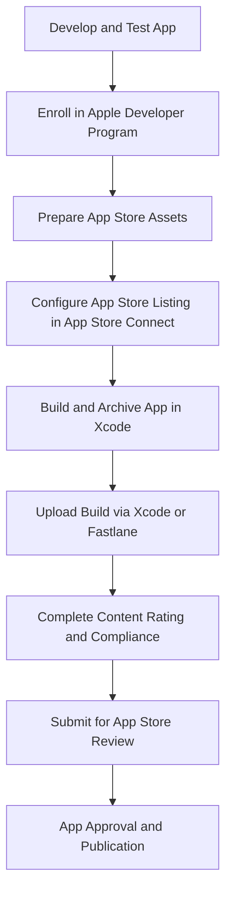

## 13.4.2 Apple App Store Submission

Submitting your Flutter app to the Apple App Store is a crucial step in reaching iOS users. This process involves several meticulous steps, including configuring app settings in Xcode, preparing store assets, complying with Apple’s guidelines, and managing the submission process. This section provides a comprehensive, step-by-step guide to ensure a successful submission to the App Store.

### Enrolling in the Apple Developer Program

Before you can submit your app to the App Store, you must enroll in the Apple Developer Program. This program provides access to a variety of resources, including beta software, advanced app capabilities, and the ability to distribute apps on the App Store.

- **Sign Up:** Visit the [Apple Developer Program](https://developer.apple.com/programs/) website to sign up. You will need an Apple ID to start the enrollment process.
- **Membership Fee:** The program requires an annual membership fee, which is currently $99 USD. This fee grants you access to the necessary tools and resources for app development and distribution.
- **Complete Your Profile:** Fill out your developer profile with all necessary details. This includes your legal name, address, and contact information, which will be used for your app's listing and communication with Apple.

### Preparing App Assets for App Store

To make your app appealing and informative to potential users, you need to prepare several assets for your App Store listing.

- **App Icon:** Your app icon is the first impression users will have of your app. Ensure it meets Apple’s specifications, which include specific dimensions and file formats. The icon should be clear, recognizable, and reflect the essence of your app.
  
- **Screenshots:** Provide high-quality screenshots for different device sizes, including iPhone and iPad. These screenshots should showcase the key features and user interface of your app. Use a clean and professional layout to highlight the app's functionality.

- **App Preview Video (Optional):** Consider creating a short video that demonstrates your app's functionality. This can be an effective way to engage users and provide a quick overview of what your app offers.

- **App Description:** Write an engaging and informative description that highlights the features and benefits of your app. Use clear and concise language to convey the app's purpose and value to potential users.

- **Keywords:** Include relevant keywords to optimize your app's searchability in the App Store. Think about the terms your target audience might use to find an app like yours.

- **Privacy Policy:** If your app collects user data, you must provide a privacy policy URL. This is mandatory for apps that require user registration or access sensitive data.

### Configuring App Store Listing in App Store Connect

Once your assets are ready, you need to configure your app's listing in App Store Connect.

- **Create an App Record:** Log in to [App Store Connect](https://appstoreconnect.apple.com/) and create a new app. You will need to provide your app's name, primary language, and bundle ID.

- **Fill in App Details:**
  - **App Name and Subtitle:** Choose a unique and descriptive name for your app. The subtitle should provide additional context or highlight a key feature.
  - **Category Selection:** Select the appropriate primary and secondary categories for your app. This helps users find your app in the right context.
  - **Licensing Agreement and Copyright:** Provide the necessary legal information, including your licensing agreement and copyright details.
  - **Privacy Policy URL:** Ensure you have a privacy policy URL if your app requires it.

### Uploading the App Build

With your app configured in App Store Connect, the next step is to upload your app build.

#### Archive and Upload via Xcode

1. **Open Your Project in Xcode:** Ensure your Flutter project is opened in Xcode.
2. **Select Target Device:** Choose `Any iOS Device (arm64)` as the target device.
3. **Create an Archive:** Navigate to `Product > Archive` to create an archive of your app.
4. **Distribute App:** In the Organizer, select the archive and click `Distribute App`.
5. **Upload to App Store Connect:** Choose `App Store Connect` and follow the prompts to upload your build.

#### Using Fastlane for Automation

Fastlane is a tool that automates the process of building and releasing your app. It can save you time and reduce the potential for errors.

- **Install Fastlane:** If you haven't already, install Fastlane using the following command:

  ```bash
  sudo gem install fastlane -NV
  ```

- **Initialize Fastlane:** Navigate to your iOS directory and initialize Fastlane:

  ```bash
  cd ios
  fastlane init
  ```

- **Create a Release Lane:** Edit the `Fastfile` to create a lane for releasing your app:

  ```ruby
  lane :release do
    build_app(scheme: "Runner") # Builds the app
    upload_to_app_store # Uploads to App Store Connect
  end
  ```

- **Run the Release Lane:** Execute the release lane to build and upload your app:

  ```bash
  fastlane release
  ```

### Completing App Store Review Process

After uploading your app, you must complete the App Store review process.

- **Content Rating:** Complete the content rating questionnaire in App Store Connect. This helps Apple determine the appropriate age rating for your app.

- **App Store Guidelines Compliance:** Ensure your app adheres to Apple’s [App Store Review Guidelines](https://developer.apple.com/app-store/review/guidelines/). This includes guidelines on app functionality, user interface, and content.

- **Submit for Review:** Once all details are complete and the build is uploaded, submit your app for review. Monitor the submission status and respond promptly to any feedback or required changes from Apple.

### Managing App Updates

Keeping your app updated is crucial for maintaining user engagement and satisfaction.

- **Increment Version and Build Numbers:** Before submitting updates, update the `version` and `build` numbers in your `pubspec.yaml` file. This helps users identify the latest version of your app.

  ```yaml
  version: 1.1.0+2
  ```

- **Follow Consistent Submission Process:** Ensure that updates adhere to the same meticulous process to maintain app integrity and user trust.

### Code Example

To build your app for release, use the following Flutter command:

```bash
flutter build ios --release
```

Ensure your `AppDelegate.swift` file is set up correctly:

```swift
// File: ios/Runner/AppDelegate.swift
import UIKit
import Flutter
@UIApplicationMain
@objc class AppDelegate: FlutterAppDelegate {
    override func application(
        _ application: UIApplication,
        didFinishLaunchingWithOptions launchOptions: [UIApplication.LaunchOptionsKey: Any]?
    ) -> Bool {
        GeneratedPluginRegistrant.register(with: self)
        return super.application(application, didFinishLaunchingWithOptions: launchOptions)
    }
}
```

### Visualizing the Submission Process

The following Mermaid.js diagram provides a visual overview of the app submission process:



### Best Practices and Common Pitfalls

- **Thorough Testing:** Ensure your app is thoroughly tested on various iOS devices to catch any potential issues before submission.
- **Compliance with Guidelines:** Familiarize yourself with Apple’s guidelines to avoid common reasons for rejection.
- **Clear Communication:** Be clear and concise in your app description and metadata to avoid misunderstandings during the review process.
- **Prompt Response:** Respond quickly to any feedback from Apple to expedite the review process.

### Additional Resources

- [Apple Developer Documentation](https://developer.apple.com/documentation/)
- [App Store Connect Help](https://help.apple.com/app-store-connect/)
- [Fastlane Documentation](https://docs.fastlane.tools/)

By following these detailed steps and best practices, you can successfully submit your Flutter app to the Apple App Store, reaching a wide audience of iOS users.

## Quiz Time!



### What is the first step in submitting your app to the Apple App Store?

- [x] Enroll in the Apple Developer Program
- [ ] Prepare app assets
- [ ] Configure App Store listing
- [ ] Upload the app build

> **Explanation:** Enrolling in the Apple Developer Program is the first step as it provides access to necessary tools and resources for app submission.

### What is required for the Apple Developer Program enrollment?

- [x] An Apple ID and an annual membership fee
- [ ] Only an Apple ID
- [ ] Only a membership fee
- [ ] A completed app

> **Explanation:** You need an Apple ID and must pay an annual membership fee to enroll in the Apple Developer Program.

### Which of the following is NOT a required app asset for the App Store?

- [ ] App Icon
- [ ] Screenshots
- [x] App Preview Video
- [ ] App Description

> **Explanation:** An App Preview Video is optional, while the other assets are required.

### How can you automate the build and upload process to the App Store?

- [x] Using Fastlane
- [ ] Using Xcode only
- [ ] Using Flutter CLI
- [ ] Using Android Studio

> **Explanation:** Fastlane is a tool that automates the build and upload process for the App Store.

### What should you do before submitting an app update?

- [x] Increment version and build numbers
- [ ] Change the app icon
- [ ] Remove old screenshots
- [ ] Rewrite the app description

> **Explanation:** Incrementing version and build numbers is necessary to identify the latest version of your app.

### What is the purpose of the content rating questionnaire?

- [x] To determine the appropriate age rating for your app
- [ ] To assess the app's performance
- [ ] To evaluate the app's design
- [ ] To check the app's security

> **Explanation:** The content rating questionnaire helps determine the appropriate age rating for your app.

### Which tool can be used to distribute the app build to App Store Connect?

- [x] Xcode
- [ ] Android Studio
- [ ] Visual Studio Code
- [ ] IntelliJ IDEA

> **Explanation:** Xcode is used to distribute the app build to App Store Connect.

### What should be included in the app description?

- [x] Features and benefits of the app
- [ ] Only technical specifications
- [ ] Developer's personal information
- [ ] App's source code

> **Explanation:** The app description should highlight the features and benefits of the app to attract users.

### Why is it important to comply with Apple's App Store Review Guidelines?

- [x] To avoid rejection during the review process
- [ ] To increase app download speed
- [ ] To improve app design
- [ ] To enhance app security

> **Explanation:** Compliance with Apple's guidelines is crucial to avoid rejection during the review process.

### True or False: You can submit your app to the App Store without a privacy policy if it collects user data.

- [ ] True
- [x] False

> **Explanation:** A privacy policy is mandatory if your app collects user data.


