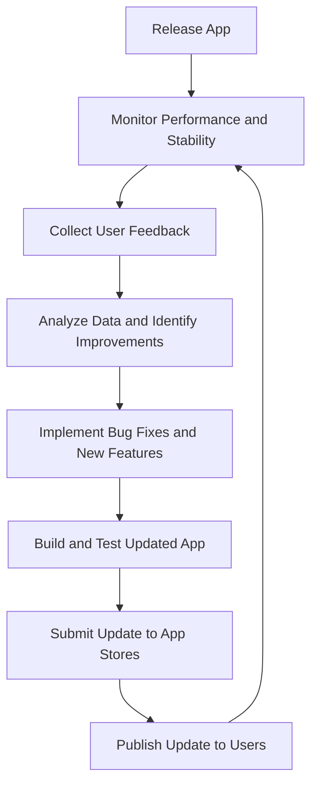

## 13.4.4 Maintaining and Updating

Maintaining and updating your app post-launch is crucial for sustaining user engagement, fixing bugs, and introducing new features. This section outlines best practices for managing app updates, ensuring compatibility with new devices and OS versions, and continuously improving the app based on user feedback.

### Regular App Updates

Regular updates are essential for keeping your app relevant and functional. They help in introducing new features, enhancing existing functionalities, and fixing bugs. Here's how you can effectively manage app updates:

- **Schedule Periodic Updates:**
  - Plan updates on a regular basis, such as monthly or quarterly, to keep your app fresh and engaging.
  - Use a roadmap to outline upcoming features and improvements, ensuring a strategic approach to development.

- **Communicate Update Details:**
  - Provide clear and concise release notes with each update to inform users about new features, improvements, and bug fixes.
  - Use in-app notifications or emails to alert users about significant updates, encouraging them to explore new functionalities.

### Monitoring App Performance and Stability

Monitoring your app's performance and stability is vital for maintaining a high-quality user experience. Utilize analytics tools to track key metrics and identify areas for improvement:

- **Use Analytics Tools:**
  - Implement tools like Firebase Analytics or Google Analytics to gather data on user behavior, session duration, and feature usage.
  - Analyze this data to understand user preferences and optimize the app accordingly.

- **Monitor Crash Reports:**
  - Use crash reporting tools such as Firebase Crashlytics to detect and analyze app crashes.
  - Address issues promptly to prevent user frustration and maintain app reliability.

### User Feedback Integration

User feedback is a valuable resource for improving your app. By actively collecting and analyzing feedback, you can prioritize features and fixes that align with user needs:

- **Collect Feedback:**
  - Encourage users to provide feedback through app store reviews, social media, and in-app surveys.
  - Use tools like UserVoice or Zendesk to manage and organize feedback efficiently.

- **Analyze and Implement:**
  - Regularly review feedback to identify common themes and areas for improvement.
  - Prioritize updates based on user suggestions, ensuring that your app evolves in line with user expectations.

### Ensuring Compatibility with New Devices and OS Versions

As new devices and operating system versions are released, it's crucial to ensure your app remains compatible:

- **Test on Latest Devices and OS Versions:**
  - Regularly test your app on the latest devices and OS versions to identify compatibility issues.
  - Use emulators and physical devices to conduct thorough testing.

- **Stay Updated with Platform Changes:**
  - Follow platform announcements and updates to stay informed about changes that may affect your app.
  - Adjust app configurations and code to accommodate new platform requirements.

### Managing App Store Submissions

Submitting updates to app stores involves following specific guidelines and ensuring all necessary assets are up-to-date:

- **Follow Platform Guidelines:**
  - Adhere to the submission guidelines provided by app stores to avoid delays or rejections.
  - Ensure your app complies with all legal and content requirements.

- **Update Assets and Metadata:**
  - Review and update app store listings, including screenshots, descriptions, and keywords, to reflect the latest app version.
  - Ensure that all required assets, such as icons and promotional images, are current.

### Implementing Feature Toggles and A/B Testing

Feature toggles and A/B testing are powerful tools for managing app features and optimizing user experience:

- **Use Feature Toggles:**
  - Implement feature toggles to enable or disable features without deploying new app versions.
  - This allows for controlled rollouts and quick reversals if issues arise.

- **Conduct A/B Testing:**
  - Use A/B testing to evaluate the effectiveness of new features and UI changes.
  - Analyze test results to make data-driven decisions about feature implementation.

#### Code Example: Feature Toggle

```dart
// Example of using a feature toggle for a new feature
class FeatureToggle {
  static bool isNewFeatureEnabled = false;

  static void enableNewFeature() {
    isNewFeatureEnabled = true;
  }

  static void disableNewFeature() {
    isNewFeatureEnabled = false;
  }
}

class HomePage extends StatelessWidget {
  @override
  Widget build(BuildContext context) {
    return Scaffold(
      appBar: AppBar(title: Text('Home')),
      body: Center(
        child: FeatureToggle.isNewFeatureEnabled
            ? NewFeatureWidget()
            : OldFeatureWidget(),
      ),
    );
  }
}
```

### Optimizing App Performance

Continuous performance optimization is key to providing a smooth user experience:

- **Profile the App:**
  - Use profiling tools to identify performance bottlenecks in rendering, memory usage, and network operations.
  - Optimize code and resources to enhance app performance.

- **Enhance User Experience:**
  - Implement lazy loading for images and data to reduce initial load times.
  - Minimize the use of heavy animations and complex layouts that may impact performance.

### Security Updates and Patches

Security is a critical aspect of app maintenance. Regular updates and audits help protect user data and app integrity:

- **Update Dependencies:**
  - Regularly update libraries and dependencies to incorporate the latest security patches.
  - Use tools like Dependabot to automate dependency updates.

- **Perform Security Audits:**
  - Conduct regular security audits to identify and mitigate vulnerabilities.
  - Implement best practices for data encryption and secure communication.

### Backup and Data Management

Effective data management ensures data integrity and compliance with regulations:

- **Implement Backup Strategies:**
  - Use cloud services or local storage solutions to back up user data regularly.
  - Ensure that backups are secure and easily recoverable.

- **Manage User Data Responsibly:**
  - Comply with data protection regulations such as GDPR and CCPA.
  - Provide users with options to manage their data, including deletion and export features.

### Automating the Update Process

Automation can streamline the update process, reducing manual effort and errors:

- **Use CI/CD Pipelines:**
  - Implement Continuous Integration and Continuous Deployment (CI/CD) pipelines to automate build and release processes.
  - Tools like Jenkins, GitHub Actions, or Bitrise can facilitate automation.

- **Streamline Deployment Workflow:**
  - Automate testing and deployment tasks to ensure consistent and reliable updates.
  - Use scripts and tools to manage versioning, code signing, and distribution.

### Visualizing the Update Process

To better understand the update process, consider the following flowchart:



This diagram illustrates the cyclical nature of app maintenance, emphasizing the continuous process of monitoring, feedback collection, and improvement.

### Conclusion

Maintaining and updating your app is an ongoing process that requires careful planning and execution. By following best practices and leveraging tools and techniques outlined in this section, you can ensure your app remains competitive, secure, and user-friendly. Regular updates, performance monitoring, and user feedback integration are key to sustaining user engagement and satisfaction.

### Additional Resources

- [Flutter Official Documentation](https://flutter.dev/docs)
- [Firebase Crashlytics](https://firebase.google.com/products/crashlytics)
- [Google Analytics for Firebase](https://firebase.google.com/products/analytics)
- [Dependabot](https://dependabot.com/)
- [Jenkins CI/CD](https://www.jenkins.io/)
- [GitHub Actions](https://github.com/features/actions)

## Quiz Time!



### What is the primary purpose of regular app updates?

- [x] To introduce new features, enhancements, and bug fixes
- [ ] To increase app size
- [ ] To change the app's color scheme
- [ ] To remove old features

> **Explanation:** Regular app updates are primarily aimed at introducing new features, enhancements, and bug fixes to keep the app relevant and functional.

### Which tool can be used to monitor app performance and stability?

- [x] Firebase Analytics
- [ ] Microsoft Word
- [ ] Adobe Photoshop
- [ ] Google Sheets

> **Explanation:** Firebase Analytics is a tool that can be used to monitor app performance and stability by tracking user behavior and app metrics.

### How can user feedback be effectively integrated into app updates?

- [x] By collecting feedback through app stores, social media, and in-app channels
- [ ] By ignoring user feedback
- [ ] By deleting negative feedback
- [ ] By only considering feedback from friends

> **Explanation:** Collecting feedback through various channels allows developers to understand user needs and prioritize updates accordingly.

### What is the role of feature toggles in app maintenance?

- [x] To enable or disable features without deploying new app versions
- [ ] To permanently remove features
- [ ] To change the app's language
- [ ] To increase app download speed

> **Explanation:** Feature toggles allow developers to enable or disable features without deploying new app versions, facilitating controlled rollouts and quick reversals.

### Why is it important to test an app on the latest devices and OS versions?

- [x] To identify and fix compatibility issues
- [ ] To increase app size
- [ ] To change the app's logo
- [ ] To reduce app functionality

> **Explanation:** Testing on the latest devices and OS versions helps identify and fix compatibility issues, ensuring the app works smoothly for all users.

### What is the benefit of using CI/CD pipelines in the update process?

- [x] To automate build and release processes
- [ ] To manually update the app
- [ ] To increase app size
- [ ] To change the app's color scheme

> **Explanation:** CI/CD pipelines automate build and release processes, reducing manual effort and ensuring consistent and reliable updates.

### How can security updates and patches be managed effectively?

- [x] By regularly updating dependencies and performing security audits
- [ ] By ignoring security issues
- [ ] By only updating the app once a year
- [ ] By removing all security features

> **Explanation:** Regularly updating dependencies and performing security audits help manage security updates and patches effectively, protecting user data and app integrity.

### What is the purpose of conducting A/B testing in app updates?

- [x] To evaluate the effectiveness of new features and UI changes
- [ ] To increase app size
- [ ] To change the app's language
- [ ] To reduce app functionality

> **Explanation:** A/B testing evaluates the effectiveness of new features and UI changes, allowing developers to make data-driven decisions about feature implementation.

### Which tool can be used to automate dependency updates?

- [x] Dependabot
- [ ] Microsoft Excel
- [ ] Adobe Illustrator
- [ ] Google Slides

> **Explanation:** Dependabot is a tool that can be used to automate dependency updates, ensuring that libraries and dependencies are up-to-date with the latest security patches.

### True or False: User feedback should be ignored when planning app updates.

- [ ] True
- [x] False

> **Explanation:** User feedback is a valuable resource that should be considered when planning app updates, as it helps prioritize features and fixes that align with user needs.


