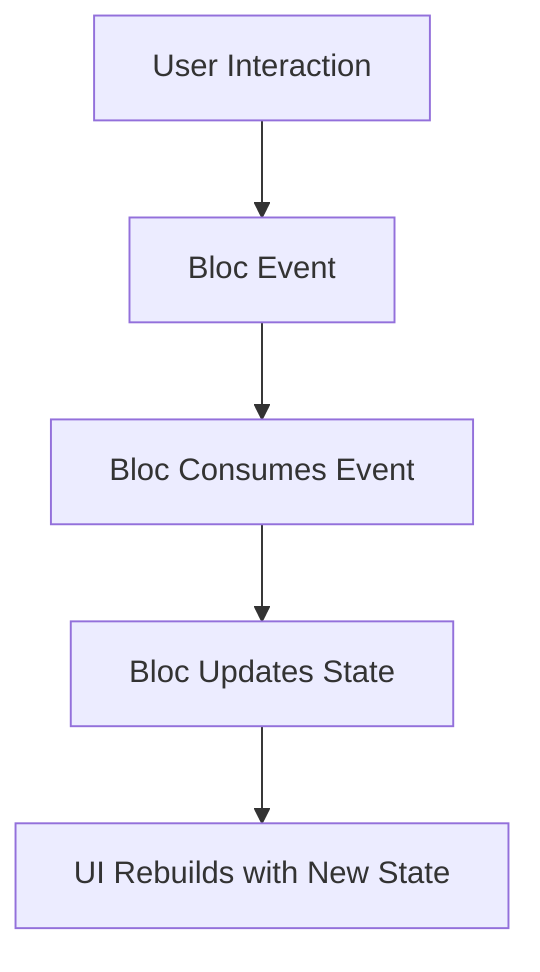

## 14.1.1 State Management Solutions

State management is a cornerstone of Flutter app development, especially as applications grow in complexity and require more sophisticated handling of data and UI interactions. In this section, we delve into advanced state management solutions that go beyond the basics, providing you with the tools and knowledge to manage state effectively in your Flutter applications.

### Advanced State Management Patterns

As your Flutter applications scale, choosing the right state management solution becomes crucial. Here, we explore several advanced patterns and tools, each with its unique strengths and use cases.

#### Bloc (Business Logic Component)

Bloc is a reactive state management library that uses streams to separate business logic from UI components. It promotes a clear separation of concerns, making your code more scalable and maintainable.

**Key Features:**
- **Separation of Concerns:** Bloc encourages a clean architecture by separating business logic from UI.
- **Scalability:** Suitable for large applications due to its structured approach.
- **Testability:** Easy to test business logic in isolation.

**Implementation Example:**

Below is a simple implementation of a counter using the Bloc pattern.

```dart
// pubspec.yaml
dependencies:
  flutter:
    sdk: flutter
  flutter_bloc: ^8.0.1
  equatable: ^2.0.3

// lib/bloc/counter_event.dart
import 'package:equatable/equatable.dart';

abstract class CounterEvent extends Equatable {
  @override
  List<Object> get props => [];
}

class Increment extends CounterEvent {}
class Decrement extends CounterEvent {}

// lib/bloc/counter_state.dart
import 'package:equatable/equatable.dart';

class CounterState extends Equatable {
  final int count;
  CounterState({required this.count});

  @override
  List<Object> get props => [count];
}

// lib/bloc/counter_bloc.dart
import 'package:bloc/bloc.dart';
import 'counter_event.dart';
import 'counter_state.dart';

class CounterBloc extends Bloc<CounterEvent, CounterState> {
  CounterBloc() : super(CounterState(count: 0)) {
    on<Increment>((event, emit) => emit(CounterState(count: state.count + 1)));
    on<Decrement>((event, emit) => emit(CounterState(count: state.count - 1)));
  }
}

// lib/main.dart
import 'package:flutter/material.dart';
import 'package:flutter_bloc/flutter_bloc.dart';
import 'bloc/counter_bloc.dart';
import 'bloc/counter_event.dart';
import 'bloc/counter_state.dart';

void main() {
  runApp(MyApp());
}

class MyApp extends StatelessWidget {
  @override
  Widget build(BuildContext context) {
    return MaterialApp(
      home: BlocProvider(
        create: (_) => CounterBloc(),
        child: CounterPage(),
      ),
    );
  }
}

class CounterPage extends StatelessWidget {
  @override
  Widget build(BuildContext context) {
    final counterBloc = BlocProvider.of<CounterBloc>(context);
    return Scaffold(
      appBar: AppBar(title: Text('Bloc Counter')),
      body: Center(
        child: BlocBuilder<CounterBloc, CounterState>(
          builder: (context, state) {
            return Text('Count: ${state.count}', style: TextStyle(fontSize: 24));
          },
        ),
      ),
      floatingActionButton: Column(
        mainAxisAlignment: MainAxisAlignment.end,
        children: [
          FloatingActionButton(
            onPressed: () => counterBloc.add(Increment()),
            child: Icon(Icons.add),
            heroTag: 'increment',
          ),
          SizedBox(height: 10),
          FloatingActionButton(
            onPressed: () => counterBloc.add(Decrement()),
            child: Icon(Icons.remove),
            heroTag: 'decrement',
          ),
        ],
      ),
    );
  }
}
```

**Mermaid.js Diagram:**



#### Riverpod

Riverpod is a modern state management library that offers improved performance and flexibility over the traditional Provider package. It provides a more robust way to manage state, with features like compile-time safety and better support for asynchronous operations.

**Key Features:**
- **Compile-Time Safety:** Ensures that your code is free of runtime errors related to state management.
- **Flexibility:** Supports a wide range of use cases, from simple state management to complex asynchronous operations.
- **Performance:** Optimized for minimal rebuilds and efficient state updates.

**Implementation Example:**

```dart
// pubspec.yaml
dependencies:
  flutter:
    sdk: flutter
  flutter_riverpod: ^1.0.0

// lib/main.dart
import 'package:flutter/material.dart';
import 'package:flutter_riverpod/flutter_riverpod.dart';

final counterProvider = StateProvider<int>((ref) => 0);

void main() {
  runApp(ProviderScope(child: MyApp()));
}

class MyApp extends StatelessWidget {
  @override
  Widget build(BuildContext context) {
    return MaterialApp(
      home: CounterPage(),
    );
  }
}

class CounterPage extends ConsumerWidget {
  @override
  Widget build(BuildContext context, WidgetRef ref) {
    final count = ref.watch(counterProvider).state;
    return Scaffold(
      appBar: AppBar(title: Text('Riverpod Counter')),
      body: Center(
        child: Text('Count: $count', style: TextStyle(fontSize: 24)),
      ),
      floatingActionButton: Column(
        mainAxisAlignment: MainAxisAlignment.end,
        children: [
          FloatingActionButton(
            onPressed: () => ref.read(counterProvider).state++,
            child: Icon(Icons.add),
            heroTag: 'increment',
          ),
          SizedBox(height: 10),
          FloatingActionButton(
            onPressed: () => ref.read(counterProvider).state--,
            child: Icon(Icons.remove),
            heroTag: 'decrement',
          ),
        ],
      ),
    );
  }
}
```

#### Redux

Redux is a predictable state management pattern that centralizes the application's state in a single store. It uses actions and reducers to manage state changes, making it easy to track and debug state updates.

**Key Features:**
- **Predictability:** Centralized state management ensures predictable state transitions.
- **Debugging:** Time-travel debugging and state inspection tools.
- **Scalability:** Suitable for large applications with complex state requirements.

**Implementation Example:**

```dart
// pubspec.yaml
dependencies:
  flutter:
    sdk: flutter
  flutter_redux: ^0.8.2
  redux: ^4.0.0

// lib/redux/actions.dart
class IncrementAction {}
class DecrementAction {}

// lib/redux/reducers.dart
int counterReducer(int state, dynamic action) {
  if (action is IncrementAction) {
    return state + 1;
  } else if (action is DecrementAction) {
    return state - 1;
  }
  return state;
}

// lib/main.dart
import 'package:flutter/material.dart';
import 'package:flutter_redux/flutter_redux.dart';
import 'package:redux/redux.dart';
import 'redux/actions.dart';
import 'redux/reducers.dart';

void main() {
  final store = Store<int>(counterReducer, initialState: 0);
  runApp(MyApp(store: store));
}

class MyApp extends StatelessWidget {
  final Store<int> store;

  MyApp({required this.store});

  @override
  Widget build(BuildContext context) {
    return StoreProvider<int>(
      store: store,
      child: MaterialApp(
        home: CounterPage(),
      ),
    );
  }
}

class CounterPage extends StatelessWidget {
  @override
  Widget build(BuildContext context) {
    return Scaffold(
      appBar: AppBar(title: Text('Redux Counter')),
      body: Center(
        child: StoreConnector<int, String>(
          converter: (store) => store.state.toString(),
          builder: (context, count) {
            return Text('Count: $count', style: TextStyle(fontSize: 24));
          },
        ),
      ),
      floatingActionButton: Column(
        mainAxisAlignment: MainAxisAlignment.end,
        children: [
          FloatingActionButton(
            onPressed: () => StoreProvider.of<int>(context).dispatch(IncrementAction()),
            child: Icon(Icons.add),
            heroTag: 'increment',
          ),
          SizedBox(height: 10),
          FloatingActionButton(
            onPressed: () => StoreProvider.of<int>(context).dispatch(DecrementAction()),
            child: Icon(Icons.remove),
            heroTag: 'decrement',
          ),
        ],
      ),
    );
  }
}
```

#### MobX

MobX is a state management library that uses observables and reactions to provide fine-grained and reactive state handling. It is known for its simplicity and ease of use, making it a popular choice for developers who prefer a more declarative approach.

**Key Features:**
- **Reactivity:** Automatically updates the UI in response to state changes.
- **Simplicity:** Minimal boilerplate and easy to understand.
- **Flexibility:** Supports both simple and complex state management needs.

**Implementation Example:**

```dart
// pubspec.yaml
dependencies:
  flutter:
    sdk: flutter
  flutter_mobx: ^2.0.0
  mobx: ^2.0.0
  provider: ^5.0.0

// lib/store/counter.dart
import 'package:mobx/mobx.dart';

part 'counter.g.dart';

class Counter = _Counter with _$Counter;

abstract class _Counter with Store {
  @observable
  int count = 0;

  @action
  void increment() {
    count++;
  }

  @action
  void decrement() {
    count--;
  }
}

// lib/main.dart
import 'package:flutter/material.dart';
import 'package:flutter_mobx/flutter_mobx.dart';
import 'package:provider/provider.dart';
import 'store/counter.dart';

void main() {
  runApp(
    MultiProvider(
      providers: [
        Provider<Counter>(create: (_) => Counter()),
      ],
      child: MyApp(),
    ),
  );
}

class MyApp extends StatelessWidget {
  @override
  Widget build(BuildContext context) {
    return MaterialApp(
      home: CounterPage(),
    );
  }
}

class CounterPage extends StatelessWidget {
  @override
  Widget build(BuildContext context) {
    final counter = Provider.of<Counter>(context);
    return Scaffold(
      appBar: AppBar(title: Text('MobX Counter')),
      body: Center(
        child: Observer(
          builder: (_) => Text('Count: ${counter.count}', style: TextStyle(fontSize: 24)),
        ),
      ),
      floatingActionButton: Column(
        mainAxisAlignment: MainAxisAlignment.end,
        children: [
          FloatingActionButton(
            onPressed: counter.increment,
            child: Icon(Icons.add),
            heroTag: 'increment',
          ),
          SizedBox(height: 10),
          FloatingActionButton(
            onPressed: counter.decrement,
            child: Icon(Icons.remove),
            heroTag: 'decrement',
          ),
        ],
      ),
    );
  }
}
```

### Choosing the Right Solution

Selecting the appropriate state management solution for your Flutter project depends on several factors, including scalability, complexity, and the learning curve. Here's a comparison to help guide your decision:

- **Bloc:** Best for large applications requiring a clear separation of business logic and UI. It has a steeper learning curve but offers excellent scalability and testability.
- **Riverpod:** Suitable for projects needing compile-time safety and flexibility. It is easier to learn than Bloc and offers robust performance.
- **Redux:** Ideal for applications that benefit from predictable state transitions and time-travel debugging. It can be complex to set up but provides a structured approach to state management.
- **MobX:** Great for developers who prefer a more declarative and reactive approach. It is simple to use and integrates well with existing projects.

### Implementing State Management

Implementing state management effectively requires careful planning and adherence to best practices. Here are some guidelines to help you maintain clean and maintainable codebases:

- **Modularize Your Code:** Break down your application into smaller, manageable modules. This makes it easier to manage state and reduces complexity.
- **Use State Management Libraries:** Leverage libraries like Bloc, Riverpod, Redux, or MobX to handle state efficiently. These libraries provide tools and patterns that simplify state management.
- **Optimize State Updates:** Minimize unnecessary widget rebuilds by carefully managing state updates. Use tools like `BlocBuilder`, `Consumer`, or `Observer` to control when the UI should rebuild.
- **Test Your State Logic:** Write unit tests for your state management logic to ensure it behaves as expected. This helps catch bugs early and improves the reliability of your application.

### Performance Considerations

State management can significantly impact your app's performance. Here are some tips to optimize state management in your Flutter applications:

- **Avoid Unnecessary Rebuilds:** Use selectors or memoization to prevent unnecessary widget rebuilds. This reduces the workload on the UI thread and improves performance.
- **Batch State Updates:** Group multiple state updates into a single transaction to minimize the number of rebuilds. This can be achieved using techniques like `setState` batching or using libraries that support batch updates.
- **Profile Your App:** Use Flutter's DevTools to profile your application and identify performance bottlenecks. This helps you understand how state management affects your app's performance and where optimizations are needed.

### Conclusion

Advanced state management solutions like Bloc, Riverpod, Redux, and MobX provide powerful tools for managing state in Flutter applications. By understanding the strengths and use cases of each solution, you can choose the right approach for your project and implement it effectively. Remember to consider performance implications and follow best practices to ensure your application remains scalable and maintainable.

## Quiz Time!



### Which state management solution is known for using streams and promoting separation of concerns?

- [x] Bloc
- [ ] Riverpod
- [ ] Redux
- [ ] MobX

> **Explanation:** Bloc uses streams to separate business logic from UI components, promoting a clear separation of concerns.

### What is a key feature of Riverpod that distinguishes it from the traditional Provider package?

- [x] Compile-time safety
- [ ] Time-travel debugging
- [ ] Observables
- [ ] Centralized store

> **Explanation:** Riverpod offers compile-time safety, ensuring that your code is free of runtime errors related to state management.

### Which state management pattern centralizes the application's state in a single store?

- [ ] Bloc
- [ ] Riverpod
- [x] Redux
- [ ] MobX

> **Explanation:** Redux centralizes the application's state in a single store, making state transitions predictable.

### MobX is known for its simplicity and use of which two concepts?

- [ ] Streams and reducers
- [ ] Actions and reducers
- [x] Observables and reactions
- [ ] Providers and consumers

> **Explanation:** MobX uses observables and reactions to provide fine-grained and reactive state handling.

### Which state management solution is best suited for large applications requiring a clear separation of business logic and UI?

- [x] Bloc
- [ ] Riverpod
- [ ] Redux
- [ ] MobX

> **Explanation:** Bloc is best suited for large applications due to its structured approach and separation of business logic from UI.

### What is a common performance optimization technique in state management?

- [x] Avoid unnecessary rebuilds
- [ ] Use more widgets
- [ ] Increase state updates
- [ ] Decrease code modularity

> **Explanation:** Avoiding unnecessary rebuilds helps reduce the workload on the UI thread and improves performance.

### Which state management solution provides time-travel debugging?

- [ ] Bloc
- [ ] Riverpod
- [x] Redux
- [ ] MobX

> **Explanation:** Redux provides time-travel debugging, allowing developers to inspect and replay state changes.

### What is a benefit of using MobX for state management?

- [ ] Centralized state
- [ ] Compile-time safety
- [x] Simplicity and ease of use
- [ ] Predictable state transitions

> **Explanation:** MobX is known for its simplicity and ease of use, making it a popular choice for developers.

### Which state management solution is optimized for minimal rebuilds and efficient state updates?

- [ ] Bloc
- [x] Riverpod
- [ ] Redux
- [ ] MobX

> **Explanation:** Riverpod is optimized for minimal rebuilds and efficient state updates, enhancing performance.

### True or False: Redux is suitable for small applications with simple state requirements.

- [ ] True
- [x] False

> **Explanation:** Redux is more suitable for large applications with complex state requirements due to its structured approach.


