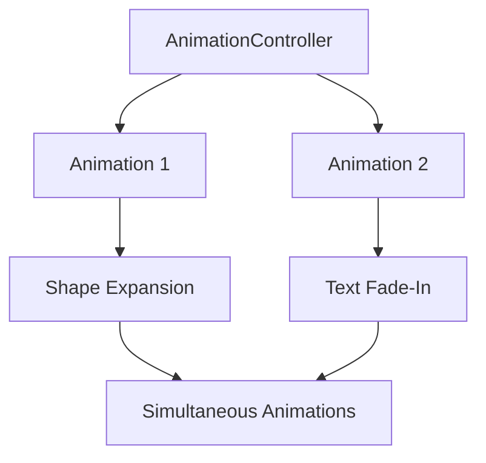

## 14.1.2 Animations and Transitions

Animations and transitions are not just about making your app look good; they play a crucial role in enhancing user experience by providing visual feedback, guiding user attention, and making interactions feel more natural. In this section, we will explore advanced animation techniques in Flutter, focusing on creating complex animations, implementing custom transitions, and optimizing animations for performance.

### Complex Animations

Flutter provides a rich set of tools for creating complex animations that can bring your app to life. Let's delve into some advanced animation techniques that can help you create more dynamic and engaging user interfaces.

#### Staggered Animations

Staggered animations involve coordinating multiple animations to run in sequence or with overlapping timings. This technique is useful for creating complex visual effects where different elements animate at different times or speeds.

**Key Concepts:**

- **AnimationController:** Manages the animation's lifecycle and timing.
- **Tween:** Defines the range of values for the animation.
- **CurvedAnimation:** Applies easing curves to animations for more natural motion.
- **Interval:** Specifies the timing for each animation segment.

**Code Example: Staggered Animation Implementation**

```dart
import 'package:flutter/material.dart';

class StaggeredAnimationDemo extends StatefulWidget {
  @override
  _StaggeredAnimationDemoState createState() => _StaggeredAnimationDemoState();
}

class _StaggeredAnimationDemoState extends State<StaggeredAnimationDemo> with SingleTickerProviderStateMixin {
  late AnimationController _controller;
  late Animation<double> _animation1;
  late Animation<double> _animation2;

  @override
  void initState() {
    super.initState();
    _controller = AnimationController(
      duration: Duration(seconds: 3),
      vsync: this,
    );
    _animation1 = Tween<double>(begin: 0, end: 200).animate(
      CurvedAnimation(
        parent: _controller,
        curve: Interval(0.0, 0.5, curve: Curves.easeOut),
      ),
    );
    _animation2 = Tween<double>(begin: 0, end: 1).animate(
      CurvedAnimation(
        parent: _controller,
        curve: Interval(0.5, 1.0, curve: Curves.easeIn),
      ),
    );
    _controller.forward();
  }

  @override
  void dispose() {
    _controller.dispose();
    super.dispose();
  }

  @override
  Widget build(BuildContext context) {
    return Scaffold(
      appBar: AppBar(title: Text('Staggered Animation')),
      body: Center(
        child: AnimatedBuilder(
          animation: _controller,
          builder: (context, child) {
            return Column(
              mainAxisAlignment: MainAxisAlignment.center,
              children: [
                Container(
                  width: _animation1.value,
                  height: _animation1.value,
                  color: Colors.blue,
                ),
                SizedBox(height: 20),
                Opacity(
                  opacity: _animation2.value,
                  child: Text('Hello, Flutter!', style: TextStyle(fontSize: 24)),
                ),
              ],
            );
          },
        ),
      ),
    );
  }
}
```

**Explanation:**

- The `AnimationController` controls the timing of the animations.
- Two animations are defined: one for expanding a square (`_animation1`) and another for fading in text (`_animation2`).
- The `Interval` class is used to stagger the animations, with the square expanding first and the text fading in afterward.

**Mermaid.js Diagram:**



#### Physics-Based Animations

Physics-based animations use real-world physics principles to create natural and responsive animations. These animations can simulate gravity, friction, and other forces to make interactions feel more realistic.

**Key Concepts:**

- **Spring Simulation:** Simulates spring-like motion with parameters such as stiffness and damping.
- **Friction Simulation:** Models motion that slows down over time due to friction.
- **Gravity Simulation:** Simulates the effect of gravity on an object.

**Example: Spring Animation**

```dart
import 'package:flutter/material.dart';
import 'package:flutter/physics.dart';

class PhysicsAnimationDemo extends StatefulWidget {
  @override
  _PhysicsAnimationDemoState createState() => _PhysicsAnimationDemoState();
}

class _PhysicsAnimationDemoState extends State<PhysicsAnimationDemo> with SingleTickerProviderStateMixin {
  late AnimationController _controller;
  late Animation<Offset> _animation;

  @override
  void initState() {
    super.initState();
    _controller = AnimationController(
      vsync: this,
      duration: Duration(seconds: 2),
    );
    _animation = _controller.drive(
      Tween<Offset>(
        begin: Offset.zero,
        end: Offset(1.0, 0.0),
      ).chain(CurveTween(curve: Curves.elasticOut)),
    );
    _controller.forward();
  }

  @override
  void dispose() {
    _controller.dispose();
    super.dispose();
  }

  @override
  Widget build(BuildContext context) {
    return Scaffold(
      appBar: AppBar(title: Text('Physics Animation')),
      body: Center(
        child: SlideTransition(
          position: _animation,
          child: Container(
            width: 100,
            height: 100,
            color: Colors.red,
          ),
        ),
      ),
    );
  }
}
```

**Explanation:**

- The `SlideTransition` widget is used to animate the position of a container.
- The animation uses an `elasticOut` curve to simulate a spring effect.

#### Custom Animations

Custom animations allow you to create unique visual effects by combining various Flutter animation widgets and controllers. This approach gives you full control over the animation's behavior and appearance.

**Example: Custom Animation with Multiple Effects**

```dart
import 'package:flutter/material.dart';

class CustomAnimationDemo extends StatefulWidget {
  @override
  _CustomAnimationDemoState createState() => _CustomAnimationDemoState();
}

class _CustomAnimationDemoState extends State<CustomAnimationDemo> with SingleTickerProviderStateMixin {
  late AnimationController _controller;
  late Animation<double> _scaleAnimation;
  late Animation<double> _rotationAnimation;

  @override
  void initState() {
    super.initState();
    _controller = AnimationController(
      duration: Duration(seconds: 2),
      vsync: this,
    );
    _scaleAnimation = Tween<double>(begin: 0.5, end: 1.5).animate(
      CurvedAnimation(
        parent: _controller,
        curve: Curves.easeInOut,
      ),
    );
    _rotationAnimation = Tween<double>(begin: 0, end: 2 * 3.14159).animate(
      CurvedAnimation(
        parent: _controller,
        curve: Curves.easeInOut,
      ),
    );
    _controller.repeat(reverse: true);
  }

  @override
  void dispose() {
    _controller.dispose();
    super.dispose();
  }

  @override
  Widget build(BuildContext context) {
    return Scaffold(
      appBar: AppBar(title: Text('Custom Animation')),
      body: Center(
        child: AnimatedBuilder(
          animation: _controller,
          builder: (context, child) {
            return Transform.scale(
              scale: _scaleAnimation.value,
              child: Transform.rotate(
                angle: _rotationAnimation.value,
                child: Container(
                  width: 100,
                  height: 100,
                  color: Colors.green,
                ),
              ),
            );
          },
        ),
      ),
    );
  }
}
```

**Explanation:**

- This example combines scaling and rotation animations to create a custom effect.
- The `Transform` widget is used to apply both scale and rotation transformations.

### Transition Effects

Transition effects are crucial for creating smooth and engaging navigation experiences in your app. Let's explore some advanced techniques for implementing custom transitions.

#### Page Transitions

Page transitions enhance the user experience by providing visual continuity between different screens. Flutter allows you to create custom page transitions using `PageRouteBuilder`.

**Example: Custom Page Transition**

```dart
import 'package:flutter/material.dart';

class CustomPageRoute extends PageRouteBuilder {
  final Widget page;

  CustomPageRoute({required this.page})
      : super(
          pageBuilder: (context, animation, secondaryAnimation) => page,
          transitionsBuilder: (context, animation, secondaryAnimation, child) {
            const begin = Offset(1.0, 0.0);
            const end = Offset.zero;
            const curve = Curves.easeInOut;

            var tween = Tween(begin: begin, end: end).chain(CurveTween(curve: curve));
            var offsetAnimation = animation.drive(tween);

            return SlideTransition(
              position: offsetAnimation,
              child: child,
            );
          },
        );
}

class PageTransitionDemo extends StatelessWidget {
  @override
  Widget build(BuildContext context) {
    return Scaffold(
      appBar: AppBar(title: Text('Page Transition')),
      body: Center(
        child: ElevatedButton(
          onPressed: () {
            Navigator.of(context).push(CustomPageRoute(page: SecondPage()));
          },
          child: Text('Go to Second Page'),
        ),
      ),
    );
  }
}

class SecondPage extends StatelessWidget {
  @override
  Widget build(BuildContext context) {
    return Scaffold(
      appBar: AppBar(title: Text('Second Page')),
      body: Center(child: Text('Welcome to the second page!')),
    );
  }
}
```

**Explanation:**

- The `CustomPageRoute` class defines a slide transition from right to left.
- The `SlideTransition` widget animates the position of the new page.

#### Hero Animations Revisited

Hero animations create smooth transitions between screens by animating shared elements. This technique is particularly useful for maintaining context when navigating between related content.

**Example: Advanced Hero Animation**

```dart
import 'package:flutter/material.dart';

class HeroAnimationDemo extends StatelessWidget {
  @override
  Widget build(BuildContext context) {
    return Scaffold(
      appBar: AppBar(title: Text('Hero Animation')),
      body: Center(
        child: GestureDetector(
          onTap: () {
            Navigator.of(context).push(MaterialPageRoute(builder: (context) => DetailPage()));
          },
          child: Hero(
            tag: 'hero-tag',
            child: Container(
              width: 100,
              height: 100,
              color: Colors.purple,
            ),
          ),
        ),
      ),
    );
  }
}

class DetailPage extends StatelessWidget {
  @override
  Widget build(BuildContext context) {
    return Scaffold(
      appBar: AppBar(title: Text('Detail Page')),
      body: Center(
        child: Hero(
          tag: 'hero-tag',
          child: Container(
            width: 200,
            height: 200,
            color: Colors.purple,
          ),
        ),
      ),
    );
  }
}
```

**Explanation:**

- The `Hero` widget is used to animate a shared element between two pages.
- The `tag` property must be the same on both pages to link the animations.

### Optimizing Animations

Optimizing animations is crucial for maintaining smooth performance, especially on lower-end devices. Here are some strategies to ensure your animations run efficiently.

#### Minimizing Rebuilds and Re-renders

- **Use `AnimatedBuilder`:** This widget helps optimize animations by rebuilding only the parts of the widget tree that need to change.
- **Avoid Unnecessary State Changes:** Ensure that state changes only occur when necessary to prevent excessive rebuilds.

#### Utilizing `RepaintBoundary`

- **Isolate Widget Trees:** Use `RepaintBoundary` to isolate parts of the widget tree that don't need to be repainted during animations. This can significantly reduce the workload on the rendering engine.

**Example: Using `RepaintBoundary`**

```dart
import 'package:flutter/material.dart';

class RepaintBoundaryDemo extends StatelessWidget {
  @override
  Widget build(BuildContext context) {
    return Scaffold(
      appBar: AppBar(title: Text('Repaint Boundary')),
      body: Center(
        child: RepaintBoundary(
          child: AnimatedContainer(
            duration: Duration(seconds: 1),
            width: 100,
            height: 100,
            color: Colors.orange,
          ),
        ),
      ),
    );
  }
}
```

**Explanation:**

- The `RepaintBoundary` widget is used to isolate the `AnimatedContainer`, preventing unnecessary repaints of the entire widget tree.

### Best Practices

When implementing animations, it's important to follow best practices to ensure a positive user experience.

- **Keep Animations Subtle:** Avoid overwhelming users with excessive or distracting animations. Subtle animations can enhance the experience without being intrusive.
- **Ensure Accessibility:** Provide options to disable or customize animations for users with motion sensitivity. Consider using the `MediaQuery` class to detect user preferences.
- **Test Across Devices:** Test animations on a variety of devices to ensure consistent performance and appearance.

### Conclusion

Animations and transitions are powerful tools for enhancing the user experience in Flutter applications. By mastering advanced animation techniques, implementing custom transitions, and optimizing for performance, you can create engaging and intuitive user interfaces that delight your users.

### Further Reading and Resources

- [Flutter Animation Documentation](https://flutter.dev/docs/development/ui/animations)
- [Flutter Cookbook: Animations](https://flutter.dev/docs/cookbook/animation)
- [Advanced Flutter Animations Course](https://www.udemy.com/course/advanced-flutter-animations/)

## Quiz Time!



### What is a key benefit of using staggered animations in Flutter?

- [x] Coordinating multiple animations in a sequence for dynamic effects
- [ ] Simplifying the animation controller setup
- [ ] Reducing the overall animation duration
- [ ] Ensuring animations run simultaneously

> **Explanation:** Staggered animations allow you to coordinate multiple animations in a sequence, creating more dynamic and engaging visual effects.

### Which widget is commonly used to apply easing curves to animations?

- [ ] AnimationController
- [x] CurvedAnimation
- [ ] Tween
- [ ] AnimatedBuilder

> **Explanation:** The `CurvedAnimation` widget is used to apply easing curves to animations, providing more natural motion.

### How can you simulate spring-like motion in Flutter animations?

- [ ] Using Tween
- [ ] Using AnimationController
- [x] Using Spring Simulation
- [ ] Using Interval

> **Explanation:** Spring Simulation is used to simulate spring-like motion in animations, allowing for natural and responsive effects.

### What is the purpose of the `RepaintBoundary` widget in Flutter?

- [x] To isolate parts of the widget tree that don't need to be repainted
- [ ] To increase the animation speed
- [ ] To simplify the widget tree structure
- [ ] To enhance the color rendering

> **Explanation:** The `RepaintBoundary` widget is used to isolate parts of the widget tree that don't need to be repainted, optimizing performance during animations.

### What is a common use case for Hero animations in Flutter?

- [x] Creating smooth transitions between screens with shared elements
- [ ] Animating background colors
- [ ] Synchronizing audio with animations
- [ ] Implementing gesture-based interactions

> **Explanation:** Hero animations are commonly used to create smooth transitions between screens by animating shared elements, maintaining context for the user.

### Which class is used to define custom page transitions in Flutter?

- [ ] MaterialPageRoute
- [x] PageRouteBuilder
- [ ] Navigator
- [ ] TransitionBuilder

> **Explanation:** The `PageRouteBuilder` class is used to define custom page transitions, allowing developers to specify the transition animations.

### How can you ensure animations are accessible to users with motion sensitivity?

- [x] Provide options to disable or customize animations
- [ ] Use only fast animations
- [ ] Avoid using animations altogether
- [ ] Increase the animation duration

> **Explanation:** Providing options to disable or customize animations ensures accessibility for users with motion sensitivity, allowing them to adjust the experience to their needs.

### What is the role of the `AnimatedBuilder` widget in Flutter?

- [x] To optimize animations by rebuilding only necessary parts of the widget tree
- [ ] To create complex animations with multiple controllers
- [ ] To simplify the animation setup process
- [ ] To enhance the visual appearance of animations

> **Explanation:** The `AnimatedBuilder` widget helps optimize animations by rebuilding only the parts of the widget tree that need to change, improving performance.

### Which of the following is a best practice when implementing animations in Flutter?

- [x] Keep animations subtle and purposeful
- [ ] Use as many animations as possible
- [ ] Focus only on visual appeal
- [ ] Ignore user preferences for motion

> **Explanation:** Keeping animations subtle and purposeful is a best practice to enhance user experience without overwhelming or distracting users.

### True or False: Testing animations on a variety of devices is unnecessary as they will perform the same on all devices.

- [ ] True
- [x] False

> **Explanation:** False. Testing animations on a variety of devices is important to ensure consistent performance and appearance, as different devices may have varying capabilities.


