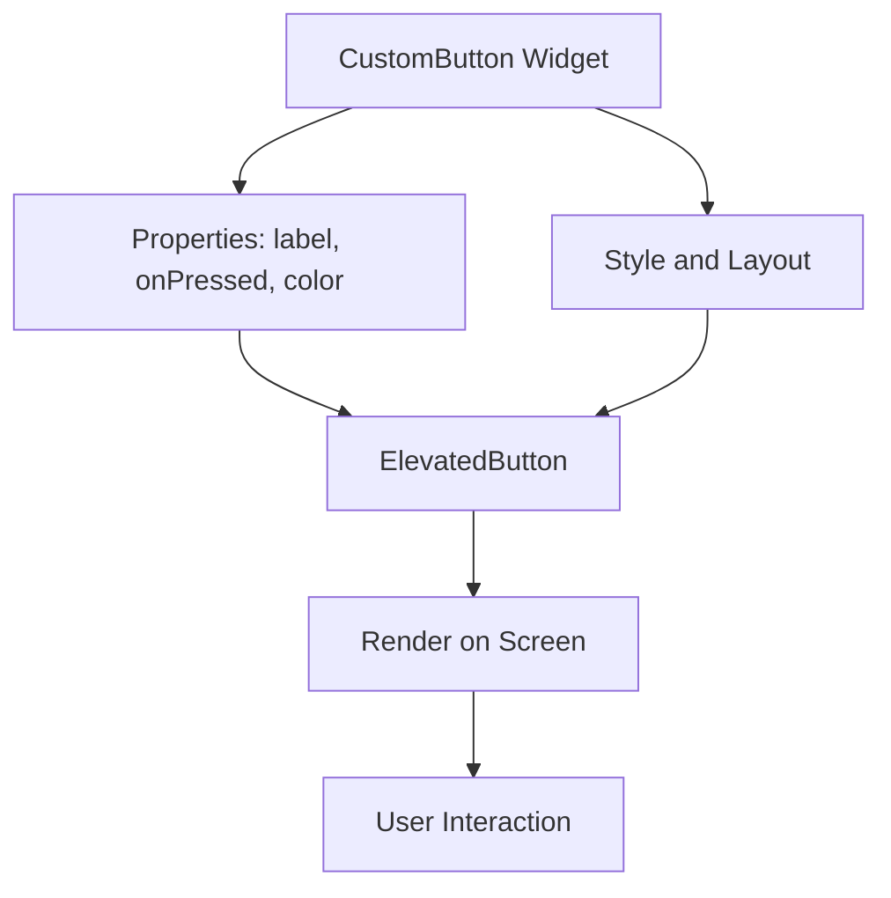

## 14.1.3 Custom Widgets in Flutter: Building Reusable UI Components

In the world of Flutter development, custom widgets are a powerful tool that allows developers to create reusable, encapsulated UI components tailored to specific needs. By leveraging custom widgets, you can promote code reuse, ensure consistency across your application, and enhance maintainability. This section delves into advanced techniques for building custom widgets in Flutter, providing you with the knowledge to create clean, modular, and efficient UI components.

### Designing Reusable Components

Creating reusable components is a cornerstone of efficient software development. In Flutter, this involves designing widgets that encapsulate both functionality and appearance, making them easy to use across different parts of your application.

- **Principles of Creating Clean and Modular Widgets:**
  - **Encapsulation:** Ensure that each widget has a clear purpose and encapsulates its functionality and appearance. This makes it easier to manage and reuse.
  - **Modularity:** Break down complex UI elements into smaller, manageable widgets. This not only simplifies your code but also enhances readability and maintainability.
  - **Reusability:** Design widgets with reusability in mind. Consider the different contexts in which a widget might be used and provide customization options through properties.

- **Encapsulating Functionality and Appearance:**
  - Use properties to allow customization of your widget's appearance and behavior. This can include colors, sizes, and event handlers.
  - Keep the widget's internal logic separate from its presentation. This separation of concerns makes it easier to update or modify the widget without affecting its usage.

### Composing Widgets

Composition is a fundamental concept in Flutter, where complex UI elements are built by combining simpler widgets. This approach promotes flexibility and scalability, allowing you to create intricate designs without sacrificing maintainability.

- **Building Complex UI Elements by Combining Simpler Widgets:**
  - Start with basic widgets and gradually build up to more complex structures. For example, a custom card widget might be composed of a `Container`, `Text`, and `Image` widget.
  - Use layout widgets like `Row`, `Column`, and `Stack` to arrange your components in a visually appealing manner.

- **Using Composition Over Inheritance:**
  - Prefer composition over inheritance when designing widgets. Composition allows you to combine multiple widgets to achieve the desired functionality, whereas inheritance can lead to tightly coupled code that is harder to maintain.
  - By using composition, you can easily swap out or modify individual components without affecting the entire widget.

### Creating Stateful and Stateless Widgets

Understanding when to use `StatefulWidget` versus `StatelessWidget` is crucial for effective widget design. Each serves a different purpose and is suited to specific scenarios.

- **Understanding When to Use `StatefulWidget` vs. `StatelessWidget`:**
  - Use `StatelessWidget` when your widget does not need to maintain any state. These widgets are immutable and are ideal for static content.
  - Use `StatefulWidget` when your widget needs to manage state that can change over time. This is useful for interactive components that respond to user input or other dynamic factors.

- **Managing Internal State Within Custom Widgets Effectively:**
  - Keep the state management logic within the widget's `State` class. This ensures that the widget remains focused on its presentation, while the `State` class handles dynamic behavior.
  - Use the `setState` method to update the widget's state and trigger a rebuild. Be mindful of performance implications and avoid unnecessary rebuilds.

### Handling Custom Properties and Callbacks

Custom properties and callbacks are essential for making widgets flexible and interactive. They allow you to pass data and event handlers to your widgets, enabling them to adapt to different contexts.

- **Passing Data and Event Handlers to Custom Widgets via Constructors:**
  - Define properties in your widget's constructor to accept data and callbacks. This allows you to customize the widget's behavior and appearance from outside.
  - Use named parameters for clarity and to provide default values where appropriate.

- **Utilizing `typedef` for Defining Custom Callback Signatures:**
  - Use `typedef` to define custom callback signatures. This provides a clear contract for the expected function signature, improving code readability and reducing errors.

### Advanced Customization

Advanced customization techniques allow you to create widgets that adapt to different themes and external factors, providing a consistent and dynamic user experience.

- **Leveraging Themes and Inherited Widgets to Customize Widget Appearance:**
  - Use Flutter's theming capabilities to apply consistent styles across your application. This includes colors, fonts, and other visual properties.
  - Inherited widgets allow you to pass data down the widget tree without explicitly passing it through constructors. This is useful for global settings like themes or localization.

- **Implementing Dynamic Styling and Behavior Based on External Factors:**
  - Use media queries and other context-aware techniques to adapt your widget's appearance and behavior based on the device's characteristics or user preferences.
  - Consider accessibility features and provide options for users to customize their experience.

### Best Practices

Adhering to best practices ensures that your custom widgets are reliable, maintainable, and easy to use.

- **Keeping Widgets Focused on a Single Responsibility:**
  - Design each widget to perform a single task or represent a single concept. This makes your code easier to understand and reduces the likelihood of bugs.

- **Documenting Custom Widgets for Better Team Collaboration and Usage:**
  - Provide clear documentation for your custom widgets, including usage examples and explanations of properties and callbacks. This facilitates collaboration and helps other developers understand how to use your components.

- **Writing Unit and Widget Tests for Custom Components to Ensure Reliability:**
  - Test your custom widgets to ensure they behave as expected. This includes unit tests for logic and widget tests for UI components.
  - Use Flutter's testing framework to automate these tests and integrate them into your development workflow.

### Code Example: Custom Reusable Button Widget

Let's explore a practical example of creating a custom reusable button widget in Flutter. This widget will demonstrate the principles of encapsulation, composition, and customization.

```dart
// lib/widgets/custom_button.dart
import 'package:flutter/material.dart';

// Define a typedef for the callback function
typedef VoidCallback = void Function();

class CustomButton extends StatelessWidget {
  final String label;
  final VoidCallback onPressed;
  final Color color;
  final double borderRadius;
  final double elevation;

  // Constructor with named parameters and default values
  CustomButton({
    required this.label,
    required this.onPressed,
    this.color = Colors.blue,
    this.borderRadius = 8.0,
    this.elevation = 2.0,
  });

  @override
  Widget build(BuildContext context) {
    return ElevatedButton(
      onPressed: onPressed,
      style: ElevatedButton.styleFrom(
        primary: color,
        onPrimary: Colors.white,
        elevation: elevation,
        shape: RoundedRectangleBorder(
          borderRadius: BorderRadius.circular(borderRadius),
        ),
      ),
      child: Text(label, style: TextStyle(fontSize: 16)),
    );
  }
}
```

In this example, the `CustomButton` widget encapsulates the appearance and behavior of a button. It accepts several properties to customize its appearance, such as `label`, `color`, `borderRadius`, and `elevation`. The `onPressed` callback allows you to define what happens when the button is pressed.

To use this custom widget, you can include it in your Flutter application as follows:

```dart
// lib/main.dart
import 'package:flutter/material.dart';
import 'widgets/custom_button.dart';

void main() {
  runApp(MyApp());
}

class MyApp extends StatelessWidget {
  @override
  Widget build(BuildContext context) {
    return MaterialApp(
      home: Scaffold(
        appBar: AppBar(title: Text('Custom Button Demo')),
        body: Center(
          child: CustomButton(
            label: 'Press Me',
            onPressed: () {
              ScaffoldMessenger.of(context).showSnackBar(
                SnackBar(content: Text('Button Pressed!')),
              );
            },
            color: Colors.green,
            borderRadius: 16.0,
            elevation: 4.0,
          ),
        ),
      ),
    );
  }
}
```

This code demonstrates how to integrate the `CustomButton` widget into a Flutter application. The button is displayed in the center of the screen, and when pressed, it shows a snackbar with a message.

### Mermaid.js Diagram

To visualize the structure and flow of the `CustomButton` widget, consider the following Mermaid.js diagram:



This diagram illustrates how the `CustomButton` widget is composed of properties and style/layout configurations, which are then used to render an `ElevatedButton` on the screen. User interactions are handled through the `onPressed` callback.

### Conclusion

Custom widgets in Flutter offer a powerful way to create reusable, encapsulated UI components that enhance the maintainability and scalability of your applications. By following best practices and leveraging advanced customization techniques, you can build widgets that are both flexible and efficient. Whether you're designing a simple button or a complex interactive component, the principles discussed in this section will guide you in creating high-quality, reusable widgets.

### Further Exploration

To deepen your understanding of custom widgets and advanced Flutter development, consider exploring the following resources:

- [Flutter Official Documentation](https://flutter.dev/docs): Comprehensive guides and API references for Flutter development.
- [Effective Dart](https://dart.dev/guides/language/effective-dart): Best practices for writing clean and efficient Dart code.
- [Flutter Community](https://flutter.dev/community): Engage with other developers and contribute to open-source projects.
- [Advanced Flutter Courses on Udemy](https://www.udemy.com/courses/search/?q=advanced%20flutter): Online courses that cover advanced topics in Flutter development.

By continuing to explore and experiment with custom widgets, you'll be well-equipped to tackle complex UI challenges and create engaging, user-friendly applications.

## Quiz Time!



### What is the primary benefit of creating custom widgets in Flutter?

- [x] Reusability and encapsulation of UI components
- [ ] Faster rendering of UI elements
- [ ] Automatic state management
- [ ] Built-in animations

> **Explanation:** Custom widgets allow developers to encapsulate functionality and appearance, promoting reusability and maintainability across the application.

### Which principle is emphasized when designing clean and modular widgets?

- [x] Encapsulation
- [ ] Inheritance
- [ ] Global state management
- [ ] Hardcoding styles

> **Explanation:** Encapsulation ensures that each widget has a clear purpose and manages its own functionality and appearance, making it easier to reuse and maintain.

### What is the recommended approach for building complex UI elements in Flutter?

- [x] Composition over inheritance
- [ ] Inheritance over composition
- [ ] Using global variables
- [ ] Hardcoding values

> **Explanation:** Composition allows developers to combine simpler widgets to create complex UI elements, promoting flexibility and scalability.

### When should you use a `StatefulWidget`?

- [x] When the widget needs to manage state that can change over time
- [ ] When the widget is static and does not change
- [ ] When you need to use global variables
- [ ] When you want to use animations

> **Explanation:** `StatefulWidget` is used when a widget needs to manage dynamic state that can change in response to user interactions or other factors.

### How can you pass data and event handlers to custom widgets?

- [x] Via constructors with named parameters
- [ ] Using global variables
- [ ] Through inheritance
- [ ] By hardcoding values

> **Explanation:** Constructors with named parameters allow you to pass data and event handlers to custom widgets, enabling customization and flexibility.

### What is the purpose of using `typedef` in custom widgets?

- [x] To define custom callback signatures
- [ ] To create global variables
- [ ] To manage state
- [ ] To handle animations

> **Explanation:** `typedef` is used to define custom callback signatures, providing a clear contract for the expected function signature.

### How can you apply consistent styles across your Flutter application?

- [x] By using Flutter's theming capabilities
- [ ] By hardcoding styles in each widget
- [ ] By using global variables
- [ ] By creating separate style files

> **Explanation:** Flutter's theming capabilities allow you to apply consistent styles across your application, ensuring a cohesive look and feel.

### What is a key benefit of documenting custom widgets?

- [x] Facilitates collaboration and helps other developers understand usage
- [ ] Increases the app's performance
- [ ] Automatically generates code
- [ ] Reduces the need for testing

> **Explanation:** Documenting custom widgets provides clear usage examples and explanations, facilitating collaboration and helping other developers understand how to use the components.

### Why is it important to write unit and widget tests for custom components?

- [x] To ensure reliability and correct behavior
- [ ] To increase the app's performance
- [ ] To automatically generate documentation
- [ ] To reduce the need for comments

> **Explanation:** Writing unit and widget tests ensures that custom components behave as expected, improving reliability and reducing the likelihood of bugs.

### True or False: Inherited widgets allow you to pass data down the widget tree without explicitly passing it through constructors.

- [x] True
- [ ] False

> **Explanation:** Inherited widgets provide a way to pass data down the widget tree without explicitly passing it through constructors, useful for global settings like themes or localization.


