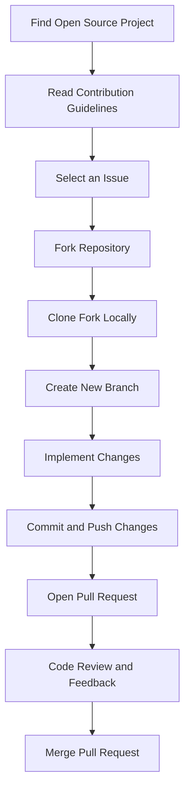

## 14.2.1 Contributing to Open Source

Contributing to open-source projects is a transformative experience that not only enhances your technical skills but also connects you with a global community of developers. By engaging with open-source projects, particularly in the Flutter ecosystem, you can learn from real-world applications, build a professional portfolio, and give back to the community that supports your development journey. This section will guide you through the process of contributing to open-source Flutter projects, from finding suitable projects to making your first contribution and adhering to best practices.

### Benefits of Contributing to Open Source

Contributing to open-source projects offers numerous benefits:

- **Learning from Real-World Projects and Experienced Developers:** Open-source projects provide a practical learning environment where you can see how experienced developers solve complex problems, structure their code, and manage projects. This exposure is invaluable for honing your skills.

- **Building a Professional Portfolio and Network:** Contributions to open-source projects are visible to potential employers and collaborators. They demonstrate your ability to work in a team, solve problems, and contribute to large codebases, enhancing your professional credibility.

- **Giving Back to the Community:** By contributing to open-source projects, you help improve the tools and libraries that you and others rely on. This sense of community and shared purpose is a core aspect of the open-source ethos.

### Finding Suitable Projects

Finding the right project to contribute to is crucial for a rewarding experience. Here are some tips:

- **Explore Repositories on GitHub, GitLab, and Other Platforms:** These platforms host a vast array of open-source projects. Use search filters to find projects related to Flutter or other areas of interest.

- **Look for Projects Labeled with `good first issue`, `help wanted`, or `beginner-friendly`:** These labels indicate issues that are suitable for newcomers and often come with additional guidance.

- **Assess Project Activity, Maintainers’ Responsiveness, and Community Engagement:** Choose projects that are actively maintained and have a welcoming community. Check the frequency of commits, responsiveness to issues, and the tone of communication in the project’s discussions.

### Understanding Contribution Guidelines

Before contributing, it’s essential to understand the project’s contribution guidelines:

- **Read and Adhere to the Project's `CONTRIBUTING.md`:** This document outlines how to contribute to the project, including coding standards, documentation requirements, and the process for submitting changes.

- **Understand Coding Standards, Documentation Requirements, and Commit Message Conventions:** Each project may have specific styles and conventions. Adhering to these ensures consistency and makes it easier for maintainers to review your contributions.

- **Familiarize Yourself with the Project's Issue Tracker and Pull Request Process:** Understanding how issues are tracked and how pull requests are reviewed will help you navigate the contribution process smoothly.

### Making Your First Contribution

Making your first contribution can be daunting, but following these steps can help:

- **Select an Issue that Matches Your Skill Level:** Start with issues labeled as `good first issue` or `beginner-friendly` to build confidence.

- **Fork the Repository and Set Up Your Local Development Environment:** Forking creates a personal copy of the repository that you can modify without affecting the original project.

- **Implement the Fix or Feature Change:** Make the necessary changes in your local environment. Ensure your code is clean, well-documented, and adheres to the project’s standards.

- **Write Tests and Update Documentation if Necessary:** Tests ensure your changes work as intended and don’t introduce new bugs. Updating documentation helps other contributors understand your changes.

- **Submit a Well-Documented Pull Request and Interact with Maintainers:** A clear and concise pull request description helps maintainers understand your changes. Be open to feedback and ready to make adjustments.

#### Code Example: Contributing to a GitHub Repository

Here's a practical example of how to contribute to a GitHub repository:

```bash
# Clone your forked repository
git clone https://github.com/yourusername/flutter_open_source_project.git
cd flutter_open_source_project
git remote add upstream https://github.com/originalowner/flutter_open_source_project.git
git fetch upstream
git checkout -b fix-issue-123
git add .
git commit -m "Fix issue #123: Correct alignment in homepage widget"
git push origin fix-issue-123
```

### Best Practices

Adhering to best practices ensures a positive contribution experience:

- **Communicate Clearly and Respectfully with Project Maintainers and Other Contributors:** Good communication fosters a collaborative environment and helps resolve issues efficiently.

- **Provide Meaningful and Constructive Feedback:** When reviewing others’ contributions, offer feedback that is specific, actionable, and respectful.

- **Continuously Learn and Improve Through Feedback and Code Reviews:** Use feedback as an opportunity to learn and enhance your skills.

### Resources for Contributors

Several resources can help you get started with open-source contributions:

- **Websites like [Open Source Friday](https://opensourcefriday.com/) and [First Timers Only](https://www.firsttimersonly.com/):** These platforms list beginner-friendly projects and provide guidance for first-time contributors.

- **Documentation and Tutorials on Effective Open-Source Contributions:** Many online resources offer tutorials on how to contribute effectively, including best practices for collaboration and communication.

### Visualizing the Contribution Process

To better understand the contribution process, refer to the following flowchart:



### Conclusion

Contributing to open-source projects is a rewarding journey that enhances your skills, builds your professional network, and allows you to give back to the community. By following the guidelines and best practices outlined in this section, you can make meaningful contributions to the Flutter ecosystem and beyond. Remember, every contribution, no matter how small, is valuable and appreciated.

## Quiz Time!



### What is one of the main benefits of contributing to open-source projects?

- [x] Learning from real-world projects and experienced developers.
- [ ] Receiving financial compensation for contributions.
- [ ] Gaining exclusive access to private repositories.
- [ ] Avoiding the need to write documentation.

> **Explanation:** Contributing to open-source projects allows you to learn from real-world projects and experienced developers, enhancing your skills and understanding of software development.

### Which label should you look for when searching for beginner-friendly issues in open-source projects?

- [x] `good first issue`
- [ ] `critical`
- [ ] `wontfix`
- [ ] `duplicate`

> **Explanation:** The `good first issue` label is often used to indicate issues that are suitable for beginners and come with additional guidance.

### What should you do before making a contribution to an open-source project?

- [x] Read and adhere to the project's `CONTRIBUTING.md`.
- [ ] Directly push changes to the main branch.
- [ ] Ignore the project's coding standards.
- [ ] Avoid communicating with maintainers.

> **Explanation:** Reading and adhering to the project's `CONTRIBUTING.md` ensures that you understand the contribution process and coding standards.

### What is the purpose of forking a repository on GitHub?

- [x] To create a personal copy of the repository that you can modify.
- [ ] To delete the original repository.
- [ ] To merge all branches into one.
- [ ] To lock the repository from further changes.

> **Explanation:** Forking a repository creates a personal copy that you can modify without affecting the original project.

### What is a best practice when interacting with project maintainers and other contributors?

- [x] Communicating clearly and respectfully.
- [ ] Criticizing their work without offering solutions.
- [ ] Ignoring their feedback.
- [ ] Making changes without informing them.

> **Explanation:** Clear and respectful communication fosters a collaborative environment and helps resolve issues efficiently.

### What should you include in your pull request description?

- [x] A clear and concise explanation of your changes.
- [ ] Personal opinions about the project.
- [ ] Unrelated code snippets.
- [ ] A list of all your previous contributions.

> **Explanation:** A clear and concise pull request description helps maintainers understand your changes and facilitates the review process.

### Which resource can help you find beginner-friendly open-source projects?

- [x] [First Timers Only](https://www.firsttimersonly.com/)
- [ ] Private GitHub repositories
- [ ] Closed-source software
- [ ] Proprietary software forums

> **Explanation:** [First Timers Only](https://www.firsttimersonly.com/) lists beginner-friendly projects and provides guidance for first-time contributors.

### What is the purpose of writing tests for your changes?

- [x] To ensure your changes work as intended and don’t introduce new bugs.
- [ ] To make the code more complex.
- [ ] To increase the size of the repository.
- [ ] To confuse other contributors.

> **Explanation:** Writing tests ensures that your changes work as intended and helps prevent new bugs from being introduced.

### What is the role of the `upstream` remote in Git?

- [x] To fetch the latest changes from the original repository.
- [ ] To delete branches from the original repository.
- [ ] To merge all branches into one.
- [ ] To lock the repository from further changes.

> **Explanation:** The `upstream` remote is used to fetch the latest changes from the original repository, ensuring your fork is up-to-date.

### True or False: Every contribution to an open-source project, no matter how small, is valuable and appreciated.

- [x] True
- [ ] False

> **Explanation:** Every contribution, regardless of size, is valuable and appreciated in the open-source community, as it helps improve the project and fosters collaboration.


