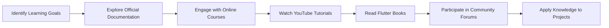

## 14.2.3 Online Resources and Courses

In the dynamic world of Flutter development, continuous learning is not just beneficial—it's essential. As Flutter evolves, so do the tools, techniques, and best practices associated with it. This section is dedicated to providing you with a comprehensive guide to online resources and courses that cater to various learning styles and proficiency levels. Whether you're a beginner looking to grasp the basics or an experienced developer aiming to refine your skills, these resources will help you stay current and deepen your understanding of Flutter.

### Official Documentation and Tutorials

#### Flutter Documentation

The [Flutter Documentation](https://flutter.dev/docs) is your go-to resource for understanding the framework's core concepts, APIs, and best practices. It offers a structured approach to learning Flutter, starting from installation guides to advanced topics like state management and animations. The documentation is regularly updated, ensuring you have access to the latest information and features.

#### Codelabs and Sample Projects

Flutter's [Codelabs](https://flutter.dev/docs/codelabs) provide hands-on tutorials that allow you to practice and apply concepts in real-world scenarios. These guided exercises cover a wide range of topics, from building your first app to integrating Firebase. Each codelab is designed to be completed in a few hours, making them perfect for weekend projects or quick learning sessions.

#### Cookbook

The [Flutter Cookbook](https://flutter.dev/docs/cookbook) is a collection of "recipes" that address common development tasks and challenges. Each recipe provides a step-by-step guide to solving specific problems, such as implementing animations, handling user input, or managing state. This resource is invaluable for developers looking to quickly find solutions to common issues.

### Online Courses and Platforms

#### Udemy

Udemy offers a plethora of courses on Flutter, catering to different skill levels. One of the most popular courses is "Flutter & Dart - The Complete Guide" by Maximilian Schwarzmüller. This course covers everything from the basics of Dart to advanced Flutter concepts, providing a comprehensive learning experience.

#### Coursera

Coursera provides specializations in Flutter app development, often offered by esteemed institutions. These courses are structured as a series of modules, each focusing on a specific aspect of Flutter development. They often include peer-reviewed assignments and projects, allowing you to apply what you've learned in a practical setting.

#### edX

edX offers university-led courses that cover both the fundamentals and advanced topics of Flutter development. These courses are designed by academic institutions and provide a rigorous learning experience, often culminating in a certificate upon completion.

#### Pluralsight

Pluralsight is known for its in-depth tutorials and courses on Flutter and related technologies. With a subscription, you gain access to a vast library of content, including courses on mobile development, UI/UX design, and more.

#### Codecademy

Codecademy offers interactive lessons and projects to help you build your Flutter skills. Their hands-on approach ensures that you not only learn the theory but also apply it through coding exercises and projects.

### YouTube Channels

#### Flutter’s Official YouTube Channel

The [Flutter YouTube Channel](https://www.youtube.com/flutterdev) is a treasure trove of up-to-date tutorials, talks, and feature highlights. It includes content from Flutter's official events, such as Flutter Engage and Flutter Live, providing insights into the latest developments and features.

#### The Net Ninja

The Net Ninja offers a comprehensive series of [Flutter tutorials](https://www.youtube.com/playlist?list=PL4cUxeGkcC9jLYyp2Aoh6hcWuxFDX6PBJ) that cover everything from the basics to more advanced topics. The tutorials are well-structured and easy to follow, making them ideal for beginners.

#### Traversy Media

Traversy Media provides high-quality tutorials and crash courses on Flutter. Their [Flutter playlist](https://www.youtube.com/playlist?list=PLillGF-RfqbbiTGgA77tGO426V3hRF9iE) is particularly popular among developers looking for concise and informative content.

### Books and eBooks

#### "Flutter in Action" by Eric Windmill

"Flutter in Action" is a comprehensive guide that covers the entire Flutter development process. It provides practical examples and detailed explanations, making it a valuable resource for both beginners and experienced developers.

#### "Flutter Cookbook" by Simone Alessandria and Brian Egan

This book offers practical recipes for Flutter projects, addressing common challenges and providing solutions. It's an excellent resource for developers looking to enhance their problem-solving skills.

#### "Programming Flutter" by Carmine Zaccagnino

"Programming Flutter" delves into the capabilities of Flutter, offering an in-depth exploration of its features. It's ideal for developers who want to gain a deeper understanding of the framework.

### Community and Forums

#### Stack Overflow

[Stack Overflow](https://stackoverflow.com/questions/tagged/flutter) is a popular platform for asking questions and finding answers related to Flutter development. The community is active and responsive, making it a great place to seek help and share knowledge.

#### Reddit

Participate in discussions and seek advice on subreddits like [r/FlutterDev](https://www.reddit.com/r/FlutterDev/). This community is a great place to share your projects, ask questions, and stay updated with the latest news in the Flutter world.

#### Flutter Community

Engage with other Flutter developers via platforms like Slack, Discord, or other community forums. These communities provide opportunities to network, collaborate, and learn from others in the field.

### Podcasts and Blogs

#### Podcasts

- **"Flutter Podcast":** This podcast features interviews and discussions with Flutter experts, providing insights into the latest trends and best practices.

#### Blogs

- **Flutter’s Official Blog:** The [Flutter Blog](https://medium.com/flutter) offers announcements, tutorials, and deep dives into new features. It's a must-read for anyone looking to stay updated with the latest developments.
- **Ray Wenderlich:** Known for high-quality tutorials and articles, [Ray Wenderlich's Flutter section](https://www.raywenderlich.com/flutter) is a valuable resource for developers of all levels.

### Practical Application and Continuous Learning

To truly benefit from these resources, it's important to apply what you learn through hands-on projects. Consider setting personal learning goals and using the resources mentioned above to achieve them. Here's a suggested learning path:

This diagram illustrates a continuous learning cycle, emphasizing the importance of applying knowledge through projects and engaging with the community to enhance your learning experience.

### Best Practices and Tips

- **Stay Updated:** Regularly check official documentation and community forums for updates and new features.
- **Engage with the Community:** Participate in discussions, attend meetups, and collaborate on open-source projects.
- **Practice Regularly:** Apply what you learn through personal projects or contribute to existing ones.
- **Seek Feedback:** Share your work with peers and seek constructive feedback to improve your skills.

### Conclusion

The journey of mastering Flutter is ongoing, and these resources are just the beginning. By leveraging the wealth of information available online, you can stay ahead in the ever-evolving field of Flutter development. Remember, the key to success is continuous learning and practical application. Embrace the community, explore new resources, and keep building amazing apps!

## Quiz Time!



### Which resource is considered the go-to for understanding Flutter's core concepts and APIs?

- [x] Flutter Documentation
- [ ] Udemy Courses
- [ ] The Net Ninja YouTube Channel
- [ ] Stack Overflow

> **Explanation:** The Flutter Documentation is the official resource for understanding Flutter's core concepts, APIs, and best practices.

### What type of content can you find on Flutter's Official YouTube Channel?

- [x] Tutorials, talks, and feature highlights
- [ ] Only beginner tutorials
- [ ] Only advanced programming techniques
- [ ] Non-technical content

> **Explanation:** Flutter's Official YouTube Channel provides a variety of content, including tutorials, talks, and feature highlights.

### Which book offers practical recipes for Flutter projects?

- [ ] "Flutter in Action" by Eric Windmill
- [x] "Flutter Cookbook" by Simone Alessandria and Brian Egan
- [ ] "Programming Flutter" by Carmine Zaccagnino
- [ ] "Flutter for Beginners" by John Doe

> **Explanation:** "Flutter Cookbook" by Simone Alessandria and Brian Egan offers practical recipes for Flutter projects.

### Which online platform offers a course titled "Flutter & Dart - The Complete Guide"?

- [x] Udemy
- [ ] Coursera
- [ ] edX
- [ ] Pluralsight

> **Explanation:** Udemy offers the course "Flutter & Dart - The Complete Guide" by Maximilian Schwarzmüller.

### What is the primary focus of Flutter's Codelabs?

- [x] Hands-on tutorials for practicing and applying concepts
- [ ] Theoretical explanations of Flutter's architecture
- [ ] Marketing strategies for Flutter apps
- [ ] Non-technical overviews

> **Explanation:** Flutter's Codelabs focus on hands-on tutorials that allow developers to practice and apply concepts in real-world scenarios.

### Which community platform is known for active discussions and Q&A related to Flutter?

- [ ] Reddit
- [ ] Discord
- [x] Stack Overflow
- [ ] LinkedIn

> **Explanation:** Stack Overflow is a popular platform for asking questions and finding answers related to Flutter development.

### What type of content does the Ray Wenderlich website provide for Flutter developers?

- [x] High-quality tutorials and articles
- [ ] Only video content
- [ ] Non-technical blog posts
- [ ] Marketing advice

> **Explanation:** Ray Wenderlich provides high-quality tutorials and articles for Flutter developers.

### Which podcast features interviews and discussions with Flutter experts?

- [x] "Flutter Podcast"
- [ ] "Tech Talk"
- [ ] "Developer Diaries"
- [ ] "Code Chat"

> **Explanation:** "Flutter Podcast" features interviews and discussions with Flutter experts.

### What is the primary benefit of engaging with the Flutter community?

- [x] Networking, collaboration, and learning from others
- [ ] Only receiving feedback on projects
- [ ] Access to exclusive content
- [ ] Marketing your apps

> **Explanation:** Engaging with the Flutter community provides opportunities for networking, collaboration, and learning from others in the field.

### True or False: Continuous learning is essential in Flutter development.

- [x] True
- [ ] False

> **Explanation:** Continuous learning is essential in Flutter development due to the ever-evolving nature of the framework and its ecosystem.


