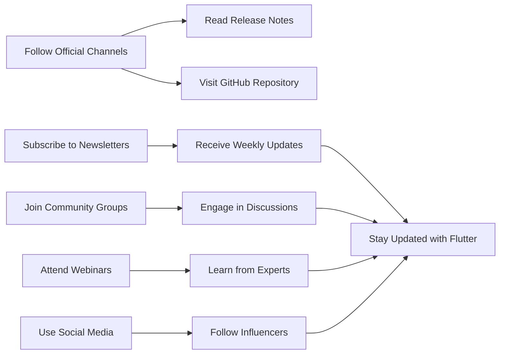

## 14.2.4 Staying Updated

In the fast-paced world of software development, staying updated with the latest advancements is crucial for maintaining the efficiency and relevance of your applications. The Flutter ecosystem is no exception, with continuous updates, new features, and evolving best practices. This section provides strategies to keep abreast of Flutter’s advancements and integrate new knowledge into your development workflows.

### Following Official Channels

#### Flutter’s Official Blog and Release Notes

One of the most reliable ways to stay informed about the latest updates in Flutter is by following the official Flutter blog and release notes. These resources provide detailed information about new features, improvements, bug fixes, and breaking changes. Regularly reviewing these notes ensures that you are aware of the latest tools and can plan for any necessary adjustments in your projects.

- **Link:** [Flutter Release Notes](https://flutter.dev/docs/development/tools/sdk/release-notes)

#### Flutter GitHub Repository

The Flutter GitHub repository is a treasure trove of information. By tracking changes, issue resolutions, and upcoming features, you can gain insights into the development process and future directions of Flutter. Engaging with the repository also allows you to contribute to discussions, report issues, and even contribute code.

- **Link:** [Flutter GitHub](https://github.com/flutter/flutter)

### Subscribing to Newsletters

#### Flutter Weekly

Newsletters like Flutter Weekly curate the latest news, tutorials, and resources, delivering them directly to your inbox. This is an efficient way to stay updated without having to actively search for information. Flutter Weekly covers a wide range of topics, from beginner tips to advanced techniques, ensuring that there is something for everyone.

- **Link:** [Flutter Weekly](https://flutterweekly.net/)

#### Dart Weekly

Similarly, Dart Weekly focuses on the Dart programming language, which is integral to Flutter development. Staying updated with Dart’s latest features and news can enhance your coding skills and improve your Flutter applications.

- **Link:** [Dart Weekly](https://dartweekly.com/)

### Joining Community Groups

#### Slack and Discord Channels

Engaging in real-time conversations through Slack and Discord channels can be incredibly beneficial. These platforms allow you to seek advice, share knowledge, and collaborate with other developers. Being part of a community can provide support and motivation, especially when tackling challenging problems.

- **Example:** [Flutter Community Slack](https://fluttercommunity.slack.com/)

#### Local Meetups and User Groups

Participating in local meetups and user groups offers opportunities to connect with nearby developers. These events can be in-person or virtual and often include presentations, workshops, and networking sessions. Engaging with the community can lead to collaborations and new learning opportunities.

### Attending Webinars and Live Streams

Webinars and live streams are excellent ways to learn from Flutter experts and community leaders. These sessions often include live coding, Q&As, and discussions on various topics. Platforms like YouTube Live and Twitch host numerous Flutter-related events that you can attend to enhance your skills.

### Reading and Contributing to Open Source

Analyzing and contributing to trending Flutter packages can provide insights into evolving best practices and architectural patterns. Open source contributions not only enhance your skills but also allow you to give back to the community. By examining popular repositories, you can learn how experienced developers structure their code and solve complex problems.

### Using Social Media Effectively

#### Twitter

Twitter is a powerful tool for staying updated with real-time information. By following Flutter’s official account and prominent Flutter developers, you can receive updates, insights, and tips directly from the source.

- **Example:** [@flutterdev](https://twitter.com/flutterdev)

#### LinkedIn

LinkedIn offers professional networking opportunities. Joining Flutter-related groups and following industry leaders can provide valuable insights and connections that can aid in your professional development.

### Engaging with Educational Content

Regularly revisiting online courses and tutorials is essential for refreshing your knowledge and learning about new features. Experimenting with new Flutter releases through sample projects can provide hands-on experience and deepen your understanding of the framework.

### Best Practices for Staying Updated

- **Allocate Regular Time for Learning:** Set aside dedicated time each week to catch up on Flutter updates and explore new features.
- **Implement Incremental Improvements:** Gradually integrate new Flutter features and optimizations into your projects to enhance their performance and functionality.
- **Encourage Team Knowledge Sharing:** Foster a culture of continuous learning within your team by encouraging members to share insights and participate in learning initiatives.

### Conclusion

Staying updated with the latest advancements in Flutter development is crucial for maintaining the relevance and efficiency of your applications. By following official channels, subscribing to newsletters, joining community groups, attending webinars, and engaging with educational content, you can ensure that your skills remain sharp and up-to-date. Embrace continuous learning and collaboration to thrive in the ever-evolving world of Flutter development.

### Mermaid.js Diagram

## Quiz Time!



### What is a reliable source for the latest Flutter updates?

- [x] Flutter’s Official Blog
- [ ] Random tech blogs
- [ ] Unofficial forums
- [ ] Personal developer blogs

> **Explanation:** Flutter’s Official Blog provides the most reliable and up-to-date information about Flutter updates.

### How can you track changes and upcoming features in Flutter?

- [x] By following the Flutter GitHub repository
- [ ] By reading random online articles
- [ ] By attending unrelated tech conferences
- [ ] By using outdated documentation

> **Explanation:** The Flutter GitHub repository is the primary source for tracking changes and upcoming features.

### Which newsletter focuses on the Dart programming language?

- [x] Dart Weekly
- [ ] Flutter Weekly
- [ ] Tech News Daily
- [ ] Code Weekly

> **Explanation:** Dart Weekly is dedicated to updates and news about the Dart programming language.

### What is a benefit of joining Slack and Discord channels?

- [x] Real-time conversations with other developers
- [ ] Access to outdated information
- [ ] Limited networking opportunities
- [ ] Irrelevant discussions

> **Explanation:** Slack and Discord channels provide real-time conversations, advice, and knowledge sharing among developers.

### What platform hosts numerous Flutter-related webinars and live streams?

- [x] YouTube Live
- [ ] Instagram Live
- [ ] Facebook Live
- [ ] LinkedIn Live

> **Explanation:** YouTube Live is a popular platform for hosting Flutter-related webinars and live streams.

### How can contributing to open source benefit you?

- [x] Enhances skills and provides insights into best practices
- [ ] Limits learning opportunities
- [ ] Provides no real-world experience
- [ ] Is only beneficial for beginners

> **Explanation:** Contributing to open source enhances skills and provides insights into best practices and architectural patterns.

### What is a key benefit of using Twitter for staying updated?

- [x] Real-time updates and insights
- [ ] Limited information
- [ ] Outdated news
- [ ] Irrelevant content

> **Explanation:** Twitter provides real-time updates and insights from official accounts and prominent developers.

### What should you do to maintain your skills with new Flutter releases?

- [x] Experiment with sample projects
- [ ] Avoid new features
- [ ] Stick to old tutorials
- [ ] Ignore updates

> **Explanation:** Experimenting with sample projects helps you gain hands-on experience with new Flutter releases.

### What is a best practice for staying updated with Flutter?

- [x] Allocate regular time for learning
- [ ] Ignore new updates
- [ ] Focus only on current projects
- [ ] Avoid community engagement

> **Explanation:** Allocating regular time for learning ensures you stay updated with the latest advancements.

### True or False: Engaging with community groups has no impact on your professional development.

- [ ] True
- [x] False

> **Explanation:** Engaging with community groups provides networking opportunities and valuable insights that aid in professional development.


