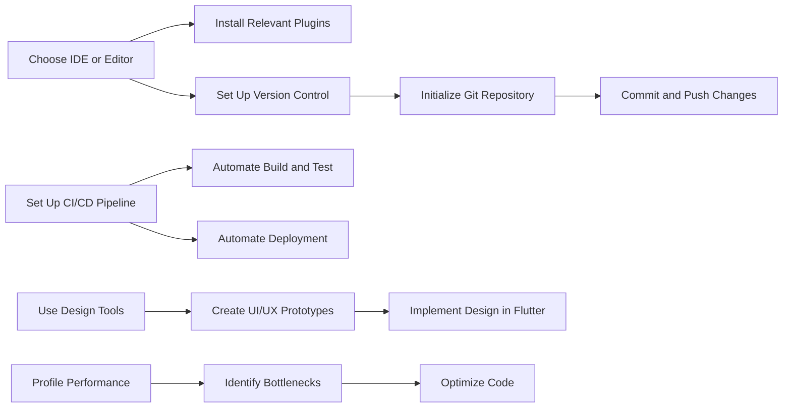

## 14.3.1 Useful Development Tools

In the rapidly evolving world of mobile app development, leveraging the right tools can significantly enhance your productivity, streamline workflows, and improve code quality. Flutter, being a versatile and powerful framework, is complemented by a rich ecosystem of development tools that cater to various aspects of the development process. This section delves into some of the most essential tools that Flutter developers can integrate into their workflow to boost efficiency and effectiveness.

### IDEs and Editors

Choosing the right Integrated Development Environment (IDE) or editor is crucial for a smooth development experience. Here are some popular options:

#### Visual Studio Code

Visual Studio Code (VS Code) is a lightweight yet powerful editor that has gained immense popularity among developers due to its flexibility and extensive support for extensions.

- **Extensions for Flutter and Dart:**
  - **Dart:** Provides support for Dart language features, including syntax highlighting, code completion, and debugging.
  - **Flutter:** Offers tools for running and debugging Flutter apps, as well as creating new projects.
  - **Flutter Awesome Snippets:** A collection of commonly used Flutter snippets to speed up development.

VS Code's marketplace offers a plethora of extensions that can further enhance your development experience, making it a favorite among Flutter developers.

#### Android Studio

Android Studio is a feature-rich IDE that comes with built-in support for Flutter through plugins. It is particularly favored by developers who work extensively with Android.

- **Flutter Plugin:** Integrates Flutter development tools directly into Android Studio, providing features like project creation, debugging, and hot reload.
- **Dart Plugin:** Adds Dart language support, enabling syntax highlighting, code completion, and more.

Android Studio's robust set of tools for Android development, combined with Flutter support, makes it a comprehensive choice for developers.

#### IntelliJ IDEA

IntelliJ IDEA, developed by JetBrains, is a robust IDE that caters to developers who prefer the JetBrains ecosystem. It offers a seamless experience for Flutter development with its powerful features.

- **Flutter Plugin:** Similar to Android Studio, IntelliJ IDEA supports Flutter development through plugins.
- **Dart Plugin:** Provides comprehensive support for Dart, enhancing the development experience.

IntelliJ IDEA is known for its intelligent code analysis and refactoring capabilities, making it a strong contender for serious developers.

### Version Control Systems

Version control is a fundamental aspect of modern software development, enabling teams to collaborate effectively and manage code changes efficiently.

#### Git

Git is the most widely used version control system, known for its speed, efficiency, and distributed nature. It allows developers to track changes, manage branches, and collaborate seamlessly.

- **Basic Commands:**
  - `git init`: Initialize a new Git repository.
  - `git add`: Stage changes for commit.
  - `git commit`: Commit changes to the repository.
  - `git push`: Push changes to a remote repository.

#### GitHub, GitLab, Bitbucket

These platforms provide hosting for Git repositories, along with additional features like issue tracking, continuous integration, and collaboration tools.

- **GitHub:** Known for its vast community and open-source projects.
- **GitLab:** Offers integrated CI/CD pipelines and DevOps tools.
- **Bitbucket:** Provides seamless integration with Atlassian tools like Jira.

These platforms are essential for managing code repositories, collaborating with teams, and automating workflows.

### Continuous Integration/Continuous Deployment (CI/CD) Tools

CI/CD tools automate the process of building, testing, and deploying applications, ensuring a streamlined and efficient workflow.

#### GitHub Actions

GitHub Actions is a powerful CI/CD tool that allows developers to automate workflows directly within GitHub.

- **Features:**
  - Automate build, test, and deployment processes.
  - Integrate with other services and tools.
  - Use pre-built actions from the GitHub Marketplace.

**Example Workflow:**

```yaml
name: Flutter CI
on:
  push:
    branches: [ main ]
  pull_request:
    branches: [ main ]
jobs:
  build:
    runs-on: ubuntu-latest
    steps:
    - uses: actions/checkout@v3
    - name: Set up Flutter
      uses: subosito/flutter-action@v2
      with:
        flutter-version: '3.10.0'
    - name: Install Dependencies
      run: flutter pub get
    - name: Run Tests
      run: flutter test
    - name: Build APK
      run: flutter build apk --release
    - name: Upload APK
      uses: actions/upload-artifact@v3
      with:
        name: app-release.apk
        path: build/app/outputs/flutter-apk/app-release.apk
```

#### Bitrise

Bitrise is a mobile-focused CI/CD service that supports Flutter projects, offering a range of integrations and automation options.

- **Features:**
  - Pre-configured workflows for mobile apps.
  - Integration with popular tools and services.
  - Customizable build pipelines.

#### CircleCI

CircleCI is a flexible and scalable CI/CD platform that supports a wide range of project needs, including Flutter.

- **Features:**
  - Fast and efficient build processes.
  - Extensive integration options.
  - Customizable workflows and pipelines.

### Design and Prototyping Tools

Design and prototyping tools are essential for creating visually appealing and user-friendly interfaces.

#### Figma

Figma is a collaborative design tool that is ideal for creating UI/UX prototypes and assets.

- **Features:**
  - Real-time collaboration with team members.
  - Vector-based design tools.
  - Integration with other design and development tools.

#### Sketch

Sketch is a vector graphics editor that is widely used for designing app interfaces.

- **Features:**
  - Powerful design tools for creating detailed interfaces.
  - Extensive library of plugins and integrations.
  - Support for exporting assets in various formats.

#### Adobe XD

Adobe XD is a tool for designing and prototyping user experiences, offering a range of features for creating interactive designs.

- **Features:**
  - Intuitive design tools for creating wireframes and prototypes.
  - Support for interactive prototypes and animations.
  - Integration with other Adobe Creative Cloud tools.

### Performance Profiling Tools

Performance profiling tools help developers analyze and optimize their applications, ensuring smooth and efficient performance.

#### Flutter DevTools

Flutter DevTools is a comprehensive suite of tools for profiling, debugging, and optimizing Flutter apps.

- **Features:**
  - Performance profiling and analysis.
  - Debugging tools for inspecting widget trees and layouts.
  - Memory usage monitoring and analysis.

#### Dart Observatory

Dart Observatory is a tool for analyzing Dart applications, profiling performance, and monitoring memory usage.

- **Features:**
  - Detailed performance analysis and profiling.
  - Memory usage tracking and analysis.
  - Debugging tools for Dart applications.

### Code Formatting and Linting

Code formatting and linting tools ensure consistency and readability in code, helping developers catch potential issues early.

#### Dartfmt

Dartfmt is a tool for automatically formatting Dart code, ensuring consistency and readability.

- **Features:**
  - Automatic code formatting based on predefined rules.
  - Integration with IDEs and editors for seamless formatting.

#### Linting Packages

Linting packages enforce code style rules and catch potential issues early, improving code quality.

- **Examples:**
  - `pedantic`: A set of lint rules used by the Dart team.
  - `flutter_lints`: A package of recommended lint rules for Flutter projects.

### Testing Frameworks and Tools

Testing frameworks and tools are essential for ensuring the reliability and stability of applications.

#### Mockito

Mockito is a framework for creating mock objects in tests, allowing developers to isolate and test specific components.

- **Features:**
  - Create mock objects for testing dependencies.
  - Verify interactions and behavior in tests.

#### Coverage Tools

Coverage tools measure code coverage to ensure comprehensive testing, helping developers identify untested areas.

- **Features:**
  - Generate detailed coverage reports.
  - Identify areas of code that require additional testing.

### Flutter-Specific Tools

Flutter-specific tools enhance the development experience by providing additional functionality and integrations.

#### Flutter Genie

Flutter Genie is a visual tool for generating SVG and other graphics integrated into Flutter, streamlining the design-to-code process.

- **Features:**
  - Generate SVG graphics for Flutter applications.
  - Integrate graphics seamlessly into Flutter projects.

#### FlutterStetho

FlutterStetho integrates with Facebook’s Stetho for debugging network and database operations, providing additional insights into app behavior.

- **Features:**
  - Debug network requests and responses.
  - Inspect database operations and queries.

### Conclusion

Integrating these development tools into your Flutter workflow can significantly enhance your productivity, streamline processes, and improve code quality. By leveraging the right tools, you can focus more on building great applications and less on managing the intricacies of the development process.

### Mermaid.js Diagram

To visualize the integration of these tools into your development workflow, consider the following diagram:



This diagram illustrates a streamlined workflow that incorporates various tools and processes to enhance your Flutter development experience.

## Quiz Time!



### Which IDE is known for its lightweight nature and extensive support for Flutter through extensions?

- [x] Visual Studio Code
- [ ] Android Studio
- [ ] IntelliJ IDEA
- [ ] Eclipse

> **Explanation:** Visual Studio Code is known for its lightweight nature and extensive support for Flutter through extensions like Dart and Flutter.

### What is the primary purpose of Git in software development?

- [x] Managing code versions
- [ ] Designing UI/UX prototypes
- [ ] Automating build processes
- [ ] Profiling application performance

> **Explanation:** Git is primarily used for managing code versions, tracking changes, and collaborating with teams.

### Which CI/CD tool is integrated directly within GitHub for automating workflows?

- [x] GitHub Actions
- [ ] Bitrise
- [ ] CircleCI
- [ ] Jenkins

> **Explanation:** GitHub Actions is integrated directly within GitHub and allows developers to automate workflows, including build, test, and deployment processes.

### Which design tool is known for its real-time collaboration features?

- [x] Figma
- [ ] Sketch
- [ ] Adobe XD
- [ ] InVision

> **Explanation:** Figma is known for its real-time collaboration features, allowing team members to work together on design projects simultaneously.

### What is the primary function of Flutter DevTools?

- [x] Profiling, debugging, and optimizing Flutter apps
- [ ] Designing UI/UX prototypes
- [ ] Managing code versions
- [ ] Automating build processes

> **Explanation:** Flutter DevTools is a comprehensive suite for profiling, debugging, and optimizing Flutter apps.

### Which tool is used for automatically formatting Dart code?

- [x] Dartfmt
- [ ] Linter
- [ ] Prettier
- [ ] ESLint

> **Explanation:** Dartfmt is used for automatically formatting Dart code to ensure consistency and readability.

### What is the purpose of the Mockito framework in testing?

- [x] Creating mock objects in tests
- [ ] Profiling application performance
- [ ] Designing UI/UX prototypes
- [ ] Automating deployment processes

> **Explanation:** Mockito is a framework for creating mock objects in tests, allowing developers to isolate and test specific components.

### Which platform is known for its vast community and open-source projects?

- [x] GitHub
- [ ] GitLab
- [ ] Bitbucket
- [ ] SourceForge

> **Explanation:** GitHub is known for its vast community and open-source projects, making it a popular platform for hosting repositories.

### What is the primary benefit of using CI/CD tools in development?

- [x] Automating build, test, and deployment processes
- [ ] Designing UI/UX prototypes
- [ ] Managing code versions
- [ ] Profiling application performance

> **Explanation:** CI/CD tools automate the build, test, and deployment processes, ensuring a streamlined and efficient workflow.

### True or False: FlutterStetho is used for generating SVG graphics for Flutter applications.

- [ ] True
- [x] False

> **Explanation:** FlutterStetho is used for debugging network and database operations, not for generating SVG graphics. Flutter Genie is the tool for generating SVG graphics.


