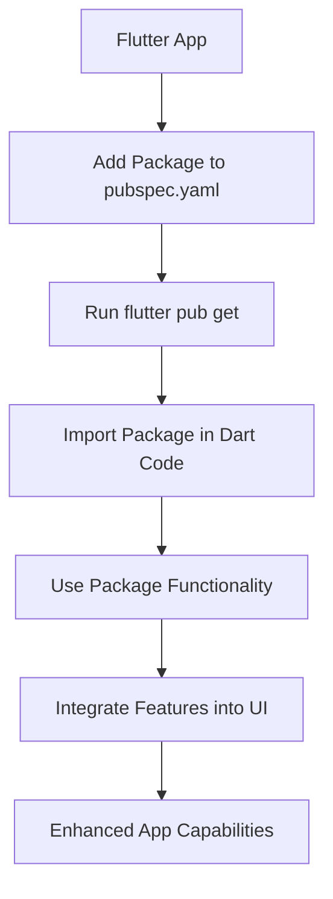

## 14.3.2 Third-Party Packages

In the dynamic world of mobile app development, leveraging third-party packages is a strategic approach to enhance functionality and accelerate the development process. Flutter, with its rich ecosystem, offers a plethora of packages that cater to various needs, from state management to UI components, networking, and beyond. This section delves into the significance of third-party packages, exploring popular options, their integration, and best practices for effective usage.

### Understanding Third-Party Packages

Third-party packages are external libraries that extend the core capabilities of Flutter. They allow developers to implement complex features quickly, saving time and effort that would otherwise be spent on building these functionalities from scratch. By using these packages, developers can focus on crafting unique app experiences rather than reinventing the wheel.

### Package Categories

To effectively utilize third-party packages, it's essential to understand the different categories they fall into:

#### State Management

Managing state efficiently is crucial for building responsive and maintainable apps. Popular packages in this category include:

- **Bloc**: Implements the Business Logic Component pattern, providing a reactive way to manage state.
- **Riverpod**: A flexible and modern state management solution that improves upon Provider.
- **Redux**: A predictable state container for Dart and Flutter apps.

#### Networking

Handling HTTP requests and API interactions is a common requirement. Key packages include:

- **Dio**: An advanced HTTP client with features like interceptors and global configuration.
- **Http**: A simple HTTP client for making network requests.

#### UI Components

Enhance your app's UI with these libraries:

- **Flutter Slidable**: Adds sliding actions to list items.
- **Cached Network Image**: Efficiently loads and caches images from the network.
- **Flutter SVG**: Renders SVG images and animations.

#### Database and Storage

For local data storage, consider:

- **Hive**: A lightweight and fast key-value database.
- **Moor (Drift)**: A reactive persistence library built on top of SQLite.
- **Sqflite**: A plugin for SQLite databases.

#### Authentication

Secure user authentication can be achieved with:

- **Firebase Auth**: Provides authentication services using Firebase.
- **Flutter Secure Storage**: Stores sensitive data securely.
- **OAuth2**: Implements OAuth2 authentication flows.

#### Forms and Validation

Simplify form handling with:

- **Flutter Form Builder**: A form creation and validation library.
- **Validators**: Provides common validation functions.

#### Animations

Bring your app to life with animations:

- **Flutter Animation Set**: Offers a collection of animations.
- **Rive**: Integrates complex animations and interactive graphics.

#### Analytics and Monitoring

Track app performance and user behavior using:

- **Firebase Analytics**: Collects app usage data.
- **Sentry Flutter**: Monitors errors and crashes.
- **Crashlytics**: Provides real-time crash reporting.

### Popular and Widely-Used Packages

While there are numerous packages available, some have gained widespread popularity due to their utility and ease of use:

- **Provider**: A simplistic yet powerful state management solution that integrates seamlessly with Flutter's widget tree.
- **Dio**: Known for its advanced features like interceptors, Dio is a preferred choice for handling HTTP requests.
- **Flutter Hooks**: Introduces hooks to Flutter, offering a new way to manage state and lifecycle.
- **GetX**: Combines state management, dependency injection, and route management in a single package.
- **Cached Network Image**: Efficiently loads and caches images, reducing network load.
- **Intl**: Supports internationalization and localization, making it easier to build apps for a global audience.

### Selecting the Right Packages

Choosing the right package involves several considerations:

- **Popularity and Maintenance**: Opt for packages with active maintenance, frequent updates, and a large user base. This ensures reliability and access to community support.
- **Documentation and Community Support**: Comprehensive documentation and an active community can significantly ease the integration process.
- **Compatibility**: Verify that the package is compatible with your Flutter version and target platforms.
- **Performance Impact**: Assess how the package affects app performance and bundle size. Some packages may introduce overhead that could impact load times or memory usage.

### Integrating Packages into Projects

Integrating third-party packages into your Flutter project involves several steps:

1. **Adding Dependencies**: Update your `pubspec.yaml` file to include the desired package. For example, to add Dio:

   ```yaml
   dependencies:
     flutter:
       sdk: flutter
     dio: ^5.0.0
   ```

2. **Installing Packages**: Run `flutter pub get` to download and install the package.

3. **Importing and Utilizing**: Import the package in your Dart code and utilize its functionalities. Here's an example of using Dio for networking:

   ```dart
   // lib/services/api_service.dart
   import 'package:dio/dio.dart';

   class ApiService {
     final Dio _dio = Dio();

     Future<Response> getData(String endpoint) async {
       try {
         Response response = await _dio.get(endpoint);
         return response;
       } catch (e) {
         throw Exception('Failed to load data: $e');
       }
     }

     Future<Response> postData(String endpoint, Map<String, dynamic> data) async {
       try {
         Response response = await _dio.post(endpoint, data: data);
         return response;
       } catch (e) {
         throw Exception('Failed to post data: $e');
       }
     }
   }
   ```

4. **Configuring Platform-Specific Settings**: Some packages require additional configuration for specific platforms, such as Android permissions or iOS `info.plist` entries.

### Best Practices

To maximize the benefits of third-party packages, consider these best practices:

- **Regular Updates**: Keep packages up to date to benefit from improvements and security patches.
- **Remove Unused Packages**: Regularly audit your project to remove unused packages, reducing potential security vulnerabilities and keeping the project lean.
- **Review Source Code and Licenses**: Understand the package's source code and licenses to ensure compliance and security.

### Code Example: Integrating `dio` for Networking

Here's a practical example of integrating the Dio package for networking:

```yaml
dependencies:
  flutter:
    sdk: flutter
  dio: ^5.0.0
```

```dart
// lib/services/api_service.dart
import 'package:dio/dio.dart';

class ApiService {
  final Dio _dio = Dio();

  Future<Response> getData(String endpoint) async {
    try {
      Response response = await _dio.get(endpoint);
      return response;
    } catch (e) {
      throw Exception('Failed to load data: $e');
    }
  }

  Future<Response> postData(String endpoint, Map<String, dynamic> data) async {
    try {
      Response response = await _dio.post(endpoint, data: data);
      return response;
    } catch (e) {
      throw Exception('Failed to post data: $e');
    }
  }
}

// lib/main.dart
import 'package:flutter/material.dart';
import 'services/api_service.dart';

void main() {
  runApp(MyApp());
}

class MyApp extends StatelessWidget {
  final ApiService apiService = ApiService();

  @override
  Widget build(BuildContext context) {
    return MaterialApp(
      home: Scaffold(
        appBar: AppBar(title: Text('Dio Networking Demo')),
        body: Center(
          child: ElevatedButton(
            onPressed: () async {
              try {
                Response response = await apiService.getData('https://jsonplaceholder.typicode.com/posts/1');
                print(response.data);
              } catch (e) {
                print(e);
              }
            },
            child: Text('Fetch Data'),
          ),
        ),
      ),
    );
  }
}
```

### Visualizing the Integration Process

To better understand the process of integrating a third-party package into a Flutter app, consider the following diagram:



### Conclusion

Third-party packages are invaluable tools in the Flutter ecosystem, enabling developers to build feature-rich applications efficiently. By understanding the categories, selecting the right packages, and following best practices, you can significantly enhance your app's capabilities and streamline the development process. As you continue your Flutter journey, keep exploring new packages and stay updated with the latest trends and innovations in the community.

## Quiz Time!



### Which package is commonly used for state management in Flutter?

- [x] Provider
- [ ] Dio
- [ ] Flutter SVG
- [ ] Sqflite

> **Explanation:** Provider is a popular package for state management in Flutter, offering a simple and efficient way to manage app state.

### What is the primary use of the Dio package?

- [x] Handling HTTP requests
- [ ] State management
- [ ] UI animations
- [ ] Local storage

> **Explanation:** Dio is an advanced HTTP client used for handling network requests and API interactions in Flutter apps.

### Which package would you use for local data storage in Flutter?

- [ ] Dio
- [ ] Provider
- [x] Hive
- [ ] Flutter Hooks

> **Explanation:** Hive is a lightweight and fast key-value database used for local data storage in Flutter applications.

### What is the purpose of the Flutter SVG package?

- [ ] State management
- [x] Rendering SVG images
- [ ] Networking
- [ ] Form validation

> **Explanation:** Flutter SVG is used to render SVG images and animations, enhancing the visual elements of a Flutter app.

### Which package is suitable for implementing user authentication?

- [ ] Flutter Slidable
- [x] Firebase Auth
- [ ] Cached Network Image
- [ ] Intl

> **Explanation:** Firebase Auth provides authentication services, allowing developers to implement secure user authentication in their apps.

### What should you consider when selecting a third-party package?

- [x] Popularity and maintenance
- [x] Documentation and community support
- [x] Compatibility
- [ ] Only the package size

> **Explanation:** When selecting a third-party package, consider its popularity, maintenance, documentation, community support, and compatibility with your project.

### How do you add a package to a Flutter project?

- [x] Add it to `pubspec.yaml` and run `flutter pub get`
- [ ] Directly import it in Dart code
- [ ] Install it via the command line
- [ ] Use the Flutter IDE

> **Explanation:** To add a package, update the `pubspec.yaml` file with the package details and run `flutter pub get` to install it.

### What is a benefit of using third-party packages?

- [x] Saves development time
- [ ] Increases app size
- [ ] Reduces app functionality
- [ ] Limits customization

> **Explanation:** Third-party packages save development time by providing pre-built functionalities, allowing developers to focus on unique app features.

### Which package is used for internationalization and localization?

- [ ] Dio
- [ ] GetX
- [ ] Flutter Hooks
- [x] Intl

> **Explanation:** The Intl package supports internationalization and localization, making it easier to build apps for a global audience.

### True or False: Removing unused packages can help reduce potential security vulnerabilities.

- [x] True
- [ ] False

> **Explanation:** Removing unused packages can help reduce potential security vulnerabilities by minimizing the codebase and reducing the attack surface.


