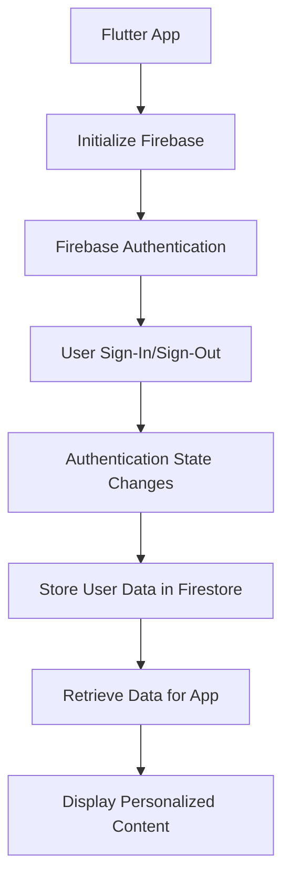

## 14.3.3 Integrating Backend Services

Integrating backend services is a crucial aspect of building robust Flutter applications. These services enable apps to store data, authenticate users, and provide real-time updates, among other functionalities. This section delves into various backend services and strategies for effectively connecting Flutter apps to backend infrastructures, ensuring seamless data flow and enhanced functionality.

### Understanding Backend Services

Backend services are the backbone of modern applications, providing essential functionalities such as data storage, user authentication, and business logic execution. These services can be broadly categorized into two types: Backend-as-a-Service (BaaS) and custom backend solutions.

#### Backend-as-a-Service (BaaS)

BaaS platforms offer ready-to-use backend functionalities, allowing developers to focus on building the frontend without worrying about server management. Popular BaaS providers include:

- **Firebase:** Offers a comprehensive suite of services, including authentication, real-time databases, cloud storage, and serverless functions.
- **AWS Amplify:** Provides a wide range of backend services, including authentication, APIs, and storage, with seamless integration into mobile and web apps.

#### Custom Backend Solutions

For applications with specific requirements, building a custom backend might be necessary. This involves creating and maintaining server-side applications using frameworks such as:

- **Node.js:** A JavaScript runtime built on Chrome's V8 engine, ideal for building scalable network applications.
- **Django:** A high-level Python web framework that encourages rapid development and clean, pragmatic design.
- **Ruby on Rails:** A server-side web application framework written in Ruby, emphasizing convention over configuration.

### Popular Backend Integrations

Integrating popular backend services can significantly enhance your Flutter application's capabilities. Let's explore some of the most widely used integrations.

#### Firebase

Firebase is a powerful BaaS platform that provides a range of services to support app development.

- **Authentication:** Firebase Authentication offers a comprehensive identity solution, supporting email/password, phone number, and social media logins. It simplifies user sign-up, login, and management processes.
- **Cloud Firestore:** A scalable, real-time NoSQL database that allows you to store and sync data across users and devices.
- **Firebase Storage:** Provides secure file uploads and downloads for user-generated content like images and videos.
- **Firebase Functions:** A serverless backend solution for running backend code in response to events triggered by Firebase features and HTTPS requests.

#### AWS Amplify

AWS Amplify is a set of tools and services that enable mobile and front-end web developers to build secure, scalable applications.

- **Authentication:** Provides easy-to-use authentication services with support for multi-factor authentication and social sign-ins.
- **APIs:** Offers GraphQL and REST APIs to interact with backend data.
- **Storage:** Allows for secure storage and retrieval of user-generated content.

#### GraphQL APIs

GraphQL is a query language for APIs that allows clients to request only the data they need. The `graphql_flutter` package enables Flutter apps to interact with GraphQL servers efficiently, providing a flexible and efficient way to query and manipulate data.

### Establishing Communication Between Flutter and Backend

Effective communication between the Flutter app and backend services is essential for data exchange and functionality.

#### HTTP Requests

The `http` and `dio` packages are popular choices for performing RESTful API interactions in Flutter.

- **http:** A simple package for making HTTP requests, handling responses, and managing errors.
- **dio:** A powerful HTTP client for Dart, supporting interceptors, global configuration, and file downloads.

#### WebSockets

For real-time communication, WebSockets provide a persistent connection between the client and server. The `web_socket_channel` package facilitates WebSocket communication in Flutter apps.

#### gRPC

gRPC is a high-performance RPC framework that uses HTTP/2 for transport. The `grpc` package allows Flutter apps to communicate with gRPC servers, offering efficient data exchange and support for bi-directional streaming.

### Securing Backend Interactions

Security is paramount when integrating backend services. Here are some strategies to secure interactions:

#### Authentication Tokens

Managing and storing authentication tokens securely is crucial. The `flutter_secure_storage` package provides a secure way to store sensitive data on the device.

#### Data Encryption

Encrypting sensitive data before transmission ensures that it remains secure during transit. Consider using libraries like `encrypt` for data encryption in Flutter.

#### Secure APIs

Implementing HTTPS and validating SSL certificates are essential steps to secure API communications. Ensure that your backend services are configured to accept only secure connections.

### Handling Data Synchronization

Data synchronization ensures that the app's state remains consistent with the backend database, even in offline scenarios.

#### Offline Support

Implementing offline support allows the app to function without an internet connection by caching data locally. This can be achieved using packages like `hive` or `sqflite`.

#### Conflict Resolution

Managing data conflicts that arise during synchronization is crucial. Implement strategies to handle conflicts gracefully, such as using timestamps or versioning.

### Best Practices

Adhering to best practices ensures that your app remains robust, scalable, and user-friendly.

#### Error Handling

Gracefully managing backend errors and network failures enhances the user experience. Implement retry mechanisms and user-friendly error messages.

#### Optimizing Data Transfer

Minimizing data payloads and using pagination or lazy loading for large data sets reduces bandwidth usage and improves performance.

#### Scalability

Designing backend architectures that can scale with increasing app demands is essential. Consider using cloud services that offer auto-scaling and load balancing.

#### Maintaining Data Consistency

Ensuring that the app’s state remains consistent with the backend database is crucial for a seamless user experience. Implement data validation and synchronization mechanisms.

### Code Example: Integrating Firebase Authentication and Firestore

Below is a practical example of integrating Firebase Authentication and Firestore in a Flutter app.

```yaml
dependencies:
  flutter:
    sdk: flutter
  firebase_core: ^2.6.0
  firebase_auth: ^4.2.3
  cloud_firestore: ^4.5.0
```

```dart
// lib/main.dart
import 'package:flutter/material.dart';
import 'package:firebase_core/firebase_core.dart';
import 'package:firebase_auth/firebase_auth.dart';
import 'package:cloud_firestore/cloud_firestore.dart';

void main() async {
  WidgetsFlutterBinding.ensureInitialized();
  await Firebase.initializeApp(
    options: FirebaseOptions(
      apiKey: 'YOUR_API_KEY',
      authDomain: 'YOUR_AUTH_DOMAIN',
      projectId: 'YOUR_PROJECT_ID',
      storageBucket: 'YOUR_STORAGE_BUCKET',
      messagingSenderId: 'YOUR_MESSAGING_SENDER_ID',
      appId: 'YOUR_APP_ID',
    ),
  );
  runApp(MyApp());
}

class MyApp extends StatelessWidget {
  @override
  Widget build(BuildContext context) {
    return MaterialApp(
      home: AuthHomePage(),
    );
  }
}

class AuthHomePage extends StatefulWidget {
  @override
  _AuthHomePageState createState() => _AuthHomePageState();
}

class _AuthHomePageState extends State<AuthHomePage> {
  final FirebaseAuth _auth = FirebaseAuth.instance;
  final FirebaseFirestore _firestore = FirebaseFirestore.instance;
  User? _user;

  @override
  void initState() {
    super.initState();
    _auth.authStateChanges().listen((User? user) {
      setState(() {
        _user = user;
      });
    });
  }

  Future<void> _signInAnonymously() async {
    try {
      await _auth.signInAnonymously();
      await _firestore.collection('users').doc(_auth.currentUser!.uid).set({
        'createdAt': FieldValue.serverTimestamp(),
      });
    } catch (e) {
      print(e);
    }
  }

  @override
  Widget build(BuildContext context) {
    return Scaffold(
      appBar: AppBar(title: Text('Firebase Integration')),
      body: Center(
        child: _user == null
            ? ElevatedButton(
                onPressed: _signInAnonymously,
                child: Text('Sign In Anonymously'),
              )
            : Text('Signed in as ${_user!.uid}'),
      ),
    );
  }
}
```

### Mermaid.js Diagram Suggestion

The following diagram illustrates the integration flow of a Flutter app with Firebase services.



### Conclusion

Integrating backend services into your Flutter application opens up a world of possibilities, from real-time data updates to secure user authentication. By leveraging platforms like Firebase and AWS Amplify, or building custom backends, you can create feature-rich applications that meet the needs of modern users. Remember to adhere to best practices for security, scalability, and data consistency to ensure a seamless user experience.

## Quiz Time!



### What is Backend-as-a-Service (BaaS)?

- [x] A platform providing ready-to-use backend functionalities.
- [ ] A custom server-side application framework.
- [ ] A type of database management system.
- [ ] A frontend development tool.

> **Explanation:** BaaS platforms offer pre-built backend services, allowing developers to focus on frontend development without managing server infrastructure.

### Which of the following is a popular BaaS provider?

- [x] Firebase
- [ ] Django
- [ ] Ruby on Rails
- [ ] Node.js

> **Explanation:** Firebase is a well-known BaaS provider offering services like authentication, real-time databases, and cloud storage.

### What package is commonly used for making HTTP requests in Flutter?

- [x] http
- [ ] graphql_flutter
- [ ] sqflite
- [ ] web_socket_channel

> **Explanation:** The `http` package is widely used in Flutter for making HTTP requests and handling responses.

### How does Firebase Authentication help in app development?

- [x] It provides user sign-up, login, and management functionalities.
- [ ] It offers a NoSQL database for storing data.
- [ ] It enables real-time data synchronization.
- [ ] It provides cloud storage for files.

> **Explanation:** Firebase Authentication simplifies user identity management by offering various sign-in methods and user management features.

### What is the purpose of the `flutter_secure_storage` package?

- [x] To securely store sensitive data on the device.
- [ ] To manage HTTP requests and responses.
- [ ] To provide real-time data updates.
- [ ] To implement offline data caching.

> **Explanation:** `flutter_secure_storage` is used to securely store sensitive information, such as authentication tokens, on the device.

### Which package would you use for real-time communication in Flutter?

- [x] web_socket_channel
- [ ] dio
- [ ] sqflite
- [ ] graphql_flutter

> **Explanation:** The `web_socket_channel` package facilitates real-time communication by maintaining a persistent connection between the client and server.

### What is a key benefit of using GraphQL APIs?

- [x] Efficient data querying by requesting only the needed data.
- [ ] Providing a NoSQL database solution.
- [ ] Offering serverless backend functions.
- [ ] Managing user authentication.

> **Explanation:** GraphQL APIs allow clients to request exactly the data they need, reducing over-fetching and under-fetching issues.

### How can you ensure secure API communications?

- [x] Implement HTTPS and validate SSL certificates.
- [ ] Use plain HTTP for faster connections.
- [ ] Store API keys directly in the app code.
- [ ] Disable authentication for easier access.

> **Explanation:** Secure API communications require HTTPS and SSL certificate validation to protect data in transit.

### What is the role of Firebase Functions?

- [x] To run backend code in response to events.
- [ ] To provide a real-time database.
- [ ] To manage user authentication.
- [ ] To store user-generated content.

> **Explanation:** Firebase Functions allow developers to execute backend logic in response to events triggered by Firebase features or HTTPS requests.

### True or False: Offline support in apps is achieved by caching data locally.

- [x] True
- [ ] False

> **Explanation:** Offline support involves caching data locally so that the app can function without an internet connection.


