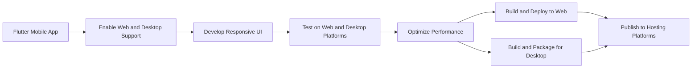

## 14.3.4 Experimenting with Web and Desktop

Expanding Flutter applications beyond mobile platforms to the web and desktop opens up new avenues for user engagement and broader market reach. This section explores the processes, tools, and best practices for adapting Flutter apps to web and desktop environments, ensuring consistent performance and user experience across all platforms.

### Flutter for Web

Flutter for Web allows developers to leverage their existing Flutter codebase to create web applications. This capability is particularly powerful as it enables a single codebase to target multiple platforms, reducing development time and effort.

#### Capabilities and Limitations

Understanding the differences between mobile and web platforms is crucial for successful web app development. While Flutter provides a consistent development experience across platforms, there are unique challenges when targeting the web:

- **Routing and Navigation:** Web applications often require more complex routing compared to mobile apps. Flutter provides the `Navigator` widget, but web-specific routing packages like `go_router` can offer more flexibility.
- **Performance Considerations:** Web apps need to be optimized for different browsers and devices. This includes managing asset loading times and ensuring smooth animations.
- **Responsive Design:** Unlike mobile apps, web applications must adapt to a wide range of screen sizes and orientations. Implementing responsive layouts is essential for a good user experience.

#### Setting Up Flutter for Web Development

To start developing Flutter web applications, ensure your Flutter SDK is updated to support web development. Follow these steps:

1. **Enable Web Support:**

   ```bash
   flutter config --enable-web
   ```

2. **Verify Web Support:**

   After enabling web support, verify that your setup is correct by listing the available devices:

   ```bash
   flutter devices
   ```

   You should see a web browser listed as a target device.

#### Building and Running Flutter Web Apps

Once your environment is set up, you can build and run your Flutter web app:

- **Run the App in a Browser:**

  Use the following command to run your app in Chrome:

  ```bash
  flutter run -d chrome
  ```

- **Deploying Web Apps:**

  After development, you can deploy your web app using hosting services like Firebase Hosting, GitHub Pages, or Netlify. Here's a brief guide to deploying on Firebase Hosting:

  ```bash
  # Build the web app for production
  flutter build web

  # Install Firebase CLI if not already installed
  npm install -g firebase-tools

  # Login to Firebase
  firebase login

  # Initialize Firebase in your project
  firebase init

  # Choose Hosting and select your Flutter web build directory (build/web)

  # Deploy the web app
  firebase deploy
  ```

#### Optimizing for Web

To ensure your web app performs well across different browsers and devices, consider the following optimizations:

- **Responsive Design:** Use media queries and layout builders to create flexible UIs that adapt to various screen sizes.
- **Asset Management:** Optimize images and other assets for faster loading times. Consider using lazy loading for non-critical resources.
- **Performance Profiling:** Use tools like Chrome DevTools to profile your app and identify performance bottlenecks.

### Flutter for Desktop

Flutter's desktop support allows developers to create applications for Windows, macOS, and Linux. This expands the reach of Flutter apps beyond mobile and web, providing a seamless experience across all major platforms.

#### Supported Platforms

Flutter currently supports the following desktop platforms:

- **Windows**
- **macOS**
- **Linux**

Each platform has its own UI conventions and system integrations, which developers must consider when designing their applications.

#### Setting Up Flutter for Desktop Development

To enable desktop support, follow these steps:

1. **Enable Desktop Support:**

   ```bash
   flutter config --enable-windows-desktop
   flutter config --enable-macos-desktop
   flutter config --enable-linux-desktop
   ```

2. **Verify Desktop Support:**

   Check that your setup is correct by listing the available devices:

   ```bash
   flutter devices
   ```

   You should see your desktop platforms listed as target devices.

#### Building and Running Desktop Apps

To build and run your Flutter desktop app, use the following commands:

- **Run the App on Desktop:**

  ```bash
  flutter run -d windows  # or macos, linux
  ```

- **Packaging Desktop Apps:**

  For distribution, package your desktop app using tools like Inno Setup for Windows, DMG creators for macOS, and AppImage for Linux.

#### Optimizing for Desktop

When developing for desktop platforms, consider the following optimizations:

- **UI Design:** Design interfaces that take advantage of larger screens and different input methods, such as mouse and keyboard.
- **Platform-Specific Features:** Leverage platform-specific features and integrations to enhance functionality, such as file system access and native dialogs.

### Best Practices for Multi-Platform Development

Developing applications that run seamlessly across mobile, web, and desktop platforms requires careful planning and execution. Here are some best practices to consider:

#### Code Sharing and Platform-Specific Code

- **Shared Codebase:** Utilize Flutter’s platform abstraction to write shared code while implementing platform-specific functionalities when necessary.
- **Conditional Imports:** Use conditional imports and platform channels for integrating native code specific to each platform.

#### Responsive and Adaptive Design

- **Responsive Layouts:** Implement responsive layouts that adapt to various screen sizes and orientations using media queries and layout builders.
- **Adaptive Components:** Use adaptive components that adjust their behavior based on the platform and device characteristics.

#### Testing Across Platforms

- **Comprehensive Testing:** Conduct thorough testing on all target platforms to ensure consistent behavior and performance.
- **Use of Emulators and Simulators:** Utilize emulators, simulators, and physical devices for comprehensive testing coverage.

#### Performance Optimization

- **Rendering Optimization:** Optimize rendering and resource usage for desktop and web platforms.
- **Profiling and Optimization:** Address platform-specific performance issues through profiling and optimization techniques.

#### Continuous Integration for Multiple Platforms

- **CI/CD Pipelines:** Set up CI/CD pipelines that build and test your app across all supported platforms.
- **Automated Deployment:** Automate the deployment process to streamline updates and releases.

### Resources for Learning Multi-Platform Development

To further your understanding of multi-platform development with Flutter, consider exploring the following resources:

- **Official Flutter Documentation:**
  - [Flutter for Web](https://flutter.dev/web)
  - [Flutter for Desktop](https://flutter.dev/desktop)

- **Online Tutorials and Courses:**
  - Comprehensive guides and video tutorials focused on Flutter’s web and desktop capabilities.

- **Community Projects and Examples:**
  - Study open-source projects that have successfully implemented multi-platform support.

### Code Example: Flutter Web Setup and Deployment

Here's a quick reference for setting up and deploying a Flutter web app:

```bash
flutter config --enable-web

flutter devices

flutter run -d chrome

flutter build web
```

Deploying to Firebase Hosting:

```bash
npm install -g firebase-tools

firebase login

firebase init


firebase deploy
```

### Visualizing the Multi-Platform Development Process

Below is a Mermaid.js diagram illustrating the process of expanding a Flutter mobile app to web and desktop platforms:



### Conclusion

Expanding your Flutter applications to web and desktop platforms not only broadens your app's reach but also enhances user engagement by providing a consistent experience across devices. By following the best practices outlined in this section, you can ensure that your multi-platform applications are robust, performant, and user-friendly.

## Quiz Time!



### What command enables web support in Flutter?

- [x] `flutter config --enable-web`
- [ ] `flutter enable web`
- [ ] `flutter setup web`
- [ ] `flutter web enable`

> **Explanation:** The correct command to enable web support in Flutter is `flutter config --enable-web`.

### Which platforms are supported by Flutter for desktop development?

- [x] Windows
- [x] macOS
- [x] Linux
- [ ] Android

> **Explanation:** Flutter supports Windows, macOS, and Linux for desktop development. Android is a mobile platform.

### What is a key consideration when developing Flutter web apps?

- [x] Responsive design
- [ ] Limited screen sizes
- [ ] Lack of routing options
- [ ] No need for performance optimization

> **Explanation:** Responsive design is crucial for web apps to adapt to various screen sizes and orientations.

### How can you run a Flutter app in a web browser?

- [x] `flutter run -d chrome`
- [ ] `flutter start web`
- [ ] `flutter launch browser`
- [ ] `flutter web run`

> **Explanation:** The command `flutter run -d chrome` is used to run a Flutter app in a web browser.

### What tool can be used to package a Flutter app for Windows distribution?

- [x] Inno Setup
- [ ] DMG Creator
- [ ] AppImage
- [ ] Firebase Hosting

> **Explanation:** Inno Setup is a tool used to package applications for Windows distribution.

### Which of the following is a best practice for multi-platform development?

- [x] Code sharing and platform-specific code
- [ ] Writing separate codebases for each platform
- [ ] Ignoring platform-specific features
- [ ] Avoiding responsive design

> **Explanation:** Code sharing and platform-specific code is a best practice to maintain a single codebase while handling platform-specific functionalities.

### What is the purpose of using conditional imports in Flutter?

- [x] To integrate platform-specific code
- [ ] To reduce code size
- [ ] To improve performance
- [ ] To simplify UI design

> **Explanation:** Conditional imports allow developers to integrate platform-specific code while maintaining a shared codebase.

### Which command is used to build a Flutter web app for production?

- [x] `flutter build web`
- [ ] `flutter compile web`
- [ ] `flutter deploy web`
- [ ] `flutter package web`

> **Explanation:** The command `flutter build web` is used to build a Flutter web app for production.

### What is a common tool for deploying Flutter web apps?

- [x] Firebase Hosting
- [ ] Inno Setup
- [ ] DMG Creator
- [ ] AppImage

> **Explanation:** Firebase Hosting is a common tool for deploying Flutter web apps.

### True or False: Flutter allows for a single codebase to target mobile, web, and desktop platforms.

- [x] True
- [ ] False

> **Explanation:** True. Flutter allows developers to use a single codebase to target mobile, web, and desktop platforms.


