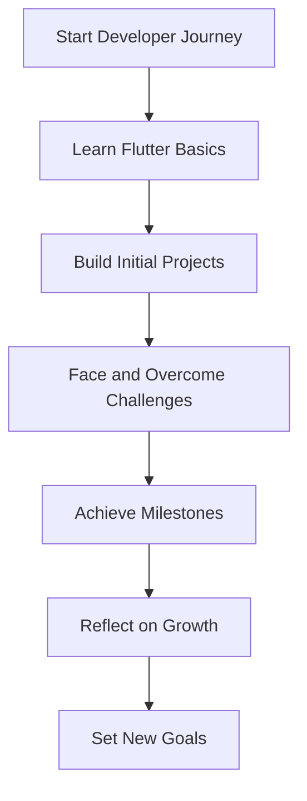

## 14.4.1 Reflecting on Your Flutter Development Journey

Embarking on the journey of learning and mastering Flutter is a significant undertaking that involves not only acquiring technical skills but also growing as a developer. Reflecting on this journey is crucial for recognizing your progress, identifying strengths, and understanding areas for improvement. This reflection not only helps in celebrating your achievements but also in setting the stage for future growth and development.

### Acknowledging Milestones

#### Identifying Key Projects and Features Developed

As you look back on your Flutter development journey, it's important to identify the key projects and features you've developed. These projects serve as tangible evidence of your progress and the skills you've acquired. Whether it's a simple personal profile app or a complex multi-screen application, each project represents a step forward in your learning path.

- **Project Portfolio:** Consider creating a portfolio that showcases your projects. This not only helps in visualizing your progress but also serves as a valuable asset when applying for jobs or freelance opportunities.
- **Feature Highlights:** Reflect on specific features you've implemented, such as state management solutions, animations, or API integrations. Each feature represents a learning milestone and contributes to your overall skill set.

#### Recognizing Skill Advancements and Knowledge Gained

Throughout your journey, you've likely gained a wealth of knowledge and skills. Recognizing these advancements is essential for understanding your growth as a developer.

- **Technical Skills:** Consider the technical skills you've acquired, such as proficiency in Dart, understanding of Flutter widgets, and the ability to implement complex UI designs.
- **Problem-Solving Abilities:** Reflect on how your problem-solving abilities have evolved. Are you able to tackle more complex challenges with confidence? Have you developed strategies for debugging and testing your applications?

### Analyzing Challenges Overcome

#### Reflecting on Obstacles Faced During Development

Every developer encounters obstacles along their journey. Reflecting on these challenges is crucial for understanding how they have contributed to your growth.

- **Technical Challenges:** Consider the technical challenges you've faced, such as debugging complex issues, optimizing app performance, or integrating third-party packages. How did you approach these challenges, and what strategies did you employ to overcome them?
- **Project Management:** Reflect on any project management challenges, such as time management, scope creep, or collaboration with team members. How have these experiences shaped your approach to future projects?

#### Understanding How Challenges Contributed to Personal and Professional Growth

Challenges are opportunities for growth. By analyzing the obstacles you've overcome, you can gain valuable insights into your personal and professional development.

- **Resilience and Adaptability:** Reflect on how overcoming challenges has strengthened your resilience and adaptability. These qualities are essential for navigating the ever-evolving landscape of software development.
- **Continuous Learning:** Consider how challenges have motivated you to continue learning and expanding your skill set. Have you sought out new resources, attended workshops, or engaged with the Flutter community to enhance your knowledge?

### Documenting Lessons Learned

#### Keeping a Learning Journal or Blog to Record Insights and Best Practices

Documenting your journey is a powerful way to solidify your learning and share your experiences with others.

- **Learning Journal:** Consider maintaining a learning journal where you record insights, best practices, and reflections on your development journey. This can be a valuable resource for future reference and a way to track your progress over time.
- **Blogging:** Sharing your experiences through a blog can help others who are facing similar challenges. By documenting your journey, you contribute to the broader developer community and establish yourself as a knowledgeable and helpful resource.

#### Sharing Experiences with the Community to Help Others Facing Similar Challenges

Engaging with the developer community is a rewarding way to share your knowledge and learn from others.

- **Community Engagement:** Participate in online forums, attend meetups, and contribute to open-source projects. Sharing your experiences and insights can help others overcome similar challenges and foster a sense of community and collaboration.
- **Mentorship:** Consider mentoring newer developers who are just starting their Flutter journey. Sharing your experiences and offering guidance can be incredibly rewarding and help solidify your own understanding.

### Setting Personal Benchmarks

#### Comparing Current Skills with Previous Benchmarks to Visualize Growth

Setting personal benchmarks is an effective way to measure your growth and maintain motivation.

- **Skill Assessment:** Regularly assess your skills and compare them to previous benchmarks. This can help you visualize your progress and identify areas for further improvement.
- **Goal Setting:** Set specific, achievable goals for your continued development. Whether it's mastering a new Flutter feature or contributing to an open-source project, having clear goals can help guide your learning journey.

#### Celebrating Successes and Maintaining Motivation

Celebrating your successes is essential for maintaining motivation and fostering a positive mindset.

- **Acknowledging Achievements:** Take time to acknowledge and celebrate your achievements, both big and small. Recognizing your progress can boost your confidence and motivate you to continue learning and growing.
- **Reflecting on Growth:** Regularly reflect on your growth and the journey you've undertaken. This reflection can provide valuable insights into your development and inspire you to set new goals and challenges.

### Visualizing Your Journey

To help visualize your development journey, consider the following Mermaid.js diagram:

This diagram illustrates the cyclical nature of the development journey, emphasizing the importance of reflection and goal setting in fostering continuous growth.

### Conclusion

Reflecting on your Flutter development journey is a powerful tool for recognizing your progress, celebrating your achievements, and setting the stage for future growth. By acknowledging milestones, analyzing challenges, documenting lessons learned, and setting personal benchmarks, you can gain valuable insights into your development and continue to grow as a developer. Embrace this journey with a growth mindset, and remember that each step forward is a testament to your dedication and passion for learning.

## Quiz Time!



### Which of the following is a key benefit of reflecting on your development journey?

- [x] Recognizing progress and identifying areas for improvement
- [ ] Learning new programming languages
- [ ] Increasing the number of projects completed
- [ ] Reducing the time spent on development

> **Explanation:** Reflecting on your development journey helps you recognize your progress and identify areas for improvement, which is crucial for personal and professional growth.

### What is one way to document lessons learned during your development journey?

- [x] Keeping a learning journal or blog
- [ ] Deleting old projects
- [ ] Avoiding community engagement
- [ ] Focusing solely on new technologies

> **Explanation:** Keeping a learning journal or blog allows you to document insights and best practices, providing a valuable resource for future reference.

### How can challenges contribute to personal and professional growth?

- [x] By strengthening resilience and adaptability
- [ ] By making development easier
- [ ] By eliminating the need for further learning
- [ ] By reducing the number of projects

> **Explanation:** Challenges contribute to personal and professional growth by strengthening resilience and adaptability, essential qualities for navigating the evolving landscape of software development.

### What is a benefit of sharing your experiences with the developer community?

- [x] Helping others facing similar challenges
- [ ] Keeping knowledge to yourself
- [ ] Avoiding collaboration
- [ ] Reducing the number of projects

> **Explanation:** Sharing your experiences with the developer community helps others facing similar challenges and fosters a sense of community and collaboration.

### Why is setting personal benchmarks important?

- [x] To measure growth and maintain motivation
- [ ] To avoid setting goals
- [ ] To focus solely on past achievements
- [ ] To reduce the number of projects

> **Explanation:** Setting personal benchmarks helps measure growth and maintain motivation, guiding your learning journey and identifying areas for improvement.

### What is one way to celebrate your successes?

- [x] Acknowledging achievements and reflecting on growth
- [ ] Ignoring past projects
- [ ] Avoiding community engagement
- [ ] Focusing solely on new technologies

> **Explanation:** Acknowledging achievements and reflecting on growth helps boost confidence and motivate continued learning and development.

### How can you visualize your development journey?

- [x] Using diagrams like Mermaid.js
- [ ] By avoiding documentation
- [ ] By focusing solely on new projects
- [ ] By reducing the number of projects

> **Explanation:** Using diagrams like Mermaid.js helps visualize the cyclical nature of the development journey, emphasizing the importance of reflection and goal setting.

### What is a key component of setting new goals?

- [x] Having clear, achievable objectives
- [ ] Ignoring past achievements
- [ ] Avoiding community engagement
- [ ] Focusing solely on new technologies

> **Explanation:** Having clear, achievable objectives is essential for setting new goals, guiding your learning journey, and maintaining motivation.

### Why is it important to engage with the developer community?

- [x] To share knowledge and learn from others
- [ ] To keep knowledge to yourself
- [ ] To avoid collaboration
- [ ] To reduce the number of projects

> **Explanation:** Engaging with the developer community allows you to share knowledge and learn from others, fostering a sense of community and collaboration.

### True or False: Reflecting on your development journey is only beneficial for beginner developers.

- [ ] True
- [x] False

> **Explanation:** Reflecting on your development journey is beneficial for developers at all levels, as it helps recognize progress, identify areas for improvement, and set the stage for future growth.


