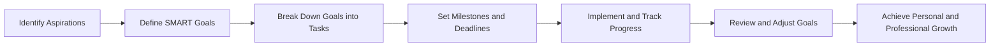

## 14.4.2 Setting Future Goals

As you journey through the world of Flutter development, setting clear and achievable goals is crucial for maintaining focus and driving continuous improvement. Whether you're aiming to master advanced techniques, secure a rewarding career, or enhance your personal skills, defining your objectives can provide the direction and motivation needed to succeed. This section will guide you in establishing both short-term and long-term goals that align with your career aspirations and personal interests in Flutter development.

### Importance of Goal Setting

Setting goals is more than just a motivational exercise; it's a strategic approach to personal and professional development. Here’s why goal setting is essential:

- **Direction and Purpose:** Goals provide a roadmap for your learning journey, helping you focus on what truly matters and avoid distractions.
- **Motivation and Commitment:** Clearly defined goals enhance your motivation to learn and grow, fostering a sense of commitment to your development path.
- **Measurement of Progress:** Goals allow you to track your progress, celebrate achievements, and identify areas for improvement.

### Defining SMART Goals

To ensure your goals are effective, consider using the SMART framework. SMART goals are:

- **Specific:** Your goals should be clear and well-defined. Avoid vague objectives and focus on what you want to achieve.
- **Measurable:** Establish criteria to track your progress. This could be the number of projects completed, skills acquired, or certifications earned.
- **Achievable:** Set realistic targets that challenge you but are attainable with effort and resources.
- **Relevant:** Align your goals with your personal and professional aspirations. Ensure they contribute to your overall growth.
- **Time-Bound:** Set deadlines to create a sense of urgency and ensure timely progress.

### Examples of Future Goals

#### Technical Goals

- **Master Advanced State Management Techniques:** Dive deeper into state management solutions like BLoC, Redux, or Riverpod to enhance your app's architecture.
- **Contribute to a Major Open-Source Flutter Package:** Engage with the Flutter community by contributing to popular packages, improving your coding skills and gaining recognition.
- **Build a Cross-Platform Flutter App Targeting Web and Desktop:** Expand your expertise by developing apps that run seamlessly across multiple platforms.

#### Career Goals

- **Secure a Flutter Developer Position in a Reputable Company:** Focus on building a strong portfolio and networking to land a job at a company that values innovation and growth.
- **Lead a Flutter Development Team:** Develop leadership skills and aim to manage a team, guiding projects from conception to deployment.
- **Present at Flutter Conferences or Meetups:** Share your knowledge and experiences by speaking at industry events, enhancing your reputation and expanding your network.

#### Personal Development Goals

- **Improve UI/UX Design Skills:** Learn design principles and tools to create visually appealing and user-friendly interfaces.
- **Learn and Integrate New Technologies with Flutter:** Stay updated with the latest tech trends and incorporate them into your projects to remain competitive.
- **Create a Comprehensive Flutter Portfolio Showcasing Diverse Projects:** Build a portfolio that highlights your versatility and expertise in various aspects of Flutter development.

### Creating a Goal Plan

Once you've defined your goals, it's essential to create a plan to achieve them:

- **Break Down Large Goals into Smaller, Manageable Tasks:** Divide your goals into actionable steps to make them less daunting and more achievable.
- **Set Milestones to Monitor Progress:** Establish checkpoints to assess your progress and make necessary adjustments.
- **Adjust Goals as Needed Based on Evolving Interests and Circumstances:** Stay flexible and be willing to modify your goals as your interests and circumstances change.

### Tracking and Reviewing Goals

Regularly reviewing your goals is crucial for staying on track:

- **Regularly Assess Progress Towards Goals:** Evaluate your achievements and identify areas needing improvement.
- **Celebrate Achievements and Recognize Areas Needing Improvement:** Acknowledge your successes and learn from your challenges.
- **Stay Flexible and Adaptable to Changing Priorities:** Be open to revising your goals as new opportunities and challenges arise.

### Visualizing the Goal-Setting Process

To better understand the goal-setting process, consider the following diagram:

This diagram illustrates the cyclical nature of goal setting, emphasizing continuous improvement and adaptation.

### Conclusion

Setting future goals is a powerful tool for personal and professional growth. By defining clear objectives, creating a structured plan, and regularly reviewing your progress, you can achieve significant milestones in your Flutter development journey. Remember to stay flexible and open to new opportunities, and don't hesitate to adjust your goals as your interests and circumstances evolve. With dedication and perseverance, you can reach new heights and make a meaningful impact in the world of Flutter development.

## Quiz Time!



### Why is setting goals important in Flutter development?

- [x] It provides direction and purpose.
- [x] It enhances motivation and commitment.
- [ ] It guarantees success without effort.
- [ ] It eliminates the need for continuous learning.

> **Explanation:** Setting goals provides direction, enhances motivation, and fosters commitment, but it does not guarantee success without effort or eliminate the need for continuous learning.

### What does the "S" in SMART goals stand for?

- [x] Specific
- [ ] Simple
- [ ] Strategic
- [ ] Standard

> **Explanation:** The "S" in SMART goals stands for Specific, meaning goals should be clear and well-defined.

### Which of the following is an example of a technical goal?

- [x] Master advanced state management techniques.
- [ ] Secure a Flutter developer position.
- [ ] Improve UI/UX design skills.
- [ ] Present at Flutter conferences.

> **Explanation:** Mastering advanced state management techniques is a technical goal, while the others are career or personal development goals.

### What is a key characteristic of achievable goals?

- [x] They are realistic and attainable.
- [ ] They are vague and undefined.
- [ ] They require no effort to achieve.
- [ ] They are impossible to reach.

> **Explanation:** Achievable goals are realistic and attainable, challenging you but within reach with effort and resources.

### How can you track progress towards your goals?

- [x] Set milestones and deadlines.
- [x] Regularly assess progress.
- [ ] Ignore any setbacks.
- [ ] Wait until the deadline to evaluate.

> **Explanation:** Tracking progress involves setting milestones, regularly assessing progress, and addressing setbacks, not ignoring them or waiting until the deadline.

### What should you do if your interests and circumstances change?

- [x] Adjust your goals as needed.
- [ ] Abandon your goals entirely.
- [ ] Stick to your original plan no matter what.
- [ ] Avoid setting new goals.

> **Explanation:** If your interests and circumstances change, you should adjust your goals as needed to stay relevant and motivated.

### Which of the following is a career goal?

- [x] Secure a Flutter developer position.
- [ ] Learn and integrate new technologies.
- [ ] Build a cross-platform app.
- [ ] Improve UI/UX design skills.

> **Explanation:** Securing a Flutter developer position is a career goal, while the others are technical or personal development goals.

### What is the purpose of setting deadlines for goals?

- [x] To ensure timely progress.
- [ ] To create unnecessary pressure.
- [ ] To make goals unattainable.
- [ ] To discourage goal setting.

> **Explanation:** Setting deadlines helps ensure timely progress and provides a sense of urgency, not to create pressure or make goals unattainable.

### Why is it important to celebrate achievements?

- [x] It boosts motivation and morale.
- [ ] It leads to complacency.
- [ ] It distracts from future goals.
- [ ] It is unnecessary.

> **Explanation:** Celebrating achievements boosts motivation and morale, encouraging continued effort and progress.

### True or False: Goals should remain fixed and unchangeable.

- [ ] True
- [x] False

> **Explanation:** Goals should be flexible and adaptable to changing priorities, interests, and circumstances.


