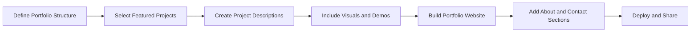

## 14.4.3 Building a Flutter Developer Portfolio

Creating a compelling portfolio is an essential step for any Flutter developer looking to showcase their skills and attract opportunities. A well-crafted portfolio not only demonstrates your technical proficiency but also highlights your ability to solve real-world problems through completed projects. This section will guide you through the process of building an effective portfolio that stands out to potential employers, clients, and collaborators.

### Importance of a Portfolio

A portfolio serves as a visual resume, providing tangible evidence of your capabilities and achievements. Here are some reasons why having a portfolio is crucial:

- **Demonstrating Practical Experience:** A portfolio showcases your hands-on experience with Flutter, allowing others to see the breadth and depth of your skills.
- **Providing Evidence of Problem-Solving Abilities:** By presenting completed projects, you can illustrate your ability to tackle challenges and deliver solutions.
- **Making a Strong First Impression:** A well-organized and visually appealing portfolio can leave a lasting impression on potential employers or clients, setting you apart from other candidates.

### Selecting Projects for the Portfolio

Choosing the right projects to include in your portfolio is critical. Here are some guidelines to help you make the best selections:

- **Diversity:** Include a variety of projects that demonstrate different skills and functionalities, such as UI design, state management, and API integration.
- **Quality Over Quantity:** Focus on showcasing your best work. It's better to have a few well-executed projects than many mediocre ones.
- **Relevance:** Select projects that align with your career goals and interests. If you're aiming for a role in e-commerce, for example, include projects related to shopping apps or payment integrations.

### Presenting Projects Effectively

Once you've selected your projects, it's important to present them in a way that highlights their value and your contributions:

- **Project Descriptions:** Write clear and concise descriptions that outline the project's objectives, the technologies used, and your specific role in its development.
- **Screenshots and Demos:** Include high-quality images, GIFs, and live demos or video walkthroughs to illustrate the functionality and design of your projects.
- **Source Code Links:** Provide links to GitHub repositories or other source code hosting platforms, allowing others to review your code.
- **Key Features and Achievements:** Highlight specific features you implemented and any recognition or success metrics achieved, such as user engagement or performance improvements.

### Designing the Portfolio Website

Your portfolio website should be a reflection of your professionalism and attention to detail. Consider the following elements when designing your site:

- **User-Friendly Layout:** Ensure easy navigation with a clean and professional design. Use a consistent layout and typography to create a cohesive look.
- **Responsive Design:** Make sure your portfolio is accessible and visually appealing on all devices, from desktops to smartphones.
- **About Section:** Include a section that introduces yourself, your skills, and your development philosophy. This personal touch helps potential employers or clients connect with you.
- **Contact Information:** Provide clear ways for prospective employers or clients to reach you, such as an email address or a contact form.

### Tools and Platforms for Building Portfolios

There are several tools and platforms you can use to build your portfolio:

- **GitHub Pages:** Host static portfolio sites directly from GitHub repositories, making it easy to showcase your projects and code.
- **Wix, Squarespace, and WordPress:** Use website builders for more customizable and feature-rich portfolios, especially if you want to include a blog or other dynamic content.
- **Flutter-Based Websites:** Utilize Flutter’s web capabilities to build a portfolio site with the same technology stack you're showcasing. This approach can demonstrate your proficiency with Flutter in a real-world application.

#### Example: Using Flutter for Web to Create a Highly Interactive Portfolio

Building your portfolio using Flutter for Web allows you to leverage your existing skills and create a highly interactive and visually appealing site. Here's a simple example to get you started:

```yaml
dependencies:
  flutter:
    sdk: flutter
  url_launcher: ^6.1.7
```

```dart
// lib/main.dart
import 'package:flutter/material.dart';
import 'package:url_launcher/url_launcher.dart';

void main() => runApp(PortfolioApp());

class PortfolioApp extends StatelessWidget {
  @override
  Widget build(BuildContext context) {
    return MaterialApp(
      title: 'My Portfolio',
      theme: ThemeData(
        primarySwatch: Colors.blue,
      ),
      home: HomePage(),
    );
  }
}

class HomePage extends StatelessWidget {
  final List<Project> projects = [
    Project(
      name: 'Expense Tracker',
      description: 'A Flutter app to track and manage expenses.',
      imageUrl: 'assets/expense_tracker.png',
      repoUrl: 'https://github.com/yourusername/expense_tracker',
    ),
    // Add more projects as needed
  ];

  @override
  Widget build(BuildContext context) {
    return Scaffold(
      appBar: AppBar(title: Text('My Portfolio')),
      body: SingleChildScrollView(
        child: Column(
          children: [
            AboutSection(),
            ProjectsSection(projects: projects),
            ContactSection(),
          ],
        ),
      ),
    );
  }
}

class AboutSection extends StatelessWidget {
  @override
  Widget build(BuildContext context) {
    return Padding(
      padding: const EdgeInsets.all(16.0),
      child: Column(
        children: [
          Text(
            'About Me',
            style: TextStyle(fontSize: 24, fontWeight: FontWeight.bold),
          ),
          SizedBox(height: 10),
          Text(
            'I am a passionate Flutter developer with experience in building cross-platform applications.',
            textAlign: TextAlign.center,
            style: TextStyle(fontSize: 16),
          ),
        ],
      ),
    );
  }
}

class ProjectsSection extends StatelessWidget {
  final List<Project> projects;
  ProjectsSection({required this.projects});

  @override
  Widget build(BuildContext context) {
    return Padding(
      padding: const EdgeInsets.all(16.0),
      child: Column(
        children: [
          Text(
            'Projects',
            style: TextStyle(fontSize: 24, fontWeight: FontWeight.bold),
          ),
          SizedBox(height: 10),
          ...projects.map((project) => ProjectCard(project: project)).toList(),
        ],
      ),
    );
  }
}

class ProjectCard extends StatelessWidget {
  final Project project;
  ProjectCard({required this.project});

  @override
  Widget build(BuildContext context) {
    return Card(
      margin: EdgeInsets.symmetric(vertical: 10),
      child: Padding(
        padding: const EdgeInsets.all(16.0),
        child: Column(
          children: [
            Image.asset(project.imageUrl, height: 200, fit: BoxFit.cover),
            SizedBox(height: 10),
            Text(
              project.name,
              style: TextStyle(fontSize: 20, fontWeight: FontWeight.bold),
            ),
            SizedBox(height: 5),
            Text(project.description, textAlign: TextAlign.center),
            SizedBox(height: 10),
            ElevatedButton(
              onPressed: () async {
                if (await canLaunch(project.repoUrl)) {
                  await launch(project.repoUrl);
                } else {
                  throw 'Could not launch ${project.repoUrl}';
                }
              },
              child: Text('View on GitHub'),
            ),
          ],
        ),
      ),
    );
  }
}

class ContactSection extends StatelessWidget {
  @override
  Widget build(BuildContext context) {
    return Padding(
      padding: const EdgeInsets.all(16.0),
      child: Column(
        children: [
          Text(
            'Contact Me',
            style: TextStyle(fontSize: 24, fontWeight: FontWeight.bold),
          ),
          SizedBox(height: 10),
          ElevatedButton.icon(
            onPressed: () async {
              const url = 'mailto:your.email@example.com';
              if (await canLaunch(url)) {
                await launch(url);
              } else {
                throw 'Could not launch $url';
              }
            },
            icon: Icon(Icons.email),
            label: Text('Send Email'),
          ),
        ],
      ),
    );
  }
}

class Project {
  final String name;
  final String description;
  final String imageUrl;
  final String repoUrl;

  Project({
    required this.name,
    required this.description,
    required this.imageUrl,
    required this.repoUrl,
  });
}
```

### Best Practices

To ensure your portfolio remains effective and relevant, consider the following best practices:

- **Keep It Updated:** Regularly add new projects and remove outdated ones to keep your portfolio current and reflective of your latest skills.
- **Optimize for Performance:** Ensure that your portfolio website loads quickly and performs smoothly, as slow loading times can deter visitors.
- **Showcase Problem-Solving Skills:** Highlight the challenges you faced during project development and how you overcame them, demonstrating your critical thinking and adaptability.
- **Personal Branding:** Incorporate consistent branding elements, such as logos and color schemes, to differentiate your portfolio and make it memorable.

### Mermaid.js Diagram: Portfolio Building Process

To visualize the process of building a portfolio, consider the following diagram:



### Conclusion

Building a portfolio is a dynamic and ongoing process that requires careful planning and execution. By selecting the right projects, presenting them effectively, and maintaining a professional and up-to-date website, you can create a portfolio that not only showcases your skills but also opens doors to new opportunities. Remember, your portfolio is a reflection of your journey as a developer, so take pride in your work and let it speak for you.

## Quiz Time!



### Why is a portfolio important for a Flutter developer?

- [x] It demonstrates practical experience and technical proficiency.
- [ ] It replaces the need for a resume.
- [x] It provides evidence of completed projects and problem-solving abilities.
- [ ] It guarantees a job offer.

> **Explanation:** A portfolio showcases your skills and projects, providing tangible evidence of your abilities and experience, which is crucial for attracting potential employers or clients.

### What should you focus on when selecting projects for your portfolio?

- [x] Quality over quantity.
- [ ] Quantity over quality.
- [x] Relevance to career goals.
- [ ] Only personal projects.

> **Explanation:** It's important to focus on quality projects that are relevant to your career goals, rather than simply including a large number of projects.

### How can you effectively present projects in your portfolio?

- [x] Include project descriptions, screenshots, and demos.
- [ ] Only provide links to GitHub repositories.
- [x] Highlight key features and achievements.
- [ ] Use only text descriptions.

> **Explanation:** Effective presentation includes clear descriptions, visuals, and highlights of key features and achievements to fully showcase your work.

### What is a key consideration when designing a portfolio website?

- [x] User-friendly layout and responsive design.
- [ ] Using complex animations.
- [ ] Including as many colors as possible.
- [x] Providing contact information.

> **Explanation:** A user-friendly and responsive design ensures accessibility, while providing contact information allows potential employers or clients to reach you.

### Which platform can you use to host a static portfolio site directly from a GitHub repository?

- [x] GitHub Pages
- [ ] Wix
- [ ] Squarespace
- [ ] WordPress

> **Explanation:** GitHub Pages allows you to host static sites directly from GitHub repositories, making it a convenient option for developers.

### What should you regularly do to maintain an effective portfolio?

- [x] Keep it updated with new projects.
- [ ] Add as many projects as possible.
- [x] Remove outdated projects.
- [ ] Change the design frequently.

> **Explanation:** Regular updates and removal of outdated projects ensure that your portfolio remains current and reflective of your latest skills.

### How can you showcase problem-solving skills in your portfolio?

- [x] Highlight challenges faced and solutions implemented.
- [ ] Only show successful projects.
- [x] Discuss the development process.
- [ ] Avoid mentioning any difficulties.

> **Explanation:** Highlighting challenges and solutions demonstrates your problem-solving abilities and adaptability, which are valuable traits for employers.

### What is a benefit of using Flutter for Web to build your portfolio site?

- [x] It demonstrates your proficiency with Flutter in a real-world application.
- [ ] It is the only way to build a portfolio site.
- [ ] It requires less effort than other methods.
- [x] It allows for a highly interactive and visually appealing site.

> **Explanation:** Using Flutter for Web showcases your skills with the technology and allows you to create an interactive and appealing portfolio site.

### What is a best practice for personal branding in a portfolio?

- [x] Incorporate consistent branding elements like logos and color schemes.
- [ ] Use a different style for each project.
- [ ] Avoid using any branding elements.
- [x] Make the portfolio memorable.

> **Explanation:** Consistent branding elements help differentiate your portfolio and make it memorable, contributing to effective personal branding.

### True or False: A portfolio can replace the need for a resume.

- [ ] True
- [x] False

> **Explanation:** While a portfolio is a valuable tool for showcasing your work, it complements rather than replaces a resume, which provides a concise overview of your experience and qualifications.


