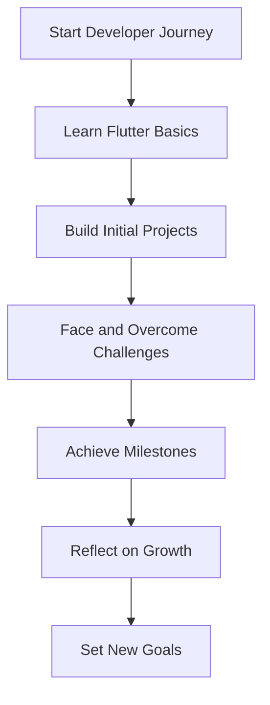

## 14.4.1 Reflecting on Your Flutter Development Journey

Embarking on a journey to master Flutter development is both exciting and challenging. As you reach the end of this book, it's crucial to take a moment to reflect on your journey. Reflection is not just about looking back; it's about understanding your progress, celebrating your achievements, and setting the stage for future growth. This section will guide you through the process of reflecting on your development journey, helping you recognize your milestones, analyze the challenges you've overcome, and set personal benchmarks for continued success.

### Acknowledging Milestones

#### Identifying Key Projects and Features Developed

As you reflect on your journey, start by identifying the key projects and features you've developed. These projects are the tangible evidence of your progress and the skills you've acquired along the way. Consider the following:

- **Initial Projects:** Think back to the first Flutter app you built. What were the core features? How did you feel when you saw your app running for the first time?
- **Complex Features:** Identify the more complex features you've implemented. Perhaps you integrated a third-party API, implemented state management, or added animations. Each of these features represents a significant step in your learning journey.
- **Hands-On Projects:** Recall the hands-on projects from this book. How did each project contribute to your understanding of Flutter? Which project challenged you the most, and why?

By acknowledging these milestones, you can see how far you've come and appreciate the effort you've put into your development.

#### Recognizing Skill Advancements and Knowledge Gained

Beyond the projects and features, consider the skills and knowledge you've gained:

- **Technical Skills:** Reflect on the technical skills you've developed, such as understanding the widget tree, managing state, or optimizing app performance.
- **Problem-Solving Abilities:** Consider how your problem-solving abilities have improved. Are you more confident in debugging issues or finding creative solutions to complex problems?
- **Soft Skills:** Don't overlook the soft skills you've honed, such as time management, communication, and collaboration, especially if you've worked on team projects.

Recognizing these advancements helps you understand your growth as a developer and motivates you to continue learning.

### Analyzing Challenges Overcome

#### Reflecting on Obstacles Faced During Development

Every developer faces challenges, and overcoming them is a crucial part of the learning process. Reflect on the obstacles you've encountered:

- **Technical Challenges:** Did you struggle with understanding certain concepts, like asynchronous programming or complex UI layouts? How did you overcome these challenges?
- **Project Management:** Were there times when managing your project timeline was difficult? How did you adapt to ensure you met your goals?
- **Motivational Hurdles:** Reflect on moments when motivation waned. What strategies did you use to reignite your passion for development?

Understanding these challenges and how you overcame them is vital for personal and professional growth.

#### Understanding How Challenges Contributed to Growth

Challenges are opportunities for growth. Consider how overcoming these obstacles has contributed to your development:

- **Resilience:** Each challenge you faced and overcame has likely increased your resilience, making you more prepared for future obstacles.
- **Confidence:** Successfully navigating difficulties boosts your confidence, reinforcing your belief in your abilities.
- **Learning Opportunities:** Challenges often lead to the most significant learning opportunities. Reflect on what each challenge taught you and how it has shaped your approach to development.

### Documenting Lessons Learned

#### Keeping a Learning Journal or Blog

Documenting your journey is an excellent way to solidify your learning and share your experiences with others. Consider starting a learning journal or blog:

- **Record Insights:** Regularly document the insights and best practices you discover. This habit helps reinforce your learning and provides a valuable resource for future reference.
- **Share Experiences:** Sharing your experiences with the community can help others facing similar challenges. It also opens the door to feedback and collaboration, further enhancing your growth.

#### Sharing Experiences with the Community

Engaging with the Flutter community is a powerful way to learn and grow:

- **Online Forums:** Participate in online forums like Stack Overflow or Reddit. Ask questions, share your knowledge, and connect with other developers.
- **Social Media:** Use platforms like Twitter or LinkedIn to share your journey, connect with industry professionals, and stay updated on the latest trends.
- **Meetups and Conferences:** Attend local meetups or conferences to network with other developers and learn from industry experts.

### Setting Personal Benchmarks

#### Comparing Current Skills with Previous Benchmarks

Setting personal benchmarks is essential for visualizing growth and maintaining motivation:

- **Skill Assessment:** Regularly assess your skills and compare them to previous benchmarks. This practice helps you identify areas for improvement and recognize your progress.
- **Goal Setting:** Use your assessments to set realistic and achievable goals. Whether it's mastering a new Flutter feature or contributing to an open-source project, having clear goals keeps you focused and motivated.

#### Celebrating Successes and Maintaining Motivation

Celebrating your successes is crucial for maintaining motivation:

- **Acknowledge Achievements:** Take time to celebrate your achievements, no matter how small. Each success is a step towards your ultimate goals.
- **Reflect on Progress:** Regularly reflect on your progress to remind yourself of how far you've come. This reflection reinforces your motivation and commitment to continuous learning.

### Conclusion

Reflecting on your journey as a Flutter developer is a powerful tool for personal and professional growth. By acknowledging your milestones, analyzing the challenges you've overcome, documenting your lessons learned, and setting personal benchmarks, you can gain valuable insights into your development journey. Remember, reflection is not just about looking back; it's about using your experiences to shape your future. Embrace the lessons you've learned, celebrate your achievements, and continue to set ambitious goals. Your journey as a Flutter developer is just beginning, and the possibilities are endless.

### Additional Resources

- **Official Flutter Documentation:** [Flutter.dev](https://flutter.dev/docs)
- **Dart Programming Language:** [Dart.dev](https://dart.dev/guides)
- **Flutter Community:** [Flutter Community on Medium](https://medium.com/flutter-community)
- **Online Courses:** Consider platforms like Udemy or Coursera for advanced Flutter courses.
- **Books:** "Flutter in Action" by Eric Windmill and "Beginning Flutter: A Hands-On Guide to App Development" by Marco L. Napoli.

### Encouragement for Continuous Learning

As you continue your journey, remember that learning is a lifelong process. Stay curious, embrace challenges, and never stop exploring new technologies and techniques. The Flutter community is vibrant and supportive, offering endless opportunities for growth and collaboration. Keep pushing the boundaries of what's possible with Flutter, and you'll continue to achieve great things.

## Quiz Time!



### What is the first step in reflecting on your Flutter development journey?

- [x] Identifying key projects and features developed
- [ ] Setting new goals
- [ ] Analyzing challenges
- [ ] Documenting lessons learned

> **Explanation:** The first step in reflecting on your journey is to identify the key projects and features you've developed, as they are tangible evidence of your progress.

### Why is it important to recognize skill advancements?

- [x] To understand your growth as a developer
- [ ] To compare yourself with others
- [ ] To find new challenges
- [ ] To set unrealistic goals

> **Explanation:** Recognizing skill advancements helps you understand your growth as a developer and motivates you to continue learning.

### How can challenges contribute to personal growth?

- [x] By increasing resilience and confidence
- [ ] By making development easier
- [ ] By reducing the need for learning
- [ ] By eliminating future challenges

> **Explanation:** Overcoming challenges increases resilience and confidence, making you more prepared for future obstacles.

### What is a benefit of keeping a learning journal?

- [x] It helps reinforce learning and provides a resource for future reference
- [ ] It replaces the need for online courses
- [ ] It guarantees success in all projects
- [ ] It eliminates the need for community engagement

> **Explanation:** A learning journal helps reinforce learning and provides a valuable resource for future reference.

### How can sharing experiences with the community be beneficial?

- [x] It helps others facing similar challenges and opens the door to feedback and collaboration
- [ ] It guarantees job offers
- [ ] It replaces the need for personal reflection
- [ ] It ensures all projects are successful

> **Explanation:** Sharing experiences with the community helps others facing similar challenges and opens the door to feedback and collaboration.

### What should you do after reflecting on your growth?

- [x] Set new goals
- [ ] Stop learning
- [ ] Compare yourself to others
- [ ] Focus only on past achievements

> **Explanation:** After reflecting on your growth, setting new goals helps you continue your development journey.

### Why is it important to celebrate successes?

- [x] To maintain motivation and acknowledge achievements
- [ ] To compete with others
- [ ] To avoid future challenges
- [ ] To eliminate the need for further learning

> **Explanation:** Celebrating successes is important for maintaining motivation and acknowledging achievements.

### What role does the Flutter community play in your development journey?

- [x] It offers opportunities for growth and collaboration
- [ ] It guarantees project success
- [ ] It replaces the need for personal reflection
- [ ] It eliminates the need for online resources

> **Explanation:** The Flutter community offers opportunities for growth and collaboration, enhancing your development journey.

### How can setting personal benchmarks help in your development?

- [x] By visualizing growth and identifying areas for improvement
- [ ] By ensuring all projects are successful
- [ ] By eliminating the need for community engagement
- [ ] By guaranteeing job offers

> **Explanation:** Setting personal benchmarks helps visualize growth and identify areas for improvement.

### True or False: Reflection is only about looking back at past achievements.

- [ ] True
- [x] False

> **Explanation:** Reflection is not just about looking back; it's about using your experiences to shape your future.


