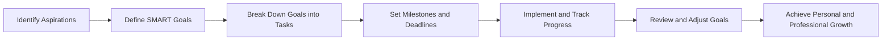

## 14.4.2 Setting Future Goals

Setting clear and achievable goals is a cornerstone of personal and professional development, especially in the fast-evolving field of Flutter development. By defining objectives that align with your career aspirations and personal interests, you can maintain focus, enhance motivation, and ensure continual growth. This section will guide you through the process of setting effective goals, using the SMART framework, and provide examples to inspire your journey.

### Importance of Goal Setting

Goal setting is crucial for providing direction and purpose in your learning and development journey. It serves as a roadmap, guiding you through the complexities of Flutter development and helping you prioritize your efforts. Here are some key benefits of setting goals:

- **Direction and Purpose:** Goals give you a clear path to follow, reducing the risk of feeling lost or overwhelmed by the vast array of learning opportunities in Flutter.
- **Motivation and Commitment:** Having specific objectives increases your motivation to learn and improve, as you have a tangible target to work towards.
- **Focus and Efficiency:** Goals help you concentrate your efforts on the most important tasks, ensuring that your time and energy are used effectively.
- **Measurement of Progress:** By setting measurable goals, you can track your progress and celebrate your achievements, which boosts confidence and encourages further growth.

### Defining SMART Goals

The SMART framework is a powerful tool for setting effective goals. It ensures that your objectives are well-defined and achievable, providing a clear path to success. Let's break down the components of SMART goals:

- **Specific:** Your goals should be clear and precise, leaving no room for ambiguity. Instead of saying "I want to improve my Flutter skills," specify what aspect you want to focus on, such as "I want to master state management in Flutter."

- **Measurable:** Establish criteria to track your progress. This could be the number of projects completed, the amount of time spent learning, or specific milestones achieved. For example, "Complete three Flutter projects using Provider for state management."

- **Achievable:** Set realistic goals that are within your reach, considering your current skills and resources. While it's important to challenge yourself, setting unattainable goals can lead to frustration.

- **Relevant:** Ensure your goals align with your personal and professional aspirations. If your career goal is to become a lead Flutter developer, focus on skills and experiences that support this path.

- **Time-Bound:** Set deadlines to create a sense of urgency and ensure timely progress. For instance, "Master advanced state management techniques within the next six months."

### Examples of Future Goals

To inspire your goal-setting process, here are some examples of future goals you might consider as a Flutter developer:

#### Technical Goals

- **Master Advanced State Management Techniques:** Dive deeper into state management solutions like BLoC, Riverpod, or MobX, and apply them in complex projects.
- **Contribute to a Major Open-Source Flutter Package:** Engage with the Flutter community by contributing to popular packages, enhancing your skills and visibility.
- **Build a Cross-Platform Flutter App Targeting Web and Desktop:** Expand your expertise by developing apps that run seamlessly across multiple platforms.

#### Career Goals

- **Secure a Flutter Developer Position in a Reputable Company:** Tailor your learning and projects to meet the requirements of your desired job role.
- **Lead a Flutter Development Team:** Develop leadership skills and gain experience in managing projects and teams.
- **Present at Flutter Conferences or Meetups:** Share your knowledge and experiences with the community, building your reputation as an expert.

#### Personal Development Goals

- **Improve UI/UX Design Skills:** Learn design principles and tools to create visually appealing and user-friendly apps.
- **Learn and Integrate New Technologies with Flutter:** Stay updated with the latest tech trends and explore integrations like Firebase, GraphQL, or machine learning.
- **Create a Comprehensive Flutter Portfolio Showcasing Diverse Projects:** Build a portfolio that highlights your skills and versatility as a developer.

### Creating a Goal Plan

Once you've defined your goals, it's essential to create a plan to achieve them. Here's how you can break down your goals into actionable steps:

- **Break Down Large Goals into Smaller, Manageable Tasks:** Divide your goals into smaller tasks that are easier to tackle. For example, if your goal is to build a cross-platform app, start with setting up the development environment, then move on to designing the UI, and so on.

- **Set Milestones to Monitor Progress:** Establish milestones to track your progress and stay motivated. Celebrate small victories along the way to maintain momentum.

- **Adjust Goals as Needed Based on Evolving Interests and Circumstances:** Be flexible and open to adjusting your goals as your interests and circumstances change. This adaptability ensures that your goals remain relevant and achievable.

### Tracking and Reviewing Goals

Regularly assessing your progress towards your goals is crucial for staying on track and making necessary adjustments. Here are some strategies for effective goal tracking:

- **Regularly Assess Progress:** Set aside time to review your progress and evaluate whether you're on track to achieve your goals. This reflection helps identify areas for improvement and reinforces your commitment.

- **Celebrate Achievements and Recognize Areas Needing Improvement:** Acknowledge your successes and use them as motivation to continue. At the same time, be honest about areas where you need to improve and take action to address them.

- **Stay Flexible and Adaptable to Changing Priorities:** Life is unpredictable, and your priorities may shift over time. Be willing to adjust your goals to reflect these changes, ensuring they remain aligned with your aspirations.

### Goal-Setting Framework and Visualization

To visualize the goal-setting process, consider the following diagram, which outlines the steps from identifying aspirations to achieving growth:

This diagram illustrates the cyclical nature of goal setting, emphasizing the importance of continuous review and adjustment to ensure ongoing growth and development.

### Conclusion

Setting future goals is a powerful way to propel your Flutter development journey forward. By defining SMART goals, creating a detailed plan, and regularly tracking your progress, you can achieve personal and professional growth. Remember to stay flexible and adaptable, allowing your goals to evolve with your changing interests and circumstances. As you continue to learn and grow, you'll not only enhance your skills but also open up new opportunities in the exciting world of Flutter development.

## Quiz Time!



### Why is goal setting important in Flutter development?

- [x] It provides direction and purpose.
- [x] It enhances motivation and commitment.
- [ ] It guarantees immediate success.
- [ ] It eliminates the need for learning.

> **Explanation:** Goal setting provides direction, enhances motivation, and helps maintain focus, but it does not guarantee immediate success or eliminate the need for learning.

### What does the 'S' in SMART goals stand for?

- [x] Specific
- [ ] Simple
- [ ] Strategic
- [ ] Standard

> **Explanation:** The 'S' in SMART goals stands for Specific, meaning goals should be clear and well-defined.

### Which of the following is an example of a technical goal for a Flutter developer?

- [x] Master advanced state management techniques.
- [ ] Secure a Flutter developer position.
- [ ] Improve public speaking skills.
- [ ] Create a comprehensive portfolio.

> **Explanation:** Mastering advanced state management techniques is a technical goal, while the others are career or personal development goals.

### What is a key benefit of setting measurable goals?

- [x] It allows tracking of progress.
- [ ] It makes goals more complex.
- [ ] It ensures goals are always achieved.
- [ ] It reduces the need for feedback.

> **Explanation:** Measurable goals allow you to track progress and assess achievements, but they do not ensure goals are always achieved or reduce the need for feedback.

### How can large goals be made more manageable?

- [x] By breaking them into smaller tasks.
- [ ] By ignoring them until later.
- [ ] By setting unrealistic deadlines.
- [ ] By focusing on multiple goals at once.

> **Explanation:** Breaking large goals into smaller, manageable tasks makes them more achievable and less overwhelming.

### What should you do if your interests or circumstances change?

- [x] Adjust your goals accordingly.
- [ ] Abandon all goals.
- [ ] Stick to the original plan no matter what.
- [ ] Ignore the changes.

> **Explanation:** It's important to adjust your goals to reflect changes in interests or circumstances to ensure they remain relevant and achievable.

### Which of the following is a career goal for a Flutter developer?

- [x] Secure a Flutter developer position.
- [ ] Master advanced state management techniques.
- [ ] Improve UI/UX design skills.
- [ ] Learn new technologies.

> **Explanation:** Securing a Flutter developer position is a career goal, while the others are technical or personal development goals.

### What is the purpose of setting milestones?

- [x] To monitor progress and maintain motivation.
- [ ] To complicate the goal-setting process.
- [ ] To ensure goals are never changed.
- [ ] To eliminate the need for deadlines.

> **Explanation:** Milestones help monitor progress and maintain motivation by providing checkpoints along the way to achieving a goal.

### Why is it important to review and adjust goals regularly?

- [x] To ensure they remain relevant and achievable.
- [ ] To make them more difficult.
- [ ] To avoid completing them.
- [ ] To eliminate the need for new goals.

> **Explanation:** Regularly reviewing and adjusting goals ensures they remain relevant and achievable, adapting to any changes in circumstances or interests.

### True or False: Setting SMART goals guarantees success.

- [ ] True
- [x] False

> **Explanation:** While setting SMART goals provides a structured approach to achieving objectives, it does not guarantee success. Effort, adaptability, and continuous learning are also crucial.


