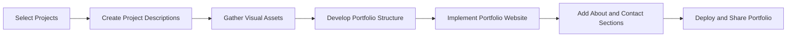

## 14.4.3 Building a Portfolio

In the competitive world of software development, a well-crafted portfolio is your gateway to showcasing your skills, projects, and accomplishments. It serves as a visual resume that highlights your expertise and attracts potential employers, clients, and collaborators. This section will guide you through creating an effective portfolio that not only demonstrates your technical proficiency but also makes a strong first impression.

### Importance of a Portfolio

A portfolio is more than just a collection of projects; it's a testament to your journey as a developer. Here's why it's crucial:

- **Demonstrating Practical Experience:** A portfolio provides tangible evidence of your ability to apply your skills in real-world scenarios. It shows that you can take concepts from theory to practice.
  
- **Providing Evidence of Problem-Solving Abilities:** Through your projects, you can illustrate how you've tackled challenges and implemented solutions, showcasing your critical thinking and creativity.
  
- **Making a Strong First Impression:** In many cases, your portfolio is the first thing potential employers or clients will see. A well-organized and visually appealing portfolio can set you apart from other candidates.

### Selecting Projects for the Portfolio

Choosing the right projects to include in your portfolio is crucial. Here are some guidelines:

- **Diversity:** Include a variety of projects that demonstrate different skills and functionalities. This could range from mobile apps to web applications, showcasing your versatility.

- **Quality Over Quantity:** It's better to have a few well-executed projects than many mediocre ones. Highlight your best work that you are proud of.

- **Relevance:** Select projects that align with your career goals and interests. If you're aiming for a position in mobile development, focus on your Flutter apps.

### Presenting Projects Effectively

Once you've selected your projects, presenting them effectively is key:

- **Project Descriptions:** Write clear and concise descriptions outlining the objectives, technologies used, and your role in the project. This helps viewers understand the context and your contributions.

- **Screenshots and Demos:** Include high-quality images, GIFs, and live demos or video walkthroughs to illustrate project functionality. Visuals can convey more than words.

- **Source Code Links:** Provide links to GitHub repositories or other source code hosting platforms. This allows potential employers to review your code quality and style.

- **Key Features and Achievements:** Highlight specific features you implemented and any recognition or success metrics achieved, such as user adoption or performance improvements.

### Designing the Portfolio Website

Your portfolio website should be as impressive as the projects it showcases:

- **User-Friendly Layout:** Ensure easy navigation and a clean, professional design. Avoid clutter and focus on readability.

- **Responsive Design:** Make the portfolio accessible and visually appealing on all devices, from desktops to smartphones.

- **About Section:** Include a section that introduces yourself, your skills, and your development philosophy. This personal touch helps viewers connect with you.

- **Contact Information:** Provide ways for prospective employers or clients to reach you, such as email or LinkedIn.

### Tools and Platforms for Building Portfolios

There are various tools and platforms you can use to build your portfolio:

- **GitHub Pages:** Host static portfolio sites directly from GitHub repositories. It's free and integrates well with your code projects.

- **Wix, Squarespace, and WordPress:** Use website builders for more customizable and feature-rich portfolios. These platforms offer templates and drag-and-drop interfaces.

- **Flutter-Based Websites:** Utilize Flutter’s web capabilities to build a portfolio site with the same technology stack. This can be a great way to demonstrate your Flutter skills.

#### Example: Using Flutter for Web to Create a Highly Interactive Portfolio

Here's a simple example of how you can create a Flutter-based portfolio website:

```yaml
dependencies:
  flutter:
    sdk: flutter
  url_launcher: ^6.1.7
```

```dart
// lib/main.dart
import 'package:flutter/material.dart';
import 'package:url_launcher/url_launcher.dart';

void main() => runApp(PortfolioApp());

class PortfolioApp extends StatelessWidget {
  @override
  Widget build(BuildContext context) {
    return MaterialApp(
      title: 'My Portfolio',
      theme: ThemeData(
        primarySwatch: Colors.blue,
      ),
      home: HomePage(),
    );
  }
}

class HomePage extends StatelessWidget {
  final List<Project> projects = [
    Project(
      name: 'Expense Tracker',
      description: 'A Flutter app to track and manage expenses.',
      imageUrl: 'assets/expense_tracker.png',
      repoUrl: 'https://github.com/yourusername/expense_tracker',
    ),
    // Add more projects as needed
  ];

  @override
  Widget build(BuildContext context) {
    return Scaffold(
      appBar: AppBar(title: Text('My Portfolio')),
      body: SingleChildScrollView(
        child: Column(
          children: [
            AboutSection(),
            ProjectsSection(projects: projects),
            ContactSection(),
          ],
        ),
      ),
    );
  }
}

class AboutSection extends StatelessWidget {
  @override
  Widget build(BuildContext context) {
    return Padding(
      padding: const EdgeInsets.all(16.0),
      child: Column(
        children: [
          Text(
            'About Me',
            style: TextStyle(fontSize: 24, fontWeight: FontWeight.bold),
          ),
          SizedBox(height: 10),
          Text(
            'I am a passionate Flutter developer with experience in building cross-platform applications.',
            textAlign: TextAlign.center,
            style: TextStyle(fontSize: 16),
          ),
        ],
      ),
    );
  }
}

class ProjectsSection extends StatelessWidget {
  final List<Project> projects;
  ProjectsSection({required this.projects});

  @override
  Widget build(BuildContext context) {
    return Padding(
      padding: const EdgeInsets.all(16.0),
      child: Column(
        children: [
          Text(
            'Projects',
            style: TextStyle(fontSize: 24, fontWeight: FontWeight.bold),
          ),
          SizedBox(height: 10),
          ...projects.map((project) => ProjectCard(project: project)).toList(),
        ],
      ),
    );
  }
}

class ProjectCard extends StatelessWidget {
  final Project project;
  ProjectCard({required this.project});

  @override
  Widget build(BuildContext context) {
    return Card(
      margin: EdgeInsets.symmetric(vertical: 10),
      child: Padding(
        padding: const EdgeInsets.all(16.0),
        child: Column(
          children: [
            Image.asset(project.imageUrl, height: 200, fit: BoxFit.cover),
            SizedBox(height: 10),
            Text(
              project.name,
              style: TextStyle(fontSize: 20, fontWeight: FontWeight.bold),
            ),
            SizedBox(height: 5),
            Text(project.description, textAlign: TextAlign.center),
            SizedBox(height: 10),
            ElevatedButton(
              onPressed: () async {
                if (await canLaunch(project.repoUrl)) {
                  await launch(project.repoUrl);
                } else {
                  throw 'Could not launch ${project.repoUrl}';
                }
              },
              child: Text('View on GitHub'),
            ),
          ],
        ),
      ),
    );
  }
}

class ContactSection extends StatelessWidget {
  @override
  Widget build(BuildContext context) {
    return Padding(
      padding: const EdgeInsets.all(16.0),
      child: Column(
        children: [
          Text(
            'Contact Me',
            style: TextStyle(fontSize: 24, fontWeight: FontWeight.bold),
          ),
          SizedBox(height: 10),
          ElevatedButton.icon(
            onPressed: () async {
              const url = 'mailto:your.email@example.com';
              if (await canLaunch(url)) {
                await launch(url);
              } else {
                throw 'Could not launch $url';
              }
            },
            icon: Icon(Icons.email),
            label: Text('Send Email'),
          ),
        ],
      ),
    );
  }
}

class Project {
  final String name;
  final String description;
  final String imageUrl;
  final String repoUrl;
  Project({
    required this.name,
    required this.description,
    required this.imageUrl,
    required this.repoUrl,
  });
}
```

### Best Practices

To ensure your portfolio remains effective and relevant, consider these best practices:

- **Keep It Updated:** Regularly add new projects and remove outdated ones to keep the portfolio current. This shows that you are actively engaged in development.

- **Optimize for Performance:** Ensure that the portfolio website loads quickly and performs smoothly. A slow site can deter potential employers.

- **Showcase Problem-Solving Skills:** Highlight the challenges faced during project development and how you overcame them. This demonstrates your ability to tackle complex problems.

- **Personal Branding:** Incorporate consistent branding elements, such as logos and color schemes, to differentiate your portfolio. This helps in creating a memorable impression.

### Mermaid.js Diagram

To visualize the process of building a portfolio, consider the following diagram:



### Conclusion

Building a portfolio is an ongoing process that evolves with your career. It's a powerful tool that not only showcases your skills but also tells your story as a developer. By following the guidelines and best practices outlined in this section, you can create a portfolio that stands out and opens doors to new opportunities.

## Quiz Time!



### Why is a portfolio important for developers?

- [x] It demonstrates practical experience and technical proficiency.
- [ ] It is only necessary for designers.
- [ ] It replaces the need for a resume.
- [ ] It is not needed if you have a LinkedIn profile.

> **Explanation:** A portfolio showcases your practical experience and technical skills, providing evidence of your abilities to potential employers or clients.

### What should you focus on when selecting projects for your portfolio?

- [x] Quality over quantity.
- [ ] Quantity over quality.
- [ ] Only personal projects.
- [ ] Only team projects.

> **Explanation:** It's better to showcase a few high-quality projects that highlight your best work rather than many mediocre ones.

### What is a key element to include when presenting projects in your portfolio?

- [x] Project descriptions and source code links.
- [ ] Only screenshots.
- [ ] Only video demos.
- [ ] Only the project name.

> **Explanation:** Including project descriptions and source code links provides context and allows viewers to understand your contributions and review your code.

### Which platform can you use to host a static portfolio site directly from your code repository?

- [x] GitHub Pages
- [ ] Wix
- [ ] Squarespace
- [ ] WordPress

> **Explanation:** GitHub Pages allows you to host static sites directly from your GitHub repositories, making it a convenient option for developers.

### What is a benefit of using Flutter for Web to build your portfolio site?

- [x] It demonstrates your Flutter skills.
- [ ] It is the only way to build a portfolio.
- [ ] It is easier than using website builders.
- [ ] It requires no coding.

> **Explanation:** Using Flutter for Web to build your portfolio site showcases your ability to use Flutter across different platforms.

### What should you include in the About section of your portfolio?

- [x] A brief introduction, your skills, and development philosophy.
- [ ] Only your name and contact information.
- [ ] A list of all your projects.
- [ ] Only your resume.

> **Explanation:** The About section should provide a personal touch, introducing yourself, your skills, and your development philosophy to help viewers connect with you.

### How can you ensure your portfolio website is accessible on all devices?

- [x] Implement responsive design.
- [ ] Use only desktop layouts.
- [ ] Use only mobile layouts.
- [ ] Avoid using images.

> **Explanation:** Responsive design ensures that your portfolio is visually appealing and functional on all devices, from desktops to smartphones.

### What is a best practice for maintaining your portfolio?

- [x] Regularly update it with new projects.
- [ ] Keep it the same once it's created.
- [ ] Only update it once a year.
- [ ] Remove old projects without adding new ones.

> **Explanation:** Regularly updating your portfolio with new projects and removing outdated ones keeps it current and relevant.

### What should you highlight to showcase your problem-solving skills in your portfolio?

- [x] Challenges faced and how you overcame them.
- [ ] Only the final product.
- [ ] Only the technologies used.
- [ ] Only the project timeline.

> **Explanation:** Highlighting challenges and how you overcame them demonstrates your ability to tackle complex problems and find solutions.

### True or False: Personal branding is not important for a developer's portfolio.

- [ ] True
- [x] False

> **Explanation:** Personal branding is important as it helps differentiate your portfolio and create a memorable impression.


