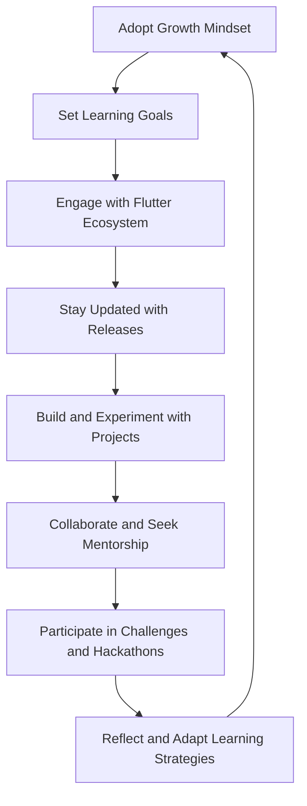

## 14.4.4 Inspiring Continued Learning

The journey of a Flutter developer is a continuous path of growth and exploration. In the ever-evolving landscape of technology, staying ahead requires a commitment to lifelong learning. This section delves into strategies and resources that can help you cultivate a mindset of continuous improvement, ensuring that you remain adaptable and proficient in Flutter development.

### Embracing a Growth Mindset

A growth mindset is the belief that abilities and intelligence can be developed through dedication and hard work. This perspective is crucial for developers who wish to thrive in a rapidly changing field like Flutter development.

- **Viewing Challenges as Opportunities:** Instead of seeing challenges as obstacles, view them as opportunities to learn and grow. Each bug you encounter or feature you struggle to implement is a chance to deepen your understanding and enhance your skills.
  
- **Staying Curious and Open:** Curiosity drives innovation. Stay open to new ideas, technologies, and methodologies. This openness will allow you to adapt to changes in the Flutter ecosystem and beyond.

### Setting Learning Goals

Setting clear, achievable learning goals can guide your development journey and keep you motivated.

- **Identifying Areas to Master:** Determine which aspects of Flutter and software development you want to focus on. This could include mastering state management, improving UI/UX design skills, or learning about backend integration.

- **Creating a Roadmap:** Develop a roadmap that outlines the skills and knowledge you wish to acquire. Break down your goals into manageable steps and set timelines to track your progress.

### Engaging with the Flutter Ecosystem

The Flutter ecosystem is vibrant and constantly evolving. Engaging with it can provide valuable insights and opportunities for growth.

- **Exploring New Packages and Tools:** Regularly explore new Flutter packages and tools. This will not only enhance your projects but also keep you informed about the latest trends and innovations in the community.

- **Contributing to the Community:** Consider contributing to Flutter’s development or community packages. This involvement can deepen your understanding of the framework and connect you with other passionate developers.

### Reading and Research

Staying informed about the latest developments in Flutter and software engineering is essential for continuous learning.

- **Keeping Up with Releases:** Regularly check for new Flutter releases and updates. Understanding the changes and improvements can help you leverage new features and optimize your applications.

- **Diving into Advanced Literature:** Read advanced books, research papers, and technical blogs related to Flutter development. These resources can provide deeper insights and broaden your knowledge base.

### Hands-On Practice

Practical experience is one of the most effective ways to solidify your learning and discover new techniques.

- **Building and Experimenting:** Continuously build new projects and experiment with different features. This hands-on practice will reinforce your skills and inspire creativity.

- **Integrating Emerging Technologies:** Try integrating emerging technologies into your projects. This could include using machine learning models, implementing augmented reality features, or exploring IoT integrations.

### Collaboration and Mentorship

Collaboration and mentorship can accelerate your learning and provide new perspectives.

- **Working with Other Developers:** Collaborate on projects with other developers. This teamwork can expose you to different approaches and problem-solving techniques.

- **Seeking and Offering Mentorship:** Find a mentor who can guide you through challenges and offer advice. Alternatively, become a mentor yourself to reinforce your knowledge and give back to the community.

### Participating in Challenges and Hackathons

Engaging in coding challenges and hackathons can test your skills and push you to innovate.

- **Coding Challenges:** Participate in coding challenges to test and enhance your Flutter skills. These challenges often present unique problems that require creative solutions.

- **Hackathons:** Join hackathons to collaborate on innovative projects under time constraints. This experience can improve your ability to work efficiently and think on your feet.

### Utilizing Online Learning Platforms

Online learning platforms offer a wealth of resources for expanding your skill set.

- **Enrolling in Courses and Tutorials:** Continually enroll in new courses and tutorials to stay updated. Platforms like Udemy, Coursera, and LinkedIn Learning offer courses specifically tailored to Flutter development.

- **Leveraging Interactive Tools:** Use interactive learning tools and environments to gain practical experience. These platforms often provide hands-on exercises that reinforce learning.

### Reflecting and Adapting

Regular reflection and adaptation are key to effective learning.

- **Assessing Progress:** Regularly assess your learning progress and adjust your strategies as needed. This reflection will help you identify areas for improvement and celebrate your achievements.

- **Embracing Feedback:** Welcome feedback from peers and mentors. Learning from both successes and failures will help you grow as a developer.

### Conclusion

Inspiring continued learning in Flutter development is about embracing a mindset of growth, setting clear goals, and engaging with the community. By staying curious, practicing regularly, and seeking collaboration, you can ensure that your skills remain sharp and relevant. Remember, the journey of learning is ongoing, and each step you take brings you closer to mastery.

## Quiz Time!



### What is a growth mindset?

- [x] The belief that abilities and intelligence can be developed through dedication and hard work.
- [ ] The belief that intelligence is fixed and cannot be changed.
- [ ] The idea that only innate talent leads to success.
- [ ] The concept that challenges should be avoided.

> **Explanation:** A growth mindset is the belief that abilities and intelligence can be developed through dedication and hard work, which is crucial for continuous learning.

### Why is setting learning goals important?

- [x] It provides direction and motivation for learning.
- [ ] It ensures you never make mistakes.
- [ ] It guarantees immediate success.
- [ ] It eliminates the need for feedback.

> **Explanation:** Setting learning goals provides direction and motivation, helping you focus on specific areas for improvement and track your progress.

### How can engaging with the Flutter ecosystem benefit developers?

- [x] It keeps developers informed about the latest trends and innovations.
- [ ] It guarantees a job in the tech industry.
- [ ] It eliminates the need for further learning.
- [ ] It ensures all projects are successful.

> **Explanation:** Engaging with the Flutter ecosystem keeps developers informed about the latest trends and innovations, which is essential for staying current in the field.

### What is the benefit of hands-on practice in learning Flutter?

- [x] It reinforces skills and inspires creativity.
- [ ] It guarantees no bugs in your code.
- [ ] It eliminates the need for theoretical knowledge.
- [ ] It ensures projects are completed faster.

> **Explanation:** Hands-on practice reinforces skills and inspires creativity, allowing developers to apply what they've learned in real-world scenarios.

### How can collaboration and mentorship accelerate learning?

- [x] They provide new perspectives and problem-solving techniques.
- [ ] They guarantee a promotion at work.
- [ ] They eliminate the need for self-study.
- [ ] They ensure you never make mistakes.

> **Explanation:** Collaboration and mentorship provide new perspectives and problem-solving techniques, which can accelerate learning and personal growth.

### Why should developers participate in coding challenges and hackathons?

- [x] To test and enhance their skills under unique constraints.
- [ ] To guarantee winning prizes.
- [ ] To avoid learning new technologies.
- [ ] To ensure all projects are perfect.

> **Explanation:** Participating in coding challenges and hackathons tests and enhances skills under unique constraints, fostering innovation and quick thinking.

### What role do online learning platforms play in continuous learning?

- [x] They offer courses and tutorials to expand skill sets.
- [ ] They replace the need for practical experience.
- [ ] They guarantee immediate expertise.
- [ ] They eliminate the need for collaboration.

> **Explanation:** Online learning platforms offer courses and tutorials that help expand skill sets, providing valuable resources for continuous learning.

### How can reflecting and adapting improve the learning process?

- [x] By helping identify areas for improvement and celebrate achievements.
- [ ] By ensuring no mistakes are made.
- [ ] By guaranteeing immediate success.
- [ ] By eliminating the need for feedback.

> **Explanation:** Reflecting and adapting help identify areas for improvement and celebrate achievements, making the learning process more effective.

### What is the importance of staying updated with Flutter releases?

- [x] It helps leverage new features and optimize applications.
- [ ] It guarantees a job in the tech industry.
- [ ] It eliminates the need for further learning.
- [ ] It ensures all projects are successful.

> **Explanation:** Staying updated with Flutter releases helps leverage new features and optimize applications, keeping your skills relevant.

### True or False: A growth mindset sees challenges as opportunities to learn.

- [x] True
- [ ] False

> **Explanation:** True. A growth mindset sees challenges as opportunities to learn and grow, which is essential for continuous improvement.


