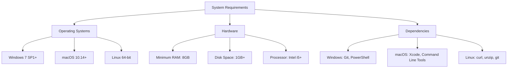

## 2.1.1 System Requirements

Setting up a robust development environment is crucial for a smooth and efficient Flutter development experience. This section will guide you through the necessary system requirements, ensuring your setup is optimized for building Flutter applications. Whether you're using Windows, macOS, or Linux, understanding these requirements will help you avoid common pitfalls and enhance your productivity.

### Operating System Support

Flutter is a versatile framework that supports multiple operating systems, allowing developers to choose their preferred platform. Here's a breakdown of the supported operating systems and their specific requirements:

- **Windows:**
  - **Version:** Windows 7 SP1 or newer (64-bit)
  - **Rationale:** Windows 7 SP1 provides the necessary updates and security features required for modern development tools. Using a 64-bit version ensures compatibility with the latest software and tools.

- **macOS:**
  - **Version:** macOS 10.14 (Mojave) or newer
  - **Rationale:** macOS Mojave introduced several enhancements and security updates that are essential for development. Newer versions also support the latest Xcode, which is crucial for iOS app development.

- **Linux:**
  - **Distribution:** Any 64-bit Linux distribution
  - **Rationale:** Linux offers flexibility and a wide range of distributions. A 64-bit system is necessary to run modern development tools efficiently.

### Hardware Requirements

To ensure a seamless development experience, your hardware should meet or exceed the following specifications:

- **RAM:**
  - **Minimum:** 8 GB
  - **Rationale:** Adequate RAM is essential for running IDEs, emulators, and other development tools simultaneously. 8 GB is a baseline for handling these tasks without significant slowdowns.

- **Disk Space:**
  - **Minimum:** 1 GB for Flutter SDK
  - **Additional:** More space required for IDEs and emulator images
  - **Rationale:** While the Flutter SDK itself is relatively lightweight, additional space is needed for IDE installations, project files, and emulator images, which can be substantial.

- **Processor:**
  - **Recommended:** Intel i5 or equivalent
  - **Rationale:** A capable processor ensures that development tasks, such as compiling code and running emulators, are performed efficiently. An Intel i5 or equivalent provides a good balance of performance and cost.

### Additional Dependencies

Depending on your operating system, there are specific dependencies you'll need to install to ensure Flutter runs smoothly:

- **Windows:**
  - **Git for Windows:** Essential for version control and fetching packages.
  - **PowerShell 5.0 or newer:** Required for running Flutter commands.

- **macOS:**
  - **Xcode:** Necessary for iOS development and simulator access. Xcode provides the tools needed to build and test iOS applications.
  - **Command Line Tools:** Install via `xcode-select --install`. These tools are required for various command-line operations.

- **Linux:**
  - **Dependencies:** Ensure `curl`, `unzip`, `which`, and `git` are installed. These tools are used for downloading and managing packages.
  - **Example (Ubuntu/Debian):**
    ```bash
    sudo apt-get update
    sudo apt-get install curl unzip git
    ```

### Visual Representation

To better understand the system requirements, refer to the following Mermaid.js diagram, which outlines the key components:



### Best Practices and Common Pitfalls

- **Best Practices:**
  - Regularly update your operating system and development tools to ensure compatibility and security.
  - Allocate sufficient disk space for your projects and tools to prevent interruptions during development.
  - Consider using an SSD for faster read/write speeds, which can significantly improve performance when working with large projects and emulators.

- **Common Pitfalls:**
  - Insufficient RAM can lead to slow performance, especially when running multiple emulators or IDEs.
  - Failing to install necessary dependencies can result in errors during setup or when running Flutter commands.
  - Using outdated operating systems or hardware can lead to compatibility issues with the latest development tools.

### Practical Example

Let's consider a scenario where you're setting up a Flutter development environment on a Windows machine:

1. **Check Your OS Version:**
   - Ensure you're running Windows 7 SP1 or newer. You can check your version by going to `Settings > System > About`.

2. **Verify Hardware Specifications:**
   - Confirm that your machine has at least 8 GB of RAM and an Intel i5 processor. This can be checked under `Settings > System > About`.

3. **Install Dependencies:**
   - Download and install Git for Windows from the official website.
   - Ensure PowerShell 5.0 or newer is installed. You can check the version by running `Get-Host | Select-Object Version` in PowerShell.

4. **Allocate Disk Space:**
   - Make sure you have at least 1 GB of free space for the Flutter SDK. Consider additional space for IDEs and emulators.

By following these steps, you can ensure that your development environment is well-prepared for Flutter development.

### Additional Resources

- **Official Flutter Documentation:** [Flutter System Requirements](https://flutter.dev/docs/get-started/install)
- **Git for Windows:** [Download Git](https://git-scm.com/download/win)
- **Xcode Installation Guide:** [Apple Developer](https://developer.apple.com/xcode/)
- **Linux Package Management:** [Ubuntu Package Management](https://help.ubuntu.com/community/AptGet/Howto)

### Conclusion

Setting up your development environment with the correct system requirements is a foundational step in your Flutter development journey. By ensuring your system meets these requirements, you can focus on building innovative applications without being hindered by technical limitations. Remember to keep your tools and dependencies updated, and don't hesitate to explore additional resources to enhance your development experience.

## Quiz Time!



### Which operating systems are supported by Flutter for development?

- [x] Windows 7 SP1 or newer (64-bit)
- [x] macOS 10.14 (Mojave) or newer
- [x] Any 64-bit Linux distribution
- [ ] Windows XP

> **Explanation:** Flutter supports Windows 7 SP1 or newer, macOS 10.14 or newer, and any 64-bit Linux distribution. Windows XP is not supported.

### What is the minimum recommended RAM for a smooth Flutter development experience?

- [ ] 4 GB
- [x] 8 GB
- [ ] 16 GB
- [ ] 2 GB

> **Explanation:** A minimum of 8 GB of RAM is recommended to handle IDEs, emulators, and other development tasks efficiently.

### Which tool is necessary for version control on Windows when setting up Flutter?

- [ ] PowerShell
- [x] Git for Windows
- [ ] Xcode
- [ ] curl

> **Explanation:** Git for Windows is essential for version control and fetching packages when setting up Flutter on Windows.

### What command is used to install Command Line Tools on macOS?

- [x] `xcode-select --install`
- [ ] `brew install xcode`
- [ ] `apt-get install xcode`
- [ ] `install xcode`

> **Explanation:** The command `xcode-select --install` is used to install Command Line Tools on macOS.

### Which processor is recommended for Flutter development?

- [ ] Intel i3
- [x] Intel i5 or equivalent
- [ ] Intel i7
- [ ] AMD Ryzen 3

> **Explanation:** An Intel i5 or equivalent processor is recommended for efficient handling of development tasks.

### What is the minimum disk space required for the Flutter SDK?

- [ ] 500 MB
- [x] 1 GB
- [ ] 2 GB
- [ ] 5 GB

> **Explanation:** At least 1 GB of free disk space is required for the Flutter SDK, with additional space needed for IDEs and emulator images.

### Which additional dependency is required on Linux for Flutter development?

- [x] curl
- [ ] PowerShell
- [ ] Xcode
- [ ] Visual Studio

> **Explanation:** On Linux, dependencies like `curl`, `unzip`, and `git` are required for Flutter development.

### What is the purpose of PowerShell in a Windows Flutter setup?

- [ ] To compile Flutter apps
- [x] To run Flutter commands
- [ ] To manage disk space
- [ ] To install Xcode

> **Explanation:** PowerShell is required to run Flutter commands on Windows.

### Which of the following is a common pitfall when setting up a Flutter development environment?

- [x] Insufficient RAM
- [ ] Using an SSD
- [ ] Installing Git
- [ ] Allocating disk space

> **Explanation:** Insufficient RAM can lead to slow performance, especially when running multiple emulators or IDEs.

### True or False: macOS Mojave is the minimum version required for Flutter development on macOS.

- [x] True
- [ ] False

> **Explanation:** macOS Mojave (10.14) is the minimum version required for Flutter development on macOS.


