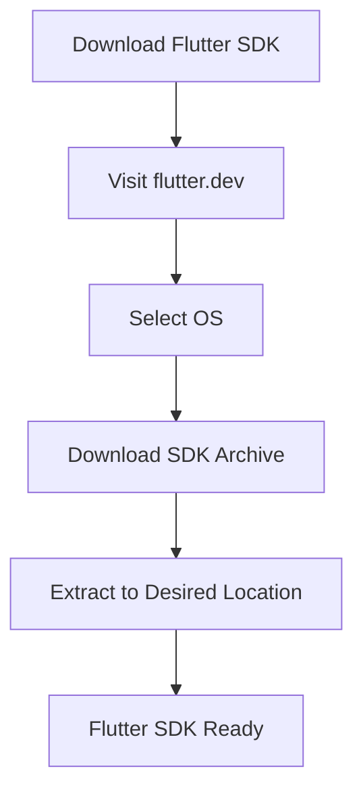

## 2.1.2 Downloading Flutter

Setting up your development environment is a crucial first step in your journey to building Flutter applications. This section will guide you through downloading the Flutter SDK, ensuring you have the latest tools to create cross-platform apps efficiently. Whether you're using Windows, macOS, or Linux, this guide will provide detailed instructions tailored to your operating system.

### Visit the Official Flutter Website

The first step in downloading the Flutter SDK is to visit the official Flutter website. This ensures that you are accessing the most recent and stable version of the SDK, which is essential for taking advantage of the latest features and improvements.

- **Navigate to [Flutter's official installation page](https://flutter.dev/docs/get-started/install):** This page is your go-to resource for downloading the Flutter SDK. It provides links to the latest stable releases and detailed installation instructions for various operating systems.

### Choose Your Operating System

Flutter supports multiple operating systems, allowing you to develop on the platform of your choice. The installation process varies slightly depending on whether you're using Windows, macOS, or Linux.

- **Select the tab corresponding to your OS:** On the Flutter installation page, you'll find tabs for different operating systems. Choose the one that matches your setup:
  - **Windows**
  - **macOS**
  - **Linux**

### Download the Flutter SDK

Once you've selected your operating system, you can proceed to download the Flutter SDK. This involves downloading a compressed archive file that contains all the necessary components.

- **Click the **Download Flutter SDK** button:** This will initiate the download of the latest stable release of the Flutter SDK.
  
#### Example for Windows:

- **Download the `flutter_windows_<version>-stable.zip` file:** This ZIP file contains the Flutter SDK for Windows. Ensure you download the correct version that matches your system architecture.

### Extract the SDK

After downloading the SDK, the next step is to extract it to a suitable location on your system. The extraction process varies slightly between Windows and Unix-based systems like macOS and Linux.

#### Windows:

- **Extract the ZIP file to `C:\src\flutter`:** This is the recommended directory for installing Flutter on Windows. However, you can choose a different location if you prefer.
  - **Avoid installing Flutter in directories that require elevated permissions:** This can lead to permission issues when running Flutter commands.

#### macOS and Linux:

- **Extract the archive in the desired location:** A common practice is to extract the SDK to a directory within your home folder, such as `$HOME/flutter`.
  - **Example command for macOS/Linux:**
    ```bash
    tar xf flutter_<version>-stable.tar.xz -C ~/development
    ```
  - This command extracts the contents of the archive to the `~/development` directory.

### Visualizing the Process with Mermaid.js

To better understand the flow of downloading and setting up the Flutter SDK, refer to the following diagram:



This diagram illustrates the straightforward process of downloading and preparing the Flutter SDK for use.

### Best Practices and Tips

- **Ensure you have a stable internet connection:** Downloading the SDK requires a reliable internet connection to avoid interruptions.
- **Check for the latest version:** Always download the latest stable version to benefit from the newest features and bug fixes.
- **Verify the integrity of the downloaded file:** Use checksums provided on the Flutter website to ensure the file has not been corrupted during download.
- **Organize your development environment:** Keep your Flutter SDK in a dedicated directory to avoid clutter and make future updates easier.

### Common Pitfalls and Solutions

- **Permission Issues on Windows:** If you encounter permission errors, ensure that the Flutter SDK is not installed in a system-protected directory.
- **Path Length Limit on Windows:** Windows has a maximum path length limit of 260 characters. Avoid deeply nested directories to prevent issues.
- **Missing Dependencies on Linux:** Ensure that all required dependencies are installed on your Linux system. The Flutter website provides a list of these dependencies.

### Additional Resources

- **Official Flutter Documentation:** [Flutter Installation Guide](https://flutter.dev/docs/get-started/install)
- **Community Forums:** Engage with other developers on platforms like Stack Overflow and Flutter's GitHub discussions.
- **Online Courses:** Consider enrolling in courses on platforms like Udemy or Coursera for a more structured learning experience.

By following these steps, you'll have the Flutter SDK downloaded and ready to use, setting the stage for your app development journey. In the next sections, we'll cover configuring your development environment and running your first Flutter app.

## Quiz Time!



### What is the first step in downloading the Flutter SDK?

- [x] Visit the official Flutter website
- [ ] Choose your operating system
- [ ] Extract the SDK
- [ ] Download the Flutter SDK

> **Explanation:** The first step is to visit the official Flutter website to access the latest SDK downloads.

### Which operating systems are supported by Flutter?

- [x] Windows
- [x] macOS
- [x] Linux
- [ ] iOS

> **Explanation:** Flutter supports development on Windows, macOS, and Linux. iOS is a target platform, not a development environment.

### What should you avoid when installing Flutter on Windows?

- [x] Installing in directories that require elevated permissions
- [ ] Extracting the ZIP file
- [ ] Downloading the SDK from the official site
- [ ] Using a stable internet connection

> **Explanation:** Installing Flutter in directories that require elevated permissions can lead to permission issues.

### What command is used to extract the Flutter SDK on macOS/Linux?

- [x] `tar xf flutter_<version>-stable.tar.xz -C ~/development`
- [ ] `unzip flutter_<version>-stable.zip -d ~/development`
- [ ] `install flutter_<version>-stable.tar.xz`
- [ ] `extract flutter_<version>-stable.tar.xz ~/development`

> **Explanation:** The `tar xf` command is used to extract the Flutter SDK archive on macOS/Linux.

### What is a recommended directory for installing Flutter on Windows?

- [x] `C:\src\flutter`
- [ ] `C:\Program Files\flutter`
- [ ] `C:\Windows\flutter`
- [ ] `C:\Users\flutter`

> **Explanation:** `C:\src\flutter` is recommended to avoid permission issues and path length limitations.

### What should you check after downloading the Flutter SDK?

- [x] The integrity of the downloaded file
- [ ] The color of the Flutter logo
- [ ] The number of files in the archive
- [ ] The size of the extracted folder

> **Explanation:** Checking the integrity ensures the file has not been corrupted during download.

### What is the purpose of the Mermaid.js diagram in this section?

- [x] To visualize the process of downloading and setting up the Flutter SDK
- [ ] To show the architecture of a Flutter app
- [ ] To illustrate the widget tree hierarchy
- [ ] To demonstrate state management

> **Explanation:** The diagram visualizes the steps involved in downloading and setting up the Flutter SDK.

### Why is it important to download the latest stable version of Flutter?

- [x] To benefit from the newest features and bug fixes
- [ ] To ensure compatibility with older devices
- [ ] To reduce the size of the download
- [ ] To avoid using beta features

> **Explanation:** The latest stable version includes the newest features and bug fixes, ensuring a better development experience.

### What should you do if you encounter permission errors on Windows?

- [x] Ensure Flutter is not installed in a system-protected directory
- [ ] Re-download the SDK
- [ ] Change your operating system
- [ ] Use a different internet connection

> **Explanation:** Installing Flutter in a system-protected directory can cause permission errors.

### True or False: Flutter can be developed on iOS.

- [ ] True
- [x] False

> **Explanation:** While Flutter apps can be deployed on iOS, the development environment is not supported on iOS devices.


