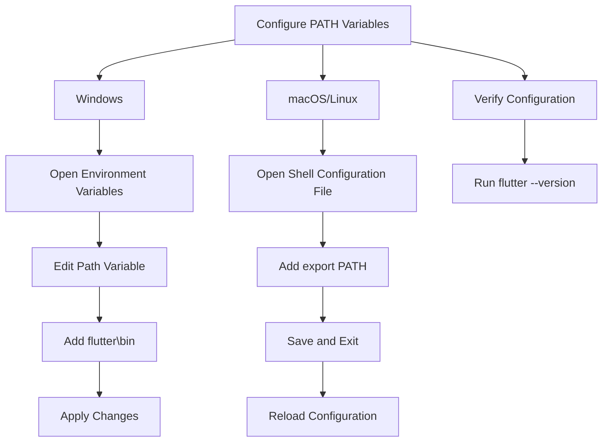

## 2.1.3 Configuring PATH Variables

Configuring PATH variables is a crucial step in setting up your development environment for Flutter. This process allows you to execute Flutter commands from any terminal window without needing to specify the full path to the Flutter executable. This guide will walk you through configuring PATH variables on Windows, macOS, and Linux, ensuring you have a seamless development experience.

### Purpose of PATH Configuration

The PATH environment variable is a system variable that tells your operating system where to look for executable files when you enter a command in the terminal or command prompt. By adding the Flutter SDK to your PATH, you enable the system to recognize Flutter commands globally, simplifying your workflow and saving time.

### Configuring PATH Variables on Windows

#### Step-by-Step Guide

Configuring PATH variables on Windows involves modifying the system's environment variables. Follow these steps to add Flutter to your PATH:

1. **Open Environment Variables:**
   - Press `Win + X` and select **System** from the menu.
   - Click on **Advanced system settings** on the left sidebar.
   - In the **System Properties** window, click on **Environment Variables**.

2. **Edit PATH Variable:**
   - Under **User variables**, find and select the `Path` variable, then click **Edit**.
   - In the **Edit Environment Variable** window, click **New** and add the path to the `flutter\bin` directory. For example, if you installed Flutter in `C:\src\flutter`, you would add `C:\src\flutter\bin`.

3. **Apply Changes:**
   - Click **OK** to close all dialog boxes and apply the changes.

4. **Verify in Command Prompt:**
   - Open a new Command Prompt window and type `flutter --version`. If configured correctly, this command will display the installed Flutter version.

#### Practical Example

Imagine you're working on a Flutter project and need to quickly check the Flutter version or run a Flutter command. By having Flutter in your PATH, you can simply open any command prompt and type `flutter <command>` without navigating to the Flutter directory each time.

### Configuring PATH Variables on macOS and Linux

#### Step-by-Step Guide

For macOS and Linux, configuring PATH variables involves editing your shell's configuration file. Here’s how you can do it:

1. **Open Terminal:**
   - Use a text editor to open your shell configuration file. For Bash users, this is typically `~/.bashrc`, and for Zsh users, it's `~/.zshrc`. You can use `nano` or any other text editor:
     ```bash
     nano ~/.bashrc
     ```
     Or for Zsh:
     ```bash
     nano ~/.zshrc
     ```

2. **Add Flutter to PATH:**
   - Append the following line to the file, replacing `/path_to_flutter` with the actual path to your Flutter SDK:
     ```bash
     export PATH="$PATH:/path_to_flutter/flutter/bin"
     ```

3. **Apply Changes:**
   - Save the changes and exit the editor. In `nano`, you can do this by pressing `Ctrl + O`, hitting `Enter`, and then `Ctrl + X`.
   - Reload the configuration file to apply the changes:
     ```bash
     source ~/.bashrc
     ```
     Or for Zsh:
     ```bash
     source ~/.zshrc
     ```

4. **Verify in Terminal:**
   - Run `flutter --version` in the terminal to ensure that Flutter is accessible from any directory.

#### Practical Example

Consider a scenario where you're developing a Flutter app on your MacBook. By configuring the PATH, you can open a terminal in any project directory and execute Flutter commands without needing to specify the full path to the Flutter SDK, streamlining your development process.

### Visualizing the Process with Mermaid.js

To help visualize the process of configuring PATH variables, here is a Mermaid.js diagram that outlines the steps for both Windows and macOS/Linux:



### Best Practices and Common Pitfalls

- **Backup Configuration Files:** Before making changes to your shell configuration files, it's a good practice to create a backup. This way, you can easily revert to the original state if something goes wrong.
- **Avoid Duplicates:** Ensure that you do not add duplicate entries to your PATH, as this can lead to unexpected behavior.
- **Case Sensitivity:** On macOS and Linux, be mindful of case sensitivity when specifying paths.
- **Persistent Changes:** Remember that changes to PATH variables are session-specific unless saved in configuration files like `.bashrc` or `.zshrc`.

### Additional Resources

- [Flutter Official Documentation](https://flutter.dev/docs/get-started/install): The official guide for installing Flutter on different operating systems.
- [Environment Variables on Windows](https://docs.microsoft.com/en-us/windows/win32/procthread/environment-variables): Microsoft’s documentation on managing environment variables.
- [Unix Shell Configuration](https://www.gnu.org/software/bash/manual/bash.html): The GNU Bash manual for understanding shell configuration files.

By following these steps and best practices, you can effectively configure PATH variables, enhancing your Flutter development workflow. This setup not only saves time but also reduces the complexity of managing multiple projects and environments.

## Quiz Time!



### What is the primary purpose of configuring PATH variables for Flutter?

- [x] To allow Flutter commands to be run from any terminal window without specifying the full path.
- [ ] To increase the speed of Flutter applications.
- [ ] To automatically update Flutter SDK.
- [ ] To enhance the security of Flutter applications.

> **Explanation:** Configuring PATH variables allows you to run Flutter commands globally from any terminal window without needing to specify the full path to the Flutter executable.

### Which command is used to verify the Flutter installation on Windows after configuring PATH variables?

- [x] `flutter --version`
- [ ] `flutter check`
- [ ] `flutter install`
- [ ] `flutter path`

> **Explanation:** The `flutter --version` command is used to verify that Flutter is correctly installed and accessible from the command line.

### On Windows, where do you add the Flutter path in the environment variables?

- [x] Under User variables, in the `Path` variable.
- [ ] Under System variables, in the `Path` variable.
- [ ] In the Windows Registry.
- [ ] In the Control Panel.

> **Explanation:** The Flutter path is added under User variables in the `Path` variable to make Flutter commands accessible from the command line.

### What is the correct command to open the Bash configuration file on macOS?

- [x] `nano ~/.bashrc`
- [ ] `edit ~/.bashrc`
- [ ] `open ~/.bashrc`
- [ ] `vim ~/.bashrc`

> **Explanation:** The `nano ~/.bashrc` command opens the Bash configuration file using the nano text editor.

### How do you apply changes to the PATH variable on macOS after editing the `.bashrc` file?

- [x] By running `source ~/.bashrc`
- [ ] By restarting the computer.
- [ ] By logging out and logging back in.
- [ ] By reinstalling the terminal.

> **Explanation:** Running `source ~/.bashrc` applies the changes made to the `.bashrc` file without needing to restart the computer.

### Which shell configuration file is typically used by Zsh users on macOS?

- [x] `~/.zshrc`
- [ ] `~/.bashrc`
- [ ] `~/.profile`
- [ ] `~/.config`

> **Explanation:** Zsh users typically use the `~/.zshrc` file for their shell configuration.

### What should you do before making changes to your shell configuration files?

- [x] Create a backup of the configuration files.
- [ ] Delete the existing configuration files.
- [ ] Install a new shell.
- [ ] Change the file permissions.

> **Explanation:** Creating a backup of configuration files ensures you can revert to the original state if something goes wrong.

### What is a common pitfall when configuring PATH variables?

- [x] Adding duplicate entries to the PATH.
- [ ] Using a text editor to edit configuration files.
- [ ] Running the `flutter` command.
- [ ] Installing Flutter SDK.

> **Explanation:** Adding duplicate entries to the PATH can lead to unexpected behavior and should be avoided.

### How can you ensure that PATH changes are persistent across terminal sessions?

- [x] By saving changes in configuration files like `.bashrc` or `.zshrc`.
- [ ] By running the `flutter` command.
- [ ] By installing a new terminal.
- [ ] By using a different operating system.

> **Explanation:** Saving changes in configuration files like `.bashrc` or `.zshrc` ensures that PATH changes are persistent across terminal sessions.

### True or False: Configuring PATH variables is only necessary on Windows.

- [ ] True
- [x] False

> **Explanation:** Configuring PATH variables is necessary on all operating systems, including Windows, macOS, and Linux, to ensure that Flutter commands can be run from any terminal window.


