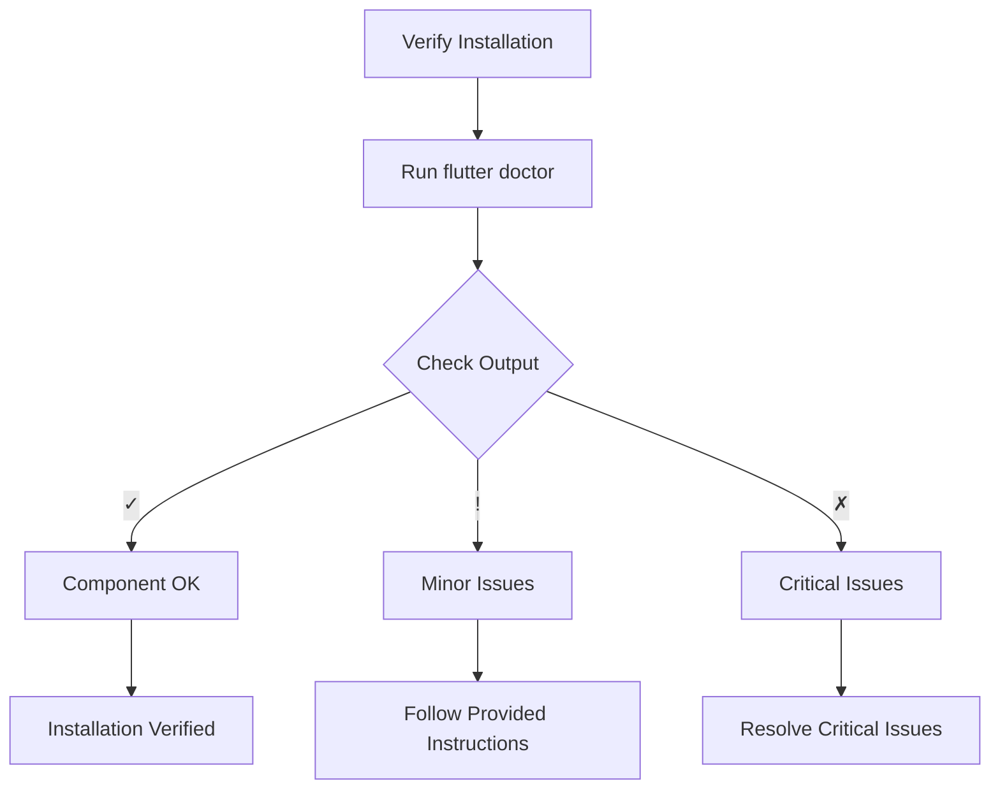

## 2.1.4 Verifying Installation

Setting up your Flutter development environment is a crucial step in your journey to building cross-platform applications. Once you've installed the Flutter SDK, it's essential to verify that everything is configured correctly. This ensures that you can start developing without encountering unexpected issues. In this section, we'll guide you through the process of verifying your Flutter installation using the `flutter doctor` command, interpreting its output, and resolving common issues that may arise.

### Running `flutter doctor`

The `flutter doctor` command is a powerful tool that checks your environment and provides a comprehensive report on the status of your Flutter installation. It helps identify any missing dependencies or configuration issues that could hinder your development process.

#### Step-by-Step Guide to Running `flutter doctor`

1. **Open Your Terminal or Command Prompt:**
   - On Windows, you can use Command Prompt or PowerShell.
   - On macOS and Linux, use the Terminal application.

2. **Execute the `flutter doctor` Command:**
   - Type the following command and press Enter:
     ```bash
     flutter doctor
     ```
   - This command will initiate a series of checks on your system to ensure that all necessary components for Flutter development are installed and configured correctly.

3. **Review the Output:**
   - The output will display a list of checks, each representing a component of your development environment, such as the Flutter SDK, Android toolchain, iOS toolchain (if applicable), and more.

### Interpreting `flutter doctor` Output

Understanding the output of `flutter doctor` is key to identifying and resolving any issues with your setup. The output uses a simple system of symbols to indicate the status of each component:

- **Green Check Marks (`✓`):** These indicate that the component is installed and functioning correctly. If all components show green check marks, your Flutter environment is ready for development.

- **Yellow Exclamation Marks (`!`):** These suggest minor issues that may need attention but do not necessarily prevent you from developing with Flutter. It's advisable to address these warnings to ensure optimal performance and compatibility.

- **Red Crosses (`✗`):** These highlight critical issues that must be resolved before you can proceed with Flutter development. These issues could prevent Flutter from functioning properly.

### Common Issues and Resolutions

While `flutter doctor` is designed to help you identify and resolve issues, here are some common problems you might encounter and how to fix them:

#### Missing Dependencies

One of the most common issues is missing dependencies, particularly related to the Android toolchain.

- **Example:** If the Android toolchain is missing, `flutter doctor` will prompt you to install Android Studio and set up the Android SDK. Follow these steps:
  - Download and install Android Studio from the official website.
  - Open Android Studio and follow the setup wizard to install the Android SDK and other necessary components.

#### Accepting Android Licenses

If you see a message indicating that Android licenses have not been accepted, you can resolve this by running the following command:

```bash
flutter doctor --android-licenses
```

This command will prompt you to review and accept the necessary licenses for Android development.

#### iOS Setup (macOS Only)

For macOS users, setting up the iOS toolchain is essential for developing iOS applications.

- **Xcode Installation:** If Xcode is not installed, `flutter doctor` will prompt you to install it from the App Store. Once installed, ensure that the command-line tools are selected by running:
  ```bash
  sudo xcode-select --switch /Applications/Xcode.app/Contents/Developer
  ```

- **CocoaPods:** Ensure that CocoaPods is installed, as it's required for managing iOS dependencies. You can install it using:
  ```bash
  sudo gem install cocoapods
  ```

### Ensure All Checks Pass

Your goal should be to have all checks display green ticks. Address any remaining issues before proceeding with Flutter development. This will help you avoid potential roadblocks and ensure a smooth development experience.

### Visualizing the Verification Process

To better understand the verification process, consider the following Mermaid.js diagram, which illustrates the flow of verifying your Flutter installation:



### Best Practices and Tips

- **Regularly Run `flutter doctor`:** Make it a habit to run `flutter doctor` whenever you update your Flutter SDK or make significant changes to your development environment. This will help you catch any new issues early.

- **Stay Updated:** Keep your Flutter SDK, Android Studio, and Xcode up to date to benefit from the latest features and bug fixes.

- **Consult Official Documentation:** If you encounter issues that are not covered here, refer to the [official Flutter documentation](https://flutter.dev/docs/get-started/install) for detailed guidance.

- **Engage with the Community:** The Flutter community is a valuable resource for troubleshooting and support. Participate in forums, join Flutter groups, and attend meetups to connect with other developers.

### Conclusion

Verifying your Flutter installation is a crucial step in setting up your development environment. By running `flutter doctor` and addressing any issues it identifies, you ensure that your system is ready for Flutter development. This proactive approach will save you time and frustration down the road, allowing you to focus on building amazing applications.

## Quiz Time!



### What command is used to verify the Flutter installation?

- [x] flutter doctor
- [ ] flutter check
- [ ] flutter verify
- [ ] flutter install

> **Explanation:** The `flutter doctor` command is used to verify the Flutter installation and check the environment setup.

### What does a green check mark (`✓`) indicate in the `flutter doctor` output?

- [x] The component is installed and functioning correctly.
- [ ] There is a minor issue that needs attention.
- [ ] There is a critical issue that must be resolved.
- [ ] The component is not installed.

> **Explanation:** A green check mark (`✓`) indicates that the component is installed and functioning correctly.

### What should you do if `flutter doctor` shows a red cross (`✗`)?

- [ ] Ignore it and continue development.
- [x] Resolve the critical issue before proceeding.
- [ ] Reinstall Flutter SDK.
- [ ] Run `flutter doctor` again.

> **Explanation:** A red cross (`✗`) indicates a critical issue that must be resolved before proceeding with Flutter development.

### How can you accept Android licenses if `flutter doctor` indicates they are not accepted?

- [ ] Reinstall Android Studio.
- [x] Run `flutter doctor --android-licenses`.
- [ ] Update the Flutter SDK.
- [ ] Restart your computer.

> **Explanation:** Running `flutter doctor --android-licenses` allows you to review and accept the necessary Android licenses.

### What command is used to select the command-line tools for Xcode on macOS?

- [ ] xcode-select --install
- [x] sudo xcode-select --switch /Applications/Xcode.app/Contents/Developer
- [ ] xcode-select --update
- [ ] xcode-select --reset

> **Explanation:** The command `sudo xcode-select --switch /Applications/Xcode.app/Contents/Developer` is used to select the command-line tools for Xcode on macOS.

### What is the purpose of the `flutter doctor` command?

- [x] To check the environment and verify the Flutter installation.
- [ ] To install Flutter SDK.
- [ ] To update Flutter packages.
- [ ] To run Flutter applications.

> **Explanation:** The `flutter doctor` command checks the environment and verifies the Flutter installation.

### Which symbol in `flutter doctor` output suggests minor issues?

- [ ] ✓
- [x] !
- [ ] ✗
- [ ] ?

> **Explanation:** A yellow exclamation mark (`!`) suggests minor issues that may need attention.

### What should you do if `flutter doctor` indicates missing dependencies?

- [x] Follow the provided instructions to install the missing components.
- [ ] Ignore the message and continue.
- [ ] Uninstall and reinstall Flutter.
- [ ] Restart your computer.

> **Explanation:** If `flutter doctor` indicates missing dependencies, you should follow the provided instructions to install the missing components.

### What is the recommended action if `flutter doctor` shows a yellow exclamation mark (`!`)?

- [ ] Ignore it and continue development.
- [x] Address the minor issue to ensure optimal performance.
- [ ] Reinstall Flutter SDK.
- [ ] Run `flutter doctor` again.

> **Explanation:** A yellow exclamation mark (`!`) suggests minor issues that should be addressed to ensure optimal performance.

### True or False: Running `flutter doctor` is only necessary after the initial installation of Flutter.

- [ ] True
- [x] False

> **Explanation:** It is recommended to run `flutter doctor` regularly, especially after updates or changes to your development environment, to ensure everything is functioning correctly.


