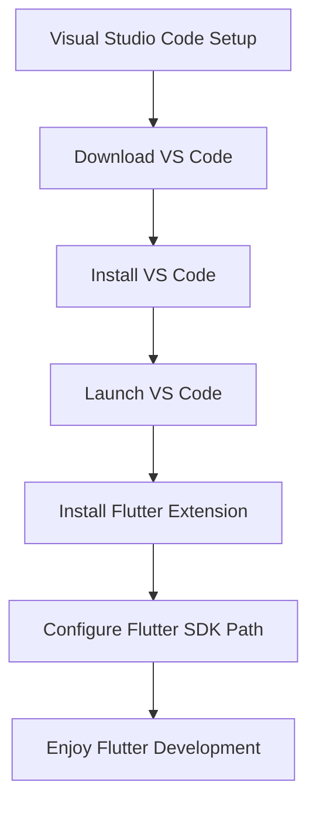

## 2.2.1 Visual Studio Code

Visual Studio Code (VS Code) is a popular choice among developers for its lightweight nature, extensive customization options, and robust feature set. Developed by Microsoft, VS Code is an open-source Integrated Development Environment (IDE) that supports a wide range of programming languages and frameworks, including Flutter. In this section, we'll delve into setting up VS Code for Flutter development, exploring its features, and understanding how it can enhance your coding experience.

### Introduction to Visual Studio Code

Visual Studio Code is renowned for its versatility and efficiency. It offers a user-friendly interface that can be tailored to suit individual preferences, making it an ideal choice for both beginners and experienced developers. Its extensibility is one of its strongest points, allowing developers to enhance functionality through a vast library of extensions.

- **Lightweight and Fast:** Unlike traditional IDEs, VS Code is lightweight, ensuring quick startup times and smooth performance even on less powerful machines.
- **Cross-Platform:** Available on Windows, macOS, and Linux, VS Code provides a consistent development experience across different operating systems.
- **Open Source:** As an open-source project, VS Code benefits from a large community of contributors who continuously improve and expand its capabilities.

### Installation Guide

Setting up Visual Studio Code is straightforward. Follow these steps to get started:

#### Download

Visit the [Visual Studio Code website](https://code.visualstudio.com/) to download the installer for your operating system. The website automatically detects your OS and suggests the appropriate download link.

#### Installation Steps

- **Windows/macOS:**
  - Run the downloaded installer.
  - Follow the on-screen instructions to complete the installation. You can customize the installation path and choose additional options like adding VS Code to your system PATH for easy command-line access.

- **Linux:**
  - You can use package managers or download the `.deb` or `.rpm` packages directly from the VS Code website.
  - For Ubuntu/Debian, you can use the following command to install via Snap:
    ```bash
    sudo snap install --classic code
    ```
  - Alternatively, use `apt` or `yum` for Debian-based or Red Hat-based distributions, respectively.

### Setting Up Flutter in VS Code

Once VS Code is installed, the next step is to configure it for Flutter development. This involves installing the necessary extensions and setting up the Flutter SDK.

#### Install Flutter Extension

The Flutter extension for VS Code provides essential tools for Flutter development, including code completion, debugging, and more.

- Open VS Code.
- Navigate to the Extensions view by pressing `Ctrl + Shift + X` (or `Cmd + Shift + X` on macOS).
- Search for "Flutter" and install the Flutter extension by Dart Code. This extension automatically installs the Dart extension as well, which is required for Flutter development.

#### Configure Flutter SDK Path

If VS Code does not automatically detect your Flutter SDK, you can manually set the path:

1. Open the Command Palette by pressing `Ctrl + Shift + P` (or `Cmd + Shift + P` on macOS).
2. Type `Flutter: Change SDK` and select it from the list.
3. Navigate to your Flutter SDK directory and select it.

### Features Enhancing Flutter Development

Visual Studio Code offers several features that significantly enhance the Flutter development experience:

- **IntelliSense:** Provides intelligent code completions based on variable types, function definitions, and imported modules. This feature helps you write code faster and with fewer errors.
  
- **Debugging Tools:** VS Code includes an integrated debugger that allows you to set breakpoints, inspect variables, and view call stacks. This makes it easier to identify and fix bugs in your Flutter applications.

- **Code Snippets:** The Flutter extension comes with predefined snippets for common Flutter widgets and patterns, helping you quickly scaffold new components and features.

- **Hot Reload Support:** One of Flutter's standout features is hot reload, which allows you to see changes in your app instantly without restarting it. VS Code integrates this feature seamlessly, enabling you to perform hot reloads directly from the IDE.

### Visualizing the Setup Process

To better understand the setup process, refer to the following Mermaid.js diagram, which outlines the steps involved in configuring Visual Studio Code for Flutter development:



### Best Practices and Tips

- **Keep Extensions Updated:** Regularly update your extensions to benefit from the latest features and improvements.
- **Customize Your Workspace:** Take advantage of VS Code's customization options to tailor the interface to your workflow. This includes themes, keybindings, and layout configurations.
- **Utilize Integrated Terminal:** VS Code's integrated terminal allows you to run command-line tools without leaving the IDE, streamlining your development process.
- **Explore Extensions:** Beyond Flutter, explore other extensions that can enhance your productivity, such as GitLens for version control or Prettier for code formatting.

### Common Pitfalls and Challenges

- **SDK Path Issues:** Ensure that the Flutter SDK path is correctly set in VS Code settings to avoid issues with code completion and debugging.
- **Extension Conflicts:** Be mindful of potential conflicts between extensions. If you encounter issues, try disabling extensions one by one to identify the culprit.
- **Performance Considerations:** While VS Code is lightweight, running too many extensions simultaneously can impact performance. Disable unnecessary extensions to maintain optimal speed.

### Additional Resources

For further exploration and learning, consider the following resources:

- [Official Visual Studio Code Documentation](https://code.visualstudio.com/docs)
- [Flutter Documentation](https://flutter.dev/docs)
- [Dart Language Tour](https://dart.dev/guides/language/language-tour)
- Online courses on platforms like Udemy or Coursera for in-depth Flutter development tutorials.

### Conclusion

Visual Studio Code is a powerful and flexible IDE that, when configured correctly, can greatly enhance your Flutter development experience. By following the steps outlined in this guide, you'll be well-equipped to build robust and efficient Flutter applications. Remember to explore the vast array of extensions and customization options available to tailor VS Code to your specific needs.

## Quiz Time!



### What is Visual Studio Code known for?

- [x] Its extensibility and user-friendly interface
- [ ] Being a heavy and resource-intensive IDE
- [ ] Only supporting Windows operating systems
- [ ] Lack of community support

> **Explanation:** Visual Studio Code is known for its extensibility and user-friendly interface, making it a popular choice among developers.

### How can you install Visual Studio Code on Ubuntu?

- [x] Using the Snap package manager
- [ ] Only by downloading a .exe file
- [ ] Through the Microsoft Store
- [ ] Using the Mac App Store

> **Explanation:** On Ubuntu, you can install Visual Studio Code using the Snap package manager with the command `sudo snap install --classic code`.

### What is the purpose of the Flutter extension in VS Code?

- [x] To provide tools for Flutter development, including code completion and debugging
- [ ] To replace the Dart extension
- [ ] To make VS Code slower
- [ ] To uninstall other extensions

> **Explanation:** The Flutter extension provides essential tools for Flutter development, such as code completion and debugging capabilities.

### What command do you use to open the Command Palette in VS Code?

- [x] Ctrl + Shift + P (or Cmd + Shift + P on macOS)
- [ ] Ctrl + Alt + P
- [ ] Ctrl + P
- [ ] Alt + Shift + P

> **Explanation:** The Command Palette in VS Code can be opened using Ctrl + Shift + P (or Cmd + Shift + P on macOS).

### Which feature of VS Code allows you to see changes in your Flutter app instantly?

- [x] Hot Reload
- [ ] Cold Restart
- [ ] IntelliSense
- [ ] Code Snippets

> **Explanation:** Hot Reload allows you to see changes in your Flutter app instantly without restarting it.

### What should you do if VS Code does not automatically detect your Flutter SDK?

- [x] Manually set the Flutter SDK path in VS Code settings
- [ ] Reinstall VS Code
- [ ] Install a different IDE
- [ ] Ignore the issue

> **Explanation:** If VS Code does not automatically detect your Flutter SDK, you should manually set the SDK path in the settings.

### What is a common issue when running too many extensions in VS Code?

- [x] Performance degradation
- [ ] Increased battery life
- [ ] Faster startup times
- [ ] Improved code quality

> **Explanation:** Running too many extensions simultaneously can lead to performance degradation in VS Code.

### Which of the following is NOT a feature of VS Code?

- [ ] IntelliSense
- [ ] Integrated Terminal
- [ ] Code Snippets
- [x] Built-in Database Management

> **Explanation:** VS Code does not have built-in database management; it focuses on code editing and development tools.

### What is the benefit of using the integrated terminal in VS Code?

- [x] It allows you to run command-line tools without leaving the IDE
- [ ] It replaces the need for a file explorer
- [ ] It automatically writes code for you
- [ ] It is only available on macOS

> **Explanation:** The integrated terminal in VS Code allows you to run command-line tools directly within the IDE, streamlining your workflow.

### True or False: Visual Studio Code is only available for Windows.

- [ ] True
- [x] False

> **Explanation:** False. Visual Studio Code is cross-platform and available for Windows, macOS, and Linux.


