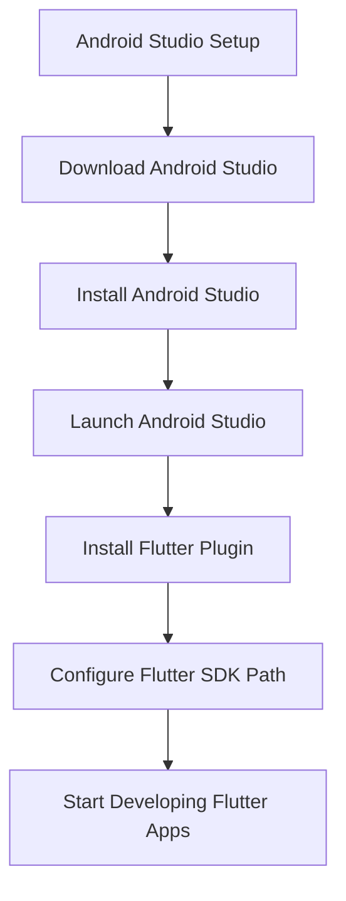

## 2.2.2 Android Studio

Android Studio is a powerful Integrated Development Environment (IDE) developed by Google, primarily aimed at Android development. However, with the right plugins, it becomes an excellent tool for Flutter development as well. In this section, we will explore how to set up Android Studio for Flutter, delve into its features, and understand why it is a preferred choice for many developers.

### Introduction to Android Studio

Android Studio is the official IDE for Android app development, built on JetBrains' IntelliJ IDEA software. It offers a robust set of tools for building apps on every type of Android device. With the addition of Flutter plugins, Android Studio becomes a versatile environment for developing cross-platform applications with Flutter.

#### Key Features of Android Studio

- **Intelligent Code Editor:** Provides advanced code completion, refactoring, and code analysis.
- **Real-time Profiling Tools:** Helps in monitoring app performance and resource usage.
- **Flexible Build System:** Based on Gradle, allowing for customized build configurations.
- **Integrated Emulator:** Quick access to Android emulators for testing applications.
- **Version Control Integration:** Seamless integration with Git and other version control systems.

### Installation Guide

Setting up Android Studio is straightforward. Follow these steps to get started:

#### Download

Visit the [Android Studio download page](https://developer.android.com/studio) and download the installer suitable for your operating system. Ensure that your system meets the minimum requirements for running Android Studio effectively.

#### Installation Steps

- **Windows/macOS:**
  - Run the downloaded installer.
  - Follow the setup wizard instructions, which will guide you through the installation process.
  - Choose the standard installation to include the most common settings and components.

- **Linux:**
  - Extract the downloaded archive to a suitable location.
  - Navigate to the `bin` directory within the extracted folder.
  - Run the `studio.sh` script to launch Android Studio.

### Setting Up Flutter in Android Studio

Once Android Studio is installed, you need to configure it for Flutter development. This involves installing the Flutter plugin and setting up the Flutter SDK path.

#### Install Flutter Plugin

1. **Open Android Studio.**
2. Navigate to **File > Settings** (on Windows/Linux) or **Android Studio > Preferences** (on macOS).
3. Go to the **Plugins** section.
4. Search for "Flutter" in the marketplace.
5. Click **Install**. This will also prompt you to install the Dart plugin, which is necessary for Flutter development.
6. Restart Android Studio to apply the changes.

#### Configure Flutter SDK Path

After installing the Flutter plugin, you may be prompted to set the Flutter SDK path. If not, follow these steps:

1. Go to **File > Settings > Languages & Frameworks > Flutter**.
2. Set the path to your Flutter SDK directory. This is the directory where you extracted or cloned the Flutter SDK.

### Features Enhancing Flutter Development

Android Studio offers several features that enhance the Flutter development experience:

- **Intelligent Code Completion:** Provides context-aware code suggestions and auto-completions tailored for Flutter and Dart, helping you write code faster and with fewer errors.
  
- **Flutter Inspector:** A powerful visual tool that allows you to inspect and debug Flutter widget trees. It helps in understanding the layout and structure of your UI, making it easier to identify and fix issues.

- **Emulator Integration:** Android Studio integrates seamlessly with Android emulators, allowing you to test your Flutter apps on virtual devices directly from the IDE.

- **Version Control Integration:** Built-in support for Git and other version control systems makes it easy to manage your code repositories, track changes, and collaborate with other developers.

### Practical Code Example

To illustrate the setup process, let's walk through creating a simple Flutter application in Android Studio:

1. **Create a New Flutter Project:**
   - Open Android Studio and select **Start a new Flutter project**.
   - Choose **Flutter Application** and click **Next**.
   - Enter your project name, select the Flutter SDK path, and configure other project settings as needed.
   - Click **Finish** to create the project.

2. **Run the Default App:**
   - Once the project is created, you will see the default Flutter app code in `lib/main.dart`.
   - Connect an Android emulator or a physical device.
   - Click the **Run** button in the toolbar to build and run the app.

3. **Explore the Flutter Inspector:**
   - With the app running, open the **Flutter Inspector** from the right-hand side panel.
   - Use the inspector to explore the widget tree and understand the app's UI structure.

### Mermaid.js Diagram

To visualize the setup process, refer to the following diagram:

### Best Practices and Common Pitfalls

- **Keep Android Studio Updated:** Regularly update Android Studio and its plugins to benefit from the latest features and improvements.
- **Optimize Performance:** Allocate sufficient memory and CPU resources to Android Studio, especially when running emulators.
- **Use Version Control:** Always use version control systems like Git to manage your codebase effectively.
- **Familiarize with Shortcuts:** Learn keyboard shortcuts to enhance productivity and navigate the IDE efficiently.

### Additional Resources

- [Official Android Studio Documentation](https://developer.android.com/studio)
- [Flutter Plugin for Android Studio](https://plugins.jetbrains.com/plugin/9212-flutter)
- [Dart Plugin for Android Studio](https://plugins.jetbrains.com/plugin/6351-dart)
- [Flutter Documentation](https://flutter.dev/docs)

### Conclusion

Android Studio is a robust and versatile IDE that, when configured with the Flutter plugin, provides a comprehensive environment for developing cross-platform applications. By following the steps outlined in this guide, you can set up Android Studio for Flutter development and take advantage of its powerful features to build high-quality apps.

## Quiz Time!



### What is Android Studio primarily used for?

- [x] Android development
- [ ] iOS development
- [ ] Web development
- [ ] Game development

> **Explanation:** Android Studio is primarily used for Android app development, although it can be extended to support Flutter for cross-platform development.

### Which plugin is essential for Flutter development in Android Studio?

- [x] Flutter plugin
- [ ] Kotlin plugin
- [ ] Java plugin
- [ ] Python plugin

> **Explanation:** The Flutter plugin is essential for Flutter development in Android Studio, as it provides the necessary tools and integrations.

### How do you install the Flutter plugin in Android Studio?

- [x] Through the Plugins section in Settings/Preferences
- [ ] By downloading from the Flutter website
- [ ] By installing a separate application
- [ ] Through the command line

> **Explanation:** The Flutter plugin can be installed through the Plugins section in Android Studio's Settings (or Preferences on macOS).

### What is the purpose of the Flutter Inspector?

- [x] To inspect and debug Flutter widget trees
- [ ] To manage app permissions
- [ ] To compile Dart code
- [ ] To deploy apps to the Play Store

> **Explanation:** The Flutter Inspector is used to inspect and debug Flutter widget trees, helping developers understand the UI structure.

### Which of the following is NOT a feature of Android Studio?

- [ ] Intelligent Code Completion
- [ ] Emulator Integration
- [ ] Version Control Integration
- [x] Built-in Database Management

> **Explanation:** Android Studio does not have built-in database management; it focuses on code editing, emulation, and version control.

### What is the first step in setting up Android Studio for Flutter development?

- [x] Downloading and installing Android Studio
- [ ] Configuring the Flutter SDK path
- [ ] Installing the Dart plugin
- [ ] Creating a new Flutter project

> **Explanation:** The first step is downloading and installing Android Studio before configuring it for Flutter development.

### How can you run a Flutter app in Android Studio?

- [x] By clicking the Run button with an emulator or device connected
- [ ] By using the terminal command `flutter run`
- [ ] By exporting the project to another IDE
- [ ] By compiling it manually

> **Explanation:** You can run a Flutter app in Android Studio by clicking the Run button, provided an emulator or device is connected.

### What should you do if Android Studio does not prompt you to set the Flutter SDK path?

- [x] Manually set it in the Languages & Frameworks section
- [ ] Reinstall the Flutter plugin
- [ ] Restart Android Studio
- [ ] Ignore it

> **Explanation:** If not prompted, you should manually set the Flutter SDK path in the Languages & Frameworks section of the settings.

### Which operating systems can Android Studio be installed on?

- [x] Windows, macOS, and Linux
- [ ] Only Windows and macOS
- [ ] Only Linux
- [ ] Only Windows

> **Explanation:** Android Studio can be installed on Windows, macOS, and Linux operating systems.

### True or False: Android Studio is the only IDE that supports Flutter development.

- [ ] True
- [x] False

> **Explanation:** False. Other IDEs like Visual Studio Code and IntelliJ IDEA also support Flutter development.


