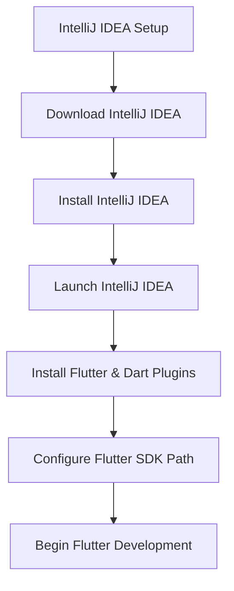

## 2.2.3 IntelliJ IDEA

IntelliJ IDEA, developed by JetBrains, is a powerful integrated development environment (IDE) that offers comprehensive support for Flutter and Dart through dedicated plugins. This section will guide you through the process of setting up IntelliJ IDEA for Flutter development, highlighting its features and providing practical insights to enhance your coding experience.

### Introduction to IntelliJ IDEA

IntelliJ IDEA is renowned for its intelligent code assistance, robust development tools, and seamless integration capabilities. It supports a wide range of programming languages and frameworks, making it a versatile choice for developers. With its advanced features tailored for Flutter and Dart, IntelliJ IDEA stands out as a preferred IDE for many developers in the Flutter community.

### Installation Guide

#### Download

To begin, you need to download IntelliJ IDEA. JetBrains offers two editions:

- **Community Edition**: Free and open-source, suitable for most Flutter development needs.
- **Ultimate Edition**: Paid version with additional features for enterprise development.

Visit the [IntelliJ IDEA download page](https://www.jetbrains.com/idea/download/) to choose the edition that best suits your needs.

#### Installation Steps

**Windows/macOS:**

1. **Run the Installer**: Once downloaded, open the installer file.
2. **Follow Setup Instructions**: The installer will guide you through the setup process. You can customize the installation directory and choose additional components if needed.

**Linux:**

1. **Extract the Archive**: Download the tar.gz file and extract it to a preferred location.
2. **Run the Script**: Navigate to the `bin` directory and execute the `idea.sh` script to launch IntelliJ IDEA.

### Setting Up Flutter in IntelliJ IDEA

Once IntelliJ IDEA is installed, the next step is to configure it for Flutter development.

#### Install Flutter and Dart Plugins

1. **Open IntelliJ IDEA**: Launch the IDE.
2. **Access Plugins**: Navigate to **File > Settings** (Windows/Linux) or **IntelliJ IDEA > Preferences** (macOS).
3. **Search for Plugins**: In the Plugins section, search for "Flutter".
4. **Install Plugins**: Click **Install** to add the Flutter plugin. This will automatically install the Dart plugin as well.
5. **Restart IntelliJ IDEA**: Restart the IDE to activate the plugins.

#### Configure Flutter SDK Path

1. **Open Settings**: Go to **File > Settings > Languages & Frameworks > Flutter**.
2. **Set SDK Path**: Specify the path to your Flutter SDK directory. This allows IntelliJ IDEA to recognize Flutter commands and tools.

### Features Enhancing Flutter Development

IntelliJ IDEA offers several features that significantly enhance the Flutter development experience:

- **Advanced Code Analysis**: IntelliJ IDEA provides real-time code analysis, detecting errors and suggesting improvements as you type. This feature helps maintain code quality and efficiency.
  
- **Refactoring Tools**: The IDE includes powerful refactoring tools that allow you to restructure your code effortlessly. Whether you need to rename variables or extract methods, IntelliJ IDEA simplifies these tasks.

- **Flutter Run Configurations**: Easily configure and run your Flutter applications directly from the IDE. You can set up different configurations for various devices and environments.

- **Integrated Terminal**: Access a terminal within IntelliJ IDEA to run Flutter commands without leaving the IDE. This integration streamlines your workflow and keeps all development activities in one place.

### Practical Code Example

To illustrate the setup process, let's walk through a simple Flutter project creation in IntelliJ IDEA:

1. **Create a New Project**: Open IntelliJ IDEA and select **New Project**.
2. **Select Flutter**: Choose Flutter from the list of project types.
3. **Configure Project**: Enter your project name, location, and ensure the Flutter SDK path is set.
4. **Finish Setup**: Click **Finish** to create the project.

Here's a basic Flutter application code snippet to get you started:

```dart
import 'package:flutter/material.dart';

void main() => runApp(MyApp());

class MyApp extends StatelessWidget {
  @override
  Widget build(BuildContext context) {
    return MaterialApp(
      title: 'Flutter Demo',
      theme: ThemeData(
        primarySwatch: Colors.blue,
      ),
      home: MyHomePage(),
    );
  }
}

class MyHomePage extends StatelessWidget {
  @override
  Widget build(BuildContext context) {
    return Scaffold(
      appBar: AppBar(
        title: Text('Welcome to Flutter'),
      ),
      body: Center(
        child: Text('Hello, World!'),
      ),
    );
  }
}
```

### Mermaid.js Diagram

To visualize the setup process, refer to the following diagram:



### Best Practices and Common Pitfalls

- **Regular Updates**: Keep IntelliJ IDEA and its plugins updated to benefit from the latest features and improvements.
- **Explore Shortcuts**: Familiarize yourself with IntelliJ IDEA's keyboard shortcuts to enhance productivity.
- **Utilize Code Inspections**: Leverage the IDE's code inspection tools to identify potential issues early in the development process.
- **Avoid Overloading Plugins**: Only install necessary plugins to prevent performance degradation.

### Additional Resources

- **Official Documentation**: Refer to the [IntelliJ IDEA Documentation](https://www.jetbrains.com/idea/documentation/) for detailed guidance.
- **Flutter Community**: Engage with the [Flutter Community](https://flutter.dev/community) for support and collaboration.
- **JetBrains Academy**: Explore courses on [JetBrains Academy](https://www.jetbrains.com/academy/) to deepen your understanding of IntelliJ IDEA and Flutter.

### Conclusion

Setting up IntelliJ IDEA for Flutter development equips you with a powerful toolset to create robust applications. By following the steps outlined in this guide, you can optimize your development environment and leverage IntelliJ IDEA's features to enhance your coding efficiency. As you continue to explore Flutter, IntelliJ IDEA will be a valuable ally in your development journey.

## Quiz Time!



### What is IntelliJ IDEA?

- [x] A powerful IDE developed by JetBrains
- [ ] A programming language
- [ ] A web browser
- [ ] A database management system

> **Explanation:** IntelliJ IDEA is an integrated development environment (IDE) developed by JetBrains, known for its robust support for various programming languages and frameworks, including Flutter and Dart.

### Which editions of IntelliJ IDEA are available for download?

- [x] Community Edition and Ultimate Edition
- [ ] Basic Edition and Pro Edition
- [ ] Standard Edition and Enterprise Edition
- [ ] Free Edition and Premium Edition

> **Explanation:** IntelliJ IDEA is available in two editions: Community Edition, which is free, and Ultimate Edition, which is a paid version with additional features.

### How do you install Flutter and Dart plugins in IntelliJ IDEA?

- [x] Through the Plugins section in Settings/Preferences
- [ ] By downloading them from the Flutter website
- [ ] By installing them via command line
- [ ] By using a third-party plugin manager

> **Explanation:** To install Flutter and Dart plugins in IntelliJ IDEA, navigate to the Plugins section in Settings (Windows/Linux) or Preferences (macOS) and search for "Flutter" to install.

### What is the purpose of configuring the Flutter SDK path in IntelliJ IDEA?

- [x] To allow IntelliJ IDEA to recognize Flutter commands and tools
- [ ] To enable IntelliJ IDEA to compile Java code
- [ ] To set up a database connection
- [ ] To configure network settings

> **Explanation:** Configuring the Flutter SDK path in IntelliJ IDEA allows the IDE to recognize and execute Flutter commands, facilitating Flutter development.

### Which feature of IntelliJ IDEA helps in detecting errors and suggesting improvements in real-time?

- [x] Advanced Code Analysis
- [ ] Integrated Terminal
- [ ] Flutter Run Configurations
- [ ] Refactoring Tools

> **Explanation:** Advanced Code Analysis in IntelliJ IDEA provides real-time feedback on code quality, detecting errors and suggesting improvements as you code.

### What is the benefit of using the integrated terminal in IntelliJ IDEA?

- [x] It allows running Flutter commands without leaving the IDE
- [ ] It provides a graphical interface for database management
- [ ] It enables remote debugging
- [ ] It offers a visual representation of code structure

> **Explanation:** The integrated terminal in IntelliJ IDEA allows developers to execute Flutter commands directly within the IDE, streamlining the development workflow.

### What should you do after installing the Flutter and Dart plugins in IntelliJ IDEA?

- [x] Restart IntelliJ IDEA to activate the plugins
- [ ] Uninstall the plugins
- [ ] Configure a new database
- [ ] Change the IDE theme

> **Explanation:** After installing the Flutter and Dart plugins, restarting IntelliJ IDEA is necessary to activate and apply the changes.

### What is a common pitfall when using IntelliJ IDEA for Flutter development?

- [x] Installing too many unnecessary plugins
- [ ] Using the integrated terminal
- [ ] Configuring the Flutter SDK path
- [ ] Utilizing code inspections

> **Explanation:** Installing too many unnecessary plugins can lead to performance issues in IntelliJ IDEA, so it's best to only install what is needed.

### Which of the following is a recommended practice for using IntelliJ IDEA?

- [x] Familiarizing yourself with keyboard shortcuts
- [ ] Avoiding the use of code inspections
- [ ] Disabling all plugins
- [ ] Using only the command line for development

> **Explanation:** Familiarizing yourself with keyboard shortcuts in IntelliJ IDEA can significantly enhance productivity and streamline development tasks.

### True or False: IntelliJ IDEA is only suitable for Flutter development.

- [ ] True
- [x] False

> **Explanation:** False. IntelliJ IDEA is a versatile IDE that supports a wide range of programming languages and frameworks, not just Flutter.


