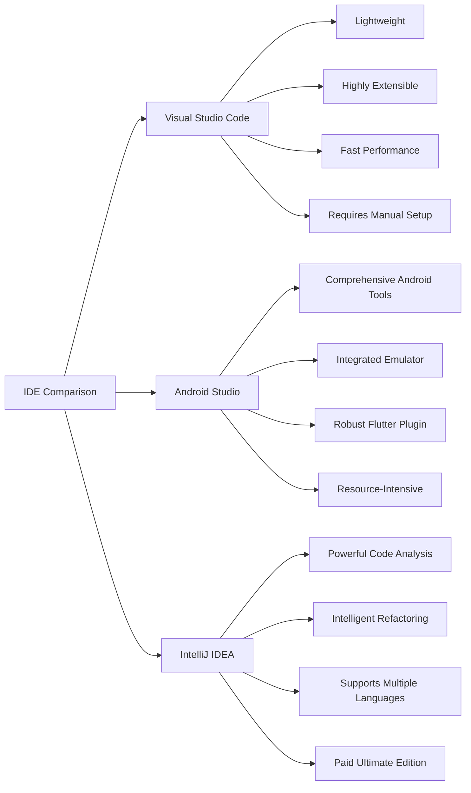

## 2.2.4 IDE Comparison

Choosing the right Integrated Development Environment (IDE) is crucial for efficient and effective Flutter development. In this section, we will compare three popular IDEs: Visual Studio Code, Android Studio, and IntelliJ IDEA. Each of these tools offers unique features and capabilities that cater to different development needs and preferences. By understanding their pros and cons, you can make an informed decision on which IDE best suits your workflow and project requirements.

### Visual Studio Code vs. Android Studio vs. IntelliJ IDEA

#### Visual Studio Code

Visual Studio Code (VS Code) is a lightweight, open-source code editor developed by Microsoft. It has gained immense popularity among developers due to its speed, flexibility, and extensive library of extensions.

**Pros:**
- **Lightweight:** VS Code is known for its minimalistic design, which allows it to run smoothly even on resource-constrained systems. This makes it an excellent choice for developers working on older hardware or those who prefer a snappy development experience.
- **Highly Extensible:** The marketplace for VS Code extensions is vast, offering plugins for virtually every language and framework, including Flutter. This extensibility allows developers to customize their environment to fit their specific needs.
- **Faster Performance:** Compared to more heavyweight IDEs, VS Code offers faster startup times and a more responsive interface, which can enhance productivity.
- **Excellent for Cross-Platform Development:** With support for multiple languages and frameworks, VS Code is ideal for developers working on projects that span different platforms.

**Cons:**
- **Requires Manual Setup:** While VS Code is highly customizable, it often requires manual configuration to set up features that are built-in with other IDEs. This can be a hurdle for beginners who may not be familiar with configuring development environments.
- **May Lack Advanced Tools:** Some advanced features, such as integrated emulators or complex refactoring tools, may not be as robust as those found in more comprehensive IDEs like Android Studio or IntelliJ IDEA.

#### Android Studio

Android Studio is the official IDE for Android development, based on IntelliJ IDEA. It is tailored specifically for building Android applications but also supports Flutter development through plugins.

**Pros:**
- **Comprehensive Android Development Tools:** Android Studio offers a suite of tools specifically designed for Android development, including a powerful layout editor, APK analyzer, and more.
- **Integrated Emulator:** The built-in Android emulator allows developers to test their applications on virtual devices directly from the IDE, streamlining the development process.
- **Robust Flutter Plugin:** With the Flutter plugin, Android Studio provides a seamless experience for Flutter development, including features like hot reload, widget inspector, and more.
- **Excellent for Android-Specific Features:** If your primary focus is Android development, Android Studio's deep integration with Android-specific tools and features makes it an ideal choice.

**Cons:**
- **Heavier and More Resource-Intensive:** Android Studio is known for being resource-heavy, which can lead to slower performance on less powerful machines. This can be a drawback for developers who prioritize speed and efficiency.
- **Slower on Less Powerful Machines:** The comprehensive nature of Android Studio means it requires more system resources, which can impact performance on older or less capable hardware.

#### IntelliJ IDEA

IntelliJ IDEA, developed by JetBrains, is a powerful IDE known for its intelligent code analysis and refactoring capabilities. It supports a wide range of programming languages and frameworks, making it a versatile choice for developers.

**Pros:**
- **Powerful Code Analysis:** IntelliJ IDEA offers advanced code analysis tools that help developers write cleaner, more efficient code. This includes features like code inspections, quick fixes, and more.
- **Intelligent Refactoring:** The IDE provides robust refactoring tools that allow developers to restructure their codebase with confidence, ensuring that changes are applied consistently across the project.
- **Supports Multiple Programming Languages:** IntelliJ IDEA's support for a wide range of languages makes it a great choice for developers working on multi-language projects.
- **Robust Plugin Ecosystem:** With a rich library of plugins, IntelliJ IDEA can be customized to support various development workflows and technologies.

**Cons:**
- **Resource-Heavy:** Like Android Studio, IntelliJ IDEA is resource-intensive, which can affect performance on less powerful machines.
- **Ultimate Edition is Paid:** While there is a free Community Edition, the full feature set of IntelliJ IDEA is available in the paid Ultimate Edition, which may not be ideal for developers on a budget.

### Feature Comparison Table

To better understand the differences between these IDEs, let's look at a feature comparison using a Mermaid.js diagram:

### Recommendations Based on Use-Cases

Choosing the right IDE often depends on your specific needs and the nature of your projects. Here are some recommendations based on common use-cases:

- **Beginners:** Visual Studio Code is an excellent choice for beginners due to its simplicity, speed, and ease of use. Its lightweight nature and extensive library of extensions make it a versatile tool for learning Flutter development.
  
- **Android-Focused Developers:** If your primary focus is Android development, Android Studio is the ideal choice. Its comprehensive suite of Android-specific tools and integrated emulator provide a seamless development experience for building Android applications.

- **Power Users and Multi-Language Developers:** For developers who require advanced features and support for multiple programming languages, IntelliJ IDEA is a powerful option. Its intelligent code analysis and refactoring capabilities make it a favorite among experienced developers working on complex projects.

### Practical Code Examples

To illustrate how each IDE can be set up for Flutter development, let's look at some practical code examples and configurations.

#### Visual Studio Code Setup

To set up Visual Studio Code for Flutter development, you'll need to install the Flutter and Dart extensions. Here's a step-by-step guide:

1. **Install Visual Studio Code:** Download and install VS Code from the [official website](https://code.visualstudio.com/).

2. **Install Flutter and Dart Extensions:**
   - Open VS Code and navigate to the Extensions view by clicking on the Extensions icon in the Activity Bar.
   - Search for "Flutter" and install the Flutter extension. This will also install the Dart extension automatically.

3. **Create a New Flutter Project:**
   - Open the Command Palette (Ctrl+Shift+P or Cmd+Shift+P on macOS) and type `Flutter: New Project`.
   - Follow the prompts to create a new Flutter project.

4. **Run Your Flutter App:**
   - Connect a device or start an emulator.
   - Open the main.dart file and click on the Run button in the top-right corner to launch your app.

#### Android Studio Setup

Android Studio requires the installation of the Flutter plugin to support Flutter development. Here's how to set it up:

1. **Install Android Studio:** Download and install Android Studio from the [official website](https://developer.android.com/studio).

2. **Install Flutter Plugin:**
   - Open Android Studio and navigate to `File > Settings > Plugins` (or `Android Studio > Preferences > Plugins` on macOS).
   - Search for "Flutter" and install the Flutter plugin. This will also install the Dart plugin.

3. **Create a New Flutter Project:**
   - Go to `File > New > New Flutter Project`.
   - Follow the prompts to create a new Flutter project.

4. **Run Your Flutter App:**
   - Connect a device or start an emulator.
   - Click on the Run button to launch your app.

#### IntelliJ IDEA Setup

IntelliJ IDEA also supports Flutter development through plugins. Here's how to set it up:

1. **Install IntelliJ IDEA:** Download and install IntelliJ IDEA from the [official website](https://www.jetbrains.com/idea/).

2. **Install Flutter Plugin:**
   - Open IntelliJ IDEA and navigate to `File > Settings > Plugins` (or `IntelliJ IDEA > Preferences > Plugins` on macOS).
   - Search for "Flutter" and install the Flutter plugin. This will also install the Dart plugin.

3. **Create a New Flutter Project:**
   - Go to `File > New > Project`.
   - Select "Flutter" from the list of project types and follow the prompts to create a new Flutter project.

4. **Run Your Flutter App:**
   - Connect a device or start an emulator.
   - Click on the Run button to launch your app.

### Best Practices and Common Pitfalls

When choosing an IDE, consider the following best practices and potential challenges:

- **Evaluate Your Needs:** Consider the specific requirements of your project and choose an IDE that aligns with those needs. For example, if you're primarily developing Android apps, Android Studio's integrated tools may be beneficial.

- **Consider System Resources:** Ensure that your machine can handle the resource demands of the chosen IDE. Lightweight options like VS Code may be preferable for older hardware.

- **Leverage Extensions and Plugins:** Take advantage of the extensive libraries of extensions and plugins available for each IDE to enhance your development experience.

- **Stay Updated:** Regularly update your IDE and plugins to benefit from the latest features and improvements.

### Additional Resources

For further exploration of IDEs and Flutter development, consider the following resources:

- [Flutter Documentation](https://flutter.dev/docs): Official documentation for Flutter, including setup guides and tutorials.
- [Visual Studio Code Marketplace](https://marketplace.visualstudio.com/vscode): Explore extensions for VS Code.
- [JetBrains Plugins Repository](https://plugins.jetbrains.com/): Discover plugins for IntelliJ IDEA.
- [Android Developers](https://developer.android.com/): Resources and guides for Android development.

### Conclusion

Choosing the right IDE is a critical step in setting up your development environment for Flutter. By understanding the strengths and weaknesses of Visual Studio Code, Android Studio, and IntelliJ IDEA, you can select the tool that best fits your workflow and project needs. Whether you're a beginner, an Android-focused developer, or a power user working with multiple languages, there's an IDE that can enhance your productivity and streamline your development process.

## Quiz Time!



### Which IDE is known for being lightweight and highly extensible?

- [x] Visual Studio Code
- [ ] Android Studio
- [ ] IntelliJ IDEA
- [ ] Eclipse

> **Explanation:** Visual Studio Code is renowned for its lightweight design and extensive library of extensions, making it highly customizable and efficient.

### What is a major con of using Android Studio?

- [ ] Lack of plugins
- [x] Resource-intensive
- [ ] Poor code analysis
- [ ] Limited language support

> **Explanation:** Android Studio is resource-intensive, which can lead to slower performance on less powerful machines.

### Which IDE offers powerful code analysis and intelligent refactoring?

- [ ] Visual Studio Code
- [ ] Android Studio
- [x] IntelliJ IDEA
- [ ] NetBeans

> **Explanation:** IntelliJ IDEA is known for its powerful code analysis and intelligent refactoring capabilities, making it a favorite among experienced developers.

### What is a common advantage of using Visual Studio Code?

- [ ] Integrated emulator
- [ ] Built-in Android tools
- [x] Faster performance
- [ ] Paid features

> **Explanation:** Visual Studio Code offers faster performance due to its lightweight nature, making it ideal for developers who prioritize speed.

### Which IDE is recommended for Android-focused developers?

- [ ] Visual Studio Code
- [x] Android Studio
- [ ] IntelliJ IDEA
- [ ] Sublime Text

> **Explanation:** Android Studio is recommended for Android-focused developers due to its comprehensive suite of Android-specific tools and features.

### What is a disadvantage of IntelliJ IDEA's Ultimate Edition?

- [ ] Lack of support for Flutter
- [ ] Poor plugin ecosystem
- [x] It is paid
- [ ] Limited language support

> **Explanation:** The Ultimate Edition of IntelliJ IDEA is paid, which may not be ideal for developers on a budget.

### Which IDE is known for its integrated emulator?

- [ ] Visual Studio Code
- [x] Android Studio
- [ ] IntelliJ IDEA
- [ ] Atom

> **Explanation:** Android Studio includes an integrated emulator, allowing developers to test their applications on virtual devices directly from the IDE.

### What is a benefit of using IntelliJ IDEA for multi-language projects?

- [ ] Limited language support
- [x] Supports multiple programming languages
- [ ] Lack of refactoring tools
- [ ] Poor code analysis

> **Explanation:** IntelliJ IDEA supports multiple programming languages, making it a great choice for developers working on multi-language projects.

### Which IDE requires manual setup for some features?

- [x] Visual Studio Code
- [ ] Android Studio
- [ ] IntelliJ IDEA
- [ ] PyCharm

> **Explanation:** Visual Studio Code often requires manual configuration to set up features that are built-in with other IDEs.

### True or False: Visual Studio Code is ideal for resource-constrained systems.

- [x] True
- [ ] False

> **Explanation:** True. Visual Studio Code is lightweight and runs smoothly on resource-constrained systems, making it an excellent choice for such environments.


