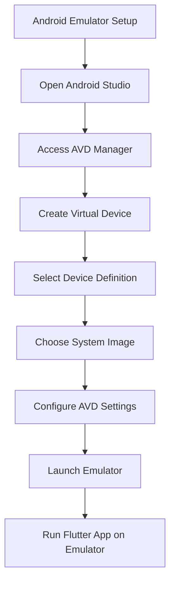

## 2.3.1 Android Emulator Setup

Setting up an Android emulator is a crucial step in developing Flutter applications, as it allows you to test your apps in a controlled environment that mimics real devices. This section will guide you through the process of setting up an Android emulator using Android Studio, running Flutter apps on the emulator, and understanding the underlying concepts to enhance your development workflow.

### Using Android Studio's Emulator

Android Studio provides a robust and feature-rich emulator that is widely used by developers for testing Android applications. The emulator simulates a variety of Android devices, enabling you to test your app on different screen sizes and Android versions without needing physical devices.

#### Launch Android Studio

To begin, ensure that Android Studio is installed on your system. If you haven't installed it yet, refer to the earlier section on setting up your development environment.

- **Open Android Studio:** Start by launching Android Studio from your applications menu or desktop shortcut. Android Studio is the official integrated development environment (IDE) for Android app development, and it includes tools for building, testing, and debugging apps.

#### Access AVD Manager

The Android Virtual Device (AVD) Manager is a tool within Android Studio that allows you to create and manage Android virtual devices.

- **Access AVD Manager:**
  - Click on the **AVD Manager** icon in the toolbar. This icon typically looks like a smartphone.
  - Alternatively, navigate to **Tools > AVD Manager** from the top menu bar.

#### Create a New Virtual Device

Creating a virtual device involves selecting a device definition and configuring its settings to match the specifications you want to test.

1. **Click Create Virtual Device:** In the AVD Manager, click the **Create Virtual Device** button. This will open a dialog where you can choose a device definition.
2. **Select a Device Definition:** Choose a device definition from the list. For example, you might select "Pixel 4" to simulate a Google Pixel 4 device. Click **Next** to proceed.

#### Choose a System Image

The system image determines the version of Android that your virtual device will run.

1. **Select a System Image:** Choose a system image that matches the target Android version you want to test. You can see a list of available system images, including their API levels and target Android versions.
2. **Download the Desired System Image:** If the desired system image is not already downloaded, click **Download** next to the image. This will download the necessary files from the Android repository.
3. **Click Next:** After selecting and downloading the system image, click **Next** to continue.

#### Configure AVD Settings

Configuring the AVD settings allows you to customize the virtual device's properties, such as its name, orientation, and hardware profile.

- **Name Your Emulator:** Give your emulator a descriptive name that reflects its configuration, such as "Pixel_4_API_30".
- **Adjust Additional Settings:** You can modify settings such as the device's orientation (portrait or landscape), RAM allocation, and other hardware features.
- **Click Finish:** Once you've configured the settings, click **Finish** to create the emulator.

#### Launching the Emulator

With your virtual device created, you can now launch it to start testing your apps.

- **Click the Play Button:** In the AVD Manager, find your newly created emulator and click the **Play** button next to it. This will start the emulator, which may take a few moments to boot up.

### Running Flutter Apps on Android Emulator

Once your emulator is running, you can deploy and test your Flutter applications on it.

- **Ensure the Emulator is Running:** Before running your Flutter app, make sure the emulator is up and running. You should see the Android home screen or lock screen on the emulator window.
- **Select the Emulator in Your IDE:** In your IDE (such as Android Studio or Visual Studio Code), select the emulator from the list of available devices. This list is usually found in the toolbar or the run configuration settings.
- **Click Run:** With the emulator selected, click the **Run** button in your IDE to launch your Flutter app on the emulator. The app will be built and deployed to the emulator, allowing you to interact with it as if it were running on a real device.

### Visualizing the Process with Mermaid.js

To better understand the flow of setting up and using an Android emulator, refer to the following Mermaid.js diagram:

### Best Practices and Tips

- **Regularly Update System Images:** Android updates frequently, so keep your system images up to date to test your apps on the latest Android versions.
- **Optimize Emulator Performance:** Emulators can be resource-intensive. Allocate sufficient RAM and CPU resources to the emulator for smoother performance.
- **Use Multiple Emulators:** Test your app on different device configurations and screen sizes by creating multiple emulators.
- **Check Emulator Logs:** Use the logcat tool in Android Studio to monitor logs and debug issues while running your app on the emulator.

### Common Pitfalls and Troubleshooting

- **Slow Emulator Performance:** If the emulator is slow, try enabling hardware acceleration in your system BIOS/UEFI settings and ensure that virtualization is enabled.
- **Emulator Not Starting:** Check for any error messages in the AVD Manager and ensure that your system meets the minimum requirements for running the emulator.
- **App Not Deploying:** Verify that the emulator is selected as the target device in your IDE and that it is running before deploying your app.

### Additional Resources

- **Official Android Emulator Documentation:** [Android Emulator Documentation](https://developer.android.com/studio/run/emulator)
- **Flutter Documentation on Emulators:** [Flutter Emulators](https://flutter.dev/docs/get-started/install/macos#android-setup)
- **Online Courses:** Consider taking courses on platforms like Udemy or Coursera for in-depth tutorials on Android development.

By following these steps and best practices, you'll be well-equipped to set up and use Android emulators for testing your Flutter applications. Emulators are an invaluable tool in the development process, allowing you to ensure your apps function correctly across a wide range of devices and configurations.

## Quiz Time!



### What is the primary purpose of using an Android emulator in Flutter development?

- [x] To test apps in a controlled environment without physical devices
- [ ] To compile Flutter code into native Android code
- [ ] To automatically generate UI components for Android apps
- [ ] To deploy apps directly to the Google Play Store

> **Explanation:** Android emulators allow developers to test their apps in a simulated environment that mimics real devices, which is essential for ensuring compatibility and functionality across different configurations.

### How do you access the AVD Manager in Android Studio?

- [x] Click on the AVD Manager icon in the toolbar or navigate to Tools > AVD Manager
- [ ] Open the File menu and select AVD Manager
- [ ] Use the shortcut Ctrl + AVD
- [ ] Navigate to View > Tool Windows > AVD Manager

> **Explanation:** The AVD Manager can be accessed by clicking its icon in the toolbar or through the Tools menu, making it easy to create and manage virtual devices.

### What should you do if the desired system image is not available in the AVD Manager?

- [x] Click Download next to the system image to download it
- [ ] Restart Android Studio to refresh the list
- [ ] Use a different IDE to access more system images
- [ ] Manually install the system image from the Android website

> **Explanation:** If a system image is not available, you can download it directly from the AVD Manager, which provides access to a wide range of Android versions.

### What is the purpose of configuring AVD settings when creating a new virtual device?

- [x] To customize the virtual device's properties, such as name, orientation, and hardware features
- [ ] To install additional software on the virtual device
- [ ] To connect the virtual device to a physical Android device
- [ ] To set up network configurations for the virtual device

> **Explanation:** Configuring AVD settings allows you to tailor the virtual device to your testing needs, ensuring it accurately simulates the target device's characteristics.

### Which of the following is a common issue that can affect emulator performance?

- [x] Insufficient RAM and CPU resources allocated to the emulator
- [ ] Incorrect app permissions set in the emulator
- [ ] Outdated Flutter SDK version
- [ ] Using a physical device instead of an emulator

> **Explanation:** Emulators can be resource-intensive, and allocating insufficient RAM and CPU resources can lead to slow performance. Ensuring adequate resources are allocated is crucial for smooth operation.

### How can you improve the performance of an Android emulator?

- [x] Enable hardware acceleration in the system BIOS/UEFI settings
- [ ] Use a lower-resolution system image
- [ ] Disable all network connections on the emulator
- [ ] Run multiple emulators simultaneously

> **Explanation:** Enabling hardware acceleration can significantly improve emulator performance by allowing it to utilize the host machine's hardware capabilities more effectively.

### What is the role of the logcat tool in Android Studio?

- [x] To monitor logs and debug issues while running an app on the emulator
- [ ] To compile Flutter code into native Android code
- [ ] To manage virtual devices and system images
- [ ] To deploy apps directly to the Google Play Store

> **Explanation:** The logcat tool provides real-time logging of system messages, which is invaluable for debugging and monitoring app behavior during development.

### What should you do if your app is not deploying to the emulator?

- [x] Verify that the emulator is selected as the target device in your IDE and that it is running
- [ ] Restart your computer and try again
- [ ] Reinstall the Flutter SDK
- [ ] Delete and recreate the virtual device

> **Explanation:** Ensuring that the emulator is selected and running in your IDE is a crucial step in deploying apps. If the app is not deploying, this is often the first thing to check.

### Why is it important to regularly update system images in the AVD Manager?

- [x] To test apps on the latest Android versions and ensure compatibility
- [ ] To reduce the size of the emulator files
- [ ] To improve the graphical performance of the emulator
- [ ] To automatically update the Flutter SDK

> **Explanation:** Regularly updating system images ensures that you can test your apps on the latest Android versions, which is essential for maintaining compatibility and taking advantage of new features.

### True or False: You can only run one Android emulator at a time on your development machine.

- [ ] True
- [x] False

> **Explanation:** You can run multiple Android emulators simultaneously on your development machine, allowing you to test your app on different configurations and screen sizes at the same time.


