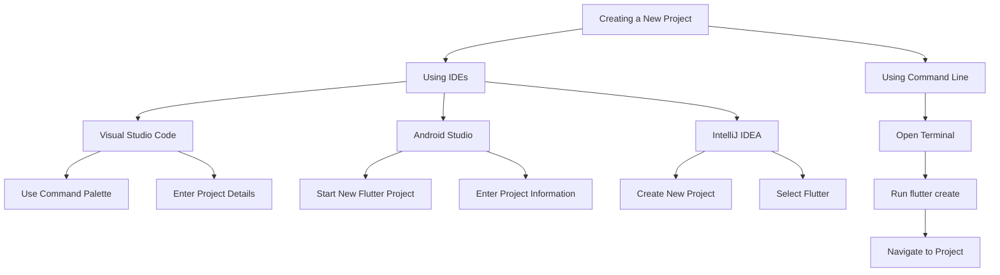

## 2.4.1 Creating a New Flutter Project

Creating a new Flutter project is the first step in bringing your app ideas to life. Whether you're using an Integrated Development Environment (IDE) like Visual Studio Code, Android Studio, or IntelliJ IDEA, or prefer the command line, this guide will walk you through the process with detailed instructions and practical insights. By the end of this section, you'll be equipped to start your Flutter journey with confidence.

### Using IDEs

Integrated Development Environments (IDEs) provide a rich set of tools and features that streamline the development process. Let's explore how to create a new Flutter project using some of the most popular IDEs.

#### Visual Studio Code

Visual Studio Code (VS Code) is a lightweight yet powerful code editor that is widely used for Flutter development. Here's how to create a new Flutter project using VS Code:

1. **Open VS Code:**
   - Launch Visual Studio Code on your computer.

2. **Open the Command Palette:**
   - Press `Ctrl + Shift + P` (Windows/Linux) or `Cmd + Shift + P` (macOS) to open the Command Palette. This is a powerful feature in VS Code that allows you to access various commands and functionalities quickly.

3. **Create a New Flutter Project:**
   - Type `Flutter: New Project` in the Command Palette and select it from the list of options. This command initializes the process of creating a new Flutter project.

4. **Choose a Project Name and Location:**
   - Enter a name for your project. Make sure the name is descriptive and follows Dart's naming conventions (e.g., lowercase_with_underscores).
   - Select the location on your file system where you want to save the project.

5. **Wait for Flutter to Create the Project Structure:**
   - VS Code will generate the necessary files and folders for your new Flutter project. This includes the main Dart file, pubspec.yaml, and other essential components.

**Practical Tip:** Ensure that the Flutter and Dart extensions are installed in VS Code for a seamless development experience. These extensions provide syntax highlighting, code completion, and debugging capabilities.

#### Android Studio

Android Studio is a robust IDE designed for Android development, but it also supports Flutter. Here's how to create a new Flutter project in Android Studio:

1. **Open Android Studio:**
   - Launch Android Studio on your computer.

2. **Start a New Flutter Project:**
   - Click on **Start a new Flutter project** from the welcome screen. If you're already working on a project, you can find this option under the **File** menu.

3. **Select Flutter Application:**
   - Choose **Flutter Application** as the project type and click **Next**. This option sets up a new Flutter app with the necessary configurations.

4. **Enter Project Details:**
   - Provide details such as the project name, description, and location. You can also specify the Flutter SDK path if it's not already configured.

5. **Finish and Generate the Project:**
   - Click **Finish** to create the project. Android Studio will generate the project structure and open it in the IDE.

**Practical Tip:** Android Studio offers a rich set of tools for debugging and profiling your Flutter apps. Make use of the built-in emulator to test your app on different Android devices.

#### IntelliJ IDEA

IntelliJ IDEA is another popular IDE that supports Flutter development. Here's how to create a new Flutter project using IntelliJ IDEA:

1. **Open IntelliJ IDEA:**
   - Launch IntelliJ IDEA on your computer.

2. **Create a New Project:**
   - Click **Create New Project** from the welcome screen.

3. **Select Flutter:**
   - Choose **Flutter** from the list of project types and click **Next**.

4. **Enter Project Details:**
   - Fill in the project name, location, and other necessary details. Ensure that the Flutter SDK path is correctly set.

5. **Finish the Setup:**
   - Click **Finish** to generate the project. IntelliJ IDEA will set up the project structure and open it for you to start coding.

**Practical Tip:** IntelliJ IDEA provides advanced code refactoring and navigation features that can enhance your productivity. Explore these features to streamline your development workflow.

### Using Command Line

For developers who prefer a more hands-on approach, the command line offers a quick and efficient way to create a new Flutter project. Here's how to do it:

1. **Open Your Terminal or Command Prompt:**
   - Launch the terminal (macOS/Linux) or command prompt (Windows) on your computer.

2. **Navigate to Your Desired Projects Directory:**
   - Use the `cd` command to navigate to the directory where you want to create your new Flutter project. For example:
     ```bash
     cd path/to/your/projects/directory
     ```

3. **Run the Flutter Create Command:**
   - Execute the following command to create a new Flutter project:
     ```bash
     flutter create my_first_app
     ```
   - Replace `my_first_app` with your desired project name.

4. **Navigate into the Project Directory:**
   - Once the project is created, navigate into the project directory using:
     ```bash
     cd my_first_app
     ```

**Practical Tip:** The `flutter create` command generates a basic Flutter app with a counter example. This is a great starting point for exploring Flutter's capabilities.

### Visualizing the Workflow with Mermaid.js Diagram

To better understand the process of creating a new Flutter project, let's visualize the workflow using a Mermaid.js diagram:



### Best Practices and Common Pitfalls

- **Consistent Naming Conventions:** Use consistent and descriptive naming conventions for your projects and files. This improves readability and maintainability.
- **Version Control:** Initialize a Git repository for your project to track changes and collaborate with others. Use platforms like GitHub or GitLab for remote repositories.
- **Regular Backups:** Regularly back up your project files to prevent data loss. Consider using cloud storage solutions for additional security.
- **Stay Updated:** Keep your Flutter SDK and IDE plugins updated to access the latest features and improvements.

### Conclusion

Creating a new Flutter project is a straightforward process, whether you prefer using an IDE or the command line. By following the steps outlined in this guide, you can set up your development environment and start building Flutter apps with confidence. Remember to explore the features and tools provided by your chosen IDE to enhance your productivity and streamline your workflow.

For further exploration, consider diving into the official Flutter documentation and community resources. These platforms offer a wealth of information and support to help you on your Flutter journey.

## Quiz Time!



### What is the first step in creating a new Flutter project using Visual Studio Code?

- [x] Open Visual Studio Code
- [ ] Open the terminal
- [ ] Install Flutter SDK
- [ ] Create a new file

> **Explanation:** The first step is to open Visual Studio Code, as it is the IDE where you will initiate the project creation process.

### Which command is used to create a new Flutter project via the command line?

- [ ] flutter init
- [x] flutter create
- [ ] flutter new
- [ ] flutter start

> **Explanation:** The `flutter create` command is used to generate a new Flutter project from the command line.

### In Android Studio, what is the option you select to start a new Flutter project?

- [ ] New File
- [ ] Open Project
- [x] Start a new Flutter project
- [ ] Import Project

> **Explanation:** You select "Start a new Flutter project" from the welcome screen or the File menu to create a new Flutter application in Android Studio.

### What is the purpose of the Command Palette in Visual Studio Code?

- [x] To access various commands and functionalities quickly
- [ ] To write code
- [ ] To compile the project
- [ ] To run tests

> **Explanation:** The Command Palette in Visual Studio Code allows you to quickly access and execute various commands and functionalities.

### Which IDE requires you to specify the Flutter SDK path during project creation?

- [ ] Visual Studio Code
- [x] Android Studio
- [ ] Sublime Text
- [ ] Atom

> **Explanation:** Android Studio requires you to specify the Flutter SDK path if it's not already configured during project creation.

### What is a practical tip for using IntelliJ IDEA for Flutter development?

- [x] Explore advanced code refactoring and navigation features
- [ ] Use it only for Java development
- [ ] Avoid using plugins
- [ ] Disable syntax highlighting

> **Explanation:** IntelliJ IDEA provides advanced code refactoring and navigation features that can enhance your productivity in Flutter development.

### What is the default example provided by the `flutter create` command?

- [ ] A weather app
- [x] A counter app
- [ ] A to-do list app
- [ ] A chat app

> **Explanation:** The `flutter create` command generates a basic Flutter app with a counter example, which is a simple starting point for exploring Flutter's capabilities.

### Which of the following is a best practice when creating a new Flutter project?

- [x] Use consistent naming conventions
- [ ] Avoid using version control
- [ ] Never update the Flutter SDK
- [ ] Ignore IDE warnings

> **Explanation:** Using consistent naming conventions improves readability and maintainability, making it a best practice when creating a new Flutter project.

### What is the benefit of using version control for your Flutter project?

- [x] Track changes and collaborate with others
- [ ] Increase app performance
- [ ] Reduce app size
- [ ] Automatically fix bugs

> **Explanation:** Version control allows you to track changes, collaborate with others, and manage different versions of your project efficiently.

### True or False: The `flutter create` command can only be used on macOS.

- [ ] True
- [x] False

> **Explanation:** The `flutter create` command can be used on any operating system where Flutter is installed, including Windows, macOS, and Linux.


