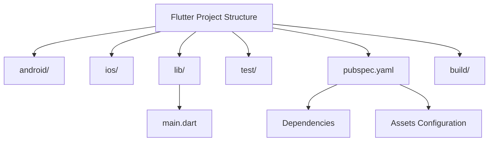

## 2.4.2 Understanding Flutter Project Structure

When embarking on a journey with Flutter, understanding the project structure is crucial. This knowledge not only helps in navigating the project efficiently but also in managing and scaling your application effectively. In this section, we will delve into the anatomy of a Flutter project, exploring each directory and file, and understanding their roles in the development process.

### Overview of Flutter Project Directory

A typical Flutter project is organized into several directories and files, each serving a specific purpose. Here's a breakdown of the main components:

- **`android/`:** This directory contains all the Android-specific configuration and code. It includes files necessary for building and running your Flutter app on Android devices. You'll find Gradle build scripts, AndroidManifest.xml, and other resources here.

- **`ios/`:** Similar to the `android/` directory, this contains iOS-specific configuration and code. It includes Xcode project files, Info.plist, and other resources required for iOS deployment.

- **`lib/`:** This is where the core of your Flutter app resides. It holds all the Dart source code, including the main entry point of your application.

  - **`main.dart`:** The entry point of your Flutter application. This file contains the `main()` function, which is the starting point of execution. It also defines the root widget of your app.

- **`test/`:** This directory is dedicated to unit and widget tests. Writing tests is a best practice in software development, and Flutter provides robust support for testing.

- **`pubspec.yaml`:** A crucial file that manages your project's dependencies, assets, and metadata. It defines the packages your app depends on and other configurations.

- **`build/`:** This directory contains generated files for builds. It's typically not included in version control as it is recreated during the build process.

### Key Files and Their Purposes

Understanding the purpose of key files in a Flutter project is essential for effective development. Let's explore some of these files in detail:

#### `main.dart`

The `main.dart` file is the heart of your Flutter application. It contains the `main()` function, which is the entry point for execution. Here's a simple example of what this file might look like:

```dart
import 'package:flutter/material.dart';

void main() {
  runApp(MyApp());
}

class MyApp extends StatelessWidget {
  @override
  Widget build(BuildContext context) {
    return MaterialApp(
      title: 'My First App',
      theme: ThemeData(
        primarySwatch: Colors.blue,
      ),
      home: MyHomePage(),
    );
  }
}

class MyHomePage extends StatelessWidget {
  @override
  Widget build(BuildContext context) {
    return Scaffold(
      appBar: AppBar(
        title: Text('Home Page'),
      ),
      body: Center(
        child: Text('Welcome to My First App!'),
      ),
    );
  }
}
```

- **`main()` Function:** This function is the starting point of the application. It calls `runApp()`, which inflates the given widget and attaches it to the screen.

- **Root Widget:** The `MyApp` class is defined as the root widget. It uses `MaterialApp`, which is a convenience widget that wraps several widgets commonly required for material design applications.

#### `pubspec.yaml`

The `pubspec.yaml` file is a configuration file that defines the dependencies and metadata for your Flutter project. Here's an example snippet:

```yaml
name: my_first_app
description: A new Flutter project.
version: 1.0.0+1

environment:
  sdk: ">=2.12.0 <3.0.0"

dependencies:
  flutter:
    sdk: flutter
  cupertino_icons: ^1.0.2

dev_dependencies:
  flutter_test:
    sdk: flutter

flutter:
  uses-material-design: true
```

- **Dependencies:** Lists the packages your app depends on. In this example, `cupertino_icons` is included as a dependency.

- **Dev Dependencies:** Lists packages needed for development and testing, such as `flutter_test`.

- **Environment:** Specifies the Dart SDK version required for the project.

- **Assets and Configurations:** You can also define assets and other configurations in this file.

#### `README.md`

The `README.md` file provides an overview and instructions for the project. It's a markdown file that typically includes information about the project, how to set it up, and how to contribute. It's a good practice to keep this file updated as it serves as the first point of reference for anyone looking at your project.

### Visualizing the Project Structure

To better understand the relationships between these directories and files, let's visualize the Flutter project structure using a Mermaid.js diagram:



This diagram illustrates the hierarchical structure of a Flutter project, highlighting the key directories and files.

### Practical Examples and Real-World Scenarios

Understanding the project structure is not just about knowing where files are located; it's about understanding how they interact and contribute to the development process. Here are some practical examples and scenarios:

- **Adding a New Dependency:** When you want to add a new package to your project, you modify the `pubspec.yaml` file. For instance, if you want to use the `http` package for making network requests, you would add it under dependencies and run `flutter pub get` to install it.

- **Platform-Specific Code:** If you need to write platform-specific code, such as accessing native APIs, you'll work within the `android/` and `ios/` directories. Flutter provides platform channels to facilitate communication between Dart and native code.

- **Testing Your App:** Writing tests is crucial for maintaining code quality. The `test/` directory is where you write unit and widget tests. Flutter's testing framework allows you to simulate user interactions and verify the behavior of your app.

### Best Practices and Common Pitfalls

- **Keep `pubspec.yaml` Organized:** As your project grows, the `pubspec.yaml` file can become cluttered. Organize dependencies and comments to keep it readable.

- **Version Control:** Exclude the `build/` directory from version control. It's generated during the build process and doesn't need to be tracked.

- **Consistent Naming Conventions:** Use consistent naming conventions for files and classes. This improves readability and maintainability.

- **Documentation:** Keep your `README.md` file updated. It serves as a guide for others (and yourself) when revisiting the project.

### References and Further Reading

- [Flutter Documentation](https://flutter.dev/docs): The official Flutter documentation is an excellent resource for learning more about Flutter's project structure and capabilities.
- [Dart Language Tour](https://dart.dev/guides/language/language-tour): A comprehensive guide to the Dart programming language, which is used in Flutter development.
- [Effective Dart](https://dart.dev/guides/language/effective-dart): Best practices for writing Dart code.

By understanding the Flutter project structure, you lay a solid foundation for efficient and effective app development. This knowledge empowers you to navigate your project with confidence, manage dependencies, and write clean, maintainable code.

## Quiz Time!



### What is the purpose of the `lib/` directory in a Flutter project?

- [x] It holds the Dart source code for the Flutter app.
- [ ] It contains Android-specific configuration and code.
- [ ] It contains iOS-specific configuration and code.
- [ ] It contains unit and widget tests.

> **Explanation:** The `lib/` directory is where the core Dart source code for the Flutter application resides, including the main entry point.

### Which file in a Flutter project is responsible for managing dependencies?

- [ ] main.dart
- [x] pubspec.yaml
- [ ] README.md
- [ ] build/

> **Explanation:** The `pubspec.yaml` file manages the project's dependencies, assets, and metadata.

### What is the entry point of a Flutter application?

- [x] The `main()` function in `main.dart`.
- [ ] The `pubspec.yaml` file.
- [ ] The `README.md` file.
- [ ] The `android/` directory.

> **Explanation:** The `main()` function in `main.dart` is the entry point of a Flutter application, where execution begins.

### What should be excluded from version control in a Flutter project?

- [ ] lib/
- [ ] pubspec.yaml
- [x] build/
- [ ] test/

> **Explanation:** The `build/` directory contains generated files for builds and should be excluded from version control.

### Which directory contains platform-specific code for iOS?

- [ ] android/
- [x] ios/
- [ ] lib/
- [ ] test/

> **Explanation:** The `ios/` directory contains iOS-specific configuration and code.

### What is the purpose of the `test/` directory?

- [ ] To hold the Dart source code for the app.
- [ ] To manage dependencies and project metadata.
- [x] To contain unit and widget tests.
- [ ] To provide an overview and instructions for the project.

> **Explanation:** The `test/` directory is dedicated to unit and widget tests, ensuring code quality and functionality.

### What does the `pubspec.yaml` file specify about the Dart SDK?

- [x] The version of the Dart SDK required for the project.
- [ ] The main entry point of the application.
- [ ] The platform-specific code for Android.
- [ ] The platform-specific code for iOS.

> **Explanation:** The `pubspec.yaml` file specifies the Dart SDK version required for the project under the `environment` section.

### Which file typically provides an overview and instructions for a Flutter project?

- [ ] main.dart
- [ ] pubspec.yaml
- [x] README.md
- [ ] build/

> **Explanation:** The `README.md` file provides an overview and instructions for the project, serving as a guide for developers.

### What is the role of the `android/` directory in a Flutter project?

- [x] It contains Android-specific configuration and code.
- [ ] It holds the Dart source code for the Flutter app.
- [ ] It contains iOS-specific configuration and code.
- [ ] It contains unit and widget tests.

> **Explanation:** The `android/` directory contains Android-specific configuration and code necessary for building and running the app on Android devices.

### True or False: The `main.dart` file is located in the `test/` directory.

- [ ] True
- [x] False

> **Explanation:** The `main.dart` file is located in the `lib/` directory, not the `test/` directory.


