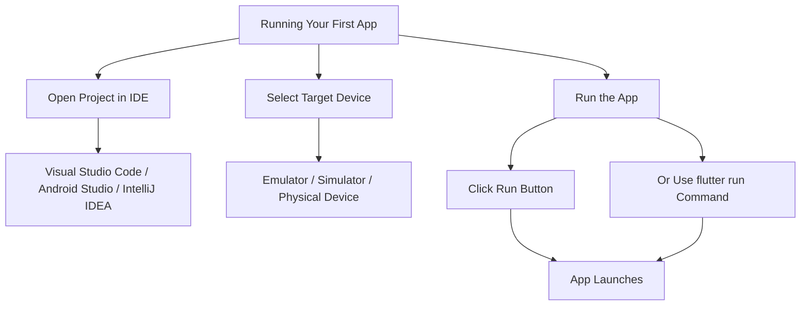

## 2.4.3 Running Your First Flutter App

Running your first Flutter app is an exciting milestone in your journey as a mobile app developer. This section will guide you through the process of opening your Flutter project in various Integrated Development Environments (IDEs), selecting a target device, and running the app. Additionally, we'll explore the default Flutter app's structure and key widgets, providing a solid foundation for your future projects.

### Open the Project in Your IDE

Before you can run your Flutter app, you need to open your project in an IDE. Flutter supports several popular IDEs, including Visual Studio Code, Android Studio, and IntelliJ IDEA. Each IDE offers unique features and workflows, but the process of opening a project is straightforward across all platforms.

#### Visual Studio Code

Visual Studio Code is a lightweight, versatile code editor with robust Flutter support through extensions. To open your Flutter project in Visual Studio Code:

- **Step 1:** Launch Visual Studio Code.
- **Step 2:** Navigate to the menu bar and select **File > Open Folder**.
- **Step 3:** In the dialog that appears, locate your Flutter project directory and select it.
- **Step 4:** Click **Open** to load the project into the editor.

#### Android Studio

Android Studio is a comprehensive IDE tailored for Android development, but it also supports Flutter with the Flutter plugin. To open your Flutter project in Android Studio:

- **Step 1:** Open Android Studio.
- **Step 2:** Click on **File > Open** from the menu bar.
- **Step 3:** Browse to your Flutter project directory and select it.
- **Step 4:** Click **OK** to open the project.

#### IntelliJ IDEA

IntelliJ IDEA is a powerful IDE that supports Flutter development through plugins. To open your Flutter project in IntelliJ IDEA:

- **Step 1:** Start IntelliJ IDEA.
- **Step 2:** Choose **File > Open** from the menu.
- **Step 3:** Navigate to your Flutter project directory and select it.
- **Step 4:** Click **Open** to load the project.

### Select a Target Device

Once your project is open in your chosen IDE, the next step is to select a target device on which to run your app. Flutter allows you to run your app on emulators, simulators, or physical devices.

- **Emulator/Simulator:** These are virtual devices that mimic the behavior of real devices. They are useful for testing your app without needing physical hardware.
- **Physical Device:** Running your app on a physical device provides a more accurate representation of how your app will perform in real-world scenarios.

#### Selecting a Device in Your IDE

- **Visual Studio Code:** Use the device selector in the bottom-right corner of the window to choose your target device.
- **Android Studio:** Use the device dropdown in the toolbar to select an emulator or connected device.
- **IntelliJ IDEA:** Similar to Android Studio, use the device dropdown in the toolbar.

### Run the App

With your project open and a target device selected, you're ready to run your app. You can do this through your IDE or the command line.

#### Using the IDE

Most IDEs provide a straightforward way to run your app with a single click:

- **Step 1:** Locate the **Run** button in the toolbar (usually represented by a green arrow).
- **Step 2:** Click the **Run** button to start the app on the selected device.

#### Using the Command Line

Running your app from the command line is a powerful alternative, especially if you prefer working in a terminal:

- **Step 1:** Open a terminal window.
- **Step 2:** Navigate to your Flutter project directory using the `cd` command.
- **Step 3:** Execute the following command to run your app:
  ```bash
  flutter run
  ```

### Understanding the Default App

When you create a new Flutter project, it comes with a default app that serves as a simple example of Flutter's capabilities. This app displays a counter that increments each time you press the Floating Action Button (FAB).

#### Key Widgets in the Default App

The default Flutter app is built using several fundamental widgets:

- **`MaterialApp`:** This widget is the root of your app and provides Material Design styling. It manages app-wide settings like themes and routes.
  
- **`Scaffold`:** This widget provides a basic structure for your app, including an AppBar, a body, and a FloatingActionButton. It's essential for creating a consistent layout.

- **`Center`:** This widget centers its child widget within the available space, making it useful for simple layouts.

- **`Column`:** This widget arranges its children vertically. In the default app, it's used to stack the text and button widgets.

Here's a simplified version of the default app's code:

```dart
import 'package:flutter/material.dart';

void main() => runApp(MyApp());

class MyApp extends StatelessWidget {
  @override
  Widget build(BuildContext context) {
    return MaterialApp(
      title: 'Flutter Demo',
      theme: ThemeData(
        primarySwatch: Colors.blue,
      ),
      home: MyHomePage(title: 'Flutter Demo Home Page'),
    );
  }
}

class MyHomePage extends StatefulWidget {
  MyHomePage({Key? key, required this.title}) : super(key: key);

  final String title;

  @override
  _MyHomePageState createState() => _MyHomePageState();
}

class _MyHomePageState extends State<MyHomePage> {
  int _counter = 0;

  void _incrementCounter() {
    setState(() {
      _counter++;
    });
  }

  @override
  Widget build(BuildContext context) {
    return Scaffold(
      appBar: AppBar(
        title: Text(widget.title),
      ),
      body: Center(
        child: Column(
          mainAxisAlignment: MainAxisAlignment.center,
          children: <Widget>[
            Text(
              'You have pushed the button this many times:',
            ),
            Text(
              '$_counter',
              style: Theme.of(context).textTheme.headline4,
            ),
          ],
        ),
      ),
      floatingActionButton: FloatingActionButton(
        onPressed: _incrementCounter,
        tooltip: 'Increment',
        child: Icon(Icons.add),
      ),
    );
  }
}
```

### Mermaid.js Diagram

To visualize the process of running your first app, consider the following diagram:



### Best Practices and Common Pitfalls

- **Ensure Device Compatibility:** Before running your app, make sure your target device meets the necessary requirements. For emulators, ensure they are properly configured and running the correct API level.
  
- **Check for Errors:** If your app doesn't run as expected, check the console output for error messages. Common issues include missing dependencies or incorrect configurations.

- **Use Hot Reload:** Flutter's hot reload feature allows you to see changes in real-time without restarting the app. Use this feature to speed up your development process.

- **Explore the Default App:** Take time to understand the default app's structure and widgets. Experiment with modifying the code to see how changes affect the app's behavior.

### Further Exploration

- **Official Flutter Documentation:** [Flutter.dev](https://flutter.dev/docs) provides comprehensive guides and API documentation.
- **Flutter Community:** Join forums and groups like [Flutter Community](https://fluttercommunity.dev/) to connect with other developers.
- **Online Courses:** Platforms like Udemy and Coursera offer courses on Flutter development.

By following these steps and understanding the default app, you'll be well-equipped to start building your own Flutter applications. Embrace the learning process, experiment with the code, and explore the vast possibilities Flutter offers.

## Quiz Time!



### What is the first step to run your Flutter app in Visual Studio Code?

- [x] Open the project folder using **File > Open Folder**.
- [ ] Click the **Run** button in the toolbar.
- [ ] Select a target device.
- [ ] Use the command line to run the app.

> **Explanation:** The first step is to open your Flutter project in Visual Studio Code using **File > Open Folder**.

### Which widget provides a basic layout structure in the default Flutter app?

- [ ] `MaterialApp`
- [x] `Scaffold`
- [ ] `Center`
- [ ] `Column`

> **Explanation:** The `Scaffold` widget provides a basic layout structure, including an AppBar and a FloatingActionButton.

### How can you run your Flutter app using the command line?

- [ ] Use the `flutter start` command.
- [x] Use the `flutter run` command.
- [ ] Use the `flutter execute` command.
- [ ] Use the `flutter launch` command.

> **Explanation:** You can run your Flutter app using the command line by executing the `flutter run` command.

### What is the purpose of the `FloatingActionButton` in the default app?

- [x] To increment the counter displayed on the screen.
- [ ] To navigate to a new screen.
- [ ] To reset the counter.
- [ ] To close the app.

> **Explanation:** The `FloatingActionButton` in the default app is used to increment the counter displayed on the screen.

### Which IDEs are mentioned for running a Flutter app?

- [x] Visual Studio Code
- [x] Android Studio
- [x] IntelliJ IDEA
- [ ] Eclipse

> **Explanation:** The IDEs mentioned for running a Flutter app are Visual Studio Code, Android Studio, and IntelliJ IDEA.

### What is the role of the `MaterialApp` widget?

- [ ] To provide a basic layout structure.
- [x] To wrap the app and provide Material Design styling.
- [ ] To center child widgets.
- [ ] To arrange child widgets vertically.

> **Explanation:** The `MaterialApp` widget wraps the app and provides Material Design styling.

### What should you do if your app doesn't run as expected?

- [x] Check the console output for error messages.
- [ ] Restart your computer.
- [ ] Uninstall and reinstall Flutter.
- [ ] Ignore the issue and continue.

> **Explanation:** If your app doesn't run as expected, check the console output for error messages to diagnose the issue.

### What feature allows you to see changes in real-time without restarting the app?

- [ ] Hot Restart
- [x] Hot Reload
- [ ] Cold Start
- [ ] Live Update

> **Explanation:** Flutter's hot reload feature allows you to see changes in real-time without restarting the app.

### True or False: You can only run a Flutter app on a physical device.

- [ ] True
- [x] False

> **Explanation:** You can run a Flutter app on emulators, simulators, or physical devices.

### What is the primary function of the `Column` widget in the default app?

- [x] To arrange child widgets vertically.
- [ ] To provide Material Design styling.
- [ ] To center child widgets.
- [ ] To increment the counter.

> **Explanation:** The `Column` widget is used to arrange child widgets vertically in the default app.


