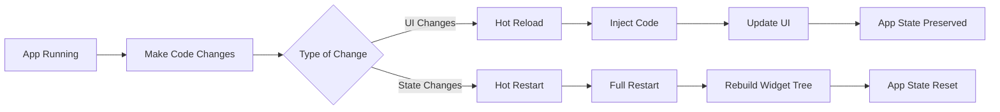

## 2.4.4 Hot Reload and Hot Restart

In the fast-paced world of mobile app development, efficiency and speed are crucial. Flutter, a popular UI toolkit for building natively compiled applications for mobile, web, and desktop from a single codebase, offers two powerful features to enhance the development process: **Hot Reload** and **Hot Restart**. These features significantly reduce the time developers spend waiting for changes to take effect, allowing for rapid iteration and experimentation. In this section, we will delve into the intricacies of Hot Reload and Hot Restart, exploring their definitions, benefits, usage, differences, and common use-cases. We will also provide practical examples and a visual representation using Mermaid.js diagrams to solidify your understanding.

### Understanding Hot Reload

#### Definition

Hot Reload is a feature in Flutter that allows developers to inject updated source code files into the running Dart Virtual Machine (VM). This process updates the UI of the application without requiring a full restart, preserving the current state of the app. This means that changes can be seen almost instantaneously, making it an invaluable tool for UI development and debugging.

#### Benefits

- **Speed:** Hot Reload significantly reduces the time between making a change and seeing the result, allowing for rapid iteration.
- **State Preservation:** Since the app state is preserved, developers can continue from where they left off without losing progress, which is particularly useful for debugging.
- **Efficiency:** By avoiding a full restart, developers can focus on refining UI elements and layouts without the overhead of reinitializing the entire app.

#### Usage

- **In IDEs:** Most IDEs, such as Visual Studio Code and Android Studio, provide a Hot Reload button, often represented by a lightning bolt icon. Clicking this button applies the changes.
- **Command Line:** When running the app via the command line using `flutter run`, pressing `r` triggers a Hot Reload.

#### Practical Example

Consider a scenario where you are working on a Flutter app and need to adjust the padding of a button. With Hot Reload, you can make the change in your code and see the effect immediately without restarting the app.

```dart
// Original button with padding
Padding(
  padding: const EdgeInsets.all(8.0),
  child: ElevatedButton(
    onPressed: () {},
    child: Text('Click Me'),
  ),
)

// Updated button with increased padding
Padding(
  padding: const EdgeInsets.all(16.0), // Change padding
  child: ElevatedButton(
    onPressed: () {},
    child: Text('Click Me'),
  ),
)
```

After making the change, simply click the Hot Reload button in your IDE or press `r` in the terminal to see the updated padding in action.

### Understanding Hot Restart

#### Definition

Hot Restart, on the other hand, fully restarts the application, rebuilding the widget tree from scratch. This process resets the app state, making it useful for changes that affect the app’s initialization logic or global variables.

#### Benefits

- **Comprehensive Reset:** Hot Restart is ideal for testing changes that require a fresh start, such as modifications to the app's entry point or global state.
- **State Reset:** By resetting the app state, developers can ensure that changes are applied consistently across the entire app.

#### Usage

- **In IDEs:** The Hot Restart button, often depicted as a circular arrow, can be used to restart the app.
- **Command Line:** Pressing `R` in the terminal where `flutter run` is active will initiate a Hot Restart.

#### Practical Example

Suppose you have changed the theme of your app, which is set in the `main()` function. A Hot Restart is necessary to apply this change, as it affects the entire app's appearance.

```dart
void main() {
  runApp(
    MaterialApp(
      theme: ThemeData.light(), // Original theme
      home: MyHomePage(),
    ),
  );
}

// Change to dark theme
void main() {
  runApp(
    MaterialApp(
      theme: ThemeData.dark(), // Updated theme
      home: MyHomePage(),
    ),
  );
}
```

After updating the theme, perform a Hot Restart to see the new theme applied throughout the app.

### Differences Between Hot Reload and Hot Restart

Understanding the differences between Hot Reload and Hot Restart is crucial for using them effectively:

- **Hot Reload:**
  - **Preserves App State:** Ideal for UI changes and quick iterations.
  - **Speed:** Changes are applied almost instantly.
  - **Use Cases:** Modifying UI elements, adjusting layouts, changing widget properties.

- **Hot Restart:**
  - **Resets App State:** Necessary for changes in `main()` or global variables.
  - **Comprehensive:** Rebuilds the widget tree from scratch.
  - **Use Cases:** Changing initialization logic, modifying global variables, altering main app configurations.

### Common Use-Cases

- **Hot Reload:**
  - **UI Adjustments:** Quickly tweak UI elements and see the results without losing the current state.
  - **Layout Changes:** Experiment with different layouts and designs.
  - **Widget Property Updates:** Modify properties such as colors, fonts, and sizes.

- **Hot Restart:**
  - **Initialization Logic:** Apply changes to the app's startup logic.
  - **Global State Modifications:** Reset the app to apply changes to global variables.
  - **Configuration Changes:** Update configurations that require a fresh start.

### Visual Representation with Mermaid.js

To better understand the workflow of Hot Reload and Hot Restart, let's visualize the process using a Mermaid.js diagram:



### Best Practices and Common Pitfalls

- **Best Practices:**
  - Use Hot Reload for iterative UI development and debugging.
  - Reserve Hot Restart for changes that require a full app reset.
  - Familiarize yourself with the shortcuts and buttons in your IDE to streamline your workflow.

- **Common Pitfalls:**
  - Overusing Hot Restart for minor changes can slow down development.
  - Forgetting to perform a Hot Restart when necessary can lead to inconsistencies in the app's behavior.

### Conclusion

Hot Reload and Hot Restart are indispensable tools in the Flutter developer's toolkit, offering flexibility and efficiency in the development process. By understanding their differences and applications, you can optimize your workflow, reduce development time, and enhance the quality of your applications. As you continue to explore Flutter, consider how these features can be leveraged to improve your projects and experiment with new ideas.

### Further Reading and Resources

- [Flutter Official Documentation on Hot Reload](https://flutter.dev/docs/development/tools/hot-reload)
- [Dart Language Tour](https://dart.dev/guides/language/language-tour)
- [Flutter Community on GitHub](https://github.com/flutter/flutter)
- [Online Course: Flutter & Dart - The Complete Guide](https://www.udemy.com/course/learn-flutter-dart-to-build-ios-android-apps/)

By mastering Hot Reload and Hot Restart, you are well on your way to becoming a more efficient and effective Flutter developer. Keep experimenting, stay curious, and continue learning to unlock the full potential of Flutter.

## Quiz Time!



### What is the primary benefit of using Hot Reload in Flutter?

- [x] It allows developers to see UI changes instantly without losing the app state.
- [ ] It completely restarts the app and resets the app state.
- [ ] It is used for making changes to the app's initialization logic.
- [ ] It requires a full rebuild of the widget tree.

> **Explanation:** Hot Reload allows developers to inject updated code into the running app, preserving the app state and enabling quick UI iterations.

### How can you trigger a Hot Reload using the command line?

- [x] Press `r` in the terminal where `flutter run` is active.
- [ ] Press `R` in the terminal where `flutter run` is active.
- [ ] Use the `flutter hot-reload` command.
- [ ] Restart the terminal session.

> **Explanation:** Pressing `r` in the terminal where `flutter run` is active triggers a Hot Reload, applying changes without restarting the app.

### Which of the following scenarios is best suited for Hot Restart?

- [x] Changing the app's theme in the `main()` function.
- [ ] Adjusting the padding of a button.
- [ ] Modifying the text color of a label.
- [ ] Updating the layout of a single screen.

> **Explanation:** Hot Restart is necessary for changes that affect the app's initialization logic or global state, such as changing the theme in `main()`.

### What happens to the app state when you perform a Hot Restart?

- [x] The app state is reset, and the widget tree is rebuilt from scratch.
- [ ] The app state is preserved, and only the UI is updated.
- [ ] The app state is partially reset, keeping some data intact.
- [ ] The app state remains unchanged, similar to Hot Reload.

> **Explanation:** Hot Restart resets the app state and rebuilds the widget tree, making it suitable for changes that require a fresh start.

### Which icon typically represents the Hot Reload button in IDEs?

- [x] A lightning bolt icon.
- [ ] A circular arrow icon.
- [ ] A play button icon.
- [ ] A stop button icon.

> **Explanation:** The Hot Reload button is often represented by a lightning bolt icon in IDEs, indicating quick updates to the app.

### What is a common pitfall when using Hot Restart?

- [x] Overusing it for minor changes, which can slow down development.
- [ ] Forgetting to save changes before restarting.
- [ ] Using it for UI changes, which preserves the app state.
- [ ] Applying it to update widget properties.

> **Explanation:** Overusing Hot Restart for minor changes can slow down development, as it involves a full app reset.

### Which of the following is NOT a benefit of Hot Reload?

- [x] It resets the app state for comprehensive testing.
- [ ] It allows for rapid UI iteration.
- [ ] It preserves the app state during updates.
- [ ] It reduces the time between making changes and seeing results.

> **Explanation:** Hot Reload does not reset the app state; it preserves it, allowing for quick UI changes without a full restart.

### In which scenario would you use Hot Reload?

- [x] Modifying the color of a button.
- [ ] Changing the app's entry point.
- [ ] Updating global variables.
- [ ] Altering the app's theme in `main()`.

> **Explanation:** Hot Reload is ideal for UI changes, such as modifying the color of a button, as it preserves the app state.

### What is the effect of pressing `R` in the terminal during `flutter run`?

- [x] It triggers a Hot Restart, resetting the app state.
- [ ] It triggers a Hot Reload, preserving the app state.
- [ ] It stops the app and exits the terminal.
- [ ] It compiles the app for release.

> **Explanation:** Pressing `R` in the terminal during `flutter run` triggers a Hot Restart, which resets the app state and rebuilds the widget tree.

### True or False: Hot Reload is suitable for changes in the app's initialization logic.

- [ ] True
- [x] False

> **Explanation:** Hot Reload is not suitable for changes in the app's initialization logic, as it does not reset the app state. Hot Restart is required for such changes.


