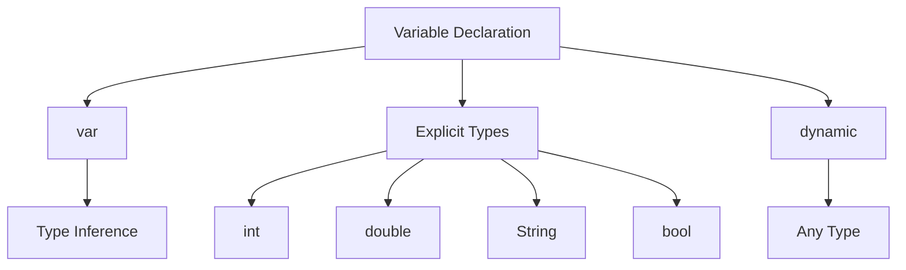

## 3.1.1 Declaring Variables

In the world of programming, variables are fundamental building blocks. They are the containers that hold data values, allowing us to store, retrieve, and manipulate information within our applications. In Dart, the language that powers Flutter, understanding how to declare and use variables effectively is crucial for building robust and efficient applications. This section will guide you through the essentials of variable declaration in Dart, covering type inference, explicit type declaration, and dynamic typing.

### Introduction to Variables

Variables in Dart, as in most programming languages, serve as named storage locations in memory. They allow developers to label data with descriptive names, making code more readable and maintainable. By using variables, you can store data that can be referenced and manipulated throughout your program. This is particularly useful in Flutter applications, where data often needs to be dynamically updated and displayed in the user interface.

Consider variables as labeled boxes where you can store different types of data. Each box has a name (the variable name) and a content type (the data type), which determines what kind of data can be stored in it. Understanding how to declare these variables and specify their types is key to effective Dart programming.

### Using `var`

Dart provides a convenient way to declare variables using the `var` keyword. When you declare a variable with `var`, Dart automatically infers the type of the variable based on the value you assign to it. This feature, known as type inference, simplifies the code and reduces verbosity, allowing you to focus on the logic rather than the syntax.

#### Example of `var`:

```dart
var name = 'Flutter'; // Dart infers this as a String
var year = 2017;      // Dart infers this as an int
```

In the example above, Dart infers that `name` is a `String` because it is initialized with a string value, and `year` is an `int` because it is initialized with an integer value. This flexibility makes `var` a popular choice for variable declaration, especially when the type is obvious from the context.

### Explicit Type Declaration

While `var` is convenient, there are situations where explicitly declaring the type of a variable is beneficial. Explicit type declaration enhances code clarity and ensures type safety, making it easier to understand the intended use of a variable and preventing unintended type assignments.

Dart supports several primary data types, including `int`, `double`, `String`, and `bool`. By explicitly declaring these types, you can make your code more readable and maintainable.

#### Examples of Explicit Type Declaration:

```dart
int age = 10;           // Declares an integer variable
double height = 5.9;    // Declares a double variable
String language = 'Dart'; // Declares a string variable
bool isActive = true;   // Declares a boolean variable
```

In these examples, the type of each variable is explicitly stated, providing clear documentation of what kind of data each variable is intended to hold. This can be particularly useful in larger codebases where understanding the data types at a glance can save time and reduce errors.

### Dynamic Type

Dart also offers a `dynamic` type for variables that can hold values of any type. This is useful when the type of data a variable will hold is not known at compile time or when you need to store different types of data in the same variable over time.

#### Example of `dynamic`:

```dart
dynamic anything = 'Hello'; // Initially a String
anything = 100;             // Now it's an int
```

In the example above, the `anything` variable is declared as `dynamic`, allowing it to hold a `String` initially and later an `int`. While `dynamic` provides flexibility, it should be used judiciously, as it bypasses Dart's type checking, potentially leading to runtime errors if not managed carefully.

### Visualizing Variable Declaration

To better understand the relationships between different types of variable declarations in Dart, consider the following diagram:



This diagram illustrates the three primary ways to declare variables in Dart: using `var` with type inference, explicit type declaration, and the `dynamic` type. Each approach has its use cases and benefits, and understanding when to use each is a key skill in Dart programming.

### Practical Code Examples

Let's explore some practical scenarios where these variable declaration techniques can be applied:

#### Scenario 1: Calculating Area of a Circle

Suppose you need to calculate the area of a circle given its radius. You can use `var` for simplicity:

```dart
var radius = 5.0; // Dart infers this as a double
var area = 3.14159 * radius * radius;
print('The area of the circle is $area');
```

In this example, `radius` is declared with `var`, and Dart infers it as a `double` because of the decimal point. The calculation of the area uses this inferred type seamlessly.

#### Scenario 2: User Profile Information

When dealing with user profile information, explicit types can enhance clarity:

```dart
String username = 'john_doe';
int age = 25;
bool isPremiumUser = false;

print('Username: $username, Age: $age, Premium User: $isPremiumUser');
```

Here, each variable is explicitly typed, making it clear what kind of data is expected and stored.

#### Scenario 3: Flexible Data Handling

In cases where data types might change, `dynamic` can be useful:

```dart
dynamic userData = 'John Doe'; // Initially a String
print('User Data: $userData');

userData = 12345; // Now it's an int
print('User ID: $userData');
```

This flexibility allows `userData` to adapt to different types of information, though it requires careful handling to avoid runtime errors.

### Best Practices and Common Pitfalls

- **Use `var` for simplicity**: When the type is obvious from the context, `var` can make your code cleaner and easier to read.
- **Prefer explicit types for clarity**: In complex applications, explicitly declaring types can prevent errors and improve code maintainability.
- **Be cautious with `dynamic`**: While `dynamic` offers flexibility, it should be used sparingly to avoid losing the benefits of Dart's strong typing system.
- **Consistent naming conventions**: Use meaningful variable names that convey the purpose of the variable, enhancing code readability.

### Conclusion

Understanding how to declare variables effectively in Dart is a foundational skill for any Flutter developer. By mastering the use of `var`, explicit types, and `dynamic`, you can write more robust, readable, and maintainable code. As you continue your journey in Flutter development, these skills will be invaluable in building complex, data-driven applications.

For further exploration, consider reviewing the [Dart Language Tour](https://dart.dev/guides/language/language-tour) for more in-depth information on Dart's type system and variable handling.

## Quiz Time!



### What is the primary purpose of variables in Dart?

- [x] To store data values that can be referenced and manipulated in the program.
- [ ] To execute functions within the program.
- [ ] To define the structure of the program.
- [ ] To handle errors in the program.

> **Explanation:** Variables are used to store data values in Dart, acting as containers for information that can be referenced and manipulated in the program.

### What does the `var` keyword in Dart do?

- [x] It allows Dart to infer the type of the variable based on the assigned value.
- [ ] It explicitly declares the variable as an integer.
- [ ] It makes the variable immutable.
- [ ] It assigns a default value to the variable.

> **Explanation:** The `var` keyword allows Dart to infer the type of the variable based on the value assigned to it, simplifying the code.

### Which of the following is an example of explicit type declaration in Dart?

- [x] `int age = 10;`
- [ ] `var age = 10;`
- [ ] `dynamic age = 10;`
- [ ] `const age = 10;`

> **Explanation:** `int age = 10;` is an example of explicit type declaration, where the type `int` is specified for the variable `age`.

### What is the benefit of using explicit type declaration in Dart?

- [x] It enhances code clarity and ensures type safety.
- [ ] It reduces the size of the code.
- [ ] It allows the variable to change types dynamically.
- [ ] It automatically optimizes the code for performance.

> **Explanation:** Explicit type declaration enhances code clarity and ensures type safety by clearly indicating the intended data type of the variable.

### What is the `dynamic` keyword used for in Dart?

- [x] To declare variables that can hold values of any type.
- [ ] To declare constants that cannot be changed.
- [ ] To declare variables that are only used within a specific function.
- [ ] To declare variables that are automatically garbage collected.

> **Explanation:** The `dynamic` keyword is used to declare variables that can hold values of any type, providing flexibility in data handling.

### Which of the following is a correct use of the `dynamic` keyword?

- [x] `dynamic anything = 'Hello'; anything = 100;`
- [ ] `dynamic anything = 'Hello'; const anything = 100;`
- [ ] `dynamic anything = 'Hello'; var anything = 100;`
- [ ] `dynamic anything = 'Hello'; final anything = 100;`

> **Explanation:** `dynamic anything = 'Hello'; anything = 100;` is correct because `dynamic` allows the variable to change types.

### What is a potential drawback of using `dynamic` in Dart?

- [x] It bypasses Dart's type checking, potentially leading to runtime errors.
- [ ] It makes the code run slower.
- [ ] It prevents the use of certain Dart libraries.
- [ ] It requires more memory than other types.

> **Explanation:** Using `dynamic` bypasses Dart's type checking, which can lead to runtime errors if not managed carefully.

### In which scenario is it most appropriate to use `var`?

- [x] When the type is obvious from the context.
- [ ] When the variable needs to hold multiple types.
- [ ] When the variable should not change its value.
- [ ] When the variable is used only once.

> **Explanation:** `var` is most appropriate when the type is obvious from the context, allowing for cleaner and more readable code.

### What does the following code do? `var year = 2017;`

- [x] Declares a variable `year` and infers its type as `int`.
- [ ] Declares a variable `year` and infers its type as `String`.
- [ ] Declares a constant `year` with a value of 2017.
- [ ] Declares a variable `year` with a default value of 0.

> **Explanation:** The code declares a variable `year` and infers its type as `int` because it is initialized with an integer value.

### True or False: Using `var` in Dart always requires specifying the data type explicitly.

- [ ] True
- [x] False

> **Explanation:** False. Using `var` in Dart does not require specifying the data type explicitly, as Dart infers the type based on the assigned value.


