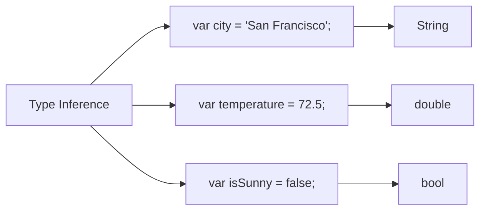

## 3.1.2 Type Inference

In the world of programming, managing data types efficiently is crucial for writing clean, maintainable, and error-free code. Dart, the language behind Flutter, offers a powerful feature known as **type inference**. This feature allows Dart to automatically determine the type of a variable based on the value assigned to it, simplifying the coding process and enhancing code readability. In this section, we will delve into the concept of type inference, its benefits, and how it maintains type safety, all while providing practical examples and insights.

### What is Type Inference?

Type inference is a feature in Dart that enables the compiler to deduce the type of a variable at compile time, based on the assigned value. This means that you don't always need to explicitly declare the type of a variable; instead, Dart can infer it for you. This capability is particularly useful in reducing boilerplate code and making your codebase cleaner and more readable.

#### How Type Inference Works

When you declare a variable using the `var` keyword and assign a value to it, Dart analyzes the value and determines the appropriate type. This inferred type is then used throughout the variable's scope, ensuring that the variable behaves consistently with its inferred type.

### Benefits of Type Inference

Type inference offers several advantages that contribute to more efficient and maintainable code:

- **Simplifies Code by Reducing Redundancy:** By allowing the compiler to infer types, you can avoid repetitive type declarations, making your code less verbose and easier to write.

- **Enhances Code Readability and Maintainability:** With less clutter from explicit type declarations, the code becomes more readable. Developers can focus on the logic rather than the syntax, which is particularly beneficial in large codebases.

- **Ensures Consistency and Type Safety:** Despite the absence of explicit type declarations, Dart maintains strict type safety, preventing type-related errors during compilation.

### Examples of Type Inference

Let's look at some examples to understand how type inference works in Dart:

```dart
var city = 'San Francisco'; // String inferred
var temperature = 72.5;     // double inferred
var isSunny = false;        // bool inferred
```

In the above examples:

- `city` is inferred as a `String` because it is assigned a string value.
- `temperature` is inferred as a `double` due to the decimal value.
- `isSunny` is inferred as a `bool` because it is assigned a boolean value.

These inferences allow you to write concise code without sacrificing clarity or safety.

### Type Safety with Inferred Types

One of the key strengths of Dart's type inference is that it maintains type safety. Even though the type is inferred, Dart ensures that you cannot assign a value of a different type to the variable later on. This prevents common type-related errors and enhances the reliability of your code.

#### Example of Type Safety

Consider the following example:

```dart
var score = 95; // int inferred
// score = 'High'; // Error: A value of type 'String' can't be assigned to a variable of type 'int'.
```

In this case, `score` is inferred as an `int`. If you attempt to assign a `String` value to `score`, Dart will throw a compile-time error, preventing potential runtime issues.

### Visualizing Type Inference with Mermaid.js

To better understand how type inference works, let's visualize the process using a Mermaid.js diagram:



In this diagram:

- The process of type inference starts with the declaration of variables using `var`.
- Each variable is linked to its inferred type (`String`, `double`, `bool`), illustrating how Dart determines the type based on the assigned value.

### Practical Applications and Real-World Scenarios

Type inference is not just a theoretical concept; it has practical applications that can significantly improve your development workflow. Here are some scenarios where type inference proves beneficial:

- **Rapid Prototyping:** When building prototypes or experimenting with new ideas, type inference allows you to focus on the logic without getting bogged down by type declarations.

- **Refactoring Code:** During refactoring, type inference helps maintain type safety while simplifying the code, making it easier to implement changes without introducing errors.

- **Collaborative Development:** In team environments, type inference reduces the cognitive load on developers, allowing them to understand and modify code more easily.

### Best Practices and Common Pitfalls

While type inference is a powerful tool, it's essential to use it judiciously. Here are some best practices and potential pitfalls to consider:

- **Use Explicit Types When Necessary:** While type inference simplifies code, there are situations where explicit type declarations improve clarity, especially when the inferred type might not be immediately obvious.

- **Avoid Overusing `var`:** Relying too heavily on `var` can sometimes lead to confusion, particularly in complex codebases. Use explicit types when it enhances understanding.

- **Be Mindful of Type Changes:** If the type of a variable might change in the future, consider using a more general type or refactoring the code to accommodate such changes.

### Encouraging Hands-On Practice

To fully grasp the concept of type inference, it's crucial to practice writing code that leverages this feature. Here are some exercises to try:

- **Exercise 1:** Create a Dart program that declares variables using `var` and assigns different types of values. Observe how Dart infers the types and experiment with changing the values to see how type safety is enforced.

- **Exercise 2:** Refactor a piece of code with explicit type declarations to use type inference. Compare the readability and maintainability of the refactored code.

- **Exercise 3:** Write a function that accepts parameters with inferred types and returns a value. Test the function with various inputs to understand how type inference works in function parameters and return types.

### Further Exploration and Resources

To deepen your understanding of type inference and its applications in Dart, consider exploring the following resources:

- **Official Dart Documentation:** The [Dart language tour](https://dart.dev/guides/language/language-tour) provides comprehensive insights into Dart's features, including type inference.

- **Open-Source Projects:** Examine open-source Flutter projects on platforms like GitHub to see how experienced developers leverage type inference in real-world applications.

- **Online Courses and Tutorials:** Platforms like Udemy and Coursera offer courses on Dart and Flutter that cover type inference and other advanced topics.

### Summary

Type inference in Dart is a powerful feature that enhances code readability, reduces redundancy, and maintains type safety. By allowing the compiler to automatically determine variable types, developers can write cleaner, more maintainable code. As you continue your journey in Flutter development, leveraging type inference will be a valuable skill that streamlines your coding process and improves the quality of your applications.

## Quiz Time!



### What is type inference in Dart?

- [x] A feature that allows Dart to automatically determine the type of a variable based on the value assigned to it.
- [ ] A method to explicitly declare variable types.
- [ ] A process of converting data types at runtime.
- [ ] A tool for debugging type errors.

> **Explanation:** Type inference is a feature in Dart that automatically determines the type of a variable based on the assigned value, simplifying code and maintaining type safety.

### Which of the following is a benefit of type inference?

- [x] Simplifies code by reducing redundancy.
- [x] Enhances code readability and maintainability.
- [ ] Increases the complexity of code.
- [ ] Requires explicit type declarations.

> **Explanation:** Type inference simplifies code by reducing redundancy and enhances readability and maintainability by allowing the compiler to infer types without explicit declarations.

### What type is inferred for the variable `var temperature = 72.5;`?

- [ ] int
- [x] double
- [ ] String
- [ ] bool

> **Explanation:** The variable `temperature` is assigned a decimal value, so Dart infers its type as `double`.

### How does Dart maintain type safety with inferred types?

- [x] By preventing type errors during compilation.
- [ ] By allowing any type to be assigned to a variable.
- [ ] By converting types at runtime.
- [ ] By ignoring type mismatches.

> **Explanation:** Dart maintains type safety by ensuring that variables with inferred types cannot be assigned values of incompatible types, preventing type errors during compilation.

### What happens if you try to assign a `String` value to a variable inferred as `int`?

- [x] A compile-time error occurs.
- [ ] The value is automatically converted.
- [ ] The program crashes at runtime.
- [ ] The assignment is ignored.

> **Explanation:** Dart enforces type safety, so assigning a `String` to a variable inferred as `int` results in a compile-time error.

### Which keyword is used in Dart to declare a variable with type inference?

- [x] var
- [ ] int
- [ ] double
- [ ] String

> **Explanation:** The `var` keyword is used in Dart to declare a variable with type inference, allowing the compiler to determine the type based on the assigned value.

### When should you consider using explicit types instead of type inference?

- [x] When the inferred type might not be immediately obvious.
- [ ] When you want to increase code verbosity.
- [ ] When you want to avoid type safety.
- [ ] When you are writing a prototype.

> **Explanation:** Explicit types should be used when they enhance understanding, especially if the inferred type might not be immediately obvious to other developers.

### What is the inferred type for `var isSunny = false;`?

- [ ] int
- [ ] double
- [ ] String
- [x] bool

> **Explanation:** The variable `isSunny` is assigned a boolean value (`false`), so Dart infers its type as `bool`.

### Which of the following is NOT a benefit of type inference?

- [ ] Simplifies code by reducing redundancy.
- [ ] Enhances code readability.
- [ ] Maintains type safety.
- [x] Increases the complexity of code.

> **Explanation:** Type inference simplifies code and enhances readability while maintaining type safety. It does not increase complexity; rather, it reduces it.

### True or False: Type inference in Dart allows for dynamic type changes at runtime.

- [ ] True
- [x] False

> **Explanation:** False. Type inference in Dart does not allow for dynamic type changes at runtime. Once a type is inferred, it remains consistent throughout the variable's scope.


