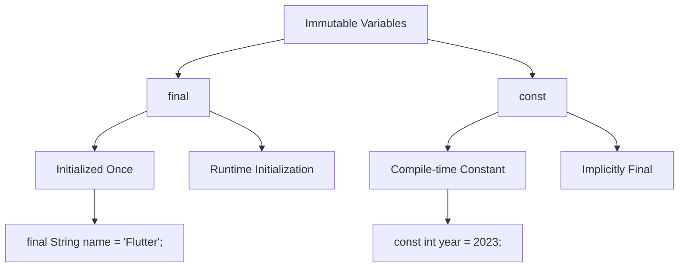

## 3.1.3 Constants and Final Variables

In the world of programming, immutability is a powerful concept that can lead to more predictable and error-free code. In Dart, the `final` and `const` keywords are used to create immutable variables, each serving a distinct purpose. Understanding when and how to use these keywords is crucial for effective Dart and Flutter development. This section will delve into the nuances of `final` and `const`, providing you with the knowledge to make informed decisions in your coding practices.

### Understanding `final` and `const`

Both `final` and `const` are used to declare variables that cannot be reassigned once they have been initialized. However, the key difference lies in when the value of these variables is determined:

- **`final`:** The value is determined at runtime. Once a `final` variable is assigned, it cannot be changed, but its value can be dynamic and determined during the execution of the program.
- **`const`:** The value is determined at compile-time. `const` variables are implicitly `final`, meaning they cannot be reassigned, and their values must be known and fixed at compile-time.

### Using `final`

The `final` keyword is used when you want to create a variable that is initialized once and cannot be reassigned. This is particularly useful when the value of the variable is not known until runtime.

#### Characteristics of `final`:

- **Runtime Initialization:** The value is assigned during the execution of the program.
- **Immutable After Initialization:** Once assigned, the value cannot be changed.
- **Flexibility:** Suitable for values that are dynamic or depend on runtime conditions.

#### Example of `final`:

```dart
final String country = 'USA';
// country = 'Canada'; // Error: Can't assign to a final variable.

final DateTime now = DateTime.now(); // Runtime value
print('The current date and time is: $now');
```

In this example, `country` is a `final` variable that holds the string 'USA'. Attempting to reassign it would result in an error. The `now` variable is initialized with the current date and time, which is determined at runtime.

### Using `const`

The `const` keyword is used to declare compile-time constants. These are values that are known and fixed at the time of compilation. `const` variables are implicitly `final`, meaning they cannot be reassigned.

#### Characteristics of `const`:

- **Compile-time Initialization:** The value must be known at compile-time.
- **Immutable and Fixed:** The value cannot change and must be a constant expression.
- **Efficiency:** Useful for values that are constant and do not change throughout the program.

#### Example of `const`:

```dart
const double pi = 3.14159;
// pi = 3.14; // Error: Can't assign to a const variable.

const int maxUsers = 100; // Compile-time constant
```

In this example, `pi` is a `const` variable representing the mathematical constant π. Its value is fixed and known at compile-time. Similarly, `maxUsers` is a constant integer that remains unchanged.

### Differences Between `final` and `const`

Understanding the differences between `final` and `const` is crucial for choosing the right keyword for your variables:

- **Initialization Time:**
  - `final`: The value is determined at runtime.
  - `const`: The value is determined at compile-time.

- **Usage Context:**
  - `final`: Use when the value is not known until runtime or when it depends on runtime conditions.
  - `const`: Use when the value is known and fixed at compile-time.

### Examples of When to Use Each

Here are some practical examples to illustrate when to use `final` and `const`:

```dart
final DateTime now = DateTime.now(); // Runtime value
const int maxUsers = 100;            // Compile-time constant

final List<int> numbers = [1, 2, 3]; // List can be modified, but reference is final
// numbers = [4, 5, 6]; // Error: Can't assign to a final variable.

const List<int> fixedNumbers = [1, 2, 3]; // List and its contents are immutable
// fixedNumbers[0] = 4; // Error: Unsupported operation: Cannot modify an unmodifiable list
```

In these examples, `now` is a `final` variable initialized with the current date and time, which is only known at runtime. `maxUsers` is a `const` variable representing a fixed number of users. The `numbers` list is a `final` reference, meaning the list itself can be modified, but the reference cannot be changed. In contrast, `fixedNumbers` is a `const` list, meaning neither the list nor its contents can be modified.

### Visualizing `final` and `const` with Mermaid.js

To better understand the relationship between `final` and `const`, let's visualize it using a Mermaid.js diagram:



This diagram illustrates that both `final` and `const` are types of immutable variables. `final` variables are initialized once and can be determined at runtime, while `const` variables are compile-time constants and implicitly `final`.

### Best Practices and Common Pitfalls

- **Use `final` for Dynamic Values:** When the value of a variable is determined during the execution of the program, use `final`. This is common for values that depend on user input or system state.
- **Use `const` for Fixed Values:** When the value is known and fixed at compile-time, use `const`. This is ideal for mathematical constants, configuration values, or any data that remains unchanged.
- **Avoid Overusing `const`:** While `const` is efficient, overusing it can lead to inflexibility. Use it only when the value is truly constant.
- **Understand List Mutability:** A `final` list can have its contents modified, but a `const` list cannot. Be mindful of this distinction to avoid runtime errors.

### Practical Applications and Real-World Scenarios

Consider a Flutter application that requires configuration settings, such as API endpoints or feature flags. These settings are typically defined as `const` because they do not change during the execution of the app. On the other hand, user-specific data, such as session tokens or user preferences, are better suited as `final` variables, as they are determined at runtime and remain constant once set.

### Further Exploration and Resources

To deepen your understanding of `final` and `const` in Dart, consider exploring the following resources:

- [Dart Language Tour](https://dart.dev/guides/language/language-tour#final-and-const)
- [Effective Dart: Style Guide](https://dart.dev/guides/language/effective-dart/style)
- [Flutter Documentation](https://flutter.dev/docs)

These resources provide comprehensive insights into Dart programming and best practices for using `final` and `const`.

### Summary

In this section, we've explored the concepts of `final` and `const` in Dart, understanding their differences, use cases, and best practices. By leveraging these keywords effectively, you can write more predictable and maintainable code in your Flutter applications. Remember to choose `final` for runtime-determined values and `const` for compile-time constants, ensuring your code is both efficient and flexible.

## Quiz Time!



### What is the main difference between `final` and `const` in Dart?

- [x] `final` is initialized at runtime, while `const` is initialized at compile-time.
- [ ] `final` can be reassigned, while `const` cannot.
- [ ] `const` is used for variables that change, while `final` is for fixed values.
- [ ] `final` is more efficient than `const`.

> **Explanation:** The main difference is the time of initialization: `final` is initialized at runtime, whereas `const` is initialized at compile-time.

### Which keyword would you use for a variable whose value is determined at runtime?

- [x] `final`
- [ ] `const`
- [ ] `var`
- [ ] `dynamic`

> **Explanation:** `final` is used for variables whose values are determined at runtime and cannot be reassigned once set.

### Can a `const` variable be reassigned after its initial assignment?

- [ ] Yes
- [x] No
- [ ] Only if it's a primitive type
- [ ] Only if it's a string

> **Explanation:** `const` variables are immutable and cannot be reassigned after their initial assignment.

### What will happen if you try to reassign a `final` variable?

- [ ] It will be reassigned successfully.
- [x] It will cause a compile-time error.
- [ ] It will cause a runtime error.
- [ ] It will silently fail.

> **Explanation:** Attempting to reassign a `final` variable will result in a compile-time error, as `final` variables are immutable after initialization.

### Which of the following is a valid use of `const`?

- [ ] `const DateTime now = DateTime.now();`
- [x] `const int maxUsers = 100;`
- [ ] `const List<int> numbers = [1, 2, 3];`
- [ ] `const String name = getName();`

> **Explanation:** `const int maxUsers = 100;` is valid because `100` is a compile-time constant. The other options involve runtime values or non-constant expressions.

### How does a `final` list differ from a `const` list?

- [x] A `final` list can have its contents modified, but a `const` list cannot.
- [ ] A `const` list can have its contents modified, but a `final` list cannot.
- [ ] Both `final` and `const` lists can have their contents modified.
- [ ] Neither `final` nor `const` lists can have their contents modified.

> **Explanation:** A `final` list allows modification of its contents, whereas a `const` list is completely immutable.

### Which keyword should you use for a variable that represents a mathematical constant like π?

- [ ] `final`
- [x] `const`
- [ ] `var`
- [ ] `dynamic`

> **Explanation:** `const` is appropriate for mathematical constants like π, as their values are known and fixed at compile-time.

### What is the result of using `final` with a variable that is initialized with a runtime value?

- [x] The variable is initialized once and cannot be reassigned.
- [ ] The variable can be reassigned multiple times.
- [ ] The variable is initialized at compile-time.
- [ ] The variable is mutable.

> **Explanation:** A `final` variable initialized with a runtime value is immutable after its initial assignment.

### Can a `const` variable be used to store the result of a function call?

- [ ] Yes, always.
- [ ] Yes, if the function returns a constant value.
- [x] No, because the result of a function call is determined at runtime.
- [ ] Yes, if the function is marked as `const`.

> **Explanation:** A `const` variable cannot store the result of a function call because the value is determined at runtime, not compile-time.

### True or False: `const` variables are implicitly `final`.

- [x] True
- [ ] False

> **Explanation:** `const` variables are implicitly `final`, meaning they cannot be reassigned once initialized.


