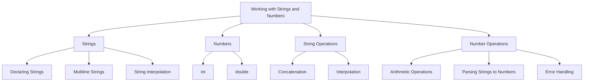

## 3.1.4 Working with Strings and Numbers

In the realm of programming, strings and numbers are fundamental data types that form the backbone of most applications. In Dart, these data types are versatile and powerful, enabling developers to handle text and numeric data efficiently. This section delves into the nuances of working with strings and numbers in Dart, providing you with the knowledge and skills necessary to build robust Flutter applications.

### Strings in Dart

**Definition:** A string in Dart is a sequence of characters used to represent text. Strings are immutable, meaning once they are created, they cannot be changed. However, you can create new strings based on existing ones.

#### Declaring Strings

Dart provides a straightforward syntax for declaring strings. You can use either single or double quotes to define a string, allowing for flexibility in handling text that contains quotes.

```dart
String greeting = 'Hello, Flutter!';
String singleQuote = 'It\'s a great day.';
String doubleQuote = "Flutter is awesome!";
```

In the example above, notice the use of the backslash (`\`) to escape the single quote in the `singleQuote` string. This is necessary to avoid syntax errors when using single quotes within a single-quoted string.

#### Multiline Strings

For longer text blocks, Dart offers multiline strings, which are defined using triple quotes. This feature is particularly useful for embedding large text blocks or writing documentation within your code.

```dart
String longText = '''
This is a multiline
string in Dart.
''';
```

Multiline strings preserve the formatting of the text, including line breaks and indentation, making them ideal for storing formatted text.

#### String Interpolation

String interpolation is a powerful feature in Dart that allows you to embed expressions within strings. This is done using the `$` symbol, which simplifies the process of constructing strings dynamically.

```dart
String name = 'Dart';
int version = 2;
String info = 'This is $name version $version.';
```

In the example above, the variables `name` and `version` are seamlessly integrated into the `info` string, demonstrating how interpolation can make your code cleaner and more readable.

### Numbers in Dart

Dart supports two primary numeric types: `int` and `double`. These types allow you to perform a wide range of arithmetic operations, from basic calculations to complex mathematical functions.

#### Integer (`int`)

The `int` type represents whole numbers without a fractional component. It is ideal for counting, indexing, and other operations where precision is not a concern.

```dart
int count = 10;
```

#### Double (`double`)

The `double` type is used for floating-point numbers, which include a decimal point. This type is essential for calculations requiring precision, such as financial computations or scientific measurements.

```dart
double price = 99.99;
```

#### Numeric Operations

Dart provides a rich set of operators for performing arithmetic operations on numbers. These include addition, subtraction, multiplication, division, and more.

```dart
int a = 5;
int b = 3;
int sum = a + b;         // 8
double division = a / b; // 1.666...
```

In the example above, `sum` stores the result of adding `a` and `b`, while `division` holds the result of dividing `a` by `b`. Note that division always returns a `double`, even when both operands are integers.

### Working with Strings and Numbers

#### Concatenation

String concatenation is the process of joining two or more strings together. In Dart, you can achieve this using the `+` operator or through string interpolation.

```dart
String firstName = 'John';
String lastName = 'Doe';
String fullName = firstName + ' ' + lastName; // John Doe
// Or using interpolation
String fullName = '$firstName $lastName'; // John Doe
```

String interpolation is often preferred for its readability and efficiency, especially when dealing with multiple variables.

#### Parsing Strings to Numbers

Converting strings to numbers is a common task in programming, especially when dealing with user input or data from external sources. Dart provides the `int.parse()` and `double.parse()` methods for this purpose.

```dart
String numericString = '123';
int number = int.parse(numericString); // 123
String floatString = '45.67';
double floatNumber = double.parse(floatString); // 45.67
```

These methods convert a string representation of a number into its respective numeric type. It's crucial to ensure that the string is a valid number to avoid runtime errors.

#### Error Handling in Parsing

When parsing strings to numbers, there's always a risk of encountering invalid input. Dart's `try-catch` blocks allow you to handle such errors gracefully, ensuring your application remains robust.

```dart
try {
  int invalidNumber = int.parse('abc');
} catch (e) {
  print('Error parsing number: $e');
}
```

In this example, attempting to parse the string `'abc'` as an integer results in an error, which is caught and handled by the `catch` block. This approach prevents the application from crashing and provides a mechanism to inform the user of the issue.

### Visualizing Concepts with Mermaid.js

To better understand the relationships and operations involving strings and numbers in Dart, consider the following diagram:



This diagram illustrates the key concepts and operations related to strings and numbers in Dart, providing a visual summary of the topics covered in this section.

### Best Practices and Common Pitfalls

- **Use String Interpolation:** Prefer string interpolation over concatenation for cleaner and more efficient code.
- **Validate Input:** Always validate and sanitize user input before parsing it to prevent errors and security vulnerabilities.
- **Handle Parsing Errors:** Implement error handling when parsing strings to numbers to ensure your application can gracefully handle invalid input.
- **Choose the Right Numeric Type:** Use `int` for whole numbers and `double` for floating-point numbers to maintain precision and avoid unnecessary conversions.

### Further Exploration

To deepen your understanding of strings and numbers in Dart, consider exploring the following resources:

- [Dart Language Tour](https://dart.dev/guides/language/language-tour): Official documentation covering Dart's language features.
- [Effective Dart](https://dart.dev/guides/language/effective-dart): Best practices for writing Dart code.
- [Flutter & Dart - The Complete Guide](https://www.udemy.com/course/learn-flutter-dart-to-build-ios-android-apps/): An online course that covers Flutter and Dart in depth.

By mastering strings and numbers in Dart, you'll be well-equipped to handle text and numeric data in your Flutter applications, paving the way for more complex and feature-rich projects.

## Quiz Time!



### What is the correct way to declare a string in Dart?

- [x] `String greeting = 'Hello, Flutter!';`
- [ ] `String greeting = Hello, Flutter!;`
- [ ] `String greeting = "Hello, Flutter!`
- [ ] `String greeting = Hello, Flutter!`

> **Explanation:** Strings in Dart can be declared using single or double quotes. The correct syntax includes quotes around the text.

### How do you create a multiline string in Dart?

- [x] Using triple quotes (`'''` or `"""`)
- [ ] Using double quotes
- [ ] Using single quotes
- [ ] Using backticks

> **Explanation:** Multiline strings in Dart are created using triple quotes, which can be either single or double.

### What is string interpolation in Dart?

- [x] Embedding expressions within strings using `$`
- [ ] Concatenating strings using `+`
- [ ] Using `int.parse()` to convert strings
- [ ] Using `double.parse()` to convert strings

> **Explanation:** String interpolation allows embedding expressions within strings using the `$` symbol, making the code more readable.

### Which numeric type in Dart is used for whole numbers?

- [x] `int`
- [ ] `double`
- [ ] `float`
- [ ] `decimal`

> **Explanation:** The `int` type in Dart is used for whole numbers without a fractional component.

### How do you convert a string to an integer in Dart?

- [x] `int.parse('123')`
- [ ] `double.parse('123')`
- [ ] `String.parse('123')`
- [ ] `parseInt('123')`

> **Explanation:** The `int.parse()` method is used to convert a string representation of a number to an integer.

### What happens if you try to parse an invalid string to a number in Dart?

- [x] An error is thrown
- [ ] The string is returned as is
- [ ] The number zero is returned
- [ ] The program crashes without error

> **Explanation:** If you try to parse an invalid string to a number, Dart throws an error, which can be caught using a `try-catch` block.

### How can you handle errors when parsing strings to numbers in Dart?

- [x] Using a `try-catch` block
- [ ] Using `if-else` statements
- [ ] Using `switch-case` statements
- [ ] Using `for` loops

> **Explanation:** A `try-catch` block is used to handle errors that occur during parsing, allowing the program to continue running.

### Which operator is used for string concatenation in Dart?

- [x] `+`
- [ ] `-`
- [ ] `*`
- [ ] `/`

> **Explanation:** The `+` operator is used for concatenating strings in Dart.

### What is the result of the expression `5 / 2` in Dart?

- [x] `2.5`
- [ ] `2`
- [ ] `3`
- [ ] `2.0`

> **Explanation:** Division in Dart always returns a `double`, so `5 / 2` results in `2.5`.

### True or False: String interpolation is more efficient than concatenation in Dart.

- [x] True
- [ ] False

> **Explanation:** String interpolation is generally more efficient and readable than concatenation, especially when dealing with multiple variables.


