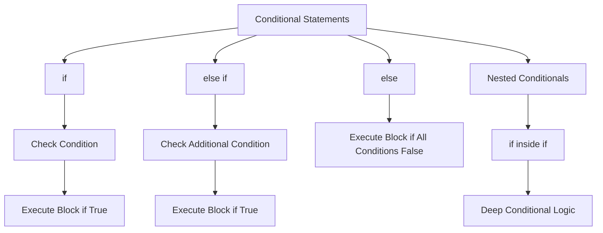

## 3.2.1 Conditional Statements

Conditional statements are a fundamental concept in programming that allow developers to control the flow of execution based on specific conditions. In Dart, as in many other programming languages, conditional statements enable your application to make decisions and execute different blocks of code depending on whether certain conditions are met. This capability is crucial for creating dynamic and responsive applications, especially in the context of Flutter, where user interactions and data-driven UI updates are common.

### Introduction to Conditional Statements

Conditional statements are the backbone of decision-making in programming. They allow you to execute different code paths based on the evaluation of boolean expressions. By using conditional statements, you can instruct your program to perform specific actions when certain conditions are true and alternative actions when they are false. This flexibility is essential for handling various scenarios in your applications, such as user input validation, data processing, and UI updates.

### The `if` Statement

The `if` statement is the simplest form of conditional statement. It evaluates a boolean expression and executes a block of code if the expression is true. If the expression is false, the code block is skipped.

#### Syntax and Usage

The syntax of an `if` statement in Dart is straightforward:

```dart
if (condition) {
  // Code to execute if the condition is true
}
```

Here, `condition` is a boolean expression that evaluates to either `true` or `false`. If the condition is true, the code block within the curly braces is executed.

#### Example

Consider the following example, where we determine if a person is an adult based on their age:

```dart
int age = 20;
if (age >= 18) {
  print('You are an adult.');
}
```

In this example, the condition `age >= 18` checks if the age is 18 or older. Since the condition is true, the message "You are an adult." is printed to the console.

### The `else if` Statement

The `else if` statement extends the `if` statement by allowing you to check multiple conditions in sequence. If the initial `if` condition is false, the program evaluates the `else if` condition. This process continues until a true condition is found or all conditions are evaluated.

#### Syntax and Usage

The syntax for an `else if` statement is as follows:

```dart
if (condition1) {
  // Code to execute if condition1 is true
} else if (condition2) {
  // Code to execute if condition2 is true
}
```

You can chain multiple `else if` statements to handle various conditions.

#### Example

Let's look at an example where we assign a grade based on a score:

```dart
int score = 85;
if (score >= 90) {
  print('Grade: A');
} else if (score >= 80) {
  print('Grade: B');
}
```

In this example, the program first checks if the score is 90 or higher. If not, it checks if the score is 80 or higher. Since the score is 85, the condition `score >= 80` is true, and "Grade: B" is printed.

### The `else` Statement

The `else` statement provides a catch-all block that executes if none of the preceding `if` or `else if` conditions are true. It is optional but useful for handling scenarios where no specific conditions are met.

#### Syntax and Usage

The syntax for an `else` statement is simple:

```dart
if (condition1) {
  // Code to execute if condition1 is true
} else if (condition2) {
  // Code to execute if condition2 is true
} else {
  // Code to execute if none of the above conditions are true
}
```

#### Example

Consider the following example, where we describe the weather based on temperature:

```dart
int temperature = 30;
if (temperature > 35) {
  print('It\'s really hot!');
} else if (temperature > 25) {
  print('It\'s warm.');
} else {
  print('The weather is cool.');
}
```

In this example, the program checks if the temperature is greater than 35. If not, it checks if the temperature is greater than 25. Since neither condition is true, the `else` block executes, printing "The weather is cool."

### Nested Conditional Statements

Nested conditional statements involve placing one conditional statement inside another. This approach allows you to handle more complex decision-making processes by evaluating multiple layers of conditions.

#### Syntax and Usage

Nested conditionals can be structured as follows:

```dart
if (outerCondition) {
  if (innerCondition) {
    // Code to execute if both conditions are true
  }
}
```

#### Example

Let's explore an example that determines if a year is a leap year:

```dart
int year = 2024;
if (year % 4 == 0) {
  if (year % 100 == 0) {
    if (year % 400 == 0) {
      print('$year is a leap year.');
    } else {
      print('$year is not a leap year.');
    }
  } else {
    print('$year is a leap year.');
  }
} else {
  print('$year is not a leap year.');
}
```

In this example, the program first checks if the year is divisible by 4. If true, it checks if the year is divisible by 100. If so, it further checks if the year is divisible by 400. This nested structure allows for precise determination of leap years according to the Gregorian calendar rules.

### Visualizing Conditional Statements with Mermaid.js

To better understand the flow of conditional statements, let's visualize them using a Mermaid.js diagram:



This diagram illustrates the decision-making process in conditional statements, showing how different paths are taken based on the evaluation of conditions.

### Best Practices and Common Pitfalls

When working with conditional statements, consider the following best practices:

- **Keep Conditions Simple:** Complex conditions can be difficult to read and maintain. Break them into smaller, manageable parts if necessary.
- **Use Comments Wisely:** Comment your code to explain the logic behind complex conditions, especially when using nested conditionals.
- **Avoid Deep Nesting:** Excessive nesting can make code hard to follow. Consider refactoring or using functions to simplify logic.
- **Test All Scenarios:** Ensure that all possible conditions are tested, including edge cases, to avoid unexpected behavior.

### Practical Applications and Real-World Scenarios

Conditional statements are used extensively in real-world applications. Here are a few scenarios where they play a crucial role:

- **User Authentication:** Checking if a user is logged in and has the necessary permissions to access certain features.
- **Form Validation:** Validating user input based on specific criteria, such as email format or password strength.
- **Dynamic UI Updates:** Changing the appearance or behavior of UI elements based on user interactions or data changes.

### Conclusion

Conditional statements are a powerful tool in any programmer's toolkit. They enable you to create dynamic, responsive applications that can adapt to various conditions and inputs. By mastering conditional statements in Dart, you'll be well-equipped to handle complex logic and decision-making processes in your Flutter applications.

### Further Reading and Resources

To deepen your understanding of conditional statements and control flow in Dart, consider exploring the following resources:

- [Dart Language Tour](https://dart.dev/guides/language/language-tour)
- [Flutter Official Documentation](https://flutter.dev/docs)
- [Effective Dart: Style](https://dart.dev/guides/language/effective-dart/style)

These resources provide comprehensive insights into Dart programming and best practices for writing clean, efficient code.

## Quiz Time!



### What is the primary purpose of conditional statements in programming?

- [x] To execute different code blocks based on certain conditions
- [ ] To repeat code multiple times
- [ ] To define variables
- [ ] To handle exceptions

> **Explanation:** Conditional statements allow programs to make decisions and execute different code paths based on the evaluation of boolean expressions.

### Which of the following is the correct syntax for an `if` statement in Dart?

- [x] `if (condition) { // code }`
- [ ] `if condition { // code }`
- [ ] `if (condition): // code`
- [ ] `if condition: // code`

> **Explanation:** The correct syntax for an `if` statement in Dart involves using parentheses around the condition and curly braces for the code block.

### In the following code, what will be printed if `age` is 16?

```dart
int age = 16;
if (age >= 18) {
  print('You are an adult.');
} else {
  print('You are not an adult.');
}
```

- [ ] `You are an adult.`
- [x] `You are not an adult.`
- [ ] `Nothing will be printed.`
- [ ] `Error: Invalid syntax`

> **Explanation:** Since the condition `age >= 18` is false, the `else` block is executed, printing "You are not an adult."

### How can you extend an `if` statement to check multiple conditions?

- [ ] By using a loop
- [x] By using `else if` statements
- [ ] By using a switch statement
- [ ] By using a function

> **Explanation:** `else if` statements allow you to check additional conditions if the initial `if` condition is false.

### What is the output of the following code?

```dart
int score = 75;
if (score >= 90) {
  print('Grade: A');
} else if (score >= 80) {
  print('Grade: B');
} else {
  print('Grade: C');
}
```

- [ ] `Grade: A`
- [ ] `Grade: B`
- [x] `Grade: C`
- [ ] `No output`

> **Explanation:** Since the score is 75, neither the `if` nor the `else if` conditions are true, so the `else` block is executed, printing "Grade: C."

### Which statement is used to execute a block of code if none of the preceding conditions are true?

- [ ] `if`
- [ ] `else if`
- [x] `else`
- [ ] `switch`

> **Explanation:** The `else` statement is used as a catch-all to execute code if none of the preceding `if` or `else if` conditions are true.

### What is a common pitfall when using nested conditional statements?

- [ ] Using too many variables
- [x] Excessive nesting leading to hard-to-read code
- [ ] Not using enough comments
- [ ] Using functions

> **Explanation:** Excessive nesting can make code difficult to read and maintain. It's important to keep nesting to a minimum and consider refactoring complex logic.

### In the leap year example, which condition checks if a year is divisible by 400?

- [x] `year % 400 == 0`
- [ ] `year % 100 == 0`
- [ ] `year % 4 == 0`
- [ ] `year % 200 == 0`

> **Explanation:** The condition `year % 400 == 0` checks if a year is divisible by 400, which is part of the rules for determining leap years.

### What is the purpose of using comments in conditional statements?

- [ ] To increase code execution speed
- [ ] To reduce the number of lines of code
- [x] To explain the logic behind complex conditions
- [ ] To prevent code from executing

> **Explanation:** Comments are used to explain the logic behind complex conditions, making the code easier to understand and maintain.

### True or False: Conditional statements can only be used with numeric data types.

- [ ] True
- [x] False

> **Explanation:** Conditional statements can be used with any data type that can be evaluated to a boolean expression, not just numeric types.


