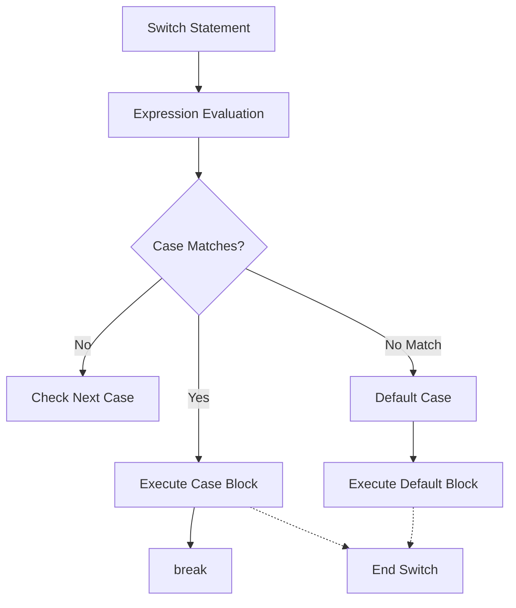

## 3.2.2 Switch Case

In the world of programming, making decisions based on conditions is a fundamental concept. Dart, the language behind Flutter, offers several ways to handle conditional logic, with the `switch` statement being a powerful tool for managing multiple conditional branches. This section will delve into the intricacies of the `switch` statement, exploring its syntax, structure, and practical applications in Flutter development.

### Introduction to `switch` Statement

The `switch` statement in Dart provides a cleaner and more organized way to handle multiple conditional branches based on the value of a single expression. Unlike a series of `if-else` statements, which can become cumbersome and difficult to read, a `switch` statement allows you to evaluate an expression once and execute different blocks of code depending on the value of that expression.

#### Why Use `switch`?

- **Readability**: The `switch` statement enhances code readability by clearly delineating different cases.
- **Efficiency**: It evaluates the expression once and jumps directly to the matching case, potentially improving performance.
- **Organization**: It groups related conditions together, making the code easier to maintain and understand.

### Syntax and Structure

The syntax of a `switch` statement in Dart is straightforward. Here's a basic template:

```dart
switch (variable) {
  case value1:
    // Code block
    break;
  case value2:
    // Code block
    break;
  default:
    // Code block
}
```

- **`switch (variable)`**: The `switch` statement begins with the keyword `switch`, followed by the expression in parentheses. This expression is evaluated once.
- **`case value:`**: Each `case` keyword is followed by a value. If the expression matches this value, the corresponding code block is executed.
- **`break;`**: The `break` statement terminates the `switch` block, preventing fall-through to subsequent cases.
- **`default:`**: The `default` case is optional but recommended. It acts as a fallback when no other case matches.

### Example Usage

Let's explore a practical example to understand how the `switch` statement works in Dart:

```dart
String day = 'Monday';

switch (day) {
  case 'Monday':
    print('Start of the work week.');
    break;
  case 'Friday':
    print('End of the work week.');
    break;
  case 'Saturday':
  case 'Sunday':
    print('Weekend!');
    break;
  default:
    print('Midweek day.');
}
```

In this example, the `switch` statement evaluates the `day` variable. Depending on its value, it prints a message indicating the part of the week. Notice how `Saturday` and `Sunday` share the same code block, demonstrating how multiple cases can execute the same logic.

### Handling Multiple Cases

Dart allows you to handle multiple cases that execute the same code block. This feature is particularly useful when different values require identical processing. Here's an example:

```dart
int score = 75;
switch (score ~/ 10) {
  case 10:
  case 9:
    print('Grade: A');
    break;
  case 8:
    print('Grade: B');
    break;
  case 7:
    print('Grade: C');
    break;
  default:
    print('Grade: F');
}
```

In this scenario, the `score` is divided by 10 using the integer division operator `~/`. The `switch` statement then evaluates the result. Both `case 10` and `case 9` lead to a grade of 'A', illustrating how multiple cases can be grouped together.

### The `default` Case

The `default` case serves as a catch-all for any values not explicitly handled by the other cases. It's a good practice to include a `default` case to ensure that your `switch` statement can handle unexpected values gracefully.

### No Fall-Through in Dart

A notable feature of Dart's `switch` statement is the absence of fall-through between cases. Unlike some other languages, Dart requires an explicit `break` statement to terminate each case. This design choice prevents accidental execution of subsequent cases, reducing the likelihood of bugs.

### Visualizing the `switch` Statement

To better understand the flow of a `switch` statement, consider the following Mermaid.js diagram:



- **Expression Evaluation**: The expression is evaluated once.
- **Case Matches**: The flow checks if the expression matches any case.
- **Execute Case Block**: If a match is found, the corresponding block is executed.
- **Break**: The `break` statement exits the `switch` block.
- **Default Case**: If no match is found, the `default` block is executed.

### Practical Applications and Best Practices

The `switch` statement is particularly useful in scenarios where you need to handle multiple discrete values. Here are some best practices and potential pitfalls to consider:

- **Use `switch` for Discrete Values**: The `switch` statement is ideal for handling discrete values like enums, integers, or strings. For complex conditions, consider using `if-else` statements.
- **Always Include a `default` Case**: Even if you expect all possible values to be covered by cases, including a `default` case ensures robustness against unexpected inputs.
- **Avoid Complex Logic in Cases**: Keep the logic within each case simple. If complex processing is required, consider refactoring into separate functions.
- **Be Mindful of `break` Statements**: Always include `break` statements to prevent unintended fall-through.

### Real-World Scenario: Building a Simple Menu

Imagine you're building a simple command-line menu for a Dart application. The `switch` statement can help manage user input efficiently:

```dart
void main() {
  String command = 'help';

  switch (command) {
    case 'start':
      print('Starting the application...');
      break;
    case 'stop':
      print('Stopping the application...');
      break;
    case 'help':
      print('Available commands: start, stop, help');
      break;
    default:
      print('Unknown command.');
  }
}
```

In this example, the `switch` statement evaluates the `command` variable and executes the corresponding action. The `default` case handles any unrecognized commands, providing feedback to the user.

### Conclusion

The `switch` statement is a versatile tool in Dart, offering a structured way to handle multiple conditional branches. By understanding its syntax, structure, and best practices, you can write cleaner, more efficient code. Whether you're managing user input, processing scores, or building complex applications, the `switch` statement is an invaluable asset in your Dart programming toolkit.

### Further Reading and Resources

- [Dart Language Tour](https://dart.dev/guides/language/language-tour#switch-and-case)
- [Effective Dart: Usage](https://dart.dev/guides/language/effective-dart/usage)
- [Flutter Documentation](https://flutter.dev/docs)

These resources provide additional insights into Dart's capabilities and best practices, helping you deepen your understanding and refine your skills.

## Quiz Time!



### What is the primary advantage of using a `switch` statement over multiple `if-else` statements?

- [x] Improved readability and organization
- [ ] Faster execution time
- [ ] Ability to handle complex conditions
- [ ] Support for fall-through between cases

> **Explanation:** The `switch` statement improves readability and organization by clearly delineating different cases, making the code easier to maintain.

### In Dart, what is required to prevent fall-through between cases in a `switch` statement?

- [x] A `break` statement
- [ ] A `continue` statement
- [ ] A `return` statement
- [ ] A `default` case

> **Explanation:** Dart requires an explicit `break` statement to prevent fall-through between cases, ensuring that only the matched case is executed.

### What happens if no `case` matches the expression in a `switch` statement and there is no `default` case?

- [x] No code block is executed
- [ ] The first case is executed
- [ ] An error is thrown
- [ ] The program crashes

> **Explanation:** If no `case` matches and there is no `default` case, no code block is executed, and the program continues.

### How can multiple cases be grouped to execute the same code block in a `switch` statement?

- [x] By listing them consecutively without `break` statements between them
- [ ] By using a `continue` statement
- [ ] By using a `return` statement
- [ ] By using a `goto` statement

> **Explanation:** Multiple cases can be grouped by listing them consecutively without `break` statements between them, allowing them to execute the same code block.

### What is the role of the `default` case in a `switch` statement?

- [x] To handle any values not explicitly covered by other cases
- [ ] To terminate the `switch` statement
- [ ] To improve performance
- [ ] To allow fall-through between cases

> **Explanation:** The `default` case acts as a fallback to handle any values not explicitly covered by other cases, ensuring robustness.

### Which of the following is NOT a recommended practice when using `switch` statements?

- [ ] Including a `default` case
- [x] Using complex logic within cases
- [ ] Keeping the logic simple
- [ ] Using `switch` for discrete values

> **Explanation:** It is not recommended to use complex logic within cases. Instead, keep the logic simple and consider refactoring into separate functions if needed.

### In the provided example, what message is printed if `day` is set to `'Wednesday'`?

- [ ] Start of the work week.
- [ ] End of the work week.
- [ ] Weekend!
- [x] Midweek day.

> **Explanation:** Since `'Wednesday'` does not match any specific case, the `default` case is executed, printing "Midweek day."

### What is the result of the following code snippet?

```dart
int score = 85;
switch (score ~/ 10) {
  case 10:
  case 9:
    print('Grade: A');
    break;
  case 8:
    print('Grade: B');
    break;
  case 7:
    print('Grade: C');
    break;
  default:
    print('Grade: F');
}
```

- [ ] Grade: A
- [x] Grade: B
- [ ] Grade: C
- [ ] Grade: F

> **Explanation:** The expression `score ~/ 10` evaluates to 8, matching `case 8`, which prints "Grade: B."

### What is the purpose of the `break` statement in a `switch` case?

- [x] To terminate the `switch` block and prevent fall-through
- [ ] To continue to the next case
- [ ] To return a value from the `switch` statement
- [ ] To execute the `default` case

> **Explanation:** The `break` statement terminates the `switch` block, preventing fall-through to subsequent cases.

### True or False: Dart allows fall-through between cases in a `switch` statement without a `break`.

- [ ] True
- [x] False

> **Explanation:** False. Dart does not allow fall-through between cases without an explicit `break` statement, ensuring only the matched case is executed.


