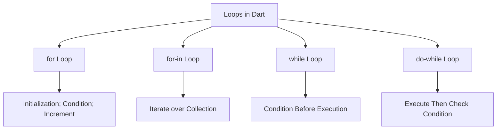

## 3.2.3 Loops: `for`, `while`, `do-while`

In the world of programming, loops are indispensable tools that allow developers to execute a block of code repeatedly until a specified condition is met. This capability is crucial for tasks that require iteration, such as processing items in a list, performing repetitive calculations, or handling user input until a valid response is received. In Dart, the language used for Flutter development, loops come in several forms: `for`, `while`, and `do-while`. Each type of loop serves a unique purpose and is suited to different scenarios. In this section, we'll delve into these loop constructs, exploring their syntax, use cases, and practical examples to enhance your understanding and proficiency in Dart programming.

### Introduction to Loops

Loops are fundamental constructs in programming that enable the execution of a block of code multiple times. They are particularly useful when dealing with repetitive tasks or when the number of iterations is determined by dynamic conditions. By using loops, you can write concise and efficient code, reducing redundancy and improving maintainability.

### `for` Loop

The `for` loop is one of the most commonly used loop constructs in programming. It is ideal for situations where the number of iterations is known beforehand. The `for` loop consists of three main components: initialization, condition, and increment. These components control the loop's execution and termination.

#### Syntax

```dart
for (initialization; condition; increment) {
  // Code to execute
}
```

- **Initialization:** Sets the starting point of the loop, typically by declaring and initializing a loop control variable.
- **Condition:** Evaluated before each iteration; the loop continues as long as this condition is true.
- **Increment:** Updates the loop control variable after each iteration, moving it closer to the termination condition.

#### Example

```dart
for (int i = 0; i < 5; i++) {
  print('Iteration $i');
}
```

In this example, the loop will execute five times, printing the iteration number each time. The loop control variable `i` starts at 0 and increments by 1 with each iteration until it reaches 5.

#### Enhanced `for` Loop (for-in)

The enhanced `for` loop, also known as the `for-in` loop, simplifies iteration over collections such as lists, sets, and maps. It abstracts away the loop control variable and increment, allowing you to focus on processing each element in the collection.

##### Example

```dart
List<String> fruits = ['Apple', 'Banana', 'Cherry'];
for (var fruit in fruits) {
  print(fruit);
}
```

In this example, the `for-in` loop iterates over the `fruits` list, printing each fruit name. This loop is particularly useful for collections where the number of elements is not predetermined.

### `while` Loop

The `while` loop is a control flow statement that allows code to be executed repeatedly based on a given Boolean condition. The loop continues as long as the condition evaluates to true. It is particularly useful when the number of iterations is not known beforehand.

#### Syntax

```dart
while (condition) {
  // Code to execute
}
```

- **Condition:** Evaluated before each iteration; the loop continues as long as this condition is true.

#### Example

```dart
int count = 0;
while (count < 3) {
  print('Count is $count');
  count++;
}
```

In this example, the loop will execute three times, printing the count each time. The loop control variable `count` starts at 0 and increments by 1 with each iteration until it reaches 3.

#### Usage Considerations

The `while` loop is ideal for scenarios where the number of iterations is determined by dynamic conditions, such as user input or external data. It provides flexibility in controlling the loop's execution based on real-time conditions.

### `do-while` Loop

The `do-while` loop is similar to the `while` loop, with one key difference: the loop body is executed at least once before the condition is evaluated. This ensures that the code block runs at least once, regardless of the condition's initial state.

#### Syntax

```dart
do {
  // Code to execute
} while (condition);
```

- **Condition:** Evaluated after each iteration; the loop continues as long as this condition is true.

#### Example

```dart
int number;
do {
  number = getUserInput();
} while (number <= 0);
```

In this example, the loop will continue to prompt the user for input until a positive number is entered. The loop body executes at least once, ensuring that the user is prompted initially.

#### Key Difference from `while`

The `do-while` loop guarantees that the loop body executes at least once, making it suitable for scenarios where the initial execution is necessary, such as input validation or initialization tasks.

### When to Use Each Loop Type

- **`for`:** Use when the number of iterations is known beforehand, such as iterating over a fixed range of numbers.
- **`for-in`:** Use when iterating over collections like lists, sets, or maps, where the number of elements is not predetermined.
- **`while`:** Use when the number of iterations is uncertain and determined by dynamic conditions, such as user input or external data.
- **`do-while`:** Use when the loop should execute at least once, regardless of the condition, such as in input validation or initialization tasks.

### Visualizing Loop Constructs

To better understand the relationships and differences between these loop constructs, let's visualize them using a Mermaid.js diagram:



This diagram illustrates the flow and characteristics of each loop type, highlighting their unique features and use cases.

### Practical Code Examples

Let's explore some practical examples to solidify your understanding of loops in Dart.

#### Example 1: Calculating the Sum of Numbers

Suppose you want to calculate the sum of numbers from 1 to 10. You can achieve this using a `for` loop:

```dart
int sum = 0;
for (int i = 1; i <= 10; i++) {
  sum += i;
}
print('The sum of numbers from 1 to 10 is $sum');
```

In this example, the loop iterates from 1 to 10, adding each number to the `sum` variable. The final result is printed after the loop completes.

#### Example 2: Filtering Even Numbers

Consider a scenario where you have a list of numbers and want to filter out the even numbers. You can use a `for-in` loop to achieve this:

```dart
List<int> numbers = [1, 2, 3, 4, 5, 6, 7, 8, 9, 10];
List<int> evenNumbers = [];

for (var number in numbers) {
  if (number % 2 == 0) {
    evenNumbers.add(number);
  }
}

print('Even numbers: $evenNumbers');
```

In this example, the `for-in` loop iterates over the `numbers` list, checking each number for evenness and adding it to the `evenNumbers` list if it is even.

#### Example 3: User Input Validation

Suppose you want to prompt the user for a positive number. You can use a `do-while` loop to ensure that the prompt is displayed at least once:

```dart
import 'dart:io';

int number;
do {
  print('Please enter a positive number:');
  number = int.parse(stdin.readLineSync()!);
} while (number <= 0);

print('You entered: $number');
```

In this example, the `do-while` loop ensures that the user is prompted for input at least once, regardless of the initial condition.

### Best Practices and Common Pitfalls

- **Avoid Infinite Loops:** Ensure that loop conditions are properly defined to prevent infinite loops, which can cause your program to hang or crash.
- **Use Descriptive Variable Names:** Use meaningful names for loop control variables to enhance code readability and maintainability.
- **Optimize Loop Performance:** Minimize operations within the loop body to improve performance, especially for large datasets or complex calculations.
- **Consider Loop Alternatives:** In some cases, functional programming constructs like `map`, `filter`, or `reduce` may offer more concise and expressive solutions than traditional loops.

### Further Reading and Resources

To deepen your understanding of loops and control flow in Dart, consider exploring the following resources:

- [Dart Language Tour](https://dart.dev/guides/language/language-tour#loops) - Official Dart documentation on loops and control flow.
- [Effective Dart](https://dart.dev/guides/language/effective-dart) - Best practices for writing clean and efficient Dart code.
- [Flutter & Dart: The Complete Guide](https://www.udemy.com/course/learn-flutter-dart-to-build-ios-android-apps/) - A comprehensive online course on Flutter and Dart development.

By mastering loops in Dart, you'll be well-equipped to handle a wide range of programming challenges, from simple iterations to complex data processing tasks. Practice these concepts in your projects to reinforce your learning and build confidence in your coding skills.

## Quiz Time!



### What is the primary purpose of loops in programming?

- [x] To execute a block of code repeatedly until a condition is met
- [ ] To execute a block of code once
- [ ] To define variables
- [ ] To handle exceptions

> **Explanation:** Loops are used to execute a block of code repeatedly until a specified condition is met, making them ideal for repetitive tasks.

### Which loop is best suited for iterating over a collection in Dart?

- [ ] `while` loop
- [ ] `do-while` loop
- [x] `for-in` loop
- [ ] `for` loop

> **Explanation:** The `for-in` loop is specifically designed for iterating over collections like lists, sets, and maps in Dart.

### What is the key difference between a `while` loop and a `do-while` loop?

- [ ] `while` loop executes at least once
- [x] `do-while` loop executes at least once
- [ ] `while` loop checks the condition after execution
- [ ] `do-while` loop checks the condition before execution

> **Explanation:** The `do-while` loop executes the loop body at least once before checking the condition, unlike the `while` loop.

### In a `for` loop, what is the purpose of the increment expression?

- [ ] To initialize the loop control variable
- [ ] To check the loop condition
- [x] To update the loop control variable
- [ ] To terminate the loop

> **Explanation:** The increment expression updates the loop control variable after each iteration, moving it closer to the termination condition.

### Which loop would you use if the number of iterations is known beforehand?

- [x] `for` loop
- [ ] `while` loop
- [ ] `do-while` loop
- [ ] `for-in` loop

> **Explanation:** The `for` loop is ideal when the number of iterations is known beforehand, as it allows you to specify the initialization, condition, and increment in one statement.

### What is a common pitfall when using loops?

- [ ] Using descriptive variable names
- [x] Creating infinite loops
- [ ] Optimizing loop performance
- [ ] Using functional programming constructs

> **Explanation:** A common pitfall when using loops is creating infinite loops, which occur when the loop condition is never met, causing the program to hang or crash.

### How can you ensure that a loop executes at least once?

- [ ] Use a `for` loop
- [ ] Use a `while` loop
- [x] Use a `do-while` loop
- [ ] Use a `for-in` loop

> **Explanation:** A `do-while` loop ensures that the loop body executes at least once before checking the condition.

### Which of the following is a best practice when using loops?

- [x] Use meaningful names for loop control variables
- [ ] Perform complex calculations within the loop body
- [ ] Avoid using loops for repetitive tasks
- [ ] Use infinite loops for better performance

> **Explanation:** Using meaningful names for loop control variables enhances code readability and maintainability, making it a best practice.

### What is the syntax for a `while` loop in Dart?

- [ ] `while (condition) { // Code to execute }`
- [x] `while (condition) { // Code to execute }`
- [ ] `do { // Code to execute } while (condition);`
- [ ] `for (initialization; condition; increment) { // Code to execute }`

> **Explanation:** The correct syntax for a `while` loop in Dart is `while (condition) { // Code to execute }`.

### True or False: The `for-in` loop can be used to iterate over a map in Dart.

- [x] True
- [ ] False

> **Explanation:** The `for-in` loop can be used to iterate over collections, including maps, in Dart.


