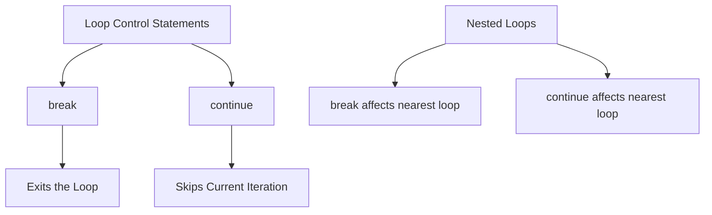

## 3.2.4 Break and Continue

In the realm of programming, controlling the flow of loops is a fundamental skill that can significantly enhance the efficiency and readability of your code. Dart, the language behind Flutter, provides two powerful statements for loop control: `break` and `continue`. These statements allow you to manage loop iterations with precision, enabling you to exit loops or skip specific iterations based on conditions. In this section, we will delve into the functionality, use cases, and best practices for using `break` and `continue` in Dart, complete with practical examples and diagrams to solidify your understanding.

### Introduction to Loop Control

Loops are essential constructs in programming that allow you to execute a block of code repeatedly. However, there are situations where you might need to alter the normal flow of a loop. This is where `break` and `continue` come into play. These statements provide you with the ability to:

- **`break`:** Exit the closest enclosing loop immediately.
- **`continue`:** Skip the current iteration and proceed to the next one.

Understanding how and when to use these statements is crucial for writing efficient and maintainable code.

### The `break` Statement

#### Functionality

The `break` statement is used to terminate the execution of the nearest enclosing loop. When a `break` statement is encountered, the loop is exited immediately, and the program continues execution with the statement following the loop.

#### Usage Example

Consider the following example where we use a `break` statement to exit a loop when a specific condition is met:

```dart
for (int i = 0; i < 10; i++) {
  if (i == 5) {
    break; // Exit loop when i is 5
  }
  print('i = $i');
}
// Outputs: i = 0 to i = 4
```

In this example, the loop iterates from 0 to 9. However, when `i` equals 5, the `break` statement is executed, causing the loop to terminate. As a result, the output only includes numbers from 0 to 4.

#### Use Cases

The `break` statement is particularly useful in scenarios where you need to:

- Exit a loop early when a specific condition is met.
- Prevent unnecessary iterations once a desired outcome is achieved.
- Improve performance by avoiding redundant computations.

### The `continue` Statement

#### Functionality

The `continue` statement is used to skip the current iteration of a loop and proceed to the next iteration. Unlike `break`, it does not terminate the loop but rather skips the remaining code in the current iteration.

#### Usage Example

Here's an example demonstrating the use of the `continue` statement:

```dart
for (int i = 0; i < 5; i++) {
  if (i == 2) {
    continue; // Skip iteration when i is 2
  }
  print('i = $i');
}
// Outputs: i = 0, i = 1, i = 3, i = 4
```

In this example, the loop iterates from 0 to 4. However, when `i` equals 2, the `continue` statement is executed, causing the loop to skip the print statement for that iteration. As a result, the output excludes the number 2.

#### Use Cases

The `continue` statement is ideal for situations where you want to:

- Skip certain iterations based on conditions without exiting the loop.
- Bypass specific logic for particular cases while continuing the loop.
- Enhance code readability by avoiding nested conditional statements.

### Nested Loops Consideration

When working with nested loops, it's important to understand that `break` and `continue` affect only the nearest enclosing loop. This means that their impact is limited to the loop in which they are directly used.

#### Example

Consider the following example with nested loops:

```dart
for (int i = 0; i < 3; i++) {
  for (int j = 0; j < 3; j++) {
    if (j == 1) {
      break; // Exits inner loop only
    }
    print('i = $i, j = $j');
  }
}
```

**Output:**

```
i = 0, j = 0
i = 1, j = 0
i = 2, j = 0
```

In this example, the `break` statement is used within the inner loop. When `j` equals 1, the inner loop is exited, but the outer loop continues its iterations. As a result, the output only includes pairs where `j` is 0.

### Best Practices

While `break` and `continue` are powerful tools, they should be used judiciously to maintain code readability and avoid complexity. Here are some best practices to consider:

- **Clarity:** Use `break` and `continue` only when they enhance the clarity of your code. Avoid using them excessively, as they can make the loop logic harder to follow.
- **Comments:** Always document the purpose of `break` and `continue` statements with comments to explain why they are used.
- **Alternatives:** Consider alternative approaches, such as restructuring your loop logic or using functions, to achieve the same result without `break` or `continue`.

### Visualizing Loop Control with Mermaid.js

To better understand the flow of control in loops, let's visualize the behavior of `break` and `continue` using a Mermaid.js diagram:



This diagram illustrates how `break` exits the loop entirely, while `continue` skips the current iteration. In nested loops, both statements affect only the nearest enclosing loop.

### Conclusion

Mastering the use of `break` and `continue` in Dart is essential for controlling loop execution effectively. By understanding their functionality, use cases, and best practices, you can write more efficient and readable code. Remember to use these statements thoughtfully, ensuring that your code remains clear and maintainable.

### Further Exploration

To deepen your understanding of loop control in Dart, consider exploring the following resources:

- [Dart Language Tour](https://dart.dev/guides/language/language-tour#loops): Official Dart documentation on loops.
- [Effective Dart](https://dart.dev/guides/language/effective-dart): Best practices for writing Dart code.
- [Flutter Documentation](https://flutter.dev/docs): Comprehensive guide to Flutter development.

By applying the concepts covered in this section, you'll be well-equipped to manage loop control in your Flutter applications, enhancing both performance and readability.

## Quiz Time!



### What does the `break` statement do in a loop?

- [x] Exits the closest enclosing loop immediately.
- [ ] Skips the current iteration and proceeds to the next one.
- [ ] Continues the loop without any interruption.
- [ ] Restarts the loop from the beginning.

> **Explanation:** The `break` statement is used to exit the closest enclosing loop immediately, terminating its execution.

### What is the primary function of the `continue` statement?

- [ ] Exits the loop entirely.
- [x] Skips the current iteration and proceeds to the next one.
- [ ] Restarts the loop from the beginning.
- [ ] Pauses the loop temporarily.

> **Explanation:** The `continue` statement skips the current iteration and proceeds to the next one, without exiting the loop.

### In a nested loop, what does the `break` statement affect?

- [x] The nearest enclosing loop.
- [ ] All loops in the program.
- [ ] Only the outermost loop.
- [ ] The innermost loop only.

> **Explanation:** The `break` statement affects only the nearest enclosing loop, exiting it immediately.

### Which statement would you use to skip an iteration in a loop?

- [ ] break
- [x] continue
- [ ] exit
- [ ] skip

> **Explanation:** The `continue` statement is used to skip the current iteration and move to the next one.

### What will the following code output?
```dart
for (int i = 0; i < 5; i++) {
  if (i == 3) {
    break;
  }
  print('i = $i');
}
```

- [x] i = 0, i = 1, i = 2
- [ ] i = 0, i = 1, i = 2, i = 3
- [ ] i = 0, i = 1, i = 2, i = 3, i = 4
- [ ] i = 0, i = 1, i = 2, i = 4

> **Explanation:** The loop exits when `i` equals 3, so the output includes only `i = 0`, `i = 1`, and `i = 2`.

### What does the `continue` statement do in a nested loop?

- [x] Skips the current iteration of the nearest enclosing loop.
- [ ] Exits all loops.
- [ ] Restarts the entire loop structure.
- [ ] Skips the current iteration of all loops.

> **Explanation:** The `continue` statement skips the current iteration of the nearest enclosing loop.

### How can excessive use of `break` and `continue` affect your code?

- [x] It can make the loop logic harder to follow.
- [ ] It always improves code performance.
- [ ] It simplifies the loop structure.
- [ ] It has no effect on code readability.

> **Explanation:** Excessive use of `break` and `continue` can make the loop logic harder to follow, affecting code readability.

### What is a good practice when using `break` and `continue`?

- [x] Document their purpose with comments.
- [ ] Use them as frequently as possible.
- [ ] Avoid using them in any loop.
- [ ] Use them only in nested loops.

> **Explanation:** It's a good practice to document the purpose of `break` and `continue` statements with comments to enhance code readability.

### True or False: The `break` statement can be used to exit a function.

- [ ] True
- [x] False

> **Explanation:** The `break` statement is used to exit loops, not functions. To exit a function, you would use the `return` statement.

### True or False: The `continue` statement can be used to skip code outside of a loop.

- [ ] True
- [x] False

> **Explanation:** The `continue` statement is used within loops to skip the current iteration, not to skip code outside of a loop.


