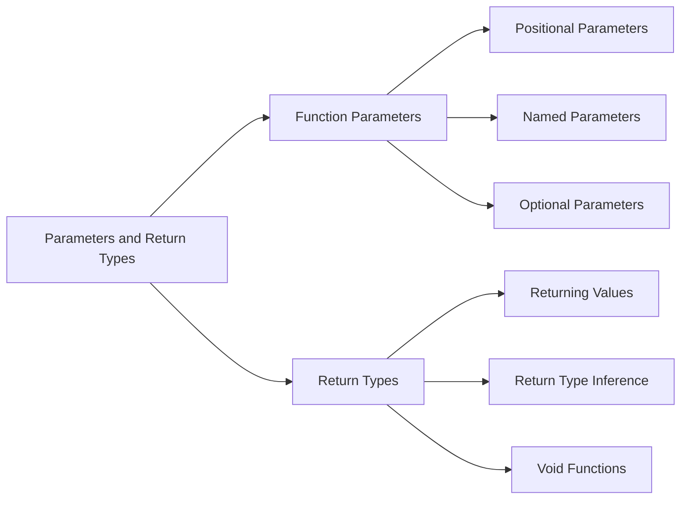

## 3.3.2 Parameters and Return Types

In the world of programming, functions and methods are fundamental building blocks that allow us to encapsulate logic, promote code reuse, and improve readability. In Dart, which is the primary language for Flutter development, understanding how to effectively use parameters and return types is crucial for building robust applications. This section delves into the intricacies of function parameters and return types, providing you with the knowledge to write clean and efficient Dart code.

### Function Parameters

Function parameters in Dart can be categorized into three main types: positional, named, and optional. Each type serves a unique purpose and offers different advantages depending on the use case.

#### Positional Parameters

Positional parameters are the most straightforward type of parameters. They are passed to a function in the order they are defined. This simplicity makes them easy to use, but it can also lead to confusion if a function has many parameters, as the order must be remembered.

**Example:**

```dart
double multiply(double x, double y) {
  return x * y;
}

void main() {
  double result = multiply(3.5, 2.0); // 7.0
  print('Result: $result');
}
```

In this example, the `multiply` function takes two positional parameters, `x` and `y`, and returns their product. The function is called with the arguments `3.5` and `2.0`, resulting in `7.0`.

**Advantages:**

- Simple and intuitive for functions with a small number of parameters.
- Efficient in terms of performance as there is no overhead of parameter labeling.

**Disadvantages:**

- Can become confusing with functions that have many parameters.
- Lack of clarity in function calls, especially when multiple parameters are of the same type.

#### Named Parameters

Named parameters enhance the readability of your code by allowing you to specify the names of the parameters when calling a function. This is particularly useful when a function has multiple parameters, as it makes the purpose of each argument clear.

**Syntax:**

```dart
void display({String name, int age}) {
  print('Name: $name, Age: $age');
}

void main() {
  display(age: 25, name: 'Alice'); // Name: Alice, Age: 25
}
```

In this example, the `display` function uses named parameters `name` and `age`. When calling the function, you can specify the parameters in any order, enhancing the readability of the code.

**Advantages:**

- Improves code readability and maintainability.
- Allows for more flexible function calls, as parameters can be specified in any order.

**Disadvantages:**

- Slightly more verbose than positional parameters.
- Requires additional syntax, which might be unfamiliar to beginners.

#### Optional Parameters

Optional parameters allow you to define functions that can be called with fewer arguments than the number of parameters defined. In Dart, optional parameters can be either positional or named.

**Example with Optional Positional Parameters:**

```dart
void log(String message, [String prefix]) {
  if (prefix != null) {
    print('$prefix: $message');
  } else {
    print(message);
  }
}

void main() {
  log('Hello World'); // Hello World
  log('Hello World', 'INFO'); // INFO: Hello World
}
```

In this example, the `log` function has an optional positional parameter `prefix`. If `prefix` is not provided, the function simply prints the message.

**Example with Optional Named Parameters:**

```dart
void greet({String name = 'Guest'}) {
  print('Hello, $name!');
}

void main() {
  greet(); // Hello, Guest!
  greet(name: 'Alice'); // Hello, Alice!
}
```

Here, the `greet` function uses an optional named parameter `name` with a default value of `'Guest'`. If no name is provided, it defaults to `'Guest'`.

**Advantages:**

- Provides flexibility in function calls.
- Allows for default values, reducing the need for overloads.

**Disadvantages:**

- Can lead to confusion if overused, as it may not be clear which parameters are optional.

### Return Types

In Dart, functions can return values of various types, including primitive types, collections, and custom objects. Understanding how to use return types effectively is essential for writing functions that are both useful and predictable.

#### Returning Values

The `return` keyword is used to send a value back from a function. The type of the value returned by a function is known as the return type.

**Example:**

```dart
String getGreeting(String name) {
  return 'Hello, $name!';
}

void main() {
  String greeting = getGreeting('Alice');
  print(greeting); // Hello, Alice!
}
```

In this example, the `getGreeting` function returns a `String` that greets the person by name.

**Return Type Inference**

Dart can infer the return type of a function if it is not explicitly specified. This feature can make your code more concise, but it's important to ensure that the inferred type is what you expect.

**Example:**

```dart
autoGreet(String name) {
  return 'Hi, $name!';
}

void main() {
  var greeting = autoGreet('Bob');
  print(greeting); // Hi, Bob!
}
```

In this example, Dart infers the return type of `autoGreet` as `String` based on the returned value.

**Handling No Return Value**

When a function does not return any value, the `void` keyword is used to indicate this. Functions that perform actions without returning a value are common in Dart.

**Example:**

```dart
void sayGoodbye() {
  print('Goodbye!');
}

void main() {
  sayGoodbye(); // Goodbye!
}
```

In this example, the `sayGoodbye` function is a `void` function, meaning it does not return any value.

### Visualizing Parameters and Return Types

To better understand the relationships between different types of parameters and return types, let's use a Mermaid.js diagram:



This diagram illustrates the breakdown of function parameters into positional, named, and optional categories, as well as the different aspects of return types, including returning values, type inference, and void functions.

### Best Practices and Common Pitfalls

- **Use Named Parameters for Clarity:** When a function has multiple parameters, especially of the same type, use named parameters to enhance readability and prevent errors.
- **Default Values for Optional Parameters:** Provide default values for optional parameters to avoid null-related issues and make your functions more robust.
- **Consistent Return Types:** Ensure that your functions consistently return the expected type, especially when using type inference.
- **Avoid Overusing Optional Parameters:** While they offer flexibility, overusing optional parameters can lead to confusion and make your code harder to maintain.

### Practical Examples and Real-World Scenarios

Consider a scenario where you are building a Flutter app that requires user authentication. You might have a function to validate user credentials:

```dart
bool validateCredentials({String username, String password}) {
  if (username == null || password == null) {
    return false;
  }
  // Assume a simple validation for demonstration purposes
  return username == 'admin' && password == '1234';
}

void main() {
  bool isValid = validateCredentials(username: 'admin', password: '1234');
  print('Credentials valid: $isValid'); // Credentials valid: true
}
```

In this example, the `validateCredentials` function uses named parameters to clearly specify the username and password. It returns a `bool` indicating whether the credentials are valid.

### Encouraging Hands-On Practice

To solidify your understanding of function parameters and return types, try the following exercises:

- **Exercise 1:** Modify the `multiply` function to accept an optional third parameter that specifies a multiplier. If not provided, default to 1.
- **Exercise 2:** Create a function that takes a list of numbers and returns the sum. Use named parameters to specify whether to include negative numbers in the sum.
- **Exercise 3:** Write a function that returns a custom object representing a user profile. Include fields for name, age, and email.

### Additional Resources

- [Dart Language Tour](https://dart.dev/guides/language/language-tour)
- [Effective Dart: Usage](https://dart.dev/guides/language/effective-dart/usage)
- [Flutter Documentation](https://flutter.dev/docs)

These resources provide further insights into Dart programming and Flutter development, helping you deepen your understanding and improve your skills.

### Summary

Understanding function parameters and return types in Dart is essential for writing effective and efficient code in Flutter. By mastering positional, named, and optional parameters, as well as return types, you can create functions that are both powerful and easy to use. Remember to apply best practices, avoid common pitfalls, and continuously experiment with different approaches to enhance your programming skills.

## Quiz Time!



### What is the primary advantage of using named parameters in Dart functions?

- [x] They enhance code readability by labeling parameters.
- [ ] They improve performance by reducing execution time.
- [ ] They allow functions to have unlimited parameters.
- [ ] They automatically handle null values.

> **Explanation:** Named parameters enhance code readability by allowing you to specify the names of the parameters when calling a function, making the purpose of each argument clear.

### How does Dart handle return type inference?

- [x] Dart infers the return type based on the value returned by the function.
- [ ] Dart requires explicit return type declarations for all functions.
- [ ] Dart uses the first parameter's type as the return type.
- [ ] Dart does not support return type inference.

> **Explanation:** Dart can infer the return type of a function if it is not explicitly specified, based on the value that the function returns.

### Which keyword is used in Dart to indicate that a function does not return any value?

- [x] void
- [ ] null
- [ ] empty
- [ ] none

> **Explanation:** The `void` keyword is used in Dart to indicate that a function does not return any value.

### What happens if you call a Dart function with fewer arguments than the number of positional parameters defined?

- [ ] The function executes with default values.
- [ ] The function returns null.
- [x] A compile-time error occurs.
- [ ] The function skips the missing parameters.

> **Explanation:** If a Dart function is called with fewer arguments than the number of positional parameters defined, a compile-time error occurs because all positional parameters must be provided.

### In Dart, how can you provide default values for optional parameters?

- [x] By specifying default values in the function signature.
- [ ] By using a special default keyword.
- [ ] By declaring the parameters as final.
- [ ] By using a separate configuration file.

> **Explanation:** In Dart, you can provide default values for optional parameters by specifying them in the function signature.

### Which of the following is a characteristic of positional parameters?

- [x] They must be passed in the order they are defined.
- [ ] They can be passed in any order.
- [ ] They are always optional.
- [ ] They automatically have default values.

> **Explanation:** Positional parameters must be passed in the order they are defined, which is a key characteristic of this parameter type.

### What is a common pitfall when using optional parameters in Dart?

- [x] Overusing them can lead to confusion and harder-to-maintain code.
- [ ] They always require default values.
- [ ] They cannot be used with named parameters.
- [ ] They increase the function's execution time.

> **Explanation:** Overusing optional parameters can lead to confusion and make the code harder to maintain, as it may not be clear which parameters are optional.

### How can you ensure that a Dart function consistently returns the expected type?

- [x] By explicitly specifying the return type and testing the function.
- [ ] By using only named parameters.
- [ ] By avoiding the use of the return keyword.
- [ ] By using global variables.

> **Explanation:** To ensure that a Dart function consistently returns the expected type, explicitly specify the return type and test the function to verify its behavior.

### What is the benefit of using default values for optional parameters?

- [x] They reduce the need for overloads and handle null-related issues.
- [ ] They make the function execute faster.
- [ ] They allow the function to return multiple types.
- [ ] They automatically log function calls.

> **Explanation:** Default values for optional parameters reduce the need for overloads and help handle null-related issues, making functions more robust.

### True or False: In Dart, a function can have both positional and named parameters.

- [x] True
- [ ] False

> **Explanation:** True. In Dart, a function can have both positional and named parameters, allowing for flexible function definitions.


