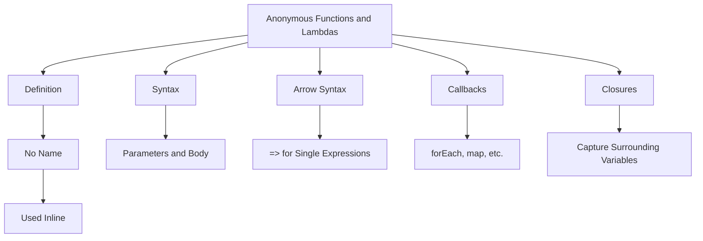

## 3.3.4 Anonymous Functions and Lambdas

In the world of programming, functions are fundamental building blocks that allow us to encapsulate logic, promote code reuse, and enhance readability. Dart, the language behind Flutter, offers a powerful feature known as anonymous functions, or lambdas, which are particularly useful for concise and flexible coding. In this section, we will delve into the concept of anonymous functions, explore their syntax, and understand their practical applications in Flutter development.

### Introduction to Anonymous Functions

Anonymous functions, also known as lambda functions, are functions that are defined without a name. They are typically used as inline functions or callbacks, allowing you to pass a block of code as an argument to other functions. This feature is particularly useful in scenarios where you need to define a function for a short period of time, without the overhead of naming it.

Anonymous functions are a staple in functional programming paradigms and are widely used in Dart for operations such as list transformations, event handling, and asynchronous programming. They provide a way to write more concise and expressive code, especially when dealing with collections or implementing callbacks.

### Syntax of Anonymous Functions

The syntax for defining anonymous functions in Dart is straightforward. An anonymous function can be defined using the following structure:

```dart
// Traditional anonymous function
() {
  print('This is an anonymous function.');
}

// With parameters
(int a, int b) {
  return a + b;
}
```

In the example above, the first function is a simple anonymous function that prints a message. The second function takes two parameters, `a` and `b`, and returns their sum. Notice that these functions do not have a name, which is why they are called anonymous.

### Arrow Syntax for Concise Functions

Dart provides a shorthand syntax for writing anonymous functions, known as arrow syntax. This is particularly useful when the function body consists of a single expression. The arrow syntax uses the `=>` operator to define the function body concisely:

```dart
// Traditional
(int a, int b) {
  return a + b;
}

// Arrow syntax
(int a, int b) => a + b;
```

In the arrow syntax example, the function `(int a, int b) => a + b;` is equivalent to the traditional function but is more concise and easier to read. This syntax is ideal for simple operations and is commonly used in Flutter for UI updates and event handling.

### Using Anonymous Functions as Callbacks

One of the most common uses of anonymous functions in Dart is as callbacks. Callbacks are functions that are passed as arguments to other functions and are executed at a later time. This is a powerful concept that allows for asynchronous programming and event-driven architectures.

In Dart, anonymous functions are frequently used with list operations such as `forEach`, `map`, and `where`. Let's look at an example using `forEach`:

```dart
List<int> numbers = [1, 2, 3, 4];
numbers.forEach((number) {
  print(number * 2);
});
```

In this example, the anonymous function `(number) { print(number * 2); }` is passed as a callback to the `forEach` method. It iterates over each element in the list `numbers` and prints the double of each number.

The same operation can be written using arrow syntax for brevity:

```dart
numbers.forEach((number) => print(number * 2));
```

This concise form is not only easier to read but also highlights the power of anonymous functions in simplifying code.

### Capturing Variables with Closures

A unique feature of anonymous functions is their ability to capture variables from their surrounding scope, a concept known as closures. This allows the function to "remember" the environment in which it was created, even after that environment has finished executing.

Consider the following example:

```dart
Function makeAdder(int addBy) {
  return (int i) => addBy + i;
}

var addTwo = makeAdder(2);
print(addTwo(3)); // Outputs: 5
```

In this example, the function `makeAdder` returns an anonymous function that adds a given number `i` to the `addBy` value. The returned function captures the `addBy` variable from its surrounding scope, allowing it to be used later when `addTwo` is called with an argument.

This capability is particularly useful in scenarios where you need to maintain state across multiple function calls or when implementing factory functions.

### Visualizing Anonymous Functions and Lambdas

To better understand the flow and relationships of anonymous functions and lambdas, let's visualize the concepts using a Mermaid.js diagram:



This diagram provides a high-level overview of the key concepts related to anonymous functions and lambdas, illustrating their definition, syntax, and practical applications.

### Practical Applications and Real-World Scenarios

Anonymous functions are not just a theoretical concept; they have practical applications in real-world Flutter projects. Here are a few scenarios where anonymous functions shine:

- **Event Handling:** In Flutter, UI components often require event handlers for user interactions. Anonymous functions provide a convenient way to define these handlers inline, reducing boilerplate code.

- **Asynchronous Programming:** Dart's `Future` and `Stream` APIs frequently use anonymous functions for handling asynchronous operations. This allows developers to write clean and readable asynchronous code.

- **Functional Programming:** Dart supports functional programming paradigms, and anonymous functions are a key component. They enable operations like filtering, mapping, and reducing collections in a concise manner.

- **State Management:** In state management solutions like Provider or Riverpod, anonymous functions are used to define state updates and transformations, promoting a declarative programming style.

### Best Practices and Common Pitfalls

While anonymous functions are powerful, it's important to use them judiciously. Here are some best practices and common pitfalls to be aware of:

- **Readability:** While anonymous functions can make code more concise, overusing them can lead to reduced readability. Ensure that the function's purpose is clear, especially when using arrow syntax.

- **Performance:** Avoid creating anonymous functions inside loops or frequently called methods, as this can lead to performance issues due to repeated function creation.

- **Debugging:** Anonymous functions can be harder to debug because they lack a name. Consider using named functions for complex logic to improve traceability.

- **Scope Management:** Be mindful of variable capture in closures, as it can lead to unexpected behavior if the captured variables change unexpectedly.

### Further Exploration and Resources

To deepen your understanding of anonymous functions and lambdas in Dart, consider exploring the following resources:

- [Dart Language Tour](https://dart.dev/guides/language/language-tour#functions): Official Dart documentation on functions.
- [Flutter Cookbook](https://flutter.dev/docs/cookbook): Practical examples and recipes for Flutter development.
- [Effective Dart](https://dart.dev/guides/language/effective-dart): Best practices for writing Dart code.

These resources provide valuable insights and examples to help you master anonymous functions and apply them effectively in your Flutter projects.

### Conclusion

Anonymous functions and lambdas are indispensable tools in the Dart programming language, offering flexibility and conciseness in code. By understanding their syntax, applications, and best practices, you can leverage these functions to write more efficient and expressive Flutter applications. As you continue your journey in Flutter development, experiment with anonymous functions in various scenarios to fully appreciate their power and versatility.

## Quiz Time!



### What is an anonymous function in Dart?

- [x] A function without a name, often used as a callback or inline function.
- [ ] A function that is always asynchronous.
- [ ] A function that can only be used within classes.
- [ ] A function that returns a Future.

> **Explanation:** Anonymous functions, also known as lambda functions, are functions defined without a name and are commonly used as callbacks or inline functions.

### How do you define an anonymous function with parameters in Dart?

- [x] (int a, int b) { return a + b; }
- [ ] function(int a, int b) { return a + b; }
- [ ] def(int a, int b) { return a + b; }
- [ ] anonymous(int a, int b) { return a + b; }

> **Explanation:** The correct syntax for defining an anonymous function with parameters in Dart is `(int a, int b) { return a + b; }`.

### What is the arrow syntax used for in Dart?

- [x] To define a concise function body with a single expression.
- [ ] To declare a variable.
- [ ] To create a new class.
- [ ] To import a library.

> **Explanation:** The arrow syntax (`=>`) in Dart is used to define a concise function body when it contains a single expression.

### Which of the following is an example of using an anonymous function as a callback?

- [x] numbers.forEach((number) => print(number * 2));
- [ ] int sum(int a, int b) => a + b;
- [ ] var add = (int a, int b) => a + b;
- [ ] print('Hello, World!');

> **Explanation:** The statement `numbers.forEach((number) => print(number * 2));` uses an anonymous function as a callback in the `forEach` method.

### What is a closure in Dart?

- [x] A function that captures variables from its surrounding scope.
- [ ] A function that is always asynchronous.
- [ ] A function that can only be used within classes.
- [ ] A function that returns a Future.

> **Explanation:** A closure is a function that captures variables from its surrounding scope, allowing it to "remember" the environment in which it was created.

### How can you create a closure in Dart?

- [x] By defining an anonymous function that captures variables from its surrounding scope.
- [ ] By using the `async` keyword.
- [ ] By declaring a class.
- [ ] By using the `await` keyword.

> **Explanation:** A closure is created by defining an anonymous function that captures variables from its surrounding scope.

### What is the output of the following code?
```dart
Function makeAdder(int addBy) {
  return (int i) => addBy + i;
}

var addTwo = makeAdder(2);
print(addTwo(3));
```

- [x] 5
- [ ] 3
- [ ] 6
- [ ] 2

> **Explanation:** The function `makeAdder` returns a closure that adds `addBy` to `i`. When `addTwo(3)` is called, it returns `2 + 3`, which is `5`.

### Which of the following is a best practice when using anonymous functions?

- [x] Ensure the function's purpose is clear, especially when using arrow syntax.
- [ ] Always use anonymous functions for complex logic.
- [ ] Avoid using anonymous functions in any scenario.
- [ ] Use anonymous functions only in synchronous code.

> **Explanation:** It is a best practice to ensure the function's purpose is clear, especially when using arrow syntax, to maintain code readability.

### What is a common pitfall when using closures?

- [x] Capturing variables that change unexpectedly.
- [ ] Using too many parameters.
- [ ] Not using enough comments.
- [ ] Using closures in synchronous code.

> **Explanation:** A common pitfall when using closures is capturing variables that change unexpectedly, which can lead to unintended behavior.

### True or False: Anonymous functions can only be used in asynchronous programming.

- [ ] True
- [x] False

> **Explanation:** False. Anonymous functions can be used in both synchronous and asynchronous programming contexts.


